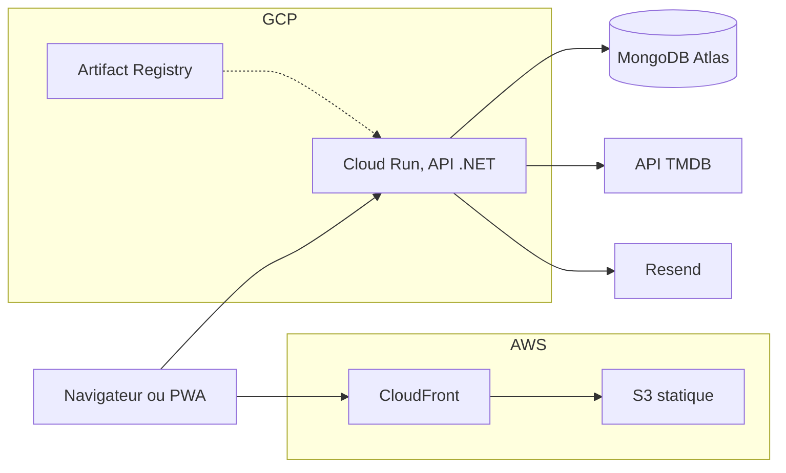

<p align="center">
  
</p>

<h1 align="center">Movie Picker</h1>

<p align="center">
  Choisir un film à plusieurs sans y passer la soirée.<br>
  <a href="https://web.movie-picker.fr/"><strong>Ouvrir l'application</strong></a>
  &nbsp;&nbsp;&nbsp;
  <a href="https://web.movie-picker.fr/tech"><strong>Lire le dossier technique</strong></a>
</p>

## Le produit

On crée une soirée, on partage le lien, chacun propose des films et vote, la roue tranche.

1. **Créer une soirée** (titre, date, heure) et récupérer son lien de partage.
2. **Rejoindre** depuis ce lien, avec un compte.
3. **Proposer des films** via la recherche TMDB (affiches, métadonnées, disponibilité en streaming).
4. **Voter** pour ou contre, et signaler un film déjà vu.
5. **Lancer la roue**, en tirage strictement aléatoire ou pondéré par les votes, au choix de l'hôte.
6. **Clôturer** sur le film gagnant.

Autour de ce parcours : une page d'accueil d'exploration (rangées personnalisées, 120 sagas,
sélections thématiques, ce qui passe ce soir en streaming), une liste de films personnelle avec
notes sur 5 ou sur 10, des profils publics `/u/:handle` avec suivi entre comptes, l'import
Letterboxd, les notifications push et in-app, l'export calendrier `.ics`, le thème clair ou sombre,
l'installation en PWA, l'export et la suppression de compte au sens RGPD, et une navigation clavier
vérifiée par axe sur les vues principales.

## La stack

| Couche | Technologies |
| --- | --- |
| Front | React 19, TypeScript, Vite, TanStack Query, React Router, PWA via Workbox. Build statique sur S3 derrière CloudFront |
| API | ASP.NET Core sur .NET 10, architecture hexagonale, conteneur sur Cloud Run déployé par digest |
| Données | MongoDB Atlas, transactions par `IUnitOfWork`, migrations versionnées en base |
| Services | TMDB (films et affiches, proxifiées par l'API), Resend (mails), Sentry, PostHog |
| Outillage | pnpm et Turbo, Vitest, xUnit, Playwright, Stryker.NET, SonarCloud, Lighthouse, Trivy |



L'API expose `/api/v1`, son contrat est exporté vers `artifacts/openapi-v1.json` et le front en
dérive ses types : une route retirée côté API casse la compilation du front. L'authentification
passe par cookie de session, les actions d'hôte par un jeton dans l'URL de partage.

> **Le dossier technique du projet est publié en ligne, sur
> [web.movie-picker.fr/tech](https://web.movie-picker.fr/tech).** Quatorze sections : architecture,
> choix techniques, interface, serveur, contrat d'API, modèle de données, une fonctionnalité suivie
> de bout en bout, tests, intégration continue, infrastructure, mesures, sécurité, méthode de
> travail et trajectoire. Les chiffres y sont relevés dans le dépôt au moment du build, pas estimés.
> Ce README en est la version courte.

## Démarrer

Node 20.19+, 22.13+ ou 24+, pnpm, et le SDK .NET 10. Rien d'autre.

```bash
pnpm install
pnpm dev:full     # API sur :4000, front sur :5173
```

Sans aucune configuration, l'API tourne entièrement en mémoire et sème comptes et soirées de
démonstration : l'application est cliquable immédiatement, la page de connexion offrant un accès
direct au compte de démonstration. En contrepartie les données repartent de zéro à chaque
redémarrage, et la recherche de films reste vide faute de clé TMDB.

Pour une vraie base et la recherche de films, copier `.env.example` en `.env` puis renseigner
`MONGODB_URI` et `TMDB_API_KEY`. Le reste (lancer Mongo en conteneur, identifiants de
démonstration, catalogue des scripts, structure du dépôt) est dans
[`docs/development.md`](docs/development.md).

## Qualité

`pnpm run verify:local` rejoue la CI en local, en treize étapes : règles d'architecture, `pnpm lint`,
ESLint, Prettier, `dotnet restore`, `dotnet format`, build Release en `-warnaserror`, export OpenAPI,
contrôle de dérive des types, audit de vulnérabilités Trivy, tests front avec seuils de couverture,
tests API unitaires, tests API d'intégration.

Ce que la chaîne empêche, plutôt que ce qu'elle mesure :

- **`check:architecture`** refuse un commentaire dans le code, un `using` qui traverse une couche de
  l'hexagone, un import de `shared/` vers une feature, une valeur littérale d'espacement, de taille
  de police, de couleur ou de `z-index` dans un CSS module, un point de rupture hors de l'échelle
  fermée, un `<dialog>` écrit ailleurs que dans `Modal`, une classe `btn` posée à la main, et une
  cible tactile sous 44 px.
- **Les tests d'intégration tournent contre une vraie MongoDB** en replica set, seul chemin qui
  exécute les adaptateurs Mongo et les transactions. Un inventaire compare les index réellement
  créés à la liste attendue : l'expiration des sessions, des jetons de réinitialisation et des
  compteurs de quota n'existe que là.
- **Le parcours critique tourne dans Playwright avec navigateur réel et base réelle ensemble**,
  seul endroit de la chaîne où les deux sont vrais en même temps.
- **Les seuils de couverture sont des portes**, pas des indicateurs : front 84 % d'instructions et
  86 % de lignes, API 90 % de lignes, adaptateurs Mongo 86 % de lignes, mesurés séparément parce
  qu'ils sont exclus du rapport principal.
- **Stryker.NET** est disponible hors CI pour savoir si les tests d'une zone vérifient quelque
  chose ou se contentent de la parcourir.

## Déploiement

Deux workflows GitHub Actions, séparés à dessein. `.github/workflows/ci-cd.yml` joue les portes de
qualité sur `master` et sur les pull requests : Gitleaks, le lint des workflows eux-mêmes
(`actionlint`, `shellcheck`, `zizmor`), le lint et le build des deux applications, l'audit des
dépendances npm et NuGet, les suites de tests, les E2E et le Quality Gate SonarCloud.

`.github/workflows/deploy.yml` met en production, et **seulement à la main** : un push sur `master`
ne déploie rien. Le déclenchement choisit sa cible (tout, front seul, API seule), refuse de partir
si le run de CI du commit visé n'est pas vert, puis ajoute les deux portes propres au déploiement,
les seuils Lighthouse et le scan Trivy de l'image. Grouper plusieurs livraisons dans un seul
déploiement est le but : les minutes GitHub Actions d'un dépôt privé sont facturées, et rejouer le
chemin de déploiement à chaque commit en consommait la moitié.

Trois choix structurent la mise en production :

- **Rien ne part sans geste explicite**, donc la production est en retard sur `master` par défaut.
  Un garde-fou final vérifie que chaque cible demandée est réellement déployée, parce qu'un job de
  déploiement empêché par une porte rouge est *sauté* et non *en échec* : le run resterait vert.
- **L'API n'est jamais promue avant d'être vérifiée.** Chaque révision est déployée sans trafic,
  éprouvée sur son URL taguée, et ne reçoit d'utilisateurs qu'une fois ses sondes vertes. Il n'y a
  donc pas de retour arrière à faire sur une révision défaillante, elle n'a servi personne.
- **Le front est poussé en trois temps**, `index.html` et le service worker en dernier, puis
  CloudFront est invalidé, pour qu'aucun client ne se retrouve avec un service worker en avance sur
  ses bundles. Le `dist` est archivé trente jours, l'hébergement statique ne gardant aucune version.

Workflows annexes : `backup-mongo.yml` sauvegarde la base chaque nuit et restaure l'archive pour la
vérifier avant de la publier, `rollback.yml` est la porte manuelle de retour arrière,
`registry-cleanup.yml` et `security-scan.yml` tiennent la rétention et la veille de vulnérabilités.

## Documentation

| Document | Contenu |
| --- | --- |
| [Dossier technique](https://web.movie-picker.fr/tech) | La version longue de tout ce qui précède, publiée dans l'application |
| [`AGENTS.md`](AGENTS.md) | Règles du dépôt : conventions, design system, portes de qualité, workflow |
| [`docs/development.md`](docs/development.md) | Installation détaillée, seed, scripts, tests, structure |
| [`CHANGELOG.md`](CHANGELOG.md) | Journal des versions, Keep a Changelog et SemVer |
| [`docs/roadmap-product.md`](docs/roadmap-product.md) | Roadmap produit |
| [`docs/roadmap-tech.md`](docs/roadmap-tech.md) | Roadmap technique : infrastructure, CI/CD, sécurité |
| [`docs/technical-debt.md`](docs/technical-debt.md) | Dette technique, contraintes et impasses connues |

## Licence

Code publié pour être lu, pas pour être réutilisé : tous droits réservés, voir
[`LICENSE`](LICENSE). Movie Picker utilise l'API de The Movie Database sans être approuvé ni
certifié par TMDB.
