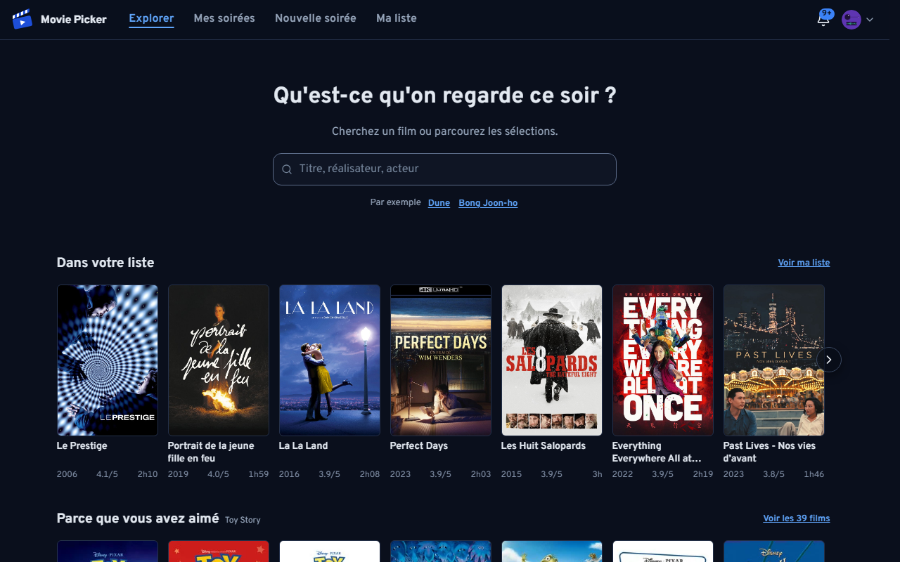
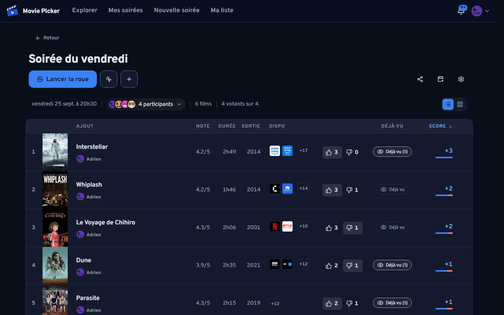
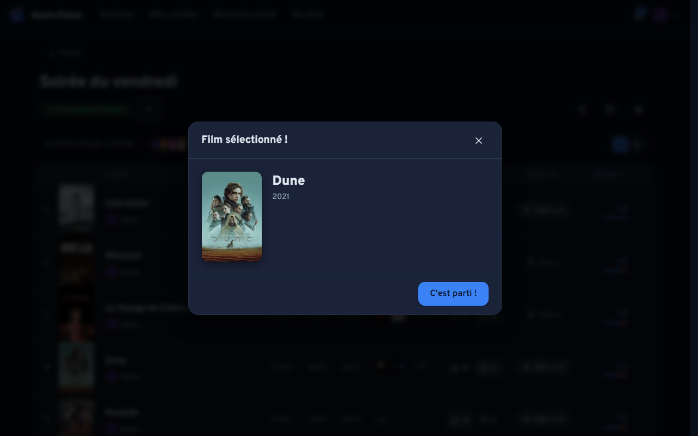
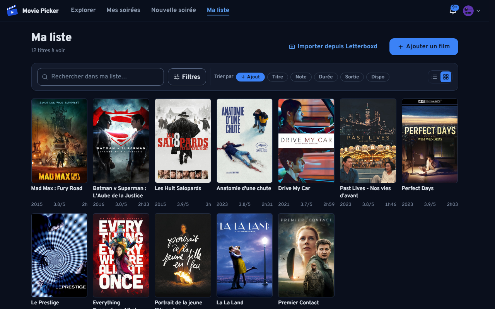
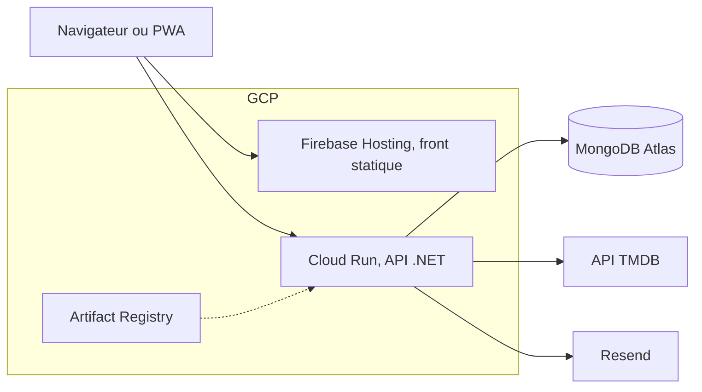

<p align="center">
  
</p>

<h1 align="center">Movie Picker</h1>

<p align="center">
  Choisir un film à plusieurs sans y passer la soirée.<br>
  <a href="https://www.movie-picker.fr/"><strong>Ouvrir l'application</strong></a>
  &nbsp;&nbsp;&nbsp;
  <a href="https://www.movie-picker.fr/tech"><strong>Lire le dossier technique</strong></a>
</p>

<p align="center">
  <a href="https://github.com/Affy657/Movie-Picker/actions/workflows/ci-cd.yml"></a>
  <a href="https://sonarcloud.io/summary/new_code?id=Affy657_Movie-Picker"></a>
  <a href="https://sonarcloud.io/summary/new_code?id=Affy657_Movie-Picker"></a>
  <a href="https://github.com/Affy657/Movie-Picker/releases"></a>
</p>

## Le produit

On crée une soirée, on partage le lien, chacun propose des films et vote, la roue tranche.

1. **Créer une soirée** (titre, date, heure) et récupérer son lien de partage.
2. **Rejoindre** depuis ce lien, avec un compte.
3. **Proposer des films** via la recherche TMDB (affiches, métadonnées, disponibilité en streaming).
4. **Voter** pour ou contre, et signaler un film déjà vu.
5. **Lancer la roue**, en tirage strictement aléatoire ou pondéré par les votes, au choix de l'hôte.
6. **Couronner** un ou plusieurs films, jusqu'à dix selon le réglage de l'hôte : chaque tirage en ajoute un au palmarès.

|  |  |
| :--: | :--: |
|  |  |
| Ce qu'on peut regarder ce soir | Les films proposés, les votes, les participants |
|  |  |
| La roue tranche | Sa liste de films, notée et importable depuis Letterboxd |

Captures prises sur l'application lancée en local, par
[`scripts/capture-screenshots.mjs`](scripts/capture-screenshots.mjs).

Autour de ce parcours :

- **Soirées** : récurrence au rythme choisi, modèles réutilisables, limite de votes par
  participant, export calendrier `.ics`.
- **Exploration** : page d'accueil avec rangées personnalisées, 120 sagas, sélections thématiques
  et ce qui passe ce soir en streaming.
- **Liste de films** : notes sur 5 ou sur 10, import Letterboxd, consultable depuis le profil de
  ses amis.
- **Social** : profils publics `/u/:handle`, recherche de comptes et suivi entre eux, notifications
  push et in-app.
- **Confort** : thème clair ou sombre, installation en PWA, navigation clavier vérifiée par axe sur
  les vues principales.
- **RGPD** : export et suppression de compte.

## La stack

| Couche | Technologies |
| --- | --- |
| Front | React 19, TypeScript, Vite, TanStack Query, React Router, PWA via Workbox. Build statique sur Firebase Hosting |
| API | ASP.NET Core sur .NET 10, architecture hexagonale, conteneur sur Cloud Run déployé par digest |
| Données | MongoDB Atlas, transactions par `IUnitOfWork`, migrations versionnées en base |
| Services | TMDB (films et affiches, proxifiées par l'API), Resend (mails), Sentry, PostHog |
| Outillage | pnpm et Turbo, Vitest, xUnit, Playwright, Stryker.NET, SonarCloud, Lighthouse, Trivy |



L'API expose `/api/v1`, son contrat est exporté vers `artifacts/openapi-v1.json` et le front en
dérive ses types : une route retirée côté API casse la compilation du front. L'authentification
passe par cookie de session, les actions d'hôte par un jeton dans l'URL de partage.

> **Le dossier technique du projet est publié en ligne, sur
> [www.movie-picker.fr/tech](https://www.movie-picker.fr/tech).** Quatorze sections : architecture,
> choix techniques, interface, serveur, contrat d'API, modèle de données, une fonctionnalité suivie
> de bout en bout, tests, intégration continue, infrastructure, mesures, sécurité, méthode de
> travail et trajectoire. Les chiffres y sont relevés dans le dépôt au moment du build, pas estimés.
> Ce README en est la version courte.

## Démarrer

Node 20.19+, 22.13+ ou 24+, pnpm, et le SDK .NET 10. Rien d'autre.

```bash
pnpm install
pnpm dev:full     # API sur :4000, front sur :5173
```

Sans aucune configuration, l'API tourne entièrement en mémoire et sème comptes et soirées de
démonstration : l'application est cliquable immédiatement, la page de connexion offrant un accès
direct au compte de démonstration. En contrepartie les données repartent de zéro à chaque
redémarrage, et la recherche de films reste vide faute de clé TMDB.

Pour une vraie base et la recherche de films, copier `.env.example` en `.env` puis renseigner
`MONGODB_URI` et `TMDB_READ_ACCESS_TOKEN` (ou `TMDB_API_KEY`). Le reste (lancer Mongo en conteneur, identifiants de
démonstration, catalogue des scripts, structure du dépôt) est dans
[`docs/development.md`](docs/development.md).

## Qualité

`pnpm run verify:local` rejoue la CI en local, en seize étapes réparties sur trois voies concurrentes
puis la suite front seule : règles d'architecture, `pnpm lint`, ESLint, Prettier (voie node) ;
`dotnet restore`, build Release en `-warnaserror`, `dotnet format`, tests API unitaires et
d'intégration, export OpenAPI, contrôle de dérive des types (voie dotnet) ; lint des workflows
(`actionlint`, `shellcheck`, `zizmor`), `terraform fmt` et `validate`, Gitleaks sur l'arbre de
travail, audit de vulnérabilités Trivy (voie docker) ; tests front avec seuils de couverture.

Ce que la chaîne empêche, plutôt que ce qu'elle mesure :

- **`check:architecture`** refuse un commentaire dans le code, un `using` qui traverse une couche de
  l'hexagone, un import de `shared/` vers une feature, une valeur littérale d'espacement, de taille
  de police, de couleur ou de `z-index` dans un CSS module, un point de rupture hors de l'échelle
  fermée, un `<dialog>` écrit ailleurs que dans `Modal`, une classe `btn` posée à la main, et une
  cible tactile sous 44 px.
- **Les tests d'intégration tournent contre une vraie MongoDB** en replica set, seul chemin qui
  exécute les adaptateurs Mongo et les transactions. Un inventaire compare les index réellement
  créés à la liste attendue : l'expiration des sessions, des jetons de réinitialisation et des
  compteurs de quota n'existe que là.
- **Le parcours critique tourne dans Playwright avec navigateur réel et base réelle ensemble**,
  seul endroit de la chaîne où les deux sont vrais en même temps.
- **Les seuils de couverture sont des portes**, pas des indicateurs : front 84 % d'instructions et
  86 % de lignes, API 90 % de lignes, adaptateurs Mongo 86 % de lignes, mesurés séparément parce
  qu'ils sont exclus du rapport principal.
- **Stryker.NET** est disponible hors CI pour savoir si les tests d'une zone vérifient quelque
  chose ou se contentent de la parcourir.

## Déploiement

Deux workflows GitHub Actions, séparés à dessein. `.github/workflows/ci-cd.yml` joue les portes de
qualité sur `master` et sur les pull requests : Gitleaks, le lint des workflows eux-mêmes
(`actionlint`, `shellcheck`, `zizmor`), le lint et le build des deux applications, l'audit des
dépendances npm et NuGet, les suites de tests, les E2E et le Quality Gate SonarCloud.

`.github/workflows/deploy.yml` met en production, et **seulement à la main** : un push sur `master`
ne déploie rien. Le déclenchement choisit son étape (la recette `staging.movie-picker.fr`, puis la
production) et sa cible (tout, front seul, API seule), refuse de partir si le run de CI du commit
visé n'est pas vert, puis ajoute les deux portes propres au déploiement, les seuils Lighthouse et le
scan Trivy de l'image. La production refuse de partir tant que la recette ne sert pas exactement le
même commit, et elle redéploie l'image de conteneur que la recette exécute, sans la reconstruire.
Grouper plusieurs livraisons dans un seul déploiement est le but : quand le dépôt était privé, ses
minutes GitHub Actions étaient facturées et rejouer le chemin de déploiement à chaque commit en
consommait la moitié.

Trois choix structurent la mise en production :

- **Rien ne part sans geste explicite**, donc la production est en retard sur `master` par défaut.
  Un garde-fou final vérifie que chaque cible demandée est réellement déployée, parce qu'un job de
  déploiement empêché par une porte rouge est *sauté* et non *en échec* : le run resterait vert.
- **L'API n'est jamais promue avant d'être vérifiée.** Chaque révision est déployée sans trafic,
  éprouvée sur son URL taguée, et ne reçoit d'utilisateurs qu'une fois ses sondes vertes. Il n'y a
  donc pas de retour arrière à faire sur une révision défaillante, elle n'a servi personne.
- **Le front est publié comme une version immuable** de Firebase Hosting, qui porte avec ses
  fichiers les paliers de cache et les en-têtes de sécurité (`infra/firebase-hosting.json`), puis
  mise en service d'un coup : aucun client ne se retrouve avec un service worker en avance sur ses
  bundles, et les versions précédentes restent servables pour un retour arrière.
- **Les routes publiques indexables sont prérendues** au build et publiées comme `<route>/index.html`,
  ce qui les fait servir en HTML complet au lieu de la coquille SPA, la forme avec barre finale étant
  ramenée sur la route. Un client sans JavaScript, moteur d'indexation ou aperçu de lien, reçoit le
  contenu et les métadonnées de la page, pas un document vide.

Workflows annexes : `backup-mongo.yml` sauvegarde la base chaque nuit et restaure l'archive pour la
vérifier avant de la publier, `rollback.yml` et `rollback-front.yml` sont les portes manuelles de
retour arrière (révision Cloud Run antérieure, version Hosting antérieure remise en service),
`security-scan.yml` tient la veille de vulnérabilités, `web-legacy.yml` publie l'ancienne adresse
du site (`infra/web-legacy/` : un worker qui désinstalle celui d'avant le changement d'adresse, une
redirection pour tout le reste) ; l'infrastructure (registre d'images, secrets, service Cloud Run,
hébergement du front, identités et fédération GitHub) est décrite en Terraform
(`infra/terraform/`), planifiée en commentaire de PR et appliquée sur `master` par `infra.yml`.

## Documentation

| Document | Contenu |
| --- | --- |
| [Dossier technique](https://www.movie-picker.fr/tech) | La version longue de tout ce qui précède, publiée dans l'application |
| [`AGENTS.md`](AGENTS.md) | Règles du dépôt : conventions, design system, portes de qualité, workflow |
| [`docs/development.md`](docs/development.md) | Installation détaillée, seed, scripts, tests, structure |
| [`docs/design-system.md`](docs/design-system.md) | Jetons et composants partagés du front, props, états et garanties d'accessibilité |
| [`CHANGELOG.md`](CHANGELOG.md) | Journal des versions, Keep a Changelog et SemVer |
| [`docs/roadmap.md`](docs/roadmap.md) | Roadmap produit et tech, version par version |
| [`docs/technical-debt.md`](docs/technical-debt.md) | Dette technique, contraintes et impasses connues |
| [`docs/runbook-mongodb-restore.md`](docs/runbook-mongodb-restore.md) | Remettre une sauvegarde MongoDB dans le cluster de production |
| [`archive/`](archive/) | Ce qui est gelé et conservé pour l'historique, hors du périmètre construit et déployé |
| [`CONTRIBUTING.md`](CONTRIBUTING.md) | Projet solo : ce qui est accepté, ce qui ne l'est pas, où signaler |
| [`SECURITY.md`](SECURITY.md) | Signaler une faille, par un canal privé |

## Licence

Code publié pour être lu, pas pour être réutilisé : tous droits réservés, voir
[`LICENSE`](LICENSE). C'est un projet solo, et le dépôt n'accepte aucune contribution externe :
[`CONTRIBUTING.md`](CONTRIBUTING.md) dit où adresser un signalement, et [`SECURITY.md`](SECURITY.md)
une faille. Movie Picker utilise l'API de The Movie Database sans être approuvé ni certifié par TMDB.
