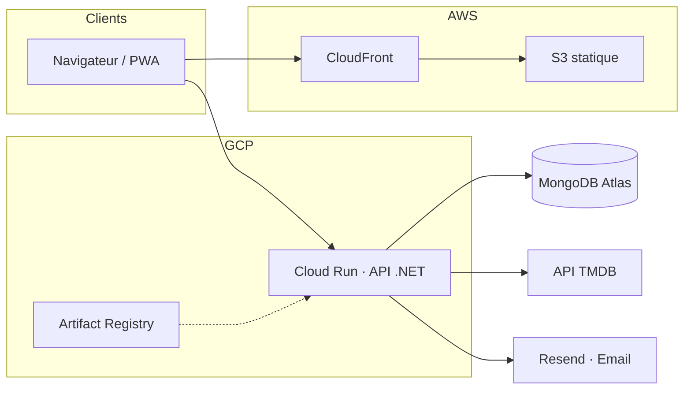

# 🎬 Movie Picker

**Organisez vos soirées film à plusieurs.** Créez une soirée, partagez le lien, proposez des films, votez — et laissez la roue trancher.

🌐 **Production : [web.movie-picker.fr](https://web.movie-picker.fr/)**

---

## Sommaire

- [Fonctionnalités](#fonctionnalités)
- [Architecture](#architecture)
- [Prérequis](#prérequis)
- [Démarrage](#démarrage)
- [Scripts utiles](#scripts-utiles)
- [Tests et qualité](#tests-et-qualité)
- [Comptes de test et seed](#comptes-de-test-et-seed)
- [Déploiement et CI/CD](#déploiement-et-cicd)
- [Structure du projet](#structure-du-projet)
- [Documentation](#documentation)

---

## Fonctionnalités

### Le parcours d'une soirée

1. 🎬 **Créer une soirée** (titre, date, heure) et obtenir un lien de partage.
2. 👥 **Rejoindre** la soirée depuis le lien partagé (compte requis).
3. 🍿 **Proposer des films** via la recherche TMDB (affiches, métadonnées).
4. 👍 **Voter** (up/down) et marquer un film « déjà vu ».
5. 🎡 **Lancer la roue** pour tirer un film au sort (tirage pondérable).
6. 🏆 **Clôturer** la soirée avec le film gagnant.

### Et aussi

- 📱 **PWA** installable (« Ajouter à l'écran d'accueil ») avec usage hors-ligne partiel
- 🌓 Thème **clair / sombre**
- 🔔 **Notifications** push et in-app
- 👤 **Profils publics** (`/u/:handle`)
- 📅 **Export calendrier** (`.ics`) des soirées à venir
- 🔒 **Suppression de compte** et export des données (RGPD)
- ♿ **Accessibilité** : navigation clavier, focus visible, skip link

---

## Architecture



- **Front** — React (Vite, TypeScript), **TanStack Query**, thème clair/sombre, PWA (Service Worker via `vite-plugin-pwa` / Workbox). Build statique hébergé sur **AWS**.
- **Back** — API ASP.NET Core (C#, .NET 10) en **architecture hexagonale**, conteneurisée sur **GCP** Cloud Run.
- **Données et services externes** — MongoDB Atlas ; TMDB (films, affiches proxifiées via `/api/v1/posters/{clé}`) ; Resend (mails de réinitialisation de mot de passe).
- **API** — préfixe public `/api/v1`, Swagger en développement, schéma exporté vers `artifacts/openapi-v1.json`.
- **Auth** — sessions par **cookie** ; actions hôte via jeton `?host=<token>`. En production, front (`web.movie-picker.fr`) et API (`api.movie-picker.fr`) partagent le même domaine racine → CORS (`ALLOWED_ORIGINS`) et cookies `SameSite=Lax; Secure`.

| Fournisseur | Service | Rôle |
|-------------|---------|------|
| **AWS** | S3 | Hébergement du build statique (front) |
| **AWS** | CloudFront | CDN, HTTPS, URL publique du front |
| **GCP** | Cloud Run | Exécution de l'API (conteneur) |
| **GCP** | Artifact Registry | Stockage de l'image Docker de l'API |
| **GCP** | Secret Manager | Secrets injectés au déploiement Cloud Run |
| **MongoDB** | Atlas | Base de données |
| **TMDB** | API | Recherche de films, affiches |
| **Resend** | API email | Mails transactionnels (prod ; dev → logs si non configuré) |

### Découpage de l'API (hexagonal)

- **Domaine** — entités et règles métier, sans dépendance framework.
- **Application** — cas d'usage (handlers), ports (interfaces) et DTOs.
- **Infrastructure** — implémentations concrètes des ports : MongoDB, TMDB, email, cookies / jeton hôte.
- **Entrée** — contrôleurs ASP.NET qui traduisent HTTP ↔ cas d'usage.

---

## Prérequis

- **Node.js** 20.19+, 22.13+ ou 24+ et **pnpm** (front)
- **.NET 10 SDK** (API)
- **MongoDB** (local ou Atlas) — **Docker** optionnel

Vérification rapide : `node scripts/check-prereqs.js` et `dotnet --version`.

---

## Démarrage

**1. Configurer l'environnement.**

- **MongoDB** — une base dédiée et jetable (jamais la prod) : soit un cluster **Atlas gratuit (M0)** via [mongodb.com/cloud/atlas](https://www.mongodb.com/cloud/atlas) (récupérer la chaîne de connexion), soit un conteneur local — `docker run -d --name moviepicker-mongo -p 27017:27017 mongo:7` → `MONGODB_URI=mongodb://localhost:27017/moviepicker_dev`.
- **TMDB** — compte gratuit sur [themoviedb.org](https://www.themoviedb.org/), puis *Réglages → API* pour obtenir une **clé API (v3 auth)** → `TMDB_API_KEY`.

Copier `.env.example` → `.env` à la racine et y renseigner ces deux valeurs (l'API .NET charge `.env` en remontant depuis le répertoire courant). Optionnel : `apps/web/.env` pour `VITE_API_URL` (voir `apps/web/.env.example`).

> En **Development**, `localhost` / `127.0.0.1` sont autorisés sans configuration CORS. En **Production** / Docker, l'API exige aussi `ALLOWED_ORIGINS` (origines du front, séparées par des virgules).

**2. Installer et lancer.**

```bash
pnpm install

pnpm dev:api-dotnet   # API .NET   → http://localhost:4000  (/health, /swagger)
pnpm dev:web          # Front Vite → http://localhost:5173
```

---

## Scripts utiles

Commandes à lancer à la racine du dépôt.

| Script | Description |
|--------|-------------|
| `pnpm dev:web` | Lance le front (Vite, port 5173) |
| `pnpm dev:api-dotnet` | Lance l'API .NET (port 4000) |
| `pnpm build` | Build du front (Turbo) |
| `pnpm lint` | Lint du front (ESLint) |
| `pnpm format` / `pnpm format:check` | Formatage Prettier (écriture / vérification) |
| `pnpm format:dotnet:check` | Style C# (`dotnet format`, après `dotnet restore`) |
| `pnpm test` | Tests front (Vitest, via Turbo) |
| `pnpm run openapi:export` | Export OpenAPI → `artifacts/openapi-v1.json` |
| `pnpm run test:e2e` | Tests E2E Playwright (local) |
| `pnpm run test:e2e:ci` | E2E recommandé : build web + Playwright (stub TMDB sur `:5010`) |
| `pnpm run lighthouse` | Lighthouse sur le build web (Node ≥ 22 + Chrome) |
| `pnpm run verify:local` | Pipeline locale complète (≈ CI) — voir [Tests et qualité](#tests-et-qualité) |

> **Build du front** : le paquet `web` enchaîne `tsc`, `vite build`, puis un contrôle (`apps/web/scripts/check-prod-bundle-secrets.mjs`) qui interdit d'embarquer les identifiants du compte dev dans `dist/assets/*.js`. Un `vite build` lancé à la main dans `apps/web` n'effectue **pas** ce contrôle.

> **Override pnpm (`basic-ftp`)** : la racine force une version patchée de `basic-ftp` (dépendance transitive de `lighthouse`) pour garder `pnpm audit --audit-level=high` vert. À réévaluer lors d'une montée majeure de Lighthouse.

---

## Tests et qualité

`pnpm run verify:local` reproduit localement l'essentiel de la CI : **lint** + **format** + **build API** + **export OpenAPI** + **`pnpm audit`** + **tests web et API**.

```bash
# API .NET
dotnet test apps/api-dotnet/MoviePicker.Api.Tests/MoviePicker.Api.Tests.csproj             # unitaires
dotnet test apps/api-dotnet/MoviePicker.Api.IntegrationTests/MoviePicker.Api.IntegrationTests.csproj  # intégration

# E2E Playwright (une fois : installer le navigateur)
pnpm exec playwright install chromium
pnpm run test:e2e:ci
```

Les tests d'intégration incluent `OpenApiContractTests`, qui vérifie le JSON OpenAPI exporté pour éviter les dérives de contrat.

---

## Comptes de test et seed

En **Development**, l'API peut créer automatiquement des comptes et des données de démo si le seed est activé (`apps/api-dotnet/MoviePicker.Api/appsettings.Development.json` → section `DevelopmentSeed`, ou variables `DevelopmentSeed__*`).

| Compte | E-mail | Mot de passe | Particularité |
|--------|--------|--------------|---------------|
| Principal | `dev@test.local` | `DevTest123!` | Hôte de plusieurs soirées |
| Alice | `alice@test.local` | `AliceTest123!` | Profil public |
| Bob | `bob@test.local` | `BobTest12345!` | Profil public |
| Carla | `carla@test.local` | `CarlaTest123!` | Profil **privé** (teste le 404) |
| David | `david@test.local` | `DavidTest123!` | Profil public |

Chaque compte n'est créé que si son e-mail est absent en base.

- **`SeedSampleEvents`** — quelques soirées de test pour le compte principal.
- **`SeedScenarioDemos`** — un jeu de soirées de démo couvrant les états clés (multi-participants, roue & clôture, capacité atteinte, retrait / quitter, roue tirée « gelée », soirée passée, échéance, soirée vide, soirée annulée), plus un graphe de follows et des notifications.

Désactivation : `DevelopmentSeed__Enabled=false`, ou plus finement `DevelopmentSeed__SeedSampleEvents=false` / `DevelopmentSeed__SeedScenarioDemos=false`. Les comptes secondaires sont configurables via `ExtraUsers` dans `appsettings.Development.json`.

---

## Déploiement et CI/CD

Pipeline GitHub Actions : `.github/workflows/ci-cd.yml`, déclenché sur `master` (push) et sur les PR.

| Phase | Contenu |
|-------|---------|
| **Sécurité repo** | Gitleaks (scan de secrets dans l'arbre Git) ; `actionlint` + `shellcheck` + `zizmor` sur les workflows eux-mêmes |
| **Lint / qualité** | ESLint + Prettier, `dotnet format`, build API Release, export OpenAPI, `pnpm audit`, audit NuGet (échec si High/Critical) |
| **Tests** | Vitest + couverture (web) ; xUnit + intégration + `OpenApiContractTests` (API) |
| **Qualité (Sonar)** | SonarScanner for .NET → SonarCloud (front + API, couverture lcov + opencover) ; Quality Gate **bloquant** (`sonar.qualitygate.wait`) |
| **Lighthouse** | Seuils perf/a11y front — **bloquant** (médiane 3 passes) |
| **Image API** *(push `master`)* | Build Docker → scan **Trivy** (HIGH/CRITICAL, bloquant) → push Artifact Registry, digest relevé |
| **Déploiement** *(push `master`)* | **Cloud Run** déployé **par digest** (secrets Secret Manager + `ALLOWED_ORIGINS`) ; front → **S3** + invalidation **CloudFront** |
| **Après déploiement** | L'API part **sans trafic**, est validée sur son URL taguée, et n'est promue qu'une fois verte ; puis smoke tests sur l'URL interne **et** sur le domaine public |

- **Quality Gate SonarCloud** : calculé à chaque run (visible dans SonarCloud / sur les PR) ; **bloquant** pour le déploiement — un Quality Gate rouge échoue le pipeline. E2E Playwright et Lighthouse sont eux aussi **bloquants**.
- **Déploiement front** : push S3 en 3 étapes (`index.html` et Service Worker en dernier, assets hachés en cache long) puis invalidation CloudFront, pour éviter toute désynchronisation Service Worker / bundles. Le `dist` est archivé en artefact (30 jours) : le front n'a pas de retour arrière côté hébergement, l'archive évite d'avoir à rejouer toute la chaîne.
- **Déploiement API** : chaque révision est déployée sans trafic et validée sur son URL taguée avant promotion — une révision qui échoue ses sondes n'est jamais servie à un utilisateur, il n'y a donc rien à annuler. `rollback.yml` reste la porte manuelle pour une régression constatée après coup.

Workflows annexes : `backup-mongo.yml` (sauvegarde quotidienne de la base, restaurée et vérifiée à chaque exécution), `rollback.yml` (retour arrière API manuel), `registry-cleanup.yml` (rétention Artifact Registry), `security-scan.yml` (scan de vulnérabilités hebdomadaire).

Branche par défaut : **`master`**.

---

## Structure du projet

```
movie-picker/
├─ apps/
│  ├─ web/            # Front React (Vite, TypeScript), PWA
│  └─ api-dotnet/     # API ASP.NET Core (.NET 10) — solution MoviePicker.slnx
├─ artifacts/         # Export OpenAPI, rapports Lighthouse
├─ configs/           # tsconfig / Prettier partagés
├─ docs/              # Documentation (roadmaps, correctifs, RNCP)
├─ e2e/               # Tests E2E Playwright
└─ scripts/           # Scripts utilitaires (verify:local, prérequis, OpenAPI…)
```

---

## Documentation

| Document | Contenu |
|----------|---------|
| [`CHANGELOG.md`](CHANGELOG.md) | Journal des versions (Keep a Changelog + SemVer) |
| [`docs/roadmap-product.md`](docs/roadmap-product.md) | Roadmap produit et tech, par version |
| [`docs/RNCP/`](docs/RNCP/) | Livrables de certification (RNCP 39583) |
