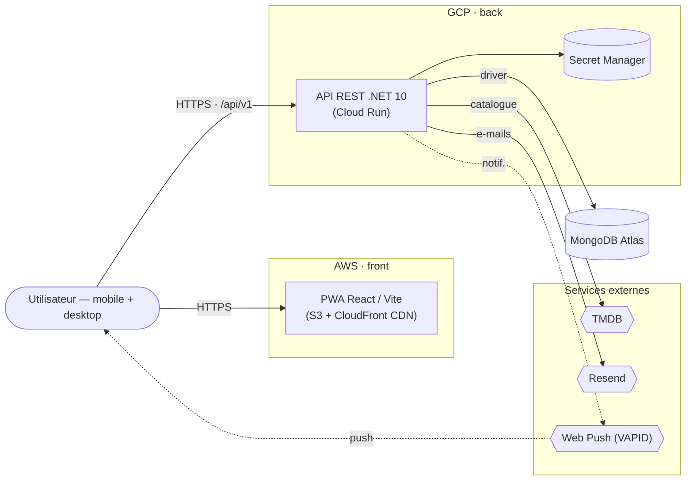
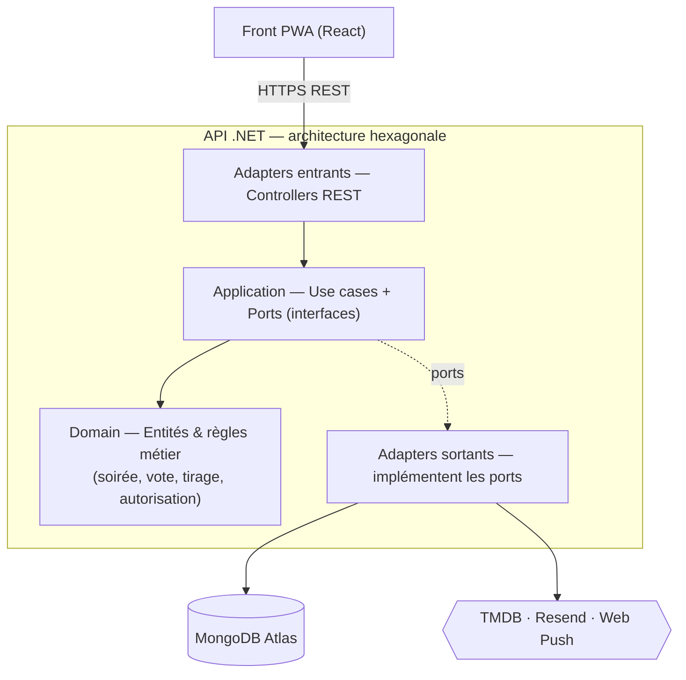
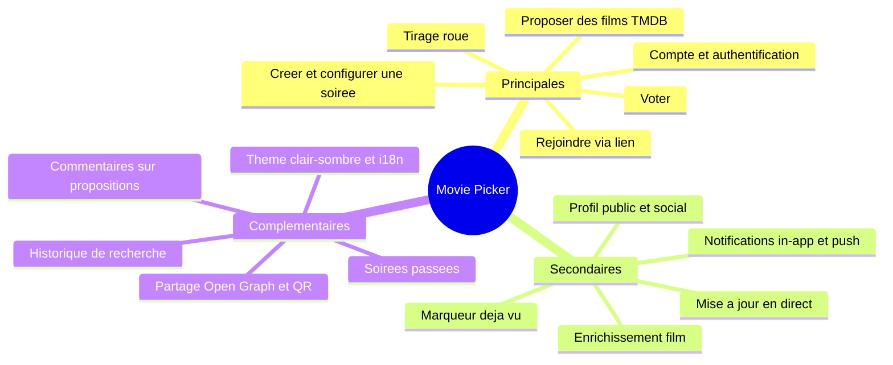
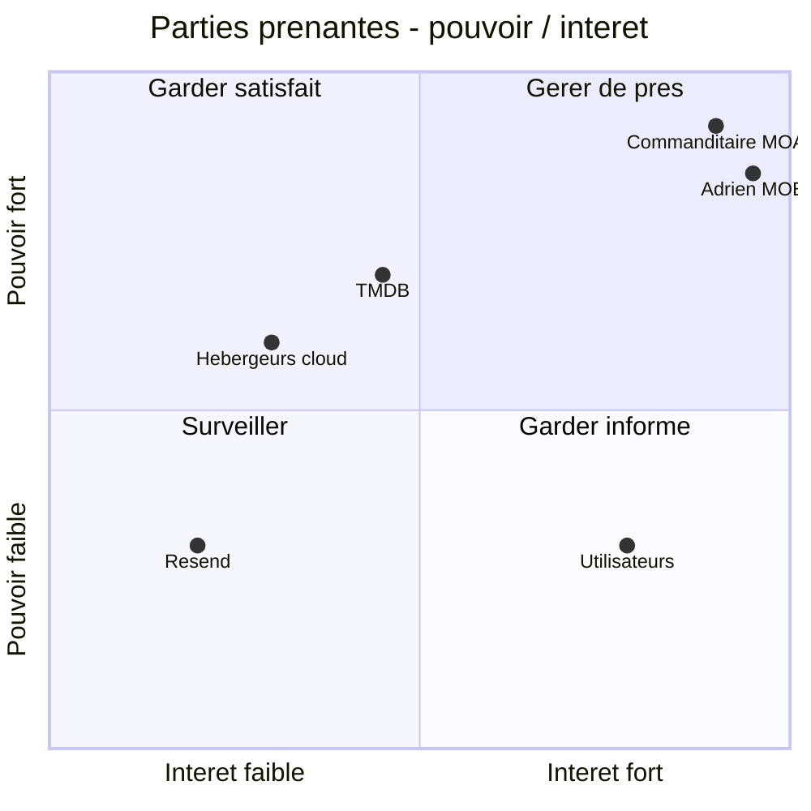
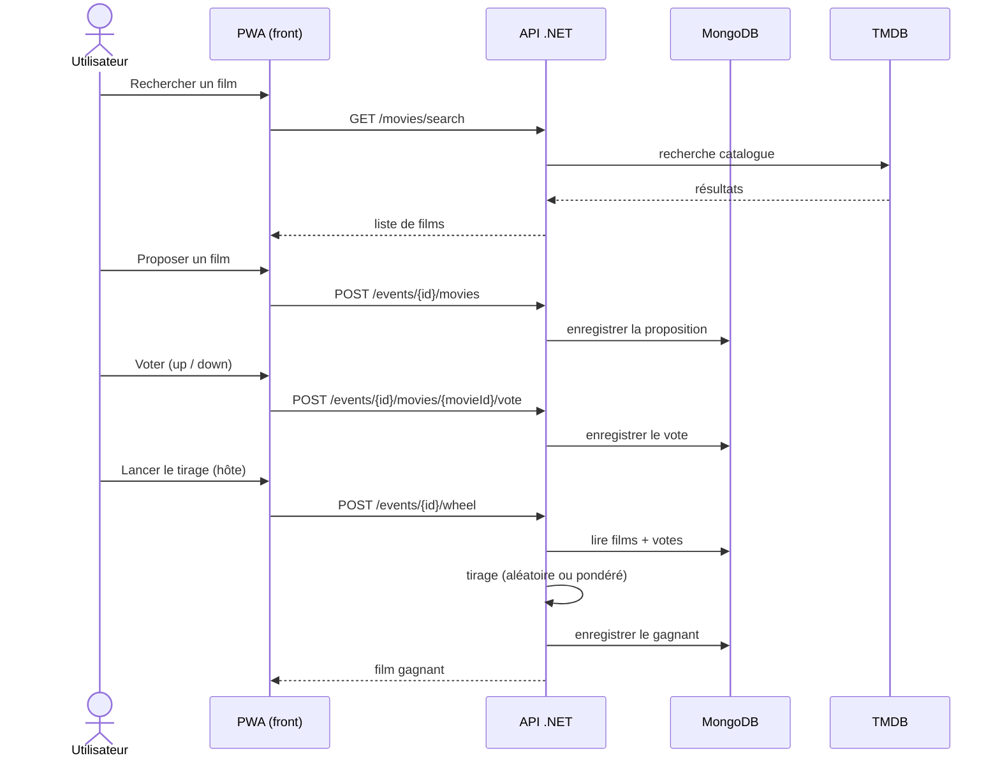

# Contenu des diapositives — Oral Bloc 1 « Cadrer un projet » (RNCP 39583)

> **Projet :** Movie Picker — **Candidat :** Adrien MORAND — **Oral :** 11 juin 2026
> **Épreuve :** oral 30 min (20 min présentation + 10 min questions), jury de 2 professionnels externes.
> **But de ce document :** décrire, **diapo par diapo, le contenu exact à afficher**.

## Conventions

- `[À VALIDER : …]` = information à confirmer avant de figer la diapo.
- ⚠️ = compétence **éliminatoire** du référentiel : diapo à blinder.
- Format de chaque diapo : **Titre** · *Critères couverts* · **Contenu affiché** · (option) **Notes orales**.
- **Cadre narratif — PRÉVISIONNEL :** au moment de l'oral, Movie Picker **n'existe pas encore**. Tout est formulé au futur / conditionnel (« le projet visera », « nous préconisons »). Aucune mention d'un produit déjà livré.
- **Existant audité :** l'écosystème et les solutions concurrentes (aucune réalisation antérieure) → projet *greenfield*.
- **Technologies :** nommées dès l'amont (parti pris de réalisme) mais présentées comme **préconisations**, justifiées par l'étude comparative (diapos 14-18).
- **Cible :** application web **mobile-first ET desktop**.
- **Volume :** **24 diapos présentées + 3 annexes** (hors-temps). ⚠️ **Timing tendu :** le contenu réel pèse ~21-22 min ; pour tenir 20 min, prévoir de raccourcir les diapos denses (SWOT, comparatif) ou d'en basculer une en annexe lors des répétitions. Minutage indicatif : ouverture 2′ · acteurs/besoin 4′ · stratégie/risques 3′ · faisabilité/veille 3′ · choix techniques 4,5′ · charge/budget 2,5′ · préconisation 2,5′.

---

## ✅ Diapos rédigées

### Diapo 1 — Couverture

*Critères couverts : aucun (page de titre).*

**Contenu affiché :**
- Titre : **Movie Picker**
- Sous-titre : *Cadrage d'un projet de développement logiciel*
- Bandeau : « Bloc 1 — Cadrer un projet de développement d'applications logicielles »
- Certification : *Expert en développement logiciel — RNCP 39583*
- **Adrien MORAND**
- 11 juin 2026
- *(optionnel : logo / maquette produit en visuel de fond)*

---

### Diapo 2 — Sommaire / fil rouge

*Critères couverts : aucun (structure). Sert le critère transversal C1.6 « discours structuré ».*

**Contenu affiché :** les 6 temps de la présentation, présentés comme un parcours de cadrage :
1. **Acteurs & besoin** — qui, pour quel problème ?
2. **Analyse stratégique & risques** — SWOT, risques.
3. **Faisabilité & veille** — audit de l'existant, veille.
4. **Choix techniques** — comparatif, architecture.
5. **Charge & budget** — analyse fonctionnelle, chiffrage.
6. **Préconisation** — décision et axes de solutions.

**Notes orales :** annoncer qu'on suit la logique « du *pourquoi/pour qui* vers le *comment/combien* jusqu'à la *recommandation* ».

---

### Diapo 3 — Contexte & problématique

*Critères couverts : pose le décor de C1.1.2 (problématique).*

**Contenu affiché :**
- **Le constat :** choisir un film à plusieurs (soirée entre amis / en famille) est une source de friction — indécision, allers-retours, temps perdu, voire abandon de la soirée.
- **Le projet proposé :** Movie Picker, une **application web (mobile et desktop)** qui aiderait un groupe à **décider ensemble** quel film regarder.
- **La problématique (formulée en question) :** *« Comment aider un groupe à choisir rapidement et de façon consensuelle un film à regarder ensemble ? »*

**Notes orales :** rester court (≈ 45 s). Cette problématique est le fil rouge : on y reviendra en préconisation (Diapo 22).

---

### Diapo 4 — Cartographie des parties prenantes ⚠️ *(C1.1.1)*

*Critères couverts : identifier tous les acteurs (développeurs, architectes, administrateurs, clients, acteurs externes) et comprendre leurs rôles et niveaux d'implication.*

**Angle clé :** le projet serait porté par **une seule personne, Adrien MORAND, endossant toutes les casquettes de réalisation (maîtrise d'œuvre)**. Le commanditaire est **fictif** (maîtrise d'ouvrage). La cartographie distingue les *rôles* — que le barème exige de nommer — des *personnes* qui les portent.

**Contenu affiché — tableau des parties prenantes :**

| Acteur | Catégorie | Rôle | Niveau d'implication |
|---|---|---|---|
| Commanditaire *(fictif)* | Client / MOA | Exprime le besoin, fixe objectifs & budget, valide les livrables | Fort — décideur |
| Adrien MORAND | MOE — Chef de projet / PO | Cadre le périmètre, priorise, planifie | Très fort |
| Adrien MORAND | MOE — Architecte logiciel | Conçoit l'architecture (web, API, base de données) | Très fort |
| Adrien MORAND | MOE — Développeur full-stack | Réalisera le front (React / TypeScript) et l'API (.NET) | Très fort |
| Adrien MORAND | MOE — Administrateur / DevOps | Déploiement, hébergement, CI/CD, supervision | Très fort |
| Adrien MORAND | MOE — Designer UX/UI | Conçoit les parcours et l'interface | Très fort |
| Utilisateurs finaux | Utilisateurs | Utiliseront l'app pour choisir un film en groupe *(détaillés Diapo 5)* | Moyen — usage & retours |
| API TMDB (The Movie Database) | Acteur externe (pressenti) | Catalogue, affiches, métadonnées, *watch providers* | Fort — dépendance fonctionnelle |
| Hébergeurs cloud (AWS, GCP, MongoDB Atlas) | Acteur externe (pressenti) | Front (S3/CloudFront), API (Cloud Run), base (Atlas) | Moyen |
| Resend (e-mail transactionnel) | Acteur externe (pressenti) | Envoi des e-mails (réinitialisation de mot de passe) | Faible |
| Service Web Push (VAPID) | Acteur externe (pressenti) | Délivrerait les notifications push aux navigateurs | Faible à moyen |

**Notes orales :** souligner qu'un seul développeur portant tous les rôles est **un risque de charge et de *bus factor*** (à relier aux risques, Diapo 10). Le positionnement **pouvoir/intérêt (Mendelow)** est en annexe (Diapo 25).

---

### Diapo 5 — Les utilisateurs cibles ⚠️ *(C1.1.1)*

*Critères couverts : identifier et détailler les caractéristiques des futurs utilisateurs.*

**Profil général :** grand public, plutôt 18-35 ans, à l'aise avec le web et les apps sociales. Usage **multi-support : mobile au moment de la soirée, desktop pour préparer / explorer**. **Faible tolérance à la friction** (décider vite). Accès **sur compte** (parti pris de conception).

**Contenu affiché — 3 personas (illustratifs) :**

| Persona | Profil | Objectif | Frustration | Usage |
|---|---|---|---|---|
| **Léa, 26 ans — l'organisatrice** | Organise les soirées de son groupe d'amis | Créer une soirée, inviter, trancher sans débat sans fin | Les « je sais pas, choisis toi » à répétition | Prépare sur desktop, anime sur mobile |
| **Tom, 30 ans — le participant** | Rejoint les soirées qu'on lui partage | Voter rapidement, donner son avis sans effort | Devoir installer / configurer trop de choses | Mobile, rejoint et vote |
| **Sami, 22 ans — le cinéphile** | Suit des amis, note et découvre des films | Découvrir, suivre les goûts des autres, garder une trace | Manque de recommandation personnalisée | Surtout desktop, explore et suit des profils |

**Notes orales :** ces personas justifient les choix fonctionnels (événements, vote, social / suivi) présentés en Diapo 19. Préciser qu'ils sont **illustratifs**, issus du parcours type « soirée film entre amis ».

---

### Diapo 6 — Analyse de la demande : besoins, objectifs & enjeux *(C1.1.2)*

*Critères couverts : recenser les besoins/attentes des parties prenantes, structurer en objectifs et enjeux.*

**Recueil du besoin :** entretien de cadrage avec le commanditaire (MOA) pour expliciter attentes & exigences, complété par l'analyse de l'existant (Diapo 11). Hypothèses validées avec la MOA.

**Besoins & attentes par partie prenante :**

| Partie prenante | Besoin principal |
|---|---|
| Commanditaire (MOA) | Un produit différenciant, déployable et démontrable, à coût maîtrisé |
| Utilisateurs | Choisir un film à plusieurs vite et sans dispute, sur mobile comme sur desktop |
| Exploitant (Adrien, DevOps) | Une app sécurisée, observable et maintenable par une seule personne |

**Objectifs du projet :**
- **O1** — Réduire le temps et la friction de décision d'un film en groupe.
- **O2** — Offrir une expérience collaborative **multi-support (mobile et desktop)**, mise à jour en direct (*polling léger*).
- **O3** — Aboutir à une web app **déployable en production** (CI/CD, sécurité, qualité).

**Enjeux :**
- *Usage* : adoption → friction minimale (compte rapide, lien de partage).
- *Technique* : dépendance au catalogue films, sécurité des données, coût d'infra.
- *Personnel* : démontrer la maîtrise full-stack + DevOps en solo.

**Notes orales :** ces objectifs sont repris dans la préconisation (Diapo 22).

---

### Diapo 7 — Problématique & pistes de solutions *(C1.1.2)*

*Critères couverts : problématique du client identifiée, pistes de solutions techniques cohérentes.*

**Problématique :** *« Comment aider un groupe à choisir rapidement et de façon consensuelle un film à regarder ensemble ? »*

**Pistes de solutions étudiées :**

| Piste | Avantages | Limite | Décision |
|---|---|---|---|
| App mobile native | Expérience riche | Coût multiplateforme, friction d'installation, ne couvre pas le desktop | Écartée |
| **Web app / PWA collaborative** | Sans installation, **mobile + desktop**, lien de partage | Temps réel à gérer | **Retenue** |
| Bot (Discord / WhatsApp) | Là où sont déjà les groupes | UX pauvre, pas de catalogue riche | Écartée |

**Mécanique envisagée :** proposer des films (catalogue TMDB) → **voter** → **tirage** (roue aléatoire ou pondérée par les votes).

**Notes orales :** la PWA couvre mobile ET desktop sans installation — c'est le facteur décisif du choix.

---

### Diapo 8 — SWOT *(C1.2.1)*

*Critères couverts : cartographie des opportunités et menaces avec un outil adapté (SWOT). L'analyse détaillée est en Diapo 9.*

**Matrice SWOT :**

| FORCES (interne) | FAIBLESSES (interne) |
|---|---|
| Stack moderne maîtrisée de bout en bout | Équipe = 1 personne (*bus factor*) |
| Approche PWA multi-support (mobile + desktop), sans installation | Conformité RGPD à intégrer |
| Sécurité & qualité prévues dès la conception (CI/CD, tests) | Accessibilité à garantir (RGAA / WCAG) |
| Catalogue riche (TMDB), coût d'infra faible (serverless) | Temps réel par *polling* (pas de WebSocket au départ) |

| OPPORTUNITÉS (externe) | MENACES (externe) |
|---|---|
| Niche « soirées entre amis » peu adressée | Dépendance à l'API TMDB (quotas, CGU, panne) |
| Intégrations streaming / Letterboxd | Concurrence (JustWatch, agrégateurs) |
| Social & notifications → rétention | Coûts cloud en cas de forte montée en charge |
| Extension mobile native ultérieure | Évolutions réglementaires (RGPD, accessibilité) |

---

### Diapo 9 — SWOT : adhérences, sécurité & impact *(C1.2.1)*

*Critères couverts : interactions/adhérences, impact environnemental, préconisations sécurité, points de vigilance, opportunités à exploiter.*

**Contenu affiché :**
- **Adhérences / interactions :** dépendances externes prévues (TMDB, MongoDB Atlas, GCP, AWS, Resend) ; projet **autonome**, sans adhérence à un système interne existant du commanditaire.
- **Impact environnemental :** préconiser un hébergement **serverless *scale-to-zero*** (pas de serveur 24/7), **CDN + cache d'affiches** pour limiter les requêtes, éco-conception (pages légères). *Vigilance : empreinte du multi-cloud.*
- **Préconisations sécurité :** auth cookie HttpOnly + sessions, **autorisation systématique (anti-IDOR)**, CORS strict, en-têtes CSP, *rate limiting*, secrets en coffre (Secret Manager), scans automatisés (Gitleaks, Trivy).
- **Points de vigilance à mettre sous contrôle :** *bus factor*, RGPD, quotas TMDB, performances.
- **Opportunités à exploiter en priorité :** social / notifications (rétention), deep links streaming.

---

### Diapo 10 — Cartographie des risques & indicateurs *(C1.2.3)*

*Critères couverts : risques priorisés dans un référentiel (perte de données, interruption, dégradation, sécurité) + indicateurs de contrôle.*

**Référentiel de risques (criticité = probabilité × impact ; mitigations à mettre en place) :**

| Risque | Crit. | Mitigation prévue | Indicateur de contrôle |
|---|---|---|---|
| Perte de données | Élevée | Backups Atlas, isolation stricte dev/prod | Succès des backups, RPO/RTO |
| Interruption du service | Moyenne | Cloud Run multi-instances, `/health`, CDN | Uptime %, taux d'erreurs 5xx |
| Dégradation (perf) | Moyenne | Cache, pagination, budgets Lighthouse | Latence p95, score Lighthouse |
| Sécurité (intrusion, IDOR) | Élevée | Authz systématique, scans CI, *rate limit* | Vulnérabilités Trivy/Sonar, taux 401/429 |
| Dépendance TMDB | Moyenne | Cache d'enrichissement, mode dégradé | Taux d'erreur TMDB |
| *Bus factor* (solo) | Élevée | CI/CD, tests automatisés, documentation | Couverture de tests |

**Notes orales :** ce référentiel servirait aussi de **registre de suivi des incidents** (la criticité est réévaluée dans le temps). Échelle : probabilité et impact notés de 1 à 4.

---

### Diapo 11 — Démarche d'audit & diagnostic de l'existant ⚠️ *(C1.2.2)*

*Critères couverts : démarche d'audit documentée/argumentée, étude technique (langages, BDD, architecture & technos, état des applications existantes).*

**Démarche d'audit (3 étapes) :**
1. Analyse des **solutions existantes et concurrentes**.
2. Inventaire des **briques techniques disponibles** (APIs, hébergement, navigateurs).
3. Confrontation aux **contraintes** (plateformes, budget, compétences).

**Diagnostic de l'existant :**
- **Solutions actuelles / concurrence :** sondages génériques (Doodle), listes & discussions de groupe (WhatsApp, Discord), agrégateurs (JustWatch) → **aucune ne réunit *proposition + vote + tirage*** pour un groupe.
- **Côté commanditaire :** **aucune application ni infrastructure existante** → projet *greenfield* (liberté de conception, rien à reprendre).
- **Briques disponibles évaluées :** APIs catalogue (TMDB, OMDb), hébergeurs cloud serverless, navigateurs modernes (PWA, Web Push).
- **Langages candidats :** TypeScript (front), C# / .NET ou Node (back).
- **Caractéristiques des bases comparées :** *documentaire (NoSQL)* — schéma flexible, agrégats imbriqués (soirée → films → votes), scalabilité horizontale, cohérence à terme ; *relationnel (SQL)* — schéma rigide, jointures, transactions ACID fortes.

**Conclusion d'audit :** besoin réel mal couvert + briques matures disponibles → **projet faisable, à bâtir *from scratch*** (web full-stack ; choix détaillés en Diapo 14).

---

### Diapo 12 — Contraintes & avis de faisabilité ⚠️ *(C1.2.2)*

*Critères couverts : contraintes techniques ET financières, avis critique sur la faisabilité.*

**Contraintes techniques :**
- Hébergement cloud managé, **serverless** (coût quasi nul au repos).
- Plateforme : navigateur (PWA) sur **mobile ET desktop** → pas d'OS cible.
- **Volume de données : faible** — documents légers (~quelques Ko/soirée), ordre de grandeur < 1 Go en année 1.
- **Nombre d'utilisateurs (cible) :** ~quelques centaines d'inscrits en an 1 ; soirées de 2-10 participants ; **pics ~10-50 utilisateurs simultanés** pendant les soirées.
- Délais : **livraison incrémentale par lots** (un MVP, puis enrichissements).
- Ressources humaines : **1 développeur** portant toutes les casquettes.

**Contraintes financières :** budget étudiant → *free tiers*, open source, serverless.

**Avis de faisabilité (critique) :**
- ✅ **Faisable** : stack maîtrisée, API gratuite (TMDB), hébergement low-cost, volume/charge modestes.
- ⚠️ Principaux risques : charge solo (*bus factor*) + RGPD à intégrer.
- → **Décision : GO**, avec jalonnement par lots et automatisation (CI/CD) pour compenser le solo.

---

### Diapo 13 — Veille technique, technologique & réglementaire *(C1.3.1)*

*Critères couverts : stratégie & objectifs de veille, outils, bénéfices, évolutions classifiées et justifiées (impact métier + environnemental).*

**Stratégie & objectifs :** rester à jour sur l'écosystème front/back, la sécurité web et la réglementation (RGPD, accessibilité).

**Outils de veille :**
- **Automatisée :** Dependabot / Renovate, GitHub Releases, flux RSS (blogs React / .NET), newsletters.
- **Sécurité :** GitHub Advisories, Trivy & Gitleaks (intégrés à la CI), audits npm / NuGet.
- **Communauté :** meetups, réseaux professionnels, changelog de l'API TMDB.

**Bénéfices attendus :** sécurité à jour, choix techniques pérennes, conformité réglementaire.

**Évolutions retenues — classées par impact (métier + environnemental) :**

| Évolution | Type | Impact métier | Impact environnemental |
|---|---|---|---|
| React 19 / .NET 10 | Technique | Vélocité, maintenabilité, coût | Moins de ressources consommées |
| RGPD & accessibilité (RGAA/WCAG) | Réglementaire | Conformité, audience élargie | — |
| Serverless & éco-conception | Environnementale | Coût d'infra réduit | Sobriété (scale-to-zero, pages légères) |

---

### Diapo 14 — Étude comparative des solutions techniques ⚠️ *(C1.3.2)*

*Critères couverts : analyse comparative des solutions envisagées, choix justifiés et adaptés, identification des ressources nécessaires.*

**Comparatif des décisions structurantes :**

| Décision | Options comparées | Choix retenu | Justification |
|---|---|---|---|
| Type d'app | Natif mobile · desktop natif · **PWA web** | **PWA web** | Mobile + desktop, sans installation, un seul code |
| Front | Angular · Vue · **React + Vite** | **React + Vite + TS** | Écosystème mûr, typage, build rapide, support PWA |
| API | Node.js · **.NET (C#)** | **.NET 10 (ASP.NET Core)** | Typage fort, performances, robustesse |
| Base de données | PostgreSQL (SQL) · **MongoDB** | **MongoDB Atlas** | Modèle documentaire souple (soirées/films/votes), itération rapide |
| Hébergement | VPS · PaaS · **Serverless** | **Serverless** (Cloud Run + S3/CloudFront) | *Scale-to-zero*, coût mini, exploitation réduite (solo) |
| Notifications | E-mail seul · polling seul · **Web Push** | **Web Push (VAPID)** + MAJ en direct | Engagement, faible coût |

**Ressources techniques nécessaires :** comptes AWS + GCP, cluster MongoDB Atlas, clé API TMDB, clés VAPID, service e-mail (Resend), pipeline CI/CD (GitHub Actions).

**Notes orales :** l'analyse des choix sur les 5 axes du barème est en Diapo 15.

---

### Diapo 15 — Analyse des choix : sécurité, systèmes, réseaux, accessibilité, environnement ⚠️ *(C1.3.2)*

*Critères couverts : avantages / inconvénients des solutions sur les 5 axes du barème.*

| Axe | Avantages des choix | Points de vigilance |
|---|---|---|
| **Sécurité** | .NET mûr (Data Protection), auth cookie HttpOnly + sessions, CORS strict, CSP, *rate limiting*, secrets en coffre, scans CI | CSRF à couvrir (CORS + SameSite), secrets sur 2 clouds |
| **Environnements systèmes** | Conteneur Docker portable (API), runtime managé (Cloud Run), front statique | 2 écosystèmes cloud à maîtriser (AWS + GCP) |
| **Réseaux** | HTTPS de bout en bout, CDN CloudFront (latence), API REST `/api/v1` | Dépendance réseau aux APIs externes, latence cross-cloud front ↔ API |
| **Accessibilité** | Web standard (HTML sémantique, clavier, lecteurs d'écran), responsive mobile + desktop, thème clair/sombre | RGAA / WCAG à tester, contrastes à valider |
| **Impact environnemental** | Serverless *scale-to-zero*, CDN + cache (moins de requêtes), pages légères | Multi-cloud, bilan carbone à estimer |

**Notes orales :** chaque choix sert la problématique (décider vite, à plusieurs, sur tout support) tout en restant maintenable par une seule personne.

---

### Diapo 16 — Architecture : vue de déploiement (conteneurs) *(C1.5)*

*Critères couverts : architecture schématisée et légendée (formes, flèches, couleurs, positions) — vue système/infrastructure.*

**Schéma de déploiement (C4 — niveau conteneurs) :**

**Légende (à afficher sur la diapo) :**
- **Formes :** stade = utilisateur · rectangle = composant interne · cylindre = base de données · hexagone = service tiers.
- **Flèches :** trait plein = appel synchrone (HTTPS / REST) · pointillé = flux asynchrone (notification push).
- **Couleurs :** bleu = composants développés · vert = cadres d'hébergement (AWS / GCP) · gris = services externes.
- **Positions :** client à gauche → API au centre → données & services à droite.

---

### Diapo 17 — Architecture logicielle : vue en couches (hexagonale) *(C1.5)*

*Critères couverts : architecture **logicielle** schématisée et légendée ; maintenable, sécurisée, extensible.*

**Schéma logiciel — architecture hexagonale (ports & adapters) de l'API :**

**Légende & principes :**
- **Domain** au centre : cœur métier **sans dépendance technique**.
- **Application** : orchestre les cas d'usage, **définit les ports** (interfaces).
- **Adapters** (entrants / sortants) : implémentations techniques **interchangeables** (ex. MongoDB ↔ *in-memory* pour les tests).
- **Règle de dépendance :** tout pointe vers le Domain → **testable, découplé, extensible**.

---

### Diapo 18 — Architecture logicielle : justification & qualités *(C1.5)*

*Critères couverts : formalisme justifié, interactions, qualités (maintenable / sécurisée / extensible), impact environnemental.*

**Contenu affiché :**
- **Formalisme retenu :** modèle **C4** (vues déploiement + logiciel, lisibles par le commanditaire) complété de **diagrammes UML de séquence** pour les parcours clés (voir annexe, Diapo 26). C4 pour la vue d'ensemble, UML pour le détail normalisé.
- **Interactions explicitées :** front ↔ API (REST HTTPS, cookie de session) · API ↔ MongoDB (driver) · API ↔ TMDB / Resend / Web Push · CI/CD GitHub Actions → déploiement.
- **Qualités de l'architecture :**
  - *Maintenable* — architecture **hexagonale** (Domain / Application / Infrastructure), *ports & adapters* → testable, découplée.
  - *Sécurisée* — autorisation systématique, CORS / CSP, secrets en coffre, scans CI.
  - *Extensible* — adapters interchangeables, API versionnée (`/api/v1`), ajout de features sans refonte (social, mobile ultérieur).
- **Impact environnemental :** serverless *scale-to-zero* (pas de machine 24/7), CDN + cache (moins de transfert), pages légères ; **bilan carbone estimable** via un outil type Website Carbon / EcoIndex.

---

### Diapo 19 — Analyse fonctionnelle : fonctionnalités hiérarchisées ⚠️ *(C1.4.1)*

*Critères couverts : fonctions recensées, caractérisées, hiérarchisées (principales / secondaires / complémentaires), outil explicité, couverture technique, UX.*

**Diagramme de fonctionnalités (arbre fonctionnel) :**

**Caractérisation des fonctions principales :**

| Fonction | Caractérisation |
|---|---|
| Compte & authentification | Créer un compte, se connecter, réinitialiser le mot de passe |
| Créer / configurer une soirée | Titre, date, options (mode de tirage, séries OK…), lien de partage |
| Rejoindre via lien | Accès à la soirée par lien partagé (compte requis) |
| Proposer des films | Recherche catalogue TMDB, ajout (anti-doublon) |
| Voter | Préférence up/down sur chaque film proposé |
| Tirage | Désigne le film via une roue (aléatoire ou pondérée par les votes) |

- **Outil d'analyse fonctionnelle :** recensement par **cas d'usage (UML)** + priorisation **MoSCoW** (Must / Should / Could → principales / secondaires / complémentaires).
- **Couverture technique :** catalogue ← TMDB · soirées & votes ← API REST + MongoDB · notifications ← Web Push · multi-support ← PWA.
- **UX :** mobile-first **et** desktop, parcours à faible friction (lien de partage, peu d'étapes), feedback en direct.

---

### Diapo 20 — Estimation de la charge (jours-homme) ⚠️ *(C1.4.1)*

*Critères couverts : charge de travail exprimée en jours-homme.*

**Estimation par lot (méthode : décomposition par lots + jugement d'expert) :**

| Lot | Charge (JH) |
|---|---|
| Socle technique, CI/CD & déploiement | 15 |
| Compte & authentification | 8 |
| Soirées (créer / configurer / rejoindre / partage) | 12 |
| Films, vote & tirage | 15 |
| Enrichissement, « déjà vu » & temps réel | 10 |
| Notifications (in-app + push) | 8 |
| Social & profil public | 8 |
| Confort (historique, commentaires, thème, i18n, OG/QR) | 7 |
| Tests, sécurité, accessibilité, perf *(transverse)* | 8 |
| Design UX/UI *(transverse)* | 6 |
| **Total** | **≈ 97 JH** |

**Hypothèses :** 1 développeur · jours effectifs · marge ~10 % incluse · ≈ **5 mois** à temps plein.

---

### Diapo 21 — Budget prévisionnel *(C1.4.2)*

*Critères couverts : estimation cohérente avec la charge, budget prévisionnel, postes de coûts.*

**Budget prévisionnel (an 1) :**

| Poste | Base de calcul | Coût (an 1) |
|---|---|---|
| **Développement** | 97 JH × 350 €/j | **≈ 34 000 €** |
| Infrastructure | Atlas / Cloud Run / S3+CloudFront (*free tiers* au démarrage) | ≈ 250 € |
| Nom de domaine | .fr / .com | ≈ 12 € |
| Services / API | TMDB (gratuit, attribution) · Resend (*free tier*) | 0 € |
| Licence utilisateur | aucune (pas de modèle par licence) | 0 € |
| **Total estimé** | | **≈ 34 300 €** |

**Lecture :** ~99 % du budget = développement (typique d'un projet logiciel) ; l'infra **serverless** maintient un coût récurrent quasi nul (argument budget **et** environnemental).

**Notes orales :** TJM **350 €/j** = freelance junior ; à ajuster selon le profil (junior chargé en ESN : ~500-650 €/j). Le coût de développement découle directement de la charge (Diapo 20) → cohérence chiffrée. Le poste « licence utilisateur » du barème est ici **nul** (à dire explicitement).

---

### Diapo 22 — Synthèse : décisions & axes de solutions préconisés ⚠️ *(C1.6)*

*Critères couverts : exposer le cadre et les solutions préconisées, argumenter au regard de la problématique.*

**Le cadre :** aider un groupe à choisir vite et de façon consensuelle un film, sur **mobile et desktop**. Commanditaire (MOA) ; réalisation **solo** (MOE).

**Les axes de solution préconisés :**
- **Web app PWA collaborative** (mobile + desktop, sans installation).
- Mécanique **proposer → voter → tirage**, appuyée sur le catalogue **TMDB**.
- Architecture **full-stack** (React/Vite · API .NET · MongoDB) en **hébergement serverless** (coût mini, sobre).
- **Sécurité & qualité dès la conception** (auth/authz, CI/CD, scans).

**En quoi cela répond à la problématique :** friction minimale (lien de partage) · décision objectivée (vote + tirage) · accessible partout (PWA).

**Conditions de réussite :** jalonnement par lots, automatisation (compense le solo), conformité RGPD & accessibilité intégrées. *Cadrage chiffré : ≈ 97 JH / ≈ 34 300 €.*

**Notes orales :** alterner terme technique + reformulation simple (ex. « *serverless* = des serveurs qui s'éteignent quand personne ne les utilise → coût quasi nul ») — vocabulaire pro **vulgarisé** pour le jury.

---

### Diapo 23 — Anticipation des objections ⚠️ *(C1.6)*

*Critères couverts : les objections sont prises en compte et traitées.*

| Objection probable | Réponse |
|---|---|
| « Pourquoi pas une app mobile native ? » | La PWA couvre mobile **et** desktop sans installation ni coût multiplateforme ; un natif reste possible ultérieurement |
| « La dépendance à TMDB n'est-elle pas risquée ? » | API gratuite et stable, **cache + mode dégradé** prévus ; alternative (OMDb) identifiée |
| « Un seul développeur, est-ce tenable ? » | Périmètre **jalonné par lots** + automatisation (CI/CD, tests) ; *bus factor* identifié et outillé |
| « Pourquoi MongoDB plutôt que du SQL ? » | Modèle **documentaire** adapté (soirées/films/votes), itération rapide ; pas de besoin transactionnel critique |
| « Le multi-cloud n'est-il pas trop complexe ? » | Chaque cloud sur son point fort (CDN AWS, serverless GCP), **secrets centralisés** ; choix assumé et documenté |
| « Du vrai temps réel ? » | **Polling léger** au départ (suffisant pour de petits groupes) ; WebSocket envisageable si le besoin grandit |

---

### Diapo 24 — Conclusion / appel à validation *(C1.6)*

*Critères couverts : clôture de l'argumentaire, demande de validation.*

**3 points à retenir :**
1. Un besoin réel et **mal couvert** → une solution ciblée (PWA collaborative).
2. Un **cadrage complet** : faisable, sécurisé, sobre, chiffré (≈ 97 JH / ≈ 34 300 €).
3. Un plan **maîtrisé** malgré le solo (lots + automatisation).

**Appel à validation :** obtenir l'adhésion du commanditaire pour lancer la réalisation (**lot 1 = MVP**).

**Ouverture :** social, mobile natif, intégrations streaming / Letterboxd.

**Notes orales :** terminer par « Merci — je suis à votre disposition pour vos questions. »

---

## 📎 Annexes (back-up — hors présentation, pour les 10 min de questions)

### Diapo 25 — Annexe : Matrice pouvoir / intérêt (Mendelow) *(appui C1.1.1)*

*Renforce le critère « niveaux d'implication » des parties prenantes.*

*(Mermaid en ASCII pour éviter les soucis de parsing — accents à remettre dans l'outil de diapo.)*

---

### Diapo 26 — Annexe : Diagramme de séquence — « proposer → voter → tirage » *(appui C1.5)*

*Explicite les interactions entre systèmes (critère C1.5).*

---

### Diapo 27 — Annexe : back-up divers

**À tenir prêt pour les questions :**
- Référentiel de risques complet (échelle proba × impact, indicateurs).
- Détail de la charge par fonctionnalité et hypothèses de budget (fourchette TJM).
- Sources & outils de veille (liste détaillée).
- Maquettes / parcours utilisateur (journey map).
- Détail du modèle de données (collections MongoDB).

---

## Couverture du barème (contrôle)

| Compétence | Diapo(s) | Élim. |
|---|---|---|
| C1.1.1 Acteurs | 4, 5 (+ annexe 25) | ⚠️ |
| C1.1.2 Demande | 6, 7 | |
| C1.2.1 SWOT | 8, 9 | |
| C1.2.2 Faisabilité | 11, 12 | ⚠️ |
| C1.2.3 Risques | 10 | |
| C1.3.1 Veille | 13 | |
| C1.3.2 Architecture technique | 14, 15 | ⚠️ |
| C1.4.1 Charge | 19, 20 | ⚠️ |
| C1.4.2 Coût | 21 | |
| C1.5 Architecture logicielle | 16, 17, 18 (+ annexe 26) | |
| C1.6 Préconisation | 22, 23, 24 (+ posture orale globale) | ⚠️ |
