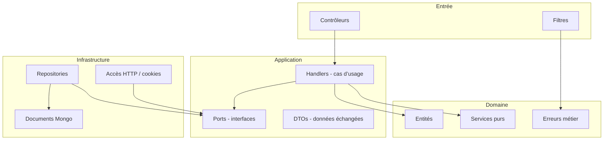
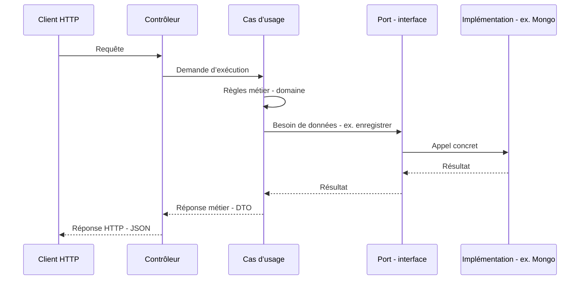

# Architecture de l’API .NET (Movie Picker)

Vulgarisation et description de l’organisation du code dans `apps/api-dotnet/MoviePicker.Api`.

---

## En une phrase

L’application est découpée en **couches** : au **centre**, les règles métier et les scénarios (créer une soirée, rejoindre, etc.) ; **autour**, tout ce qui touche au **web** (HTTP) ou à la **base de données** est branché via des **contrats** (interfaces), pour pouvoir les changer sans réécrire le cœur de l’app.

On appelle souvent ça une **architecture hexagonale** : le « cœur » ne dépend pas de MongoDB ni d’ASP.NET ; ce sont ces technologies qui s’adaptent au cœur.

---

## Schéma global

```
        ┌─────────────────────────────────────┐
        │  Ce qui reçoit les requêtes HTTP    │
        │  (contrôleurs, filtres d’erreur)  │
        └──────────────────┬──────────────────┘
                           │
                           ▼
        ┌─────────────────────────────────────┐
        │  Cas d’usage + contrats (interfaces)  │
        │  « Que faire ? » + « J’ai besoin de   │
        │   lire/écrire des événements »        │
        └──────────────────┬──────────────────┘
                           │
              ┌────────────┴────────────┐
              ▼                         ▼
   ┌────────────────────┐    ┌────────────────────┐
   │  Règles métier     │    │  Accès MongoDB,    │
   │  (soirée, slug…)   │    │  lecture cookie…   │
   └────────────────────┘    └────────────────────┘
```

- **Haut** : l’**entrée** du monde extérieur (le navigateur ou un client appelle l’API).
- **Milieu** : l’**application** orchestre ce qu’il faut faire et s’appuie sur des **interfaces** pour ne pas connaître le détail technique.
- **Bas à gauche** : le **domaine** = concepts et règles (une soirée « terminée », génération d’identifiants courts, etc.).
- **Bas à droite** : l’**infrastructure** = comment on parle vraiment à MongoDB, comment on lit le token hôte dans la requête HTTP.

---

## Les quatre blocs (dépendances)

Idée clé : **le domaine et l’application ne « voient » pas MongoDB ni les contrôleurs**. Seules les couches extérieures connaissent ces détails.



| Bloc | Rôle vulgarisé |
|------|----------------|
| **Domaine** | « C’est quoi une soirée / un participant ? » et règles qui ne dépendent d’aucun framework. |
| **Application** | « Quand quelqu’un crée une soirée, quelles étapes ? » Elle appelle des **ports** (ex. « sauvegarder un événement ») sans savoir si c’est Mongo ou autre chose. |
| **Infrastructure** | Réalise concrètement les ports : écriture en base, lecture du paramètre `host` ou du cookie, etc. |
| **Entrée (contrôleurs)** | Traduit la requête HTTP en appel au bon cas d’usage et renvoie la réponse JSON. |

---

## Parcours type : une action utilisateur



En cas d’erreur attendue (ex. ressource introuvable), le cas d’usage peut lever une **erreur métier** ; un **filtre** la transforme en message JSON et code HTTP cohérents pour le client.

---

## Où est le code dans le dépôt

| Dossier | Contenu documenté |
|---------|-------------------|
| `Domain/` | Entités, services sans dépendance externe, exceptions métier. |
| `Application/` | Interfaces des ports, DTOs, handlers par scénario. |
| `Infrastructure/` | MongoDB (documents, repositories), accès au contexte HTTP, chargement config, filtres. |
| `Controllers/` | Points d’entrée HTTP. |
| `Program.cs` | Assemblage de l’application (pipeline, enregistrement des services). |

Ce document ne décrit que l’**architecture** ; le contrat HTTP : préfixe **`/api/v1`**, document OpenAPI via **Swagger** en développement (`/swagger/v1/swagger.json`), et tests de non-régression du schéma dans **`MoviePicker.Api.IntegrationTests/OpenApiContractTests.cs`**.

### Erreurs HTTP (enveloppe unique, roadmap § 29)

Réponses d’erreur JSON : `{ "error": string, "code": number (HTTP), "requestId": string? }` (`requestId` omis si absent du contexte). En-tête réponse **`X-Request-Id`** (réutilise `X-Request-Id` / `X-Correlation-Id` entrant si valide, sinon UUID). Même format pour : filtres d’exception / validation, **404** sans route (`StatusCodePages`), **429** (rate limiting). CORS : `X-Request-Id` exposé au navigateur (`Access-Control-Expose-Headers`).

### Qualité C# (roadmap § 31)

- **Solution** : `apps/api-dotnet/MoviePicker.slnx` (trois projets).
- **`Directory.Build.props`** : `AnalysisLevel` 8.0, `EnforceCodeStyleInBuild`, **`CS4014`** (async non attendu) en **erreur** de build.
- **`.editorconfig`** (dans `apps/api-dotnet/`) : style + sévérités ciblées (ex. noms `*Handler`, entité `Event`, tests avec `_`, logger sans source-gen).
- **CI** : job **lint** exécute `dotnet format … --verify-no-changes` puis `dotnet build … -warnaserror`.
- **Local** : `pnpm run format:dotnet` (appliquer) / `pnpm run format:dotnet:check` (vérifier).

### Contrat OpenAPI — artefact & codegen (roadmap § 32)

- **Document runtime** : en dev, `GET /swagger/v1/swagger.json` (Swagger UI sur `/swagger`).
- **Export fichier (local)** : `pnpm run openapi:export` → `artifacts/openapi-v1.json` (outil **Swashbuckle.AspNetCore.Cli** dans `apps/api-dotnet/dotnet-tools.json`, génération via `dotnet swagger tofile` avec `ASPNETCORE_ENVIRONMENT=Development` pour ne pas exiger `ALLOWED_ORIGINS`). Build en **Release** : si `MoviePicker.Api.exe` est verrouillé (API en cours d’exécution), arrêter le processus ou lancer après un `dotnet build` réussi sans serveur actif.
- **CI** : le job **lint** enchaîne déjà un build Release ; l’export réutilise la DLL (`SKIP_OPENAPI_BUILD=1` dans le script) puis publie l’artefact **`openapi-v1`** (*Actions* → run → *Artifacts*).
- **Gouvernance** : conserver **`OpenApiContractTests`** (chemins critiques dans le JSON) ; en cas de changement de surface API, mettre à jour les tests et regénérer l’OpenAPI.
- **Codegen TypeScript (optionnel V1)** : à partir de `openapi-v1.json`, outils possibles — **`openapi-typescript`** (`npx openapi-typescript artifacts/openapi-v1.json -o apps/web/src/api/schema.d.ts`), **Orval**, **hey-api/openapi-ts**. À brancher dans le front si vous voulez des types alignés sur l’API ; le client actuel reste manuel (`fetchApi`).

---

## Prérequis machine (.NET 10)

- **SDK** : [.NET 10](https://dotnet.microsoft.com/download/dotnet/10.0) (LTS). Sous Windows : `winget install Microsoft.DotNet.SDK.10` (ou équivalent).  
- Vérifier : `dotnet --version` → **10.x** ; `dotnet nuget list source` → au moins nuget.org.  
- Lancer l’API : `pnpm dev:api-dotnet` ou `dotnet run` depuis `MoviePicker.Api` (voir [README racine](../../README.md)).
