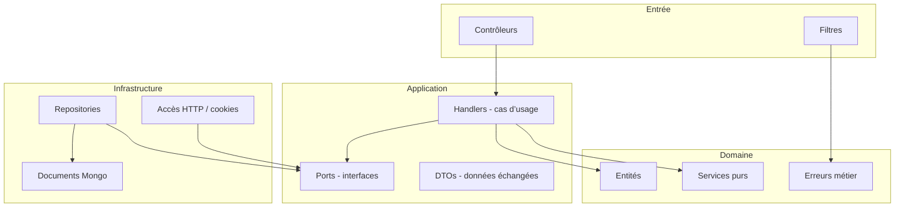
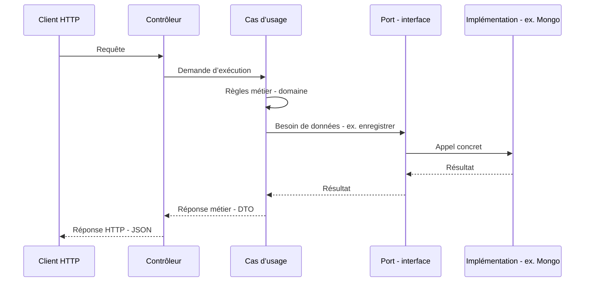

# Architecture de l’API .NET (Movie Picker)

Vulgarisation et description de l’organisation du code dans `apps/api-dotnet/MoviePicker.Api`.

---

## En une phrase

L’application est découpée en **couches** : au **centre**, les règles métier et les scénarios (créer une soirée, rejoindre, etc.) ; **autour**, tout ce qui touche au **web** (HTTP) ou à la **base de données** est branché via des **contrats** (interfaces), pour pouvoir les changer sans réécrire le cœur de l’app.

On appelle souvent ça une **architecture hexagonale** : le « cœur » ne dépend pas de MongoDB ni d’ASP.NET ; ce sont ces technologies qui s’adaptent au cœur.

---

## Schéma global

```
        ┌─────────────────────────────────────┐
        │  Ce qui reçoit les requêtes HTTP    │
        │  (contrôleurs, filtres d’erreur)  │
        └──────────────────┬──────────────────┘
                           │
                           ▼
        ┌─────────────────────────────────────┐
        │  Cas d’usage + contrats (interfaces)  │
        │  « Que faire ? » + « J’ai besoin de   │
        │   lire/écrire des événements »        │
        └──────────────────┬──────────────────┘
                           │
              ┌────────────┴────────────┐
              ▼                         ▼
   ┌────────────────────┐    ┌────────────────────┐
   │  Règles métier     │    │  Accès MongoDB,    │
   │  (soirée, slug…)   │    │  lecture cookie…   │
   └────────────────────┘    └────────────────────┘
```

- **Haut** : l’**entrée** du monde extérieur (le navigateur ou un client appelle l’API).
- **Milieu** : l’**application** orchestre ce qu’il faut faire et s’appuie sur des **interfaces** pour ne pas connaître le détail technique.
- **Bas à gauche** : le **domaine** = concepts et règles (une soirée « terminée », génération d’identifiants courts, etc.).
- **Bas à droite** : l’**infrastructure** = comment on parle vraiment à MongoDB, comment on lit le token hôte dans la requête HTTP.

---

## Les quatre blocs (dépendances)

Idée clé : **le domaine et l’application ne « voient » pas MongoDB ni les contrôleurs**. Seules les couches extérieures connaissent ces détails.



| Bloc | Rôle vulgarisé |
|------|----------------|
| **Domaine** | « C’est quoi une soirée / un participant ? » et règles qui ne dépendent d’aucun framework. |
| **Application** | « Quand quelqu’un crée une soirée, quelles étapes ? » Elle appelle des **ports** (ex. « sauvegarder un événement ») sans savoir si c’est Mongo ou autre chose. |
| **Infrastructure** | Réalise concrètement les ports : écriture en base, lecture du paramètre `host` ou du cookie, etc. |
| **Entrée (contrôleurs)** | Traduit la requête HTTP en appel au bon cas d’usage et renvoie la réponse JSON. |

---

## Parcours type : une action utilisateur



En cas d’erreur attendue (ex. ressource introuvable), le cas d’usage peut lever une **erreur métier** ; un **filtre** la transforme en message JSON et code HTTP cohérents pour le client.

---

## Où est le code dans le dépôt

| Dossier | Contenu documenté |
|---------|-------------------|
| `Domain/` | Entités, services sans dépendance externe, exceptions métier. |
| `Application/` | Interfaces des ports, DTOs, handlers par scénario. |
| `Infrastructure/` | MongoDB (documents, repositories), accès au contexte HTTP, chargement config, filtres. |
| `Controllers/` | Points d’entrée HTTP. |
| `Program.cs` | Assemblage de l’application (pipeline, enregistrement des services). |

**MongoDB (V1 § données)** : collections \`users\` (email unique en minuscules, \`passwordHash\`, \`displayName\`, \`uiTheme\` : \`system\` / \`light\` / \`dark\`), \`events\` avec \`creatorUserId\` optionnel (hôte sans compte inchangé : \`hostToken\`), \`participants\` avec \`userId\` optionnel, \`reactions\` (V1 §6 : \`eventId\`, \`movieId\`, \`participantId\`, \`reactionId\`). Index assurés au démarrage par \`MongoIndexInitializer\` : email unique sur \`users\`, \`events.creatorUserId\` sparse, \`participants\` combinaison \`eventId\`+\`userId\` unique partielle (présence de \`userId\`) + index sparse sur \`userId\`, \`reactions\` unique composé \`eventId\`+\`movieId\`+\`participantId\`+\`reactionId\` + index \`movieId\`.

Ce document ne décrit que l’**architecture** ; le contrat HTTP : préfixe **`/api/v1`**, document OpenAPI via **Swagger** en développement (`/swagger/v1/swagger.json`), et tests de non-régression du schéma dans **`MoviePicker.Api.IntegrationTests/OpenApiContractTests.cs`**.

### Authentification utilisateur (V1) — choix technique

Décision validée pour la **V1** (voir [v1-produit/01-roadmap-v1.md](v1-produit/01-roadmap-v1.md) § 1) :

| Option | Décision |
|--------|----------|
| **Cookie serveur vs JWT stateless** | **Cookie HTTP** avec **session côté serveur** (identifiant opaque dans le cookie, état en base). **JWT** non retenu pour le flux navigateur principal en V1 : révocation / déconnexion explicite plus simple avec session stockée ; pas d’app client natif hors navigateur à couvrir en V1. |
| **Stockage de session** | **MongoDB** (collection dédiée, ex. `auth_sessions` : `sessionId`, `userId`, dates création / expiration / dernière activité). Le cookie ne contient **pas** les données utilisateur en clair. |
| **Protection du cookie** | Chiffrement / signature via **ASP.NET Core Data Protection** ; le cookie est **HttpOnly** et **Secure**. |
| **Durée de session** | **Glissante**, cible **14 jours** depuis la dernière requête authentifiée (ajustable en config). Pas de variante « se souvenir de moi » distincte en V1 sauf évolution produit. |
| **Cross-origin (front CloudFront, API Cloud Run)** | Origines distinctes → attribut cookie **`SameSite=None`** (obligatoire avec **`Secure`**). CORS : **`Access-Control-Allow-Credentials: true`** et origines explicites via **`ALLOWED_ORIGINS`** (déjà en place pour le MVP). Le client front doit appeler l’API avec **`credentials: 'include'`** (aligné sur `fetchApi` en V1). |
| **CSRF** | Avec cookie sur scénario cross-site, prévoir une **protection anti-forgery** sur les écritures sensibles (inscription, connexion, mutations compte, config hôte, etc.) : token synchronizer ou en-tête dédié documenté côté front — à implémenter en même temps que les routes auth. |
| **Déconnexion** | **POST** `/api/v1/auth/logout` : suppression (ou invalidation) de l’enregistrement de session en MongoDB + suppression du cookie côté réponse. |
| **Parallèle avec l’hôte MVP** | Le **jeton hôte** (`?host=` / cookie `moviepicker_host`) reste le mécanisme MVP pour les utilisateurs **sans compte**. La **reconnaissance hôte par compte** (`creatorUserId`) et la précédence token vs compte sont décrites en roadmap V1 § 4 et implémentées avec les routes « mes soirées ». |

**Précédence hôte (V1 § 4)** : `isHost` sur le détail d’événement est vrai si **l’une** des conditions est remplie : (1) le **jeton hôte** présent dans la requête (query ou cookie `moviepicker_host`) correspond au `hostToken` de la soirée — quelle que soit l’identité du compte connecté (comportement MVP : détention du lien) ; (2) l’utilisateur **authentifié** est le **créateur** (`creatorUserId` = id du compte). Les deux peuvent être vraies en même temps. Un utilisateur connecté qui n’est **ni** créateur **ni** porteur du bon jeton n’est pas hôte.

**Secrets** : clé(s) **Data Protection** partagées entre **toutes les instances** Cloud Run (sinon les cookies ne sont pas déchiffrables après scale ou nouvelle révision). Procédure : [v1-produit/02-deploiement-secrets-et-ci-v1.md](v1-produit/02-deploiement-secrets-et-ci-v1.md) § 1–2 (secret **`AUTH_DATAPROTECTION_KEYRING`**).

### Auth (V1 § 3) — implémenté

Routes **`/api/v1/auth`** : `POST …/register`, `POST …/login`, `POST …/logout`, `GET|PATCH …/me`. Cookie **`moviepicker_auth`** ; contenu serveur via **`ITicketStore`** : collection **`auth_sessions`** (Mongo) ou stockage mémoire (tests / sans `MONGODB_URI`). Hash mot de passe : **`IPasswordHasher`** sur l’entité **`User`** (Identity). Enums JSON exposés en **chaînes camelCase** (ex. `uiTheme`). **CSRF** (cross-origin + cookie) : à câbler côté front selon la stratégie § 1 ; pas d’anti-forgery formulaire sur ces endpoints pour l’instant.

### Surface API prévue en V1 (avant implémentation massive)

Liste de référence pour le contrat **OpenAPI**, les **`ProducesResponseType`** et **`OpenApiContractTests`** — à étendre au fil des merges. Les chemins exacts peuvent être affinés (regroupement sous `/auth`, `/events`, etc.) tant que le préfixe **`/api/v1`** est respecté.

| Zone | Verbes / ressources (indicatif) | Notes contrat / tests |
|------|----------------------------------|------------------------|
| **Auth** | `POST …/auth/register`, `POST …/auth/login`, `POST …/auth/logout`, `GET …/auth/me`, `PATCH …/auth/me` | Schémas corps / erreurs (validation, 401, 409 email) ; rate limiting documenté ; pas de fuite d’infos inutiles sur l’inscription. |
| **Événements + compte** | Extension `POST …/events`, `POST …/events/{id}/join`, `GET …/events/mine` (« mes soirées ») | Champs `creatorUserId` / `userId` participant ; compatibilité création / join **sans** compte. |
| **Détail événement** | Comportement hôte si `creatorUserId` = utilisateur connecté (en plus du host token) | Documenter réponses et codes ; précédence token vs compte (doc + éventuellement en-tête ou erreur métier). |
| **Config soirée** | `GET` / `PATCH` … `/api/v1/events/{idOrSlug}/config` (V1 §5) | Schéma `events.config` : `theme`, `endDate`, `maxProposalsPerParticipant` (0 = illimité en PATCH), `wheelMode` (`strictRandom` \| `weightedByVotes`), `allowedReactionIds` (clés catalogue : `already_seen`, `want_to_watch`, `not_interested`, `masterpiece`, `meh`) ; **403** non-hôte, **409** si soirée terminée ou roue déjà lancée (`winnerMovieId`). |
| **Réactions** (V1 §6) | `GET|POST` `/api/v1/events/{idOrSlug}/movies/{movieId}/reactions`, `DELETE` `…/reactions/{reactionId}` (corps JSON `participantId`, comme la suppression de film) ; agrégats aussi dans `GET …/movies` (`reactions[]` par film, `count` = total, `pseudos` plafonnés) | Collection Mongo **`reactions`** ; index unique `(eventId, movieId, participantId, reactionId)` ; respect de **`allowedReactionIds`** (`ReactionPolicy`) ; **POST** idempotent si même réaction ; **429** sur mutations via `reactions-mutation`. |
| **TMDB enrichi (V1 §7)** | `GET /api/v1/movies/search` renvoie un objet `{ items, watchProvidersRegion, disclaimer, tmdbAttributionUrl }` : note moyenne TMDB (`voteAverage`), pastilles **watch providers** (région `TMDB_WATCH_REGION`, défaut **FR**), lien page « où regarder » TMDB ; enrichissement limité aux **N** premiers résultats (`TMDB_SEARCH_MAX_PROVIDER_LOOKUPS`, défaut 10). `GET …/events/{idOrSlug}/movies` enrichit chaque film (vote + providers + `tmdbWatchPageUrl`) avec **cache mémoire** par `(région, tmdbId)` — TTL `TMDB_ENRICHMENT_CACHE_HOURS` (défaut 24), parallélisme plafonné par `TMDB_LIST_ENRICHMENT_MAX_PARALLEL` (défaut 4). Panne réseau TMDB sur la recherche → **503** (`ServiceUnavailableException`), message générique. Texte indicatif : constante serveur `TmdbIndicativeCopy` / champ `disclaimer` ; pas d’exposition de la clé API TMDB. |
| **Cache posters (V1 §8)** | `GET /api/v1/posters/{posterKey}` (public, **sans auth**) : clé = **SHA-256 hex (64)** d’une URL TMDB normalisée `https://image.tmdb.org/t/p/…` ; corps = image (jpeg/png/webp). **Stockage** : collection Mongo **`poster_cache`** (binaire + `sourceUrl` + `expiresAtUtc`) ; sans `MONGODB_URI`, cache **mémoire processus**. **Flux** : `ToPublicPosterPath` (pur) produit le chemin `/api/v1/posters/…` ; `RegisterTmdbSource*` enregistre les métadonnées (ajout film, **bulk** sur liste films, gagnant) ; **lazy fetch** au premier GET ; client HTTP affiche **sans redirection automatique** (`AllowAutoRedirect = false`) pour limiter le risque SSRF. **POST film** : `posterPath` accepte uniquement des URLs **https** absolues ou un chemin `/api/v1/posters/…`. **Désactivation** : `POSTER_CACHE_ENABLED=0` → JSON inchangé (URLs TMDB). **Limites** : `POSTER_CACHE_TTL_DAYS` (défaut 30), `POSTER_CACHE_MAX_BYTES` (défaut 524288) ; types MIME image stricts. **Évolution** : bucket GCS/S3 + CDN. **Rate limiting** prod : `posters-get`. |

À chaque ajout de route : mettre à jour **Swagger**, regénérer **`artifacts/openapi-v1.json`** si besoin, et compléter **`OpenApiContractTests`** (chemins critiques, comme pour `/health` et `/api/v1/events` aujourd’hui).

### Erreurs HTTP (enveloppe unique, roadmap § 29)

Réponses d’erreur JSON : `{ "error": string, "code": number (HTTP), "requestId": string? }` (`requestId` omis si absent du contexte). En-tête réponse **`X-Request-Id`** (réutilise `X-Request-Id` / `X-Correlation-Id` entrant si valide, sinon UUID). Même format pour : filtres d’exception / validation, **404** sans route (`StatusCodePages`), **429** (rate limiting). CORS : `X-Request-Id` exposé au navigateur (`Access-Control-Expose-Headers`).

**409 Conflict** : état de la ressource incompatible avec l’opération (ex. soirée terminée ou roue déjà lancée pour une écriture, limite de propositions atteinte, doublon film). Les erreurs de **validation de requête** (corps mal formé) restent en **400**.

### Qualité C# (roadmap § 31)

- **Solution** : `apps/api-dotnet/MoviePicker.slnx` (trois projets).
- **`Directory.Build.props`** : `AnalysisLevel` 8.0, `EnforceCodeStyleInBuild`, **`CS4014`** (async non attendu) en **erreur** de build.
- **`.editorconfig`** (dans `apps/api-dotnet/`) : style + sévérités ciblées (ex. noms `*Handler`, entité `Event`, tests avec `_`, logger sans source-gen).
- **CI** : job **lint** exécute `dotnet format … --verify-no-changes` puis `dotnet build … -warnaserror`.
- **Local** : `pnpm run format:dotnet` (appliquer) / `pnpm run format:dotnet:check` (vérifier).

### Contrat OpenAPI — artefact & codegen (roadmap § 32)

- **Document runtime** : en dev, `GET /swagger/v1/swagger.json` (Swagger UI sur `/swagger`).
- **Export fichier (local)** : `pnpm run openapi:export` → `artifacts/openapi-v1.json` (outil **Swashbuckle.AspNetCore.Cli** dans `apps/api-dotnet/dotnet-tools.json`, génération via `dotnet swagger tofile` avec `ASPNETCORE_ENVIRONMENT=Development` pour ne pas exiger `ALLOWED_ORIGINS`). Build en **Release** : si `MoviePicker.Api.exe` est verrouillé (API en cours d’exécution), arrêter le processus ou lancer après un `dotnet build` réussi sans serveur actif.
- **CI** : le job **lint** enchaîne déjà un build Release ; l’export réutilise la DLL (`SKIP_OPENAPI_BUILD=1` dans le script) puis publie l’artefact **`openapi-v1`** (*Actions* → run → *Artifacts*).
- **Gouvernance** : conserver **`OpenApiContractTests`** (chemins critiques dans le JSON) ; en cas de changement de surface API, mettre à jour les tests et regénérer l’OpenAPI.
- **Codegen TypeScript (optionnel V1)** : à partir de `openapi-v1.json`, outils possibles — **`openapi-typescript`** (`npx openapi-typescript artifacts/openapi-v1.json -o apps/web/src/api/schema.d.ts`), **Orval**, **hey-api/openapi-ts**. À brancher dans le front si vous voulez des types alignés sur l’API ; le client actuel reste manuel (`fetchApi`).

---

## Prérequis machine (.NET 10)

- **SDK** : [.NET 10](https://dotnet.microsoft.com/download/dotnet/10.0) (LTS). Sous Windows : `winget install Microsoft.DotNet.SDK.10` (ou équivalent).  
- Vérifier : `dotnet --version` → **10.x** ; `dotnet nuget list source` → au moins nuget.org.  
- Lancer l’API : `pnpm dev:api-dotnet` ou `dotnet run` depuis `MoviePicker.Api` (voir [README racine](../../README.md)).
