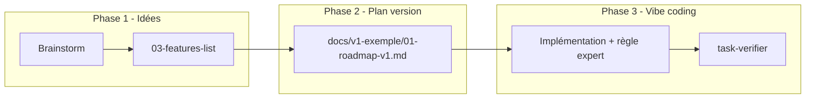

# Processus de travail (humain + IA) — flux Movie Picker

Ce document décrit **ton** enchaînement idée → features → roadmap de version → *vibe coding* → contrôle qualité, en s’appuyant sur les mécanismes Cursor documentés officiellement : [Règles](https://cursor.com/fr/docs/rules), [Skills](https://cursor.com/fr/docs/skills), [Sous-agents](https://cursor.com/fr/docs/subagents). Les sorties **persistantes** : [03-features-list.md](03-features-list.md), les dossiers [00-roadmaps-par-version.md](00-roadmaps-par-version.md) (`docs/v{n}-slug/`), [mvp/01-roadmap-mvp.md](mvp/01-roadmap-mvp.md) (historique MVP).

**Optionnel plus tard** : packager une partie en [plugin](https://cursor.com/fr/docs/plugins) ou ajouter des [hooks](https://cursor.com/fr/docs/hooks) / [MCP](https://cursor.com/fr/docs/mcp) si tu veux automatiser l’audit ou des outils externes — ce n’est pas requis pour démarrer.

---

## Vue d’ensemble du flux

---

## Phase 1 — Brainstorm → features propres

| Objectif | Challenge des idées, alternatives, puis **mise au propre** ordonnée par version / sprint. |
|----------|---------------------------------------------------------------------------------------------|
| **Source de vérité** | [03-features-list.md](03-features-list.md) + [01-spec-technique.md](01-spec-technique.md) |
| **Cursor (recommandé)** | Sous-agent **`product-brainstorm`** : contexte isolé, `readonly`, adapté au volume d’exploration ([sous-agents](https://cursor.com/fr/docs/subagents)). Invocation : `/product-brainstorm` ou demande explicite dans le chat. |
| **Ensuite** | Skill **`brainstorm-to-features`** (`/brainstorm-to-features` ou invocation Agent) pour produire une structure must/should/could prête à coller dans la features list. |
| **Règle optionnelle** | `role-product-owner.mdc` — cadrage / priorisation quand tu restes dans le chat principal sans déléguer. |

**Bonnes pratiques** : une conversation (ou sous-agent) par **session d’idées** ; évite de mélanger avec du code.

---

## Phase 2 — Roadmap d’une version (sous-dossier)

| Objectif | Pour une version choisie (ex. V1), une **roadmap exécutable** façon [mvp/01-roadmap-mvp.md](mvp/01-roadmap-mvp.md), dans son **propre dossier**. |
|----------|--------------------------------------------------------------------------------------------------------------------------------------------------|
| **Emplacement** | `docs/v{n}-{slug}/` — convention [00-roadmaps-par-version.md](00-roadmaps-par-version.md) ; roadmap principale `01-roadmap-v{n}.md` ; modèle [v0-template-version/01-roadmap-vx.md](v0-template-version/01-roadmap-vx.md). |
| **Cursor** | Skill **`version-roadmap-draft`** pour générer / structurer `01-roadmap-v{n}.md` + fichiers `NN-nom-v{n}.md` si besoin (même idée que les liens `deploy-*.md` du MVP). |
| **Humain** | Tu coches au fil de l’eau ; tu ajoutes en bas les **refactos** / features opportunistes non prévues au départ. |

---

## Phase 3 — *Vibe coding* par tâche

| Objectif | Implémenter étape par étape la roadmap, avec une **identité d’expert** alignée sur la couche touchée. |
|----------|----------------------------------------------------------------------------------------------------------|
| **Expertise back (.cs)** | Règle **`role-dotnet-backend`** — s’applique quand tu travailles sous `apps/api-dotnet/` ([règles + globs](https://cursor.com/fr/docs/rules)). Tu peux aussi l’**attacher manuellement** (`@role-dotnet-backend`) pour une tâche back même si les globs ne matchent pas encore. |
| **Expertise front (.ts/.tsx)** | Règle **`role-frontend-react`** — idem pour `apps/web/`. |
| **Généraliste** | `role-senior-developer.mdc` si la tâche touche les deux ou la doc / scripts. |
| **Garde-fous** | `movie-picker-guardrails.mdc` + stack : toujours en vigueur sur le dépôt. |

**Tâche manuelle** : si la roadmap pointe vers `docs/v{n}-slug/NN-….md` (suffixe `-v{n}` aligné sur le dossier), tu ou l’agent suivez la procédure **avant** ou **à la place** d’un changement de code.

---

## Fin de **chaque** tâche — contrôle qualité

Tu veux un **challenge** du travail fait, tests, conventions, absence de dette évitable.

| Mécanisme | Rôle |
|-----------|------|
| **Sous-agent `task-verifier`** | Relecture **sceptique**, lancement / prescription de tests, contrat OpenAPI, conventions. `model: fast`, `readonly: true` — contexte séparé ([sous-agents](https://cursor.com/fr/docs/subagents)). Invocation : `/task-verifier` après la tâche. |
| **Gate humain** | `pnpm run verify:local` avant push (déjà documenté dans [AGENTS.md](../AGENTS.md)). |

**Flux typique** : implémentation dans le chat (avec règle expert) → **`/task-verifier`** → corrections si besoin → tu coches la case sur `01-roadmap-v{n}.md`.

---

## Correspondance rapide Phase → outil Cursor

| Phase | Outil principal | Fichiers |
|--------|------------------|----------|
| Brainstorm | Sous-agent `product-brainstorm` | `.cursor/agents/product-brainstorm.md` |
| Structurer → features list | Skill `brainstorm-to-features` | `.cursor/skills/brainstorm-to-features/` |
| Roadmap version | Skill `version-roadmap-draft` | `docs/v{n}-{slug}/` |
| Code back | Règle `role-dotnet-backend` | `.cursor/rules/role-dotnet-backend.mdc` |
| Code front | Règle `role-frontend-react` | `.cursor/rules/role-frontend-react.mdc` |
| Fin de tâche | Sous-agent `task-verifier` | `.cursor/agents/task-verifier.md` |

---

## Rappels

- **Skills** : invoqués via `/` dans le chat Agent quand ils sont découverts ([doc Skills](https://cursor.com/fr/docs/skills)).
- **Règles** : `Always` / `Intelligent` / fichiers / **manuel via @** — les rôles `role-*` ici sont surtout **manuels** ou **fichiers** ([doc Règles](https://cursor.com/fr/docs/rules)).
- Les **sous-agents** coûtent plus de contexte si tu en lances beaucoup en parallèle ; pour une tâche simple, un seul `task-verifier` à la fin suffit souvent.

---

*Un dossier par version : `docs/v{n}-{slug}/` ; une roadmap principale `01-roadmap-v{n}.md` par dossier ; tous les guides de la même release partagent le suffixe `-v{n}`.*
