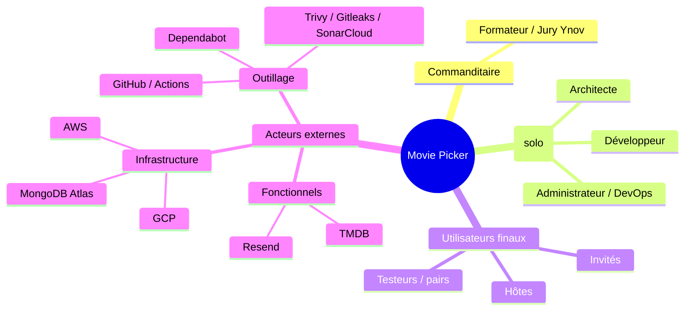

# 01 — Cartographie des parties prenantes

> **RNCP 39583 — C1.1.1 (ÉLIMINATOIRE)**
>
> **Compétence** — Cartographier les différents acteurs du projet de développement d'application logicielle (commanditaire, parties prenantes) et leurs rôles, en prenant en compte leur niveau d'implication et en identifiant les futurs utilisateurs, afin de cadrer l'environnement et le périmètre du projet.
>
> **Livrable attendu** — La cartographie des parties prenantes.
>
> **Critères d'évaluation**
> - La cartographie identifie les différents acteurs du projet : développeurs, architectes, administrateurs, clients, acteurs externes.
> - Elle permet de comprendre leurs rôles et leurs niveaux d'implication.
> - Les caractéristiques des futurs utilisateurs sont identifiées et détaillées.
>
> ---
>
> Projet : **Movie Picker** — application web (SPA React + API ASP.NET Core / MongoDB) pour choisir un film à plusieurs lors d'une soirée.

---

## 1. Cartographie des acteurs

| Acteur | Catégorie | Rôle dans le projet | Niveau d'implication |
|--------|-----------|---------------------|----------------------|
| **Formateur / jury Ynov** | Commanditaire | Définit le cadre du titre, valide les livrables, évalue la conformité RNCP | **Élevé** — décisionnaire final, points de validation réguliers |
| **Candidat (moi)** | Développeur | Conception, développement front + back, tests, documentation | **Permanent** — porteur unique du projet (solo) |
| **Candidat (moi)** | Architecte | Choix de la stack, modélisation de l'architecture (C4), arbitrages techniques (ADR) | **Permanent** — cumulé avec le rôle développeur |
| **Candidat (moi)** | Administrateur / DevOps | Mise en place CI/CD, déploiement Cloud Run + S3/CloudFront, secrets, supervision | **Permanent** — cumulé avec les rôles ci-dessus |
| **Utilisateurs finaux — hôtes** | Client / utilisateur | Créent et configurent une soirée, lancent la roue, clôturent | **Direct** — cœur de cible produit |
| **Utilisateurs finaux — participants invités** | Client / utilisateur | Rejoignent via lien (compte connecté requis), proposent des films, votent | **Direct** — majoritaires par soirée (plusieurs participants par hôte) |
| **Testeurs / pairs** | Utilisateur consulté | Recette manuelle, retours UX, signalement d'anomalies | **Ponctuel** — phases de recette |
| **TMDB** | Acteur externe (API) | Fournit métadonnées films (poster, note, bande-annonce, watch providers) | **Critique** — dépendance fonctionnelle forte |
| **GCP** (Cloud Run, Artifact Registry, Secret Manager, Cloud Monitoring) | Acteur externe (infra) | Héberge l'API, stocke l'image Docker et les secrets, supervise | **Critique** — disponibilité du back |
| **AWS** (S3, CloudFront) | Acteur externe (infra) | Héberge et distribue le front statique (SPA) | **Critique** — disponibilité du front |
| **MongoDB Atlas** | Acteur externe (infra) | Persistance des soirées, utilisateurs, films, votes | **Critique** — perte de données = perte du service |
| **Resend** | Acteur externe (API) | Envoi des emails transactionnels (reset mot de passe) | **Moyen** — dégradable (repli logs en dev) |
| **GitHub / GitHub Actions** | Acteur externe (outillage) | Gestion des sources, CI/CD, suivi (Issues, Projects) | **Élevé** — socle de production |
| **Dependabot / Gitleaks / Trivy / SonarCloud** | Acteur externe (qualité/sécurité) | Veille dépendances, scan secrets, scan image, quality gate | **Continu** — automatisé, non bloquant pour l'usage produit |

### Schéma d'implication (parties prenantes)

> **Spécificité projet solo** : les rôles développeur, architecte et administrateur convergent sur une seule personne. Ce cumul est assumé et traité par une **automatisation maximale** (CI/CD, Dependabot, agents de revue) et une **analyse réflexive** sur le pilotage de soi.

---

## 2. Caractéristiques des futurs utilisateurs (personas)

### Persona 1 — Léa, l'hôte organisatrice

| | |
|--|--|
| **Profil** | 26 ans, étudiante / jeune active, organise régulièrement des soirées entre amis |
| **Équipement** | Smartphone en usage principal (mobile-first), ordinateur occasionnellement |
| **Contexte d'usage** | Crée la soirée à l'avance depuis son téléphone, partage le lien dans un groupe de messagerie |
| **Attentes** | Créer vite, paramétrer (thème, limite de propositions, mode de roue), garder le contrôle (lancer la roue, clôturer) |
| **Frustrations évitées** | Débats interminables sur « quel film ce soir ? », organisation chaotique |

**Scénario clé** : Léa crée une soirée « Horreur » pour vendredi, configure la roue en mode pondéré, copie le lien et l'envoie sur WhatsApp. Le soir venu, elle lance la roue depuis son canapé et obtient le film gagnant.

### Persona 2 — Tom, le participant invité

| | |
|--|--|
| **Profil** | 22 ans, invité à une soirée par un ami, utilisateur occasionnel |
| **Équipement** | Smartphone exclusivement, rejoint depuis un lien reçu par message |
| **Contexte d'usage** | Clique sur le lien, se connecte ou crée un compte (parcours rapide), propose 1-2 films et vote |
| **Attentes** | Inscription express puis accès immédiat à la soirée, interface au doigt |
| **Frustrations évitées** | Parcours d'inscription long, ou perdre le contexte de la soirée après s'être connecté |

**Scénario clé** : Tom reçoit le lien, l'ouvre, est invité à se connecter ou créer un compte ; après une inscription express il est **redirigé automatiquement sur la soirée** (`returnTo`), recherche « Dune », le propose et vote. Son **pseudo affiché = le nom de son compte**.

### Persona 3 — Le groupe d'amis récurrent

| | |
|--|--|
| **Profil** | Cercle de 4-8 amis organisant des soirées ciné régulières |
| **Équipement** | Majoritairement mobile, quelques desktop |
| **Contexte d'usage** | Usage répété ; certains créent un compte pour retrouver « Mes soirées » et leur historique |
| **Attentes** | Persistance multi-appareils (compte), historique des soirées passées, marqueur « déjà vu » pour ne pas reproposer un film déjà regardé ensemble |
| **Frustrations évitées** | Reproposer un film déjà vu, perdre la trace des soirées passées |

**Scénario clé** : un membre du groupe se crée un compte, retrouve ses soirées sur tous ses appareils, et consulte l'historique pour vérifier les films déjà vus avant d'en proposer de nouveaux.

### Synthèse des caractéristiques transverses

- **Mobile-first** : la majorité des utilisateurs rejoignent via un lien partagé et utilisent l'appareil en main.
- **Compte obligatoire pour tous les participants** : créer comme rejoindre une soirée exige un compte connecté ; le pseudo affiché correspond au **nom du compte** (plus de pseudo anonyme par soirée — le mode invité anonyme a été retiré). La friction d'inscription est atténuée par un parcours rapide + **redirection automatique vers la soirée** après connexion (`returnTo`).
- **Usage ponctuel ET récurrent** : le produit sert le participant occasionnel comme le groupe fidèle ; le compte, désormais requis pour tous, débloque notifications, suivi social et historique.
- **Accessibilité** : prise en compte dès la conception (clavier, contraste, lecteurs d'écran).
