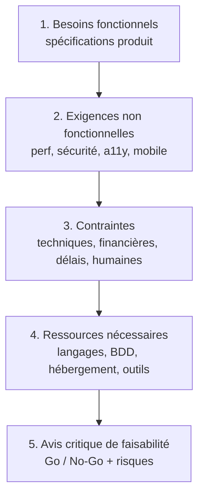

# 03 — Faisabilité technique & diagnostic des infrastructures

> **RNCP 39583 — C1.2.2 (ÉLIMINATOIRE)**
>
> **Compétence** — Évaluer la faisabilité technique en analysant l'environnement technique et fonctionnel, les contraintes et le budget du client pour décider de son lancement et déterminer les moyens nécessaires à sa réalisation.
>
> **Livrable attendu** — La démarche d'audit mise en œuvre et le diagnostic des infrastructures existantes.
>
> **Critères d'évaluation**
> - La démarche d'audit est documentée et argumentée.
> - L'étude technique comprend : les langages informatiques utilisés, les caractéristiques des bases de données, l'architecture existante et les technologies utilisées, un état des applications et logiciels existants.
> - L'audit identifie les contraintes techniques et financières : hébergement, système d'exploitation, volume de données, nombre d'utilisateurs, délais, ressources financières, techniques et humaines, etc.
> - La démarche permet de formuler un avis critique sur la faisabilité technique du projet.

---

## 1. Démarche d'audit

L'évaluation de la faisabilité suit une **grille d'analyse descendante** en 5 étapes, du besoin vers la décision :

| Étape | Question posée | Source / méthode |
|-------|----------------|------------------|
| 1. Besoins fonctionnels | Que doit faire le produit ? | Spécifications fonctionnelles (12 domaines métier) |
| 2. Exigences non fonctionnelles | Avec quelle qualité de service ? | Mobile-first, HTTPS, CORS strict, OWASP, accessibilité |
| 3. Contraintes | Quelles limites s'imposent ? | Budget étudiant, projet solo, délais cursus |
| 4. Ressources | Quels moyens mobiliser ? | Étude technique (§ 3) et étude comparative des solutions |
| 5. Avis critique | Le projet est-il réalisable ? | Synthèse argumentée (§ 5) |

> La démarche est **itérative** : un projet étudiant solo sans existant logiciel impose de dimensionner les choix sur la soutenabilité (automatisation, free tiers) plutôt que sur la performance à grande échelle.

---

## 2. Étude technique de l'existant disponible

> **Contexte** : projet **greenfield** (pas de système legacy à migrer). « L'existant » à auditer est donc l'**environnement technique disponible** dans le cursus / l'écosystème, parmi lequel sélectionner.

### 2.1 Langages disponibles

| Langage | Maîtrise / disponibilité | Pertinence projet |
|---------|--------------------------|-------------------|
| **TypeScript** | Cursus Ynov, écosystème web | Front SPA — typage strict, gros écosystème |
| **C# / .NET** | Cursus Ynov | API back — performant, typé, LTS .NET 10 |
| **Node.js / JS** | Cursus Ynov | Alternative back envisagée (cf. étude comparative) |
| **Python** | Cursus Ynov | Non retenu (pas d'avantage décisif ici) |

### 2.2 Bases de données candidates

| BDD | Type | Caractéristiques | Note projet |
|-----|------|------------------|-------------|
| **MongoDB** | Document (NoSQL) | Schéma souple, scaling horizontal, free tier Atlas M0 | **Retenue** — modèle soirée/films/votes évolutif sans migration lourde |
| **PostgreSQL** | Relationnel | ACID strict, relations fortes | Alternative solide (cf. étude comparative) |
| **SQLite** | Relationnel embarqué | Zéro infra, fichier | Inadapté au multi-instance Cloud Run |

### 2.3 Technologies & architecture cible

- **Architecture** : SPA (front) + API REST (back) + BDD document — découplage net front/back.
- **API .NET** : architecture **hexagonale** (Domaine / Application / Infrastructure / Entrée).
- **Contrat** : `/api/v1`, OpenAPI exporté + `OpenApiContractTests` pour éviter les dérives.
- **Couche live** : polling en MVP, prête à passer SSE/WebSocket sans recâbler les composants.

### 2.4 Applications & services externes mobilisés

| Service | Rôle | État |
|---------|------|------|
| **TMDB** | Métadonnées films (poster, note, bande-annonce, watch providers) | API publique, clé serveur requise |
| **Resend** | Emails transactionnels (reset password) | Repli `LogEmailSender` en dev |
| **GCP Cloud Run / Artifact Registry / Secret Manager** | Hébergement API, image, secrets | Free tier suffisant |
| **AWS S3 + CloudFront** | Hébergement + CDN front | Free tier 12 mois |
| **MongoDB Atlas** | Persistance managée | Free tier M0 |
| **GitHub Actions** | CI/CD | Inclus repo |

---

## 3. Contraintes identifiées

### 3.1 Contraintes techniques

| Contrainte | Détail | Implication |
|------------|--------|-------------|
| **Architecture distribuée** | Front et API sur origines distinctes (CloudFront / Cloud Run) | CORS strict (`ALLOWED_ORIGINS`), cookies `SameSite=None; Secure` |
| **HTTPS obligatoire** | Front + API | Certificats gérés (CloudFront / Cloud Run) |
| **Mobile-first** | Usage principal sur téléphone | Breakpoints ≈ 375 px, touch, perf assets |
| **Multi-instance** | Cloud Run scale-to-zero / scale-out | Pas d'état en mémoire → état en base (Mongo) |
| **Système d'exploitation** | Conteneur Linux (`mcr.microsoft.com/dotnet/aspnet:10.0`) | Image Docker, pas de dépendance OS poste |

### 3.2 Contraintes financières

- **Budget cible** : ≤ ~15 €/mois en production réelle (projet étudiant) → **free tiers prioritaires**.
- Détail chiffré présenté dans le budget prévisionnel du projet.

### 3.3 Contraintes de délais

- Alignées sur le **calendrier du cursus Ynov** (jalons semestre/année).
- Découpage par versions : MVP → migration .NET → V1 → V1.1.

### 3.4 Contraintes humaines

- **Projet solo** : un seul intervenant cumulant développeur / architecte / administrateur.
- **Implication** : automatisation maximale (CI/CD, Dependabot, scans sécurité, agents de revue) pour compenser l'absence d'équipe et de relecture par les pairs.

### 3.5 Volume de données & charge attendue

| Dimension | Estimation projet étudiant |
|-----------|----------------------------|
| **Nombre d'utilisateurs** | Faible (dizaines à centaines) — usage démonstratif et cercle restreint |
| **Volume de données** | Faible (soirées, films, votes) — largement sous free tier Mongo M0 (512 Mo) |
| **Pics de charge** | Ponctuels (soirée = quelques participants simultanés) — scale-to-zero adapté |
| **Appels TMDB** | Limités par cache posters (TTL) pour rester sous les quotas |

---

## 4. Moyens nécessaires (synthèse)

| Catégorie | Moyen retenu |
|-----------|--------------|
| **Langages** | TypeScript (front) + C# / .NET 10 (API) |
| **Frameworks** | React + Vite + TanStack Query / ASP.NET Core |
| **Base de données** | MongoDB Atlas (M0 free tier) |
| **Hébergement API** | GCP Cloud Run |
| **Hébergement front** | AWS S3 + CloudFront |
| **Secrets** | GCP Secret Manager |
| **CI/CD** | GitHub Actions |
| **Observabilité** | Logs structurés + Cloud Monitoring (+ Sentry, cf. supervision) |
| **Email** | Resend (transactionnel) |

> La **justification comparée** de chacun de ces choix est développée dans l'étude comparative des solutions techniques.

---

## 5. Avis critique de faisabilité

### Verdict : **projet réalisable (Go)** avec la stack retenue.

**Arguments en faveur** :
- Stack maîtrisée et cohérente avec le cursus (TS / C#).
- Free tiers cloud couvrant largement le volume attendu → coût quasi nul.
- Architecture découplée et hexagonale → maintenable et extensible en solo.
- Automatisation CI/CD compensant l'absence d'équipe.

**Risques techniques principaux et atténuations** :

| Risque | Impact | Atténuation |
|--------|--------|-------------|
| **TMDB indisponible / rate limiting / changement CGU** | Recherche film dégradée | Cache posters (TTL), saisie manuelle en repli, clé serveur uniquement |
| **Coût Cloud Run en cas de pic** | Dépassement budget | Scale-to-zero, free tier 2 M req/mois, limites de concurrence |
| **Complexité des aperçus OG dynamiques** | Effort disproportionné | Repli OG statiques documenté (cf. spec § 1) |
| **Cookies cross-site (CSRF)** | Faille sécurité | CORS strict + `SameSite=None; Secure` + mesures OWASP |
| **Charge solo / soutenabilité** | Retard projet | Automatisation, périmètre versionné (MVP → V1), backlog priorisé |

> **Conclusion** : la faisabilité technique est **avérée**. Les risques sont identifiés, de criticité maîtrisée, et couverts par des mesures concrètes. Le lancement est recommandé.
