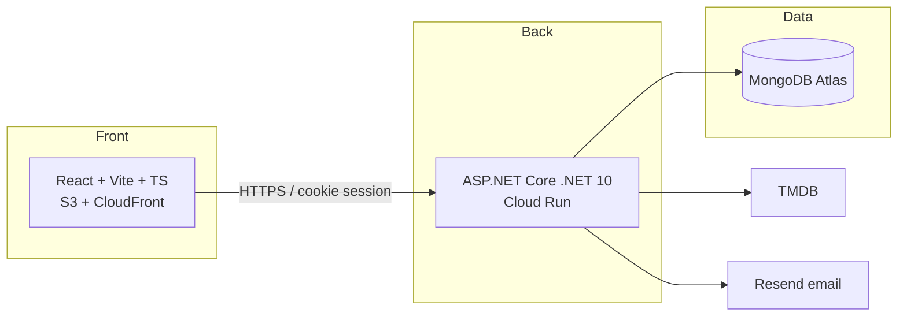

# 04 — Étude comparative des solutions techniques

> **RNCP 39583 — C1.3.2 (ÉLIMINATOIRE)** : « Une analyse comparative des solutions techniques envisagées est réalisée. Les choix retenus sont justifiés et adaptés à la réalisation du projet. Les inconvénients et avantages des différentes solutions sont analysés en termes de : sécurité, environnements systèmes, réseaux, accessibilité, impact environnemental. »

---

## Méthode

Pour chaque **brique technique majeure**, 2 à 3 options sont comparées selon **6 critères** (5 imposés par la grille + le coût, déterminant pour un projet étudiant). Chaque tableau se conclut par une **décision justifiée**. La synthèse de la stack figure en fin de document.

> **Légende des critères** : **Sécurité** (surface d'attaque, maturité) · **Env. système** (runtime, exploitation) · **Réseau** (latence, CDN, CORS) · **Accessibilité** (capacité à livrer une UI a11y) · **Impact env.** (empreinte énergétique / carbone) · **Coût** (budget étudiant).

---

## 1. Framework front

| Critère | **React + Vite** ✅ | Next.js (SSR) | SvelteKit |
|---------|---------------------|---------------|-----------|
| **Sécurité** | Bonne, SPA pure (pas de serveur Node exposé) | Surface accrue (serveur SSR à durcir) | Bonne, mais écosystème plus jeune |
| **Env. système** | Build statique, aucun runtime serveur | Nécessite Node en prod (ou edge) | Build statique possible |
| **Réseau** | Servi par CDN (CloudFront), TTFB faible | SSR = appels serveur par requête | CDN possible |
| **Accessibilité** | Écosystème mature (axe, Testing Library) | Idem React | Bon mais moins d'outillage a11y |
| **Impact env.** | Faible (statique, pas de calcul serveur) | Plus élevé (rendu serveur par requête) | Faible |
| **Coût** | Free (S3 + CloudFront free tier) | Surcoût hébergement Node/edge | Free |

**Décision : React + Vite + TypeScript strict.** Maîtrise cursus, écosystème a11y mature (axe, vitest-axe), build statique distribuable par CDN sans serveur à sécuriser ni à alimenter en énergie. Le SSR de Next.js n'apporte pas de valeur décisive ici (aperçus OG traités séparément, cf. spec § 1) pour un surcoût de sécurité, d'exploitation et d'empreinte.

---

## 2. Framework back / API

| Critère | **ASP.NET Core (.NET 10)** ✅ | Node + Express | Go + Gin |
|---------|-------------------------------|----------------|----------|
| **Sécurité** | Très bonne (typage fort, analyzers, Data Protection, antiforgery natif) | Dépend des libs, plus de footguns | Bonne, mais écosystème sécu à assembler |
| **Env. système** | Runtime .NET en conteneur Linux, LTS | Runtime Node | Binaire statique léger |
| **Réseau** | Performant, HTTP/2, middleware sécurité | Bon | Excellent |
| **Accessibilité** | N/A (back) | N/A | N/A |
| **Impact env.** | Bon (AOT/trim possible, scale-to-zero) | Moyen | Excellent (binaire minimal) |
| **Coût** | Free (Cloud Run free tier) | Free | Free |

**Décision : ASP.NET Core sur .NET 10 (LTS).** Typage fort et analyzers (warnings = erreurs) réduisent la classe de bugs ; middleware de sécurité natif (CORS, rate limiting, antiforgery, security headers) ; LTS = veille sereine. Go serait plus léger mais hors maîtrise cursus et sans gain décisif au volume attendu.

---

## 3. Base de données

| Critère | **MongoDB (Atlas)** ✅ | PostgreSQL | SQLite |
|---------|------------------------|------------|--------|
| **Sécurité** | TLS, auth, IP allowlist Atlas | TLS, rôles fins | Fichier local, pas d'auth réseau |
| **Env. système** | Managé (Atlas), aucune admin serveur | Managé possible (surcoût) | Embarqué, fichier |
| **Réseau** | Connexion réseau managée | Idem | Local uniquement |
| **Accessibilité** | N/A | N/A | N/A |
| **Impact env.** | Cluster partagé M0 (mutualisé) | Instance dédiée plus lourde | Très faible mais inadapté |
| **Coût** | Free tier M0 (512 Mo) | Free tiers plus rares/limités | Gratuit |

**Décision : MongoDB Atlas (M0).** Modèle document souple adapté à des entités évolutives (soirée → films → votes → seenMarks) sans migration de schéma lourde, free tier généreux, managé (zéro admin pour un solo). **Incompatibilité SQLite** : Cloud Run scale-out multi-instance → un fichier local n'est pas partageable. PostgreSQL resterait viable mais le coût d'un schéma relationnel rigide n'est pas justifié au stade V1.

---

## 4. Hébergement API

| Critère | **GCP Cloud Run** ✅ | AWS ECS Fargate | Scaleway Serverless |
|---------|----------------------|-----------------|---------------------|
| **Sécurité** | HTTPS managé, secrets via Secret Manager, IAM | HTTPS, IAM, plus de config | HTTPS, secrets |
| **Env. système** | Conteneur, scale-to-zero, zéro serveur à gérer | Conteneur, cluster à dimensionner | Conteneur serverless |
| **Réseau** | URL HTTPS managée, région `europe-west1` | ALB à configurer | Région EU |
| **Accessibilité** | N/A | N/A | N/A |
| **Impact env.** | **Scale-to-zero** (0 conso à l'idle) | Tâches souvent 24/7 | Scale-to-zero |
| **Coût** | Free tier 2 M req/mois | Pas de scale-to-zero natif → coût idle | Free tier limité |

**Décision : GCP Cloud Run.** Scale-to-zero = **coût et empreinte quasi nuls à l'idle** (déterminant pour un usage par pics), HTTPS et secrets managés, déploiement conteneur simple. Fargate impose un coût de veille (pas de scale-to-zero natif simple) inadapté au budget.

---

## 5. Hébergement front

| Critère | **AWS S3 + CloudFront** ✅ | Vercel | Netlify |
|---------|---------------------------|--------|---------|
| **Sécurité** | HTTPS, headers via CloudFront Functions, bucket privé | HTTPS managé | HTTPS managé |
| **Env. système** | Statique pur, pas de runtime | Plateforme intégrée | Plateforme intégrée |
| **Réseau** | CDN mondial, edge cache | CDN | CDN |
| **Accessibilité** | Sert la SPA a11y (côté app) | Idem | Idem |
| **Impact env.** | Faible (statique + edge cache) | Faible | Faible |
| **Coût** | Free tier 12 mois puis ~1-5 € | Free tier (limites projet perso) | Free tier |

**Décision : AWS S3 + CloudFront.** Couplé à la maîtrise du déploiement en 3 étapes (assets hachés → `index.html`/SW en dernier → invalidation), contrôle fin du cache et des en-têtes de sécurité (CSP front via CloudFront Function). Vercel/Netlify plus simples mais moins formateurs et liés à un écosystème propriétaire. Le choix **bi-cloud assumé** (front AWS / API GCP) est documenté comme parti pris pédagogique (maîtrise de deux fournisseurs).

---

## 6. Authentification

| Critère | **Sessions cookie (HttpOnly)** ✅ | JWT stateless | OAuth provider (Auth0/Clerk) |
|---------|-----------------------------------|---------------|------------------------------|
| **Sécurité** | Cookie `HttpOnly` non lisible en JS, révocation côté serveur | Token en JS = exposé XSS, révocation complexe | Très bonne (déléguée) |
| **Env. système** | État session côté API | Sans état | SaaS externe |
| **Réseau** | Cookie cross-site → `SameSite=None; Secure` + CORS `AllowCredentials` | Header `Authorization` | Redirections OAuth |
| **Accessibilité** | Parcours standard | Idem | Dépend du provider |
| **Impact env.** | Négligeable | Négligeable | Appels externes supplémentaires |
| **Coût** | Free | Free | Payant au-delà du free tier, dépendance |

**Décision : sessions par cookie `HttpOnly`.** Meilleure posture sécurité par défaut (token non accessible au JS, donc résistant au vol par XSS ; révocation immédiate côté serveur). Le coût = gérer le cross-site (CORS strict + `SameSite=None; Secure` + mesures anti-CSRF, cf. [`../owasp-top-10.md`](../bloc-2-conception-developpement/owasp-top-10.md)). Décision tracée en ADR (`docs/adr/0002-cookie-sessions-vs-jwt.md`). OAuth externe écarté (dépendance + coût + complexité disproportionnés).

---

## 7. API de métadonnées films

| Critère | **TMDB** ✅ | OMDB | JustWatch |
|---------|-------------|------|-----------|
| **Sécurité** | Clé API côté serveur uniquement | Clé API | Pas d'API publique officielle stable |
| **Env. système** | REST JSON, SDK communautaires | REST JSON | Scraping risqué |
| **Réseau** | CDN images TMDB, proxy posters côté API | Images limitées | Instable |
| **Accessibilité** | Métadonnées riches (alt text posters possible) | Plus pauvre | Variable |
| **Impact env.** | Cache posters → moins d'appels | Idem | N/A |
| **Coût** | Gratuit (usage non commercial, attribution) | Free tier limité (1000 req/jour) | N/A |

**Décision : TMDB.** Données les plus riches (poster, note, bande-annonce, **watch providers** par région), gratuit avec attribution, CDN images. Clé **serveur uniquement** + **cache posters** (TTL) pour limiter appels et empreinte réseau. OMDB trop limité (quota), JustWatch sans API officielle fiable.

---

## Synthèse — stack retenue

| Brique | Choix | Justification dominante |
|--------|-------|-------------------------|
| Front | React + Vite + TS | Maîtrise + a11y mature + statique CDN (sécurité & empreinte) |
| API | ASP.NET Core .NET 10 | Typage fort + sécurité native + LTS |
| BDD | MongoDB Atlas M0 | Schéma souple + free tier + managé |
| Hébergement API | GCP Cloud Run | Scale-to-zero (coût + impact env.) |
| Hébergement front | AWS S3 + CloudFront | Contrôle cache/sécurité + CDN |
| Auth | Sessions cookie HttpOnly | Posture sécurité par défaut |
| API films | TMDB | Données riches + gratuit + cache |

### Impact environnemental (transverse)
- **Scale-to-zero** Cloud Run : aucune consommation à l'idle (pas de serveur 24/7).
- **Cache posters** + **CloudFront edge cache** : réduction des appels réseau et de la bande passante.
- **Front statique** : aucun calcul serveur pour le rendu.
- **Piste d'optimisation** : image Docker `aspnet:10.0` → variante `alpine` / `chiseled` pour réduire surface d'attaque et empreinte (à arbitrer selon compatibilité ICU/globalisation).

### Ressources matérielles / techniques nécessaires
- **Poste de développement** : éditeur (Cursor / VS Code), Node 22 LTS, .NET 10 SDK, pnpm, Docker Desktop, MongoDB local.
- **Comptes de service** : GCP, AWS, MongoDB Atlas, TMDB, Resend, GitHub — tous en free tier.
- Aucun matériel serveur propre (full managé / serverless).

---

*Voir aussi : [`03-faisabilite-technique.md`](03-faisabilite-technique.md) (faisabilité — C1.2.2), [`09-architecture.md`](09-architecture.md) (architecture — C1.5), [`../bloc-3-coordination-pilotage/adr/`](../bloc-3-coordination-pilotage/adr/) (ADR — arbitrages tracés).*
