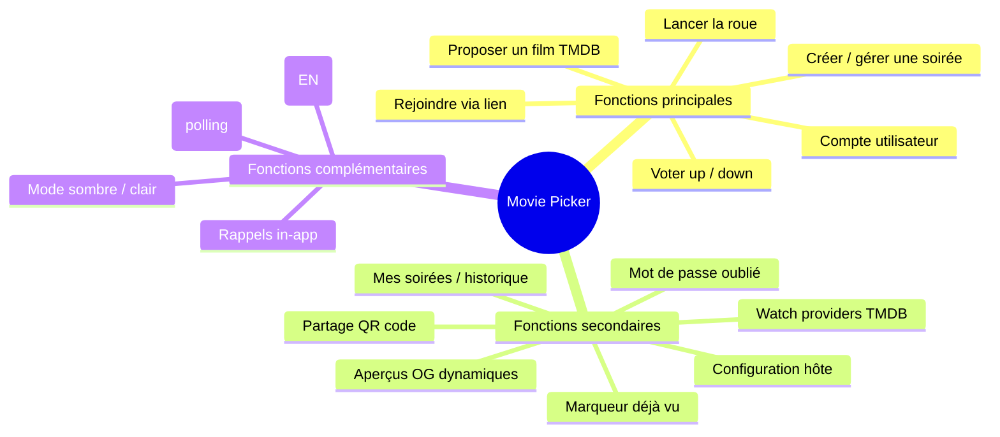

# 05 — Cahier des charges fonctionnel & estimation de charge (J/H)

> **RNCP 39583 — C1.4.1 (ÉLIMINATOIRE)** : « Les fonctions sont recensées, caractérisées, ordonnées et hiérarchisées (principales, secondaires, complémentaires). La charge de travail est exprimée en jours-homme. L'outil d'analyse fonctionnelle est explicité. La couverture technique des besoins fonctionnels est argumentée et justifiée. L'expérience utilisateur est prise en compte. »

---

## 1. Outil d'analyse fonctionnelle

L'analyse combine deux outils complémentaires :

- **MoSCoW** pour la **priorisation** (Must / Should / Could / Won't) — adapté à un découpage par versions (MVP → V1 → V1.1).
- **Diagramme de fonctionnalités** (type *bête à cornes* / arborescence) pour la **hiérarchisation** (fonctions principales / secondaires / complémentaires).

> Justification du choix : MoSCoW est léger, lisible par un commanditaire non-technique, et cohérent avec la roadmap par versions ([`../../roadmap-product.md`](../../roadmap-product.md)). La hiérarchisation principale/secondaire/complémentaire répond directement au critère de la grille.

### Bête à cornes (besoin fondamental)

| Question | Réponse |
|----------|---------|
| **À qui le produit rend-il service ?** | À un groupe d'amis qui veut regarder un film ensemble |
| **Sur quoi agit-il ?** | Sur le processus de décision collective d'un film |
| **Dans quel but ?** | Choisir un film rapidement, équitablement et de façon ludique |

---

## 2. Diagramme de fonctionnalités (hiérarchisé)

### Hiérarchisation détaillée (MoSCoW)

| Fonction | Catégorie | Priorité MoSCoW | Version |
|----------|-----------|-----------------|---------|
| Créer / gérer une soirée | Principale | **Must** | MVP |
| Rejoindre via lien + pseudo | Principale | **Must** | MVP |
| Proposer un film (recherche TMDB) | Principale | **Must** | MVP |
| Voter up/down | Principale | **Must** | MVP |
| Lancer la roue (aléatoire/pondérée) | Principale | **Must** | MVP |
| Compte utilisateur (inscription/connexion) | Principale | **Must** | V1 |
| Configuration par l'hôte | Secondaire | **Should** | V1 |
| Marqueur « déjà vu » (neutre roue) | Secondaire | **Should** | V1 |
| Mes soirées / historique | Secondaire | **Should** | V1 |
| Watch providers TMDB | Secondaire | **Should** | V1 |
| Partage QR code | Secondaire | **Should** | V1 |
| Mot de passe oublié | Secondaire | **Should** | V1 |
| Aperçus OG dynamiques | Secondaire | **Should** | V1 |
| Mise à jour en direct (polling) | Secondaire | **Should** | V1 |
| Internationalisation (EN) | Complémentaire | **Could** | V1 |
| Mode sombre / clair | Complémentaire | **Could** | V1 |
| Rappels in-app | Complémentaire | **Could** | V1 |
| Limite participants / plage de votes | Complémentaire | **Won't (V1)** | V1.1 |
| .ics / compte à rebours dédié | Complémentaire | **Won't (V1)** | V1.1 |
| Mode hors-ligne / vue grille-liste | Complémentaire | **Won't (V1)** | V1.1 |

---

## 3. Estimation de la charge (jours-homme)

> Granularité alignée sur les lots de livraison ([`../livraison-v1.md`](../../v1-produit/livraison-v1.md)). Hypothèse : 1 J/H ≈ 1 journée de travail effectif d'un développeur. Méthode d'estimation : **analogique** (par comparaison entre lots de complexité voisine) ; la valeur retenue correspond au scénario **probable**, marge d'incertitude estimée à ± 20 % sur les lots de développement.

### MVP (rétrospectif)

| Lot | Charge (J/H) |
|-----|--------------|
| Socle monorepo (pnpm + Turbo, configs, CI de base) | 3 |
| Modèle de données + API soirées (CRUD) | 4 |
| Recherche & proposition de films (intégration TMDB) | 4 |
| Vote up/down + agrégation | 2 |
| Roue (tirage serveur atomique + animation front) | 4 |
| Front SPA (shell, pages soirée, mobile-first) | 6 |
| Déploiement initial (Cloud Run + S3/CloudFront) | 4 |
| **Sous-total MVP** | **27** |

### Migration API .NET

| Lot | Charge (J/H) |
|-----|--------------|
| Réécriture API en ASP.NET Core (archi hexagonale) | 8 |
| Tests d'intégration + contrat OpenAPI | 3 |
| Re-déploiement conteneur .NET | 2 |
| **Sous-total migration** | **13** |

### V1 produit

| Lot | Charge (J/H) |
|-----|--------------|
| Auth (inscription/connexion/déconnexion, hash, session cookie, rate limit) | 5 |
| Mot de passe oublié (email transactionnel, lien TTL, invalidation) | 3 |
| Mes soirées + reconnaissance hôte par compte | 3 |
| Configuration hôte (PATCH + validation + garde-fous) | 3 |
| Marqueur « déjà vu » (agrégat `seenMarks`) | 2 |
| Cache posters (BDD/bucket + TTL) | 2 |
| Watch providers TMDB (endpoint agrégé + cache) | 2 |
| Partage QR code | 1 |
| Aperçus OG dynamiques (ou repli statique documenté) | 3 |
| Mise à jour en direct (couche polling isolée) | 2 |
| Mode sombre / clair | 1 |
| Rappels in-app | 1 |
| Internationalisation (FR/EN, LocaleContext, TMDB aligné) | 3 |
| Sécurité CI (Sonar, NuGet vuln, Trivy, Gitleaks, rate limit prod) | 4 |
| **Sous-total V1** | **35** |

### Clôture RNCP (livrables documentaires & process)

| Lot | Charge (J/H) |
|-----|--------------|
| Cadrage Bloc 1 (parties prenantes, faisabilité, comparatif, charge, SWOT, risques, veille, archi, budget, argumentaire) | 6 |
| Pilotage Bloc 3 (planification, suivi, ADR, comptes rendus, analyse réflexive) | 4 |
| Sécurité & qualité (OWASP Top 10, accessibilité + tests axe) | 4 |
| Recette (cahier de recettes + E2E Playwright) | 4 |
| Process & exploitation (manuels, CHANGELOG, supervision Sentry, templates anomalies) | 5 |
| **Sous-total RNCP** | **23** |

### Total projet

| Phase | Charge (J/H) |
|-------|--------------|
| MVP | 27 |
| Migration .NET | 13 |
| V1 produit | 35 |
| Clôture RNCP | 23 |
| **TOTAL** | **≈ 98 J/H** |

> Cette charge totale alimente le **budget prévisionnel** ([`10-budget.md`](10-budget.md), C1.4.2) : ≈ 98 J/H × TJM junior simulé = base de chiffrage si le projet était réalisé en agence.

---

## 4. Couverture technique des besoins fonctionnels

Chaque fonction principale est tracée jusqu'à son implémentation (endpoint + écran + tests) — extrait :

| Fonction | Endpoint API | Écran front | Tests prévus |
|----------|--------------|-------------|--------------|
| Créer une soirée | `POST /api/v1/events` | `CreateEvent` | Unit + intégration + E2E |
| Rejoindre | `GET /api/v1/events/{slug}` + join | `EventDetail` | Intégration + E2E |
| Proposer un film | `POST .../movies` (proxy TMDB) | `EventDetail` | Intégration (doublon refusé) |
| Voter | `POST .../movies/{id}/vote` | `EventDetail` | Unit (un vote/participant) |
| Lancer la roue | `POST .../wheel` | `EventDetail` | Unit (tirage atomique, 0/1 film) |
| Auth | `/api/v1/auth/*` | `LoginPage` / `RegisterPage` | Intégration + rate limit |
| Config hôte | `PATCH .../config` | `EventDetail` (section config) | Intégration (garde-fous) |

> Couverture complète et tableau scénarios → tests dans le cahier de recettes ([`../cahier-recettes.md`](../bloc-2-conception-developpement/cahier-recettes.md), C2.3.1).

---

## 5. Prise en compte de l'expérience utilisateur

L'UX est intégrée dès le cahier des charges, conformément à [`../../spec.md`](../../spec.md) § 8 et § 9 :

- **Mobile-first** : conception d'abord pour écran étroit (≈ 375 px), zones tactiles ≥ 44×44 px, colonne unique.
- **Friction minimale** : rejoindre sans compte, « Copier le lien » + QR code pour le partage.
- **Feedback clair** : toasts succès/erreur, indicateurs de chargement, action « Réessayer » (pas de liste vide silencieuse).
- **Lisibilité** : police ≥ 16 px, contraste validé en modes sombre et clair.
- **Accessibilité** : navigation clavier, labels lecteurs d'écran (référentiel détaillé dans [`../accessibilite.md`](../bloc-2-conception-developpement/accessibilite.md)).

> L'expérience utilisateur n'est pas une couche cosmétique ajoutée après coup : elle conditionne la hiérarchisation (les fonctions principales sont celles du parcours mobile critique) et l'estimation (le poids du lot « Front SPA mobile-first » le reflète).

---

*Voir aussi : [`02-analyse-demande.md`](02-analyse-demande.md) (besoins — C1.1.2), [`10-budget.md`](10-budget.md) (budget à partir de la charge — C1.4.2), [`../livraison-v1.md`](../../v1-produit/livraison-v1.md) (lots de livraison détaillés).*
