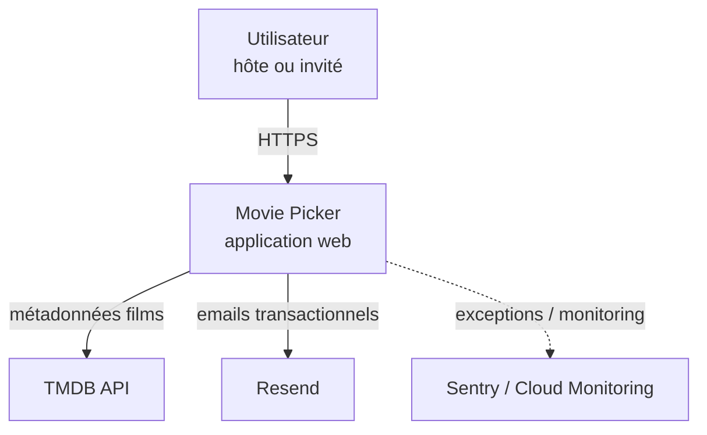
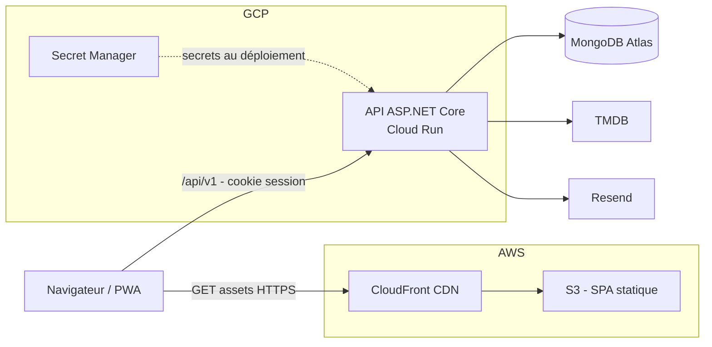
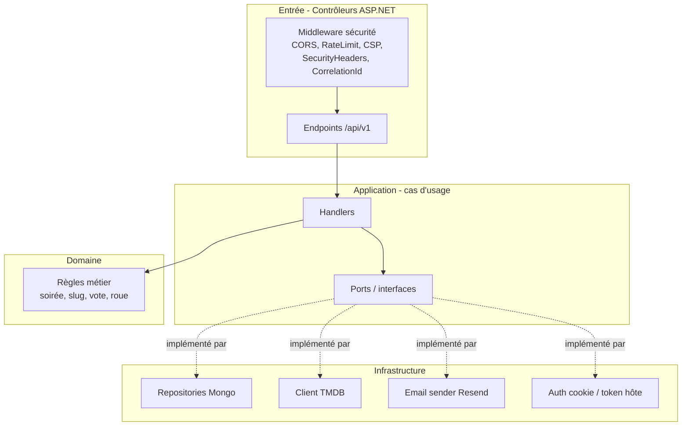
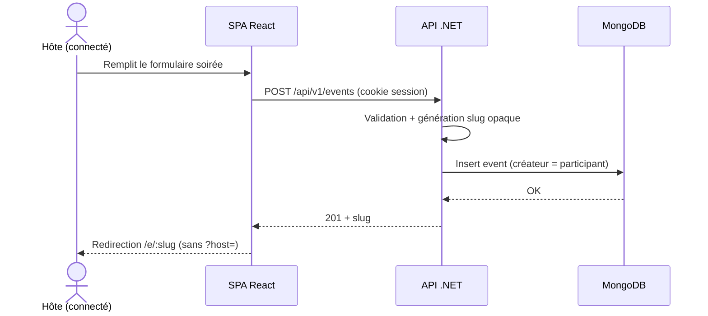
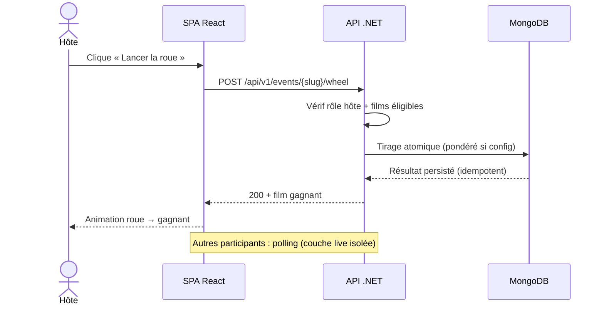

# 09 — Modélisation de l'architecture logicielle

> **RNCP 39583 — C1.5**
>
> **Compétence** — Modéliser une architecture logicielle à partir du scénario élaboré en respectant les spécifications fonctionnelles attendues, les exigences de sécurité, et en intégrant les techniques visant à réduire l'impact écologique afin de faciliter les phases de développement, d'évolution, de déploiement et de maintenance du logiciel.
>
> **Livrable attendu** — Les schémas de l'architecture logicielle proposée.
>
> **Critères d'évaluation**
> - L'architecture est schématisée et légendée (signification des formes, flèches, couleurs, positions, etc.).
> - Elle répond aux exigences des parties prenantes et aux contraintes de production ; elle est adaptée au système et à l'infrastructure.
> - Le choix de la méthode de modélisation et du formalisme est justifié (ex : UML, Merise…).
> - Les interactions avec les systèmes informatiques sont explicitées.
> - L'architecture proposée est maintenable, sécurisée et extensible.
> - Elle prend en compte son impact environnemental (ex : bilan carbone de la solution).

---

## 1. Méthode de modélisation retenue

**Choix : modèle C4** (Context → Container → Component → Code) **complété par des diagrammes de séquence UML** sur les parcours clés.

| Méthode | Pourquoi retenue / écartée |
|---------|----------------------------|
| **C4 Model** ✅ | Lisible, progressif (du contexte au composant), moderne et adapté à une application web ; ne suppose pas la lourdeur d'UML complet |
| **UML (séquence)** ✅ (complément) | Pertinent pour décrire les **interactions dynamiques** (création soirée, lancement roue) |
| UML complet (classes, composants, états…) | Écarté — trop verbeux pour un projet web V1 solo |
| Merise | Écarté — orienté BDD relationnelle, inadapté à un modèle document MongoDB |

> **Légende commune aux diagrammes** : rectangles = conteneurs/composants applicatifs ; cylindres = bases de données ; éléments externes = services tiers ; flèches pleines = appels synchrones (HTTP) ; flèches pointillées = flux asynchrones / déploiement.

---

## 2. C4 — Niveau 1 : Contexte

**Interactions** : l'utilisateur interagit uniquement avec Movie Picker (HTTPS). Movie Picker consomme TMDB (films), Resend (emails) et remonte vers l'observabilité.

---

## 3. C4 — Niveau 2 : Conteneurs

**Interactions** :
- Le navigateur charge la SPA via CloudFront/S3, puis appelle l'API (`/api/v1`) en cross-origin avec cookie de session (`SameSite=None; Secure`, CORS `AllowCredentials`).
- L'API lit/écrit dans MongoDB Atlas, interroge TMDB (clé serveur), envoie des emails via Resend, récupère ses secrets depuis Secret Manager au déploiement.

---

## 4. C4 — Niveau 3 : Composants (API .NET, architecture hexagonale)

> **Architecture hexagonale** : le Domaine et l'Application ne connaissent ni MongoDB ni HTTP ; l'Infrastructure implémente les ports. Cela **facilite les tests** (mocks de ports) et **l'évolution** (changer de BDD = nouvelle implémentation de port).

---

## 5. Diagrammes de séquence UML (parcours clés)

### 5.1 Création d'une soirée

### 5.2 Lancement de la roue

---

## 6. Qualités architecturales

| Qualité | Comment elle est assurée |
|---------|--------------------------|
| **Maintenable** | Archi hexagonale, séparation des responsabilités, tests d'intégration + contrat OpenAPI, monorepo outillé |
| **Sécurisée** | Préfixe `/api/v1` versionné, middleware sécurité (CORS, rate limit, CSP, security headers), validation centralisée, secrets externes, cookie HttpOnly |
| **Extensible** | Schéma Mongo souple (ajout `users`, `seenMarks` sans refonte), ports pour brancher de nouvelles implémentations, couche live prête pour SSE/WebSocket, modèle config soirée extensible (V1.1) |
| **Évolutive (déploiement)** | Conteneur Docker, CI/CD GitHub Actions, déploiement Cloud Run + S3/CloudFront automatisé |

---

## 7. Impact écologique de l'architecture

- **Cloud Run scale-to-zero** : pas de serveur 24/7, conso nulle à l'idle.
- **Cache posters** (TTL) : réduction des appels TMDB et de la bande passante.
- **CloudFront edge cache** : contenu servi au plus près, moins de trajets réseau.
- **Front statique** : aucun calcul serveur pour le rendu.
- **Piste d'optimisation** : image `mcr.microsoft.com/dotnet/aspnet:10.0` → variante `alpine`/`noble-chiseled` pour réduire surface d'attaque et empreinte image (arbitrage compatibilité ICU/globalisation).
