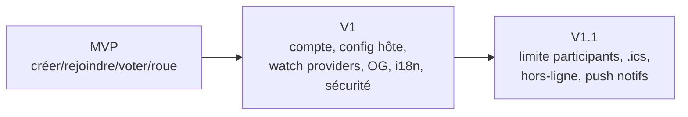

# 11 — Argumentaire client (synthèse des décisions et axes de solutions)

> **RNCP 39583 — C1.6 (ÉLIMINATOIRE)** : « Proposer les décisions et axes de solutions préconisées auprès du client en structurant son discours, en développant un argumentaire adapté afin d'obtenir son adhésion et sa validation. »
>
> **Nature mixte du livrable** : ce critère est **majoritairement oral** (vocabulaire adapté à l'auditoire, traitement des objections, supports de présentation). Ce document est le **support écrit versionné** qui consolide les choix de cadrage et sert de base à la restitution orale devant le jury.

---

## 1. Rappel de la problématique client

> **Comment permettre à un groupe d'amis de choisir un film à regarder ensemble, rapidement et équitablement, sans débat interminable ni outil contraignant ?**

(Détail : [`02-analyse-demande.md`](02-analyse-demande.md).)

Aucune solution existante ne combine décision collective + métadonnées films riches + départage ludique + zéro friction mobile. C'est le créneau adressé par **Movie Picker**.

---

## 2. Décisions structurantes

> Pour chaque décision : contexte, options envisagées, décision retenue, argumentaire vulgarisé (auditoire non-technique), risques résiduels.

### Décision 1 — Application web mobile-first (pas d'app native)

| | |
|--|--|
| **Contexte** | Les invités rejoignent via un lien de messagerie, sur téléphone, souvent une seule fois |
| **Options** | App web responsive · app native iOS/Android · app hybride |
| **Décision** | **Application web (SPA) mobile-first** |
| **Argumentaire** | « On clique sur un lien et on participe : aucune installation, aucun store. C'est ce qui supprime la barrière d'entrée pour des invités occasionnels. » |
| **Risque résiduel** | Fonctions natives limitées (notifications push) → reportées en V1.1 avec consentement |

### Décision 2 — Rejoindre sans compte, créer avec compte

| | |
|--|--|
| **Contexte** | Tension entre friction minimale (invités) et persistance (organisateurs réguliers) |
| **Options** | Tout sans compte · tout avec compte · **modèle asymétrique** |
| **Décision** | **Créer une soirée = compte requis ; rejoindre = sans compte (pseudo)** |
| **Argumentaire** | « L'invité participe en 5 secondes ; l'organisateur, lui, retrouve ses soirées sur tous ses appareils. Chacun a le bon niveau d'engagement. » |
| **Risque résiduel** | Gestion du rôle hôte cross-canal → tracée en ADR, sécurisée (cf. § décision 4) |

### Décision 3 — Stack moderne maîtrisée et sans coût de licence

| | |
|--|--|
| **Contexte** | Projet solo, budget étudiant, besoin de maintenabilité |
| **Options** | Voir l'étude comparative complète ([`04-etude-comparative.md`](04-etude-comparative.md)) |
| **Décision** | **React + Vite (front) · ASP.NET Core .NET 10 (API) · MongoDB Atlas** |
| **Argumentaire** | « Des technologies éprouvées, gratuites, et avec un support long terme : le produit reste maintenable et économe dans la durée. » |
| **Risque résiduel** | Dépendance TMDB → cache + repli saisie manuelle |

### Décision 4 — Sécurité intégrée dès la conception

| | |
|--|--|
| **Contexte** | Données personnelles (comptes), rôle hôte sensible |
| **Options** | Sessions cookie HttpOnly · JWT · OAuth externe |
| **Décision** | **Sessions cookie HttpOnly + couverture OWASP Top 10 + rate limiting** |
| **Argumentaire** | « La sécurité n'est pas une option ajoutée à la fin : le mot de passe est haché, la session protégée, les abus limités, et les 10 risques majeurs du web sont traités point par point. » |
| **Risque résiduel** | Cookie cross-site (CSRF) → CORS strict + mesures anti-CSRF |

### Décision 5 — Hébergement serverless économe et élastique

| | |
|--|--|
| **Contexte** | Usage par pics (soirées), budget contraint, sensibilité environnementale |
| **Options** | Serveur 24/7 · conteneur managé · **serverless scale-to-zero** |
| **Décision** | **GCP Cloud Run (API) + AWS S3/CloudFront (front)** |
| **Argumentaire** | « On ne paie et ne consomme de l'énergie que quand le service est utilisé : à 3 h du matin sans visiteur, le coût et l'empreinte sont nuls. » |
| **Risque résiduel** | Coût en cas de pic imprévu → free tier large + limites de concurrence |

---

## 3. Axes de solutions techniques retenus

| Axe | Solution | Renvoi |
|-----|----------|--------|
| **Architecture** | C4 + hexagonale (maintenable, testable, extensible) | [`09-architecture.md`](09-architecture.md) |
| **Stack** | React/Vite · .NET 10 · MongoDB | [`04-etude-comparative.md`](04-etude-comparative.md) |
| **Hébergement** | Cloud Run + S3/CloudFront (scale-to-zero) | [`04-etude-comparative.md`](04-etude-comparative.md) |
| **Sécurité** | OWASP Top 10 + cookie HttpOnly + rate limit | [`../owasp-top-10.md`](../bloc-2-conception-developpement/owasp-top-10.md) |
| **Qualité** | CI/CD, tests, scans automatisés | [`../protocole-ci-cd.md`](../bloc-2-conception-developpement/protocole-ci-cd.md) |

---

## 4. Budget prévisionnel consolidé

| Poste | Montant |
|-------|---------|
| Valeur de développement (simulée) | ≈ 34 300 € HT (98 J/H) |
| Infrastructure récurrente | ≈ 5–15 €/mois |
| Licences | 0 € (stack open source) |
| Coût réel de trésorerie | < 200 €/an |

(Détail : [`10-budget.md`](10-budget.md).)

> **Message clé** : « Une valeur de développement conséquente pour un coût d'exploitation quasi nul — le projet est viable économiquement. »

---

## 5. Roadmap par version

(Détail : [`../../roadmap-product.md`](../../roadmap-product.md) + [`../../roadmap-tech.md`](../../roadmap-tech.md).)

---

## 6. Objections anticipées & réponses

| Objection probable | Réponse préparée |
|--------------------|------------------|
| « Pourquoi pas une app native ? » | Friction d'installation incompatible avec un usage ponctuel via lien ; le web mobile-first couvre 100 % du parcours critique |
| « MongoDB est-il sûr pour des données perso ? » | TLS, IP allowlist, hash des mots de passe, free tier managé répliqué ; le volume de données perso est minimal (email + pseudo) |
| « Le projet solo, n'est-ce pas risqué ? » | Compensé par une automatisation forte (CI/CD, Dependabot, scans) et une documentation/process complets ; tout est tracé et reproductible |
| « Et si TMDB change ses conditions ? » | Cache local + repli saisie manuelle ; aucune donnée TMDB n'est critique au fonctionnement de base |
| « Le coût va-t-il exploser en cas de succès ? » | Scale-to-zero + free tiers larges ; un palier payant existe mais reste marginal (~9 $/mois pour la BDD) |

---

## 7. Supports de restitution orale (hors dépôt)

- Présentation projetée (slides ou page Markdown formatée) reprenant les 5 décisions structurantes.
- **Démonstration produit** du parcours hôte + invité (portée par C3.4.2, hors scope dépôt).
- Vocabulaire adapté à un auditoire **non-technique** : vulgarisation systématique des termes (serverless → « ne tourne que quand c'est utilisé », hexagonale → « code organisé en couches indépendantes »).

---

*Synthèse de l'ensemble du cadrage Bloc 1 : [`01-parties-prenantes.md`](01-parties-prenantes.md) · [`02-analyse-demande.md`](02-analyse-demande.md) · [`03-faisabilite-technique.md`](03-faisabilite-technique.md) · [`04-etude-comparative.md`](04-etude-comparative.md) · [`05-charge-jh.md`](05-charge-jh.md) · [`06-swot.md`](06-swot.md) · [`07-risques.md`](07-risques.md) · [`08-veille.md`](08-veille.md) · [`09-architecture.md`](09-architecture.md) · [`10-budget.md`](10-budget.md).*
