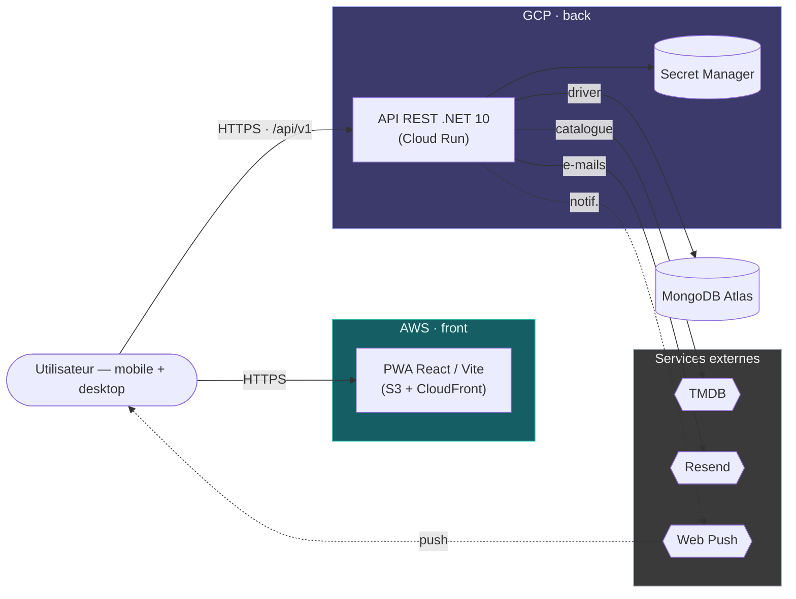
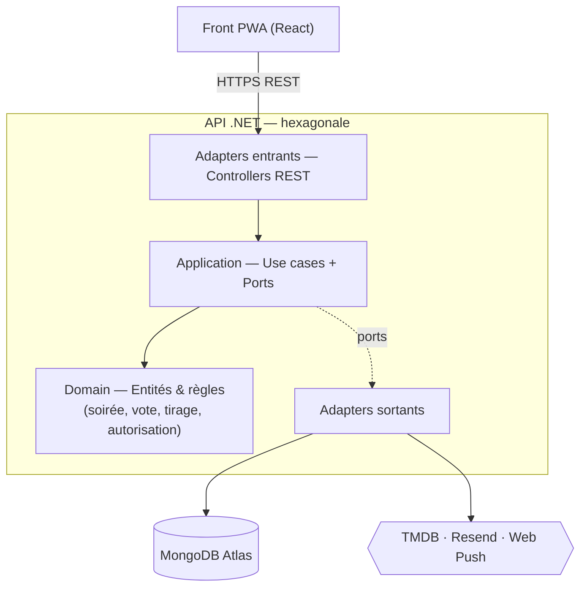
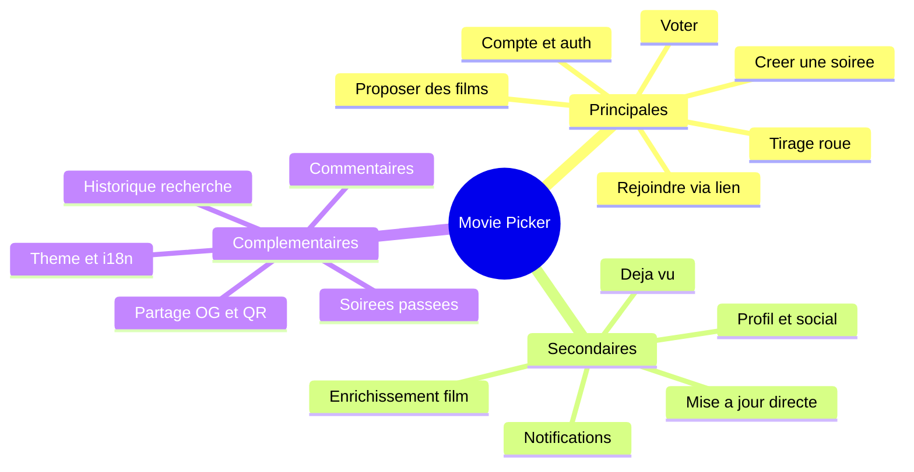
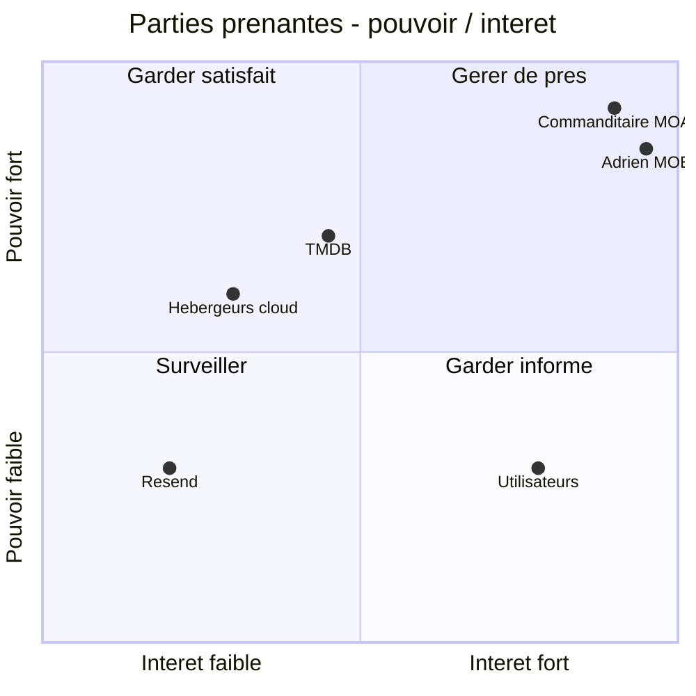
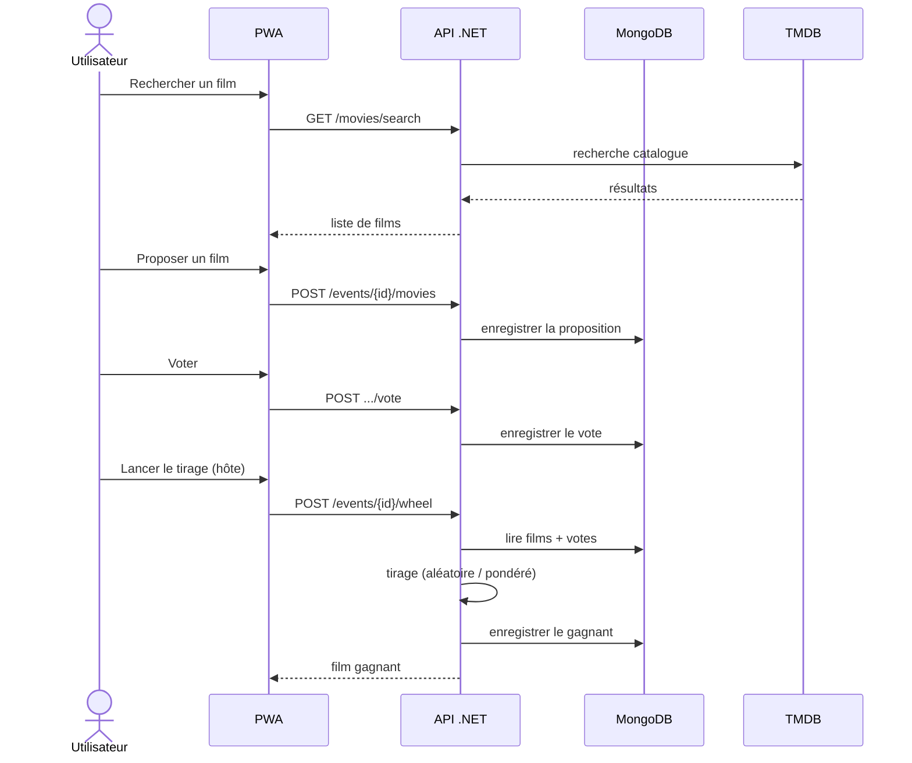

# Movie Picker

Cadrage d'un projet de développement logiciel

Bloc 1 — Cadrer un projet de développement d'applications logicielles 
Expert en développement logiciel · RNCP 39583

Adrien MORAND · 11 juin 2026

<!--
Page de titre. Annoncer le plan en une phrase et le fil rouge.
-->

---

# Sommaire

1. **Acteurs & besoin** — qui, pour quel problème ?
2. **Analyse stratégique & risques** — SWOT, risques
3. **Faisabilité & veille** — audit de l'existant, veille
4. **Choix techniques** — comparatif, architecture
5. **Charge & budget** — analyse fonctionnelle, chiffrage
6. **Préconisation** — décision & axes de solutions

<!--
Fil rouge : du « pourquoi / pour qui » vers le « comment / combien » jusqu'à la recommandation.
-->

---

# Contexte & problématique

- **Le constat** — choisir un film à plusieurs (soirée entre amis / en famille) est une source de friction : indécision, allers-retours, temps perdu, voire abandon de la soirée.
- **Le projet proposé** — Movie Picker, une **application web (mobile & desktop)** pour **décider ensemble** quel film regarder.

<b>Problématique</b> — <i>Comment aider un groupe à choisir rapidement et de façon consensuelle un film à regarder ensemble ?</i>

<!--
Critères : pose le décor de C1.1.2 (problématique). ~45 s. Fil rouge repris en préconisation.
-->

---

# Cartographie des parties prenantes

Projet porté par **une seule personne (MOE)** ; commanditaire **fictif (MOA)**. On distingue les *rôles* des *personnes*.

| Acteur | Rôle(s) | Implication |
|---|---|---|
| Commanditaire *(fictif, MOA)* | Exprime le besoin, fixe le budget, valide les livrables | Fort — décideur |
| **Adrien MORAND** *(MOE)* | Chef de projet/PO · Architecte · Dév full-stack · DevOps / Admin · UX/UI | Très fort |
| Utilisateurs finaux | Choisissent un film en groupe | Moyen |
| API TMDB | Catalogue, affiches, métadonnées, *watch providers* | Fort — dépendance |
| Hébergeurs (AWS · GCP · MongoDB Atlas) | Front, API, base de données | Moyen |
| Resend | E-mails (réinitialisation de mot de passe) | Faible |
| Web Push (VAPID) | Notifications push | Faible-moyen |

<!--
C1.1.1 (éliminatoire) : tous les types d'acteurs nommés (dev, architecte, admin, client, externes) + rôles + implication.
Oral : un seul dev = risque de bus factor (cf. risques). Positionnement Mendelow en annexe.
-->

---

# Les utilisateurs cibles

**Profil** — grand public, 18-35 ans, à l'aise avec le web. Usage **multi-support** : mobile pendant la soirée, desktop pour préparer/explorer. Faible tolérance à la friction. Accès **sur compte**.

| Persona | Objectif | Frustration | Usage |
|---|---|---|---|
| **Léa, 26 — l'organisatrice** | Créer une soirée, inviter, trancher | Les « choisis toi » à répétition | Desktop pour préparer, mobile pour animer |
| **Tom, 30 — le participant** | Voter vite, sans effort | Devoir trop configurer | Mobile, rejoint & vote |
| **Sami, 22 — le cinéphile** | Découvrir, suivre, garder une trace | Pas de reco personnalisée | Surtout desktop, explore & suit |

<!--
C1.1.1 (éliminatoire) : caractéristiques détaillées des utilisateurs. Personas illustratifs.
-->

---

# Analyse de la demande

**Recueil du besoin** — entretien de cadrage avec le commanditaire (MOA) + analyse de l'existant. Hypothèses validées avec la MOA.

**Besoins clés** — Commanditaire : produit différenciant, déployable, à coût maîtrisé · Utilisateurs : décider vite, sans dispute, mobile & desktop · Exploitant : app sécurisée et maintenable en solo.

**Objectifs** — O1 réduire le temps de décision · O2 expérience collaborative multi-support (mise à jour en direct) · O3 web app déployable en production.

**Enjeux** — *usage* (adoption, friction minimale) · *technique* (dépendance catalogue, sécurité, coût) · *personnel* (maîtrise full-stack + DevOps en solo).

<!--
C1.1.2 : besoins/attentes par PP, structurés en objectifs + enjeux. Objectifs repris en préconisation.
-->

---

# Problématique & pistes de solutions

> *Comment aider un groupe à choisir rapidement et de façon consensuelle un film à regarder ensemble ?*

| Piste | Avantages | Limite | Décision |
|---|---|---|---|
| App mobile native | Expérience riche | Coût multiplateforme, friction d'install, pas de desktop | Écartée |
| **Web app / PWA collaborative** | Sans install, **mobile + desktop**, lien de partage | Temps réel à gérer | **Retenue** |
| Bot (Discord / WhatsApp) | Là où sont les groupes | UX pauvre, pas de catalogue riche | Écartée |

**Mécanique retenue** — proposer (catalogue TMDB) → **voter** → **tirage** (roue aléatoire ou pondérée).

<!--
C1.1.2 : problématique + pistes cohérentes. La PWA couvre mobile ET desktop : facteur décisif.
-->

---
layout: two-cols
---

# SWOT

**Forces**
- Stack moderne maîtrisée de bout en bout
- PWA multi-support, sans installation
- Sécurité & qualité dès la conception
- Catalogue riche (TMDB), infra faible coût

**Faiblesses**
- Équipe = 1 personne (*bus factor*)
- RGPD à intégrer
- Accessibilité à garantir
- Temps réel par *polling*

::right::

**Opportunités**
- Niche « soirées entre amis » peu adressée
- Intégrations streaming / Letterboxd
- Social & notifications → rétention
- Extension mobile native ultérieure

**Menaces**
- Dépendance à TMDB (quotas, CGU, panne)
- Concurrence (JustWatch, agrégateurs)
- Coûts cloud si forte montée en charge
- Évolutions réglementaires (RGPD, a11y)

<!--
C1.2.1 : cartographie via SWOT. Analyse détaillée à la diapo suivante.
-->

---

# SWOT — adhérences, sécurité & impact

- **Adhérences / interactions** — dépendances externes (TMDB, Atlas, GCP, AWS, Resend) ; projet **autonome**, sans adhérence à un système interne.
- **Impact environnemental** — hébergement **serverless *scale-to-zero***, CDN + cache d'affiches, pages légères. *Vigilance : empreinte multi-cloud.*
- **Préconisations sécurité** — auth cookie HttpOnly + sessions, **authz systématique (anti-IDOR)**, CORS strict, CSP, *rate limiting*, secrets en coffre, scans CI (Gitleaks, Trivy).
- **Points de vigilance** — *bus factor*, RGPD, quotas TMDB, performances.
- **Opportunités à exploiter** — social / notifications, deep links streaming.

<!--
C1.2.1 : les 5 sous-critères (adhérences, environnement, sécurité, vigilance, opportunités).
-->

---

# Risques & indicateurs

Criticité = probabilité × impact (échelle 1-4) ; mitigations à mettre en place.

| Risque | Crit. | Mitigation prévue | Indicateur |
|---|---|---|---|
| Perte de données | Élevée | Backups Atlas, isolation stricte dev/prod | Succès backups, RPO/RTO |
| Interruption | Moyenne | Cloud Run multi-instances, `/health`, CDN | Uptime %, erreurs 5xx |
| Dégradation (perf) | Moyenne | Cache, pagination, budgets Lighthouse | Latence p95, Lighthouse |
| Sécurité (intrusion, IDOR) | Élevée | Authz systématique, scans CI, *rate limit* | Vulns Trivy/Sonar, 401/429 |
| Dépendance TMDB | Moyenne | Cache, mode dégradé | Taux d'erreur TMDB |
| *Bus factor* (solo) | Élevée | CI/CD, tests, documentation | Couverture de tests |

<!--
C1.2.3 : référentiel priorisé (perte/interruption/dégradation/sécurité) + indicateurs. Sert aussi de registre d'incidents.
-->

---

# Audit & diagnostic de l'existant

**Démarche (3 étapes)** — 1) solutions concurrentes · 2) briques techniques disponibles · 3) confrontation aux contraintes.

**Diagnostic**
- **Concurrence** — sondages (Doodle), discussions de groupe, agrégateurs (JustWatch) → **aucune ne réunit proposition + vote + tirage**.
- **Côté commanditaire** — **aucune application ni infrastructure** → projet *greenfield*.
- **Briques disponibles** — APIs catalogue (TMDB, OMDb), hébergeurs serverless, navigateurs (PWA, Web Push).
- **Langages candidats** — TypeScript (front) · C# / .NET ou Node (back).
- **Bases comparées** — *documentaire* (schéma flexible, agrégats imbriqués, scalabilité, cohérence à terme) vs *relationnel* (schéma rigide, jointures, ACID fort).

**Conclusion** — besoin mal couvert + briques matures → **faisable, à bâtir from scratch**.

<!--
C1.2.2 (éliminatoire) : démarche d'audit + langages/BDD/technos. Greenfield assumé : pas d'archi existante à reprendre, l'audit porte sur l'état de l'art.
-->

---

# Contraintes & avis de faisabilité

**Contraintes techniques**
- Hébergement cloud **serverless** (coût quasi nul au repos)
- Plateforme : navigateur (PWA) **mobile & desktop** → pas d'OS cible
- Volume : faible (~Ko/soirée, < 1 Go an 1)
- Utilisateurs (cible) : centaines d'inscrits, pics ~10-50 simultanés
- Délais : **livraison incrémentale par lots** · Ressources : **1 développeur**

**Contraintes financières** — budget étudiant → *free tiers*, open source, serverless.

**Avis** — ✅ Faisable (stack maîtrisée, TMDB gratuit, low-cost) · ⚠️ risques solo + RGPD · → **Décision : GO**.

<!--
C1.2.2 (éliminatoire) : contraintes techniques ET financières + avis critique.
-->

---

# Veille technique, techno & réglementaire

**Stratégie** — rester à jour sur l'écosystème front/back, la sécurité web, la réglementation. **Bénéfices** : sécurité à jour, choix pérennes, conformité.

**Outils** — *automatisée* (Dependabot/Renovate, Releases, RSS) · *sécurité* (Advisories, Trivy/Gitleaks en CI, audits npm/NuGet) · *communauté* (meetups, réseaux pro, changelog TMDB).

| Évolution | Type | Impact métier | Impact env. |
|---|---|---|---|
| React 19 / .NET 10 | Technique | Vélocité, maintenabilité, coût | Moins de ressources |
| RGPD & accessibilité | Réglementaire | Conformité, audience élargie | — |
| Serverless & éco-conception | Environnementale | Coût réduit | Sobriété |

<!--
C1.3.1 : stratégie, outils, bénéfices, évolutions classées par impact métier + environnemental.
-->

---

# Étude comparative des solutions techniques

| Décision | Options | Choix retenu | Justification |
|---|---|---|---|
| Type d'app | Natif · desktop · **PWA** | **PWA web** | Mobile + desktop, sans install, un seul code |
| Front | Angular · Vue · **React** | **React + Vite + TS** | Écosystème mûr, typage, build rapide, PWA |
| API | Node · **.NET** | **.NET 10 (ASP.NET Core)** | Typage fort, performances, robustesse |
| Base | SQL · **MongoDB** | **MongoDB Atlas** | Documentaire souple, itération rapide |
| Hébergement | VPS · PaaS · **Serverless** | **Cloud Run + S3/CloudFront** | Scale-to-zero, coût mini, peu d'exploitation |
| Notifications | E-mail · polling · **Web Push** | **Web Push (VAPID)** | Engagement, faible coût |

**Ressources nécessaires** — comptes AWS + GCP, cluster Atlas, clé TMDB, clés VAPID, Resend, CI/CD GitHub Actions.

<!--
C1.3.2 (éliminatoire) : comparatif + choix justifiés + ressources. Analyse par axes à la diapo suivante.
-->

---

# Choix techniques — analyse par axes

| Axe | Avantages | Vigilance |
|---|---|---|
| **Sécurité** | .NET mûr, auth cookie+sessions, CORS, CSP, rate limit, secrets en coffre, scans CI | CSRF (CORS+SameSite), secrets sur 2 clouds |
| **Systèmes** | Conteneur Docker portable, runtime managé, front statique | 2 écosystèmes cloud à maîtriser |
| **Réseaux** | HTTPS de bout en bout, CDN, API REST `/api/v1` | Dépendance aux APIs externes, latence cross-cloud |
| **Accessibilité** | Web standard, responsive mobile+desktop, thème clair/sombre | RGAA/WCAG à tester, contrastes |
| **Environnement** | Serverless scale-to-zero, CDN + cache, pages légères | Multi-cloud, bilan carbone à estimer |

<!--
C1.3.2 (éliminatoire) : les 5 axes exacts du barème (sécurité, systèmes, réseaux, accessibilité, environnement).
-->

---
layout: two-cols-header
---

# Architecture — vue de déploiement

::left::

::right::

**Légende**

- *Formes* — rectangle = composant · cylindre = base · hexagone = service tiers
- *Flèches* — trait plein = synchrone (HTTPS) · pointillé = asynchrone (push)
- *Couleurs* — zones d'hébergement : teal AWS · indigo GCP · gris tiers
- *Position* — gauche → droite : client → API → données

<!--
C1.5 : schéma système/déploiement légendé. La vue logicielle (couches) est à la diapo suivante.
-->

---
layout: two-cols-header
---

# Architecture logicielle — couches (hexagonale)

::left::

::right::

**Principes**

- **Domain** au centre — sans dépendance technique
- **Application** — définit les *ports*
- **Adapters** interchangeables (Mongo ↔ in-memory pour les tests)
- Dépendances vers le Domain → **testable, découplé, extensible**

<!--
C1.5 : architecture LOGICIELLE schématisée (le critère central). Sert maintenabilité & extensibilité.
-->

---

# Architecture — justification & qualités

- **Formalisme** — modèle **C4** (vues déploiement + logiciel, lisibles par le commanditaire) + **UML de séquence** pour les parcours clés (annexe). C4 pour l'ensemble, UML pour le détail.
- **Interactions** — front ↔ API (REST HTTPS, cookie) · API ↔ MongoDB · API ↔ TMDB / Resend / Web Push · CI/CD → déploiement.
- **Qualités**
  - *Maintenable* — hexagonale (Domain / Application / Infrastructure), testable.
  - *Sécurisée* — authz systématique, CORS / CSP, secrets en coffre, scans CI.
  - *Extensible* — adapters interchangeables, API versionnée, features sans refonte.
- **Impact environnemental** — serverless scale-to-zero, CDN + cache, pages légères ; **bilan carbone estimable** (Website Carbon / EcoIndex).

<!--
C1.5 : formalisme justifié, interactions, qualités, impact environnemental.
-->

---
layout: two-cols
---

# Analyse fonctionnelle

::right::

**Fonctions principales — caractérisation**

| Fonction | Caractérisation |
|---|---|
| Compte & auth | Inscription, connexion, reset mdp |
| Créer / configurer | Titre, date, options, lien |
| Rejoindre | Via lien partagé (compte requis) |
| Proposer | Recherche TMDB, anti-doublon |
| Voter | Up/down par film |
| Tirage | Roue aléatoire ou pondérée |

**Outil** — cas d'usage (UML) + **MoSCoW**.
**Couverture** — TMDB · API+MongoDB · Web Push · PWA.
**UX** — mobile & desktop, faible friction.

<!--
C1.4.1 (éliminatoire) : fonctions recensées, caractérisées, hiérarchisées + outil + couverture + UX.
-->

---

# Estimation de la charge (jours-homme)

| Lot | JH | | Lot | JH |
|---|---|---|---|---|
| Socle, CI/CD & déploiement | 15 | | Notifications | 8 |
| Compte & authentification | 8 | | Social & profil public | 8 |
| Soirées (créer/rejoindre/partage) | 12 | | Confort (historique, thème, i18n…) | 7 |
| Films, vote & tirage | 15 | | Tests, sécurité, a11y, perf | 8 |
| Enrichissement, « déjà vu », temps réel | 10 | | Design UX/UI | 6 |

**Total ≈ 97 JH** · ≈ **5 mois** à temps plein (1 dév, marge ~10 %)

<!--
C1.4.1 (éliminatoire) : charge exprimée en jours-homme, hypothèses explicites.
-->

---

# Budget prévisionnel

| Poste | Base de calcul | Coût (an 1) |
|---|---|---|
| **Développement** | 97 JH × 350 €/j | **≈ 34 000 €** |
| Infrastructure | Atlas / Cloud Run / S3+CloudFront (*free tiers*) | ≈ 250 € |
| Nom de domaine | .fr / .com | ≈ 12 € |
| Services / API | TMDB (gratuit) · Resend (*free tier*) | 0 € |
| Licence utilisateur | aucune (pas de modèle par licence) | 0 € |
| **Total estimé** | | **≈ 34 300 €** |

**Lecture** — ~99 % = développement ; l'infra **serverless** maintient un coût récurrent quasi nul (argument budget **et** environnemental).

<!--
C1.4.2 : budget cohérent avec la charge, postes (dont « licence » = nul, à dire). TJM 350 €/j = freelance junior, ajustable.
-->

---

# Synthèse & préconisation

**Cadre** — aider un groupe à choisir vite et de façon consensuelle un film, sur mobile & desktop.

**Axes préconisés**
- **PWA collaborative** (mobile + desktop, sans installation)
- Mécanique **proposer → voter → tirage** (catalogue TMDB)
- **Full-stack** (React · .NET · MongoDB) en **serverless**
- **Sécurité & qualité dès la conception**

**Réponse à la problématique** — friction minimale · décision objectivée · accessible partout.

**Conditions** — jalonnement par lots, automatisation, RGPD & a11y intégrées · *≈ 97 JH / ≈ 34 300 €*.

<!--
C1.6 (éliminatoire) : cadre + solutions + argumentaire. Vulgariser (ex. « serverless = serveurs qui s'éteignent au repos »).
-->

---

# Anticipation des objections

| Objection | Réponse |
|---|---|
| Pourquoi pas du mobile natif ? | La PWA couvre mobile **et** desktop sans install ; natif possible plus tard |
| Dépendance à TMDB risquée ? | API gratuite, **cache + mode dégradé**, alternative OMDb identifiée |
| Un seul développeur, tenable ? | **Lots** + automatisation (CI/CD, tests) ; bus factor outillé |
| Pourquoi MongoDB et pas du SQL ? | Modèle **documentaire** adapté ; pas de besoin transactionnel critique |
| Multi-cloud trop complexe ? | Chaque cloud sur son point fort, **secrets centralisés**, documenté |
| Du vrai temps réel ? | **Polling léger** au départ ; WebSocket si le besoin grandit |

<!--
C1.6 (éliminatoire) : les objections sont anticipées et traitées.
-->

---
layout: center
class: text-center
---

# Conclusion

**Trois points à retenir**

1. Un besoin réel et **mal couvert** → une solution ciblée
2. Un **cadrage complet** : faisable, sécurisé, sobre, chiffré (≈ 97 JH / ≈ 34 300 €)
3. Un plan **maîtrisé** malgré le solo (lots + automatisation)

**Validation demandée** pour lancer le **lot 1 (MVP)**

Merci — je suis à votre disposition pour vos questions.

<!--
C1.6 : clôture + appel à validation. Ouverture : social, mobile natif, intégrations streaming.
-->

---
layout: section
---

# Annexes
Pour les questions

---

# Annexe — Matrice pouvoir / intérêt (Mendelow)

<!--
Appui C1.1.1 : renforce les « niveaux d'implication ». Accents retirés pour Mermaid.
-->

---

# Annexe — Séquence « proposer → voter → tirage »

<!--
Appui C1.5 : interactions entre systèmes explicitées.
-->

---

# Annexe — Back-up

À tenir prêt pour les questions :

- Référentiel de risques complet (échelle proba × impact, indicateurs)
- Détail de la charge par fonctionnalité et hypothèses de budget
- Sources & outils de veille (liste détaillée)
- Maquettes / parcours utilisateur (journey map)
- Modèle de données (collections MongoDB)

<!--
Diapos de réserve, non présentées en linéaire.
-->
