# Dossier professionnel — Bloc 2

## Concevoir et développer des applications logicielles

|  |  |
|---|---|
| **Certification** | Expert en développement logiciel — **RNCP 39583** |
| **Bloc évalué** | Bloc 2 — Concevoir et développer des applications logicielles |
| **Projet support** | **Movie Picker** — application web pour choisir un film à plusieurs |
| **Candidat** | Adrien MORAND |
| **Modalité** | Projet individuel, commanditaire fictif (Ynov) |
| **Livrables** | Ce dossier (`dossier-bloc-2.pdf`, ≤ 30 pages) + archive `.zip` du code source |
| **Date** | Juillet 2026 |

> Ce dossier est **autonome** : il embarque les preuves nécessaires à l'évaluation (extraits de code, schémas, captures, tableaux) et n'exige pas la lecture du dépôt. Chaque section indique néanmoins les fichiers de référence de l'archive `.zip` pour permettre au jury de recouper.

---

## Sommaire

| § | Section | Compétence(s) |
|:--:|---|---|
| 1 | Présentation du projet & prototype | C2.2.1 |
| 2 | Architecture logicielle | C2.2.1 |
| 3 | Environnement de développement & outils | C2.1.1 |
| 4 | Intégration continue | C2.1.2 |
| 5 | Déploiement continu | C2.1.1 · C2.2.4 |
| 6 | Critères de qualité & performance | C2.1.1 |
| 7 | Harnais de tests unitaires | C2.2.2 |
| 8 | Sécurité — couverture OWASP Top 10 | **C2.2.3** (élim.) |
| 9 | Accessibilité | **C2.2.3** (élim.) |
| 10 | Cahier de recettes | **C2.3.1** (élim.) |
| 11 | Plan de correction des bogues | C2.3.2 |
| 12 | Historique des versions | C2.2.4 |
| 13 | Manuels d'exploitation | C2.4.1 |

### Table de correspondance compétences → sections → critères

| Compétence | Élim. | Section(s) | Critères d'évaluation couverts |
|---|:--:|---|---|
| **C2.1.1** — Environnements déploiement/test + qualité/perf | | §3, §5, §6 | Protocole CD explicité · env. de dev détaillé · outils (compilateur, serveur d'application, gestion de sources) · séquences de déploiement · critères qualité/perf |
| **C2.1.2** — Intégration continue | | §4 | Protocole CI explicité · séquences d'intégration |
| **C2.2.1** — Prototype | ✅ | §1, §2 | Bonnes pratiques (frameworks, paradigmes) · prototype fonctionnel · user stories · composants d'interface · exigences de sécurité |
| **C2.2.2** — Harnais de tests unitaires | ✅ | §7 | Tests unitaires couvrant une fonctionnalité · couverture majoritaire du code |
| **C2.2.3** — Sécurité + accessibilité | ✅ | §8, §9 | 10 failles OWASP couvertes · référentiel d'accessibilité présenté et justifié · exigences respectées |
| **C2.2.4** — Déploiement continu + historique versions | | §5, §12 | Système de gestion de versions · évolutions tracées · logiciel manipulable en autonomie |
| **C2.3.1** — Cahier de recettes | ✅ | §10 | Reprend l'ensemble des fonctionnalités · tests fonctionnels, structurels et de sécurité conformes au plan |
| **C2.3.2** — Plan de correction des bogues | | §11 | Bogues détectés, qualifiés, traités · analyse des tests en échec · corrections conformes |
| **C2.4.1** — Documentation d'exploitation | | §13 | Manuels déploiement + utilisation + mise à jour · clarté · choix techno/langages décrits |

> **Note sur les compétences acquises.** C2.2.1 (prototype) et C2.2.2 (harnais de tests unitaires) sont **déjà acquises** au titre de la fiche d'évaluation ; elles sont présentées de façon condensée (§1, §2, §7). L'effort de démonstration porte en priorité sur les compétences éliminatoires restantes : **C2.2.3** (§8–§9) et **C2.3.1** (§10).

---

## §1 — Présentation du projet & prototype

> **Compétence C2.2.1** — *Concevoir un prototype de l'application logicielle en tenant compte des spécificités ergonomiques et des équipements ciblés afin de répondre aux fonctionnalités attendues et aux exigences de sécurité.* L'architecture détaillée qui complète cette compétence fait l'objet du §2.

### 1.1 — Contexte & objectif produit

**Movie Picker** répond à un irritant du quotidien : choisir un film à plusieurs sans négociation interminable. L'application matérialise une **soirée** organisée par un **hôte**, qui invite des participants via un simple lien. Chaque participant propose des films (recherche dans le catalogue **TMDB**), l'assemblée vote, puis une **roue** tire un film au sort parmi les propositions retenues — transformant une décision de groupe en moment ludique.

Deux parcours structurent le produit :

- **Hôte** — crée la soirée, la configure (nombre de films par personne, échéance, options), suit les propositions et les votes, lance la roue, clôture.
- **Invité** — rejoint via le lien, propose des films, vote (ou marque « déjà vu »), assiste au tirage.

Le produit est **en production**, installable en PWA (application web progressive) sur mobile et desktop. Le « prototype fonctionnel » attendu par la compétence C2.2.1 est donc incarné par une **application réellement déployée et utilisée**, et non par une maquette : les écrans présentés en §1.5 sont ceux de l'application vivante.

### 1.2 — User stories principales

| # | En tant que… | Je veux… | Afin de… |
|:--:|---|---|---|
| US-1 | hôte | créer une soirée et obtenir un lien de partage | inviter mes amis sans configuration lourde |
| US-2 | invité | rejoindre une soirée via son lien | participer immédiatement, après connexion |
| US-3 | participant | rechercher et proposer un film (catalogue TMDB) | soumettre mes envies à l'assemblée |
| US-4 | participant | voter pour les films proposés (ou marquer « déjà vu ») | faire émerger un consensus |
| US-5 | hôte | lancer la roue de tirage parmi les favoris | trancher de façon ludique et impartiale |
| US-6 | hôte | configurer et clôturer la soirée | maîtriser le déroulé (quota de films, échéance, fin) |

Ces récits pilotent les fonctionnalités reprises intégralement dans le **cahier de recettes** (§10), où chacune est adossée à un scénario de test E2E.

### 1.3 — Stack technique & frameworks

| Couche | Technologies (versions du dépôt) | Rôle |
|---|---|---|
| **Front (SPA)** | React 19 · TypeScript 6 · Vite 8 · React Router 7 · TanStack Query 5 · PWA (VitePWA / Workbox) | Interface, routage, état serveur/cache, hors-ligne installable |
| **API** | ASP.NET Core .NET 10 (contrôleurs + filtres) · Swashbuckle (OpenAPI / Swagger) · WebPush | Ressources métier REST, contrat OpenAPI, notifications push |
| **Données** | MongoDB (driver 3.9, MongoDB Atlas) | Persistance documentaire (soirées, utilisateurs, votes) |
| **Intégrations tierces** | TMDB (catalogue films & affiches) · e-mail (réinitialisation) · Web Push · PostHog (analytics, soumis au consentement) | Enrichissement fonctionnel |
| **Hébergement** | Front : AWS S3 + CloudFront · API : GCP Cloud Run · Secrets : Secret Manager | Diffusion statique CDN + service conteneurisé managé |

*Preuves : `apps/web/package.json` (dépendances front), `apps/api-dotnet/MoviePicker.Api/MoviePicker.Api.csproj` (cible `net10.0` + paquets).*

### 1.4 — Paradigmes & partis pris

- **SPA + API REST versionnée.** Le front est une *single-page application* ; l'API expose ses ressources métier sous le préfixe **`/api/v1`** (sonde de disponibilité `GET /health`), garantissant une évolution non cassante des contrats. Référence : `ApiRoutePrefix.V1`, câblé côté client dans `apps/web/src/shared/api/client.ts`.
- **API en architecture hexagonale.** Le code serveur sépare *contrôleurs* → *cas d'usage* (un `*Handler` par action, commandes et requêtes distinctes) → *domaine* → *infrastructure* (via des ports), isolant la logique métier des détails techniques (base, transport). Détail en §2.
- **Front organisé par *features*.** L'arborescence `apps/web/src/` distingue `app/` (composition applicative), `features/` (domaines fonctionnels autonomes) et `shared/` (composants et utilitaires transverses), pour une base de code lisible et extensible.
- **Conventions de robustesse.** TypeScript en mode strict, validation centralisée des entrées côté API, **enveloppe d'erreur homogène** assortie d'un *correlation id* pour la traçabilité (repris en §10 comme tests structurels).

### 1.5 — Composants d'interface (prototype fonctionnel)

Les écrans clés du parcours illustrent la couverture fonctionnelle et les partis pris ergonomiques (mobile-first, thèmes clair/sombre, PWA). Les captures ci-dessous proviennent de l'**application réelle** (jeu de données de démonstration).

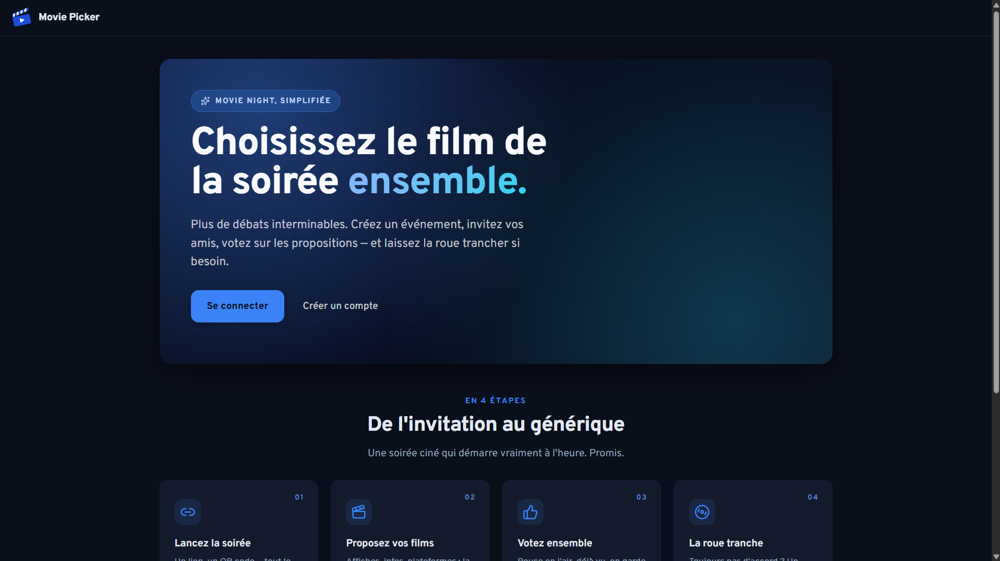

*Figure 1 — **Accueil / landing** : proposition de valeur et points d'entrée (se connecter / créer un compte).*

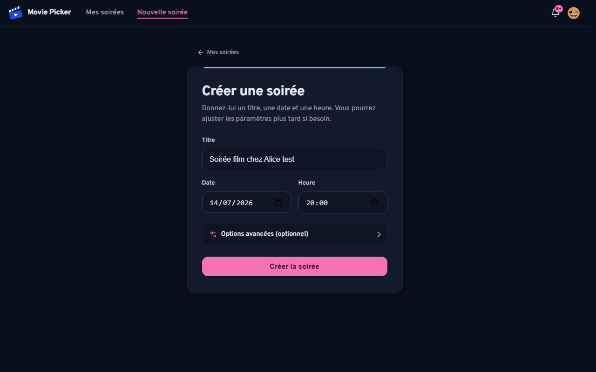

*Figure 2 — **Création de soirée** : titre, date et heure, options avancées ; le lien de partage est généré dès la création.*

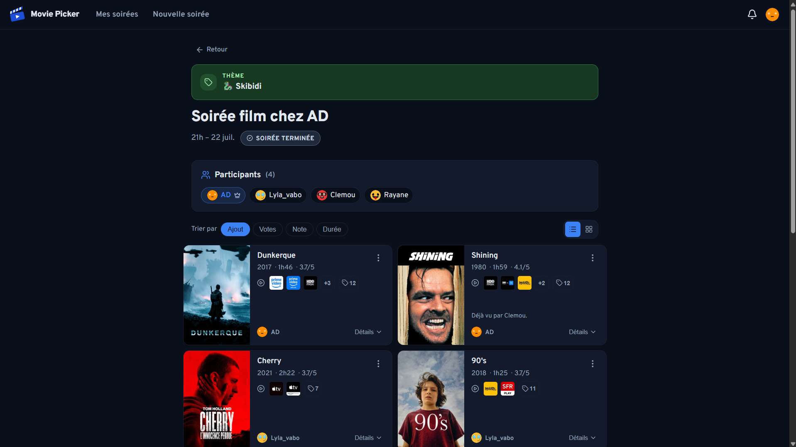

*Figure 3 — **Détail d'une soirée** : thème, participants, films proposés (métadonnées et plateformes de streaming TMDB) et tri (votes, note, durée, ordre d'ajout).*

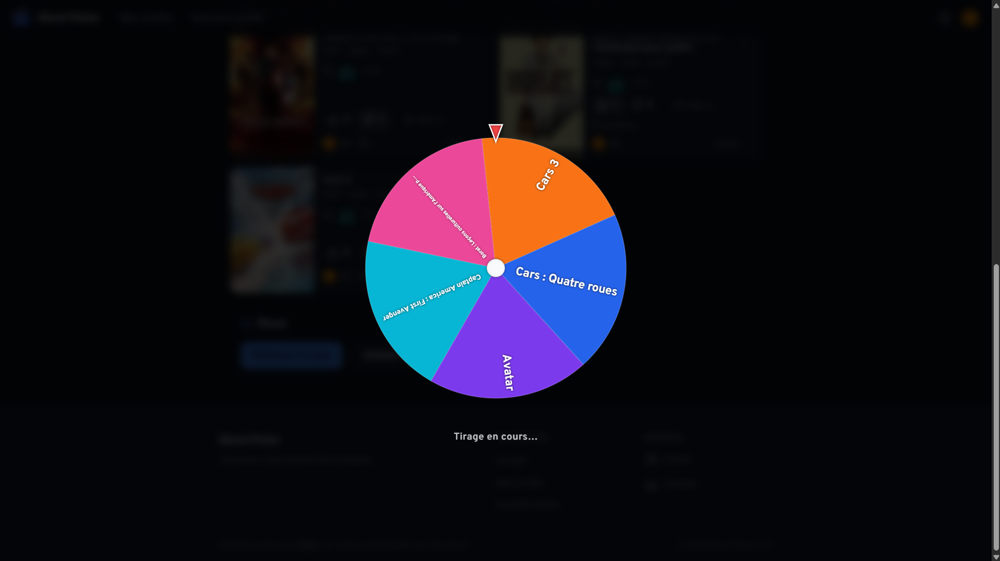

*Figure 4 — **Roue de tirage** : le film gagnant désigné parmi les propositions de la soirée.*

### 1.6 — Sécurité *by design* (renvoi §8)

Deux principes sont posés dès la conception ; leur mise en œuvre détaillée (10 mesures OWASP) figure en **§8** et l'accessibilité en **§9** :

- **Compte obligatoire.** Il n'existe pas de mode invité anonyme : rejoindre une soirée impose une authentification (redirection `returnTo` après connexion). Chaque action métier est ainsi rattachée à un utilisateur identifié, base de la maîtrise des accès (OWASP A01).
- **Secrets hors du dépôt.** Aucune donnée sensible n'est versionnée : les secrets sont fournis par variables d'environnement / Secret Manager et un scan **Gitleaks** garde le dépôt propre en intégration continue.

> **Preuves de la section.** `apps/web/package.json` · `apps/api-dotnet/MoviePicker.Api/MoviePicker.Api.csproj` · `apps/api-dotnet/MoviePicker.Api/Program.cs` (documentation du préfixe `/api/v1` et sonde `/health`) · `apps/web/src/{app,features,shared}/` (organisation par *features*) · captures UI (§1.5).

---

## §2 — Architecture logicielle

> **Compétence C2.2.1** (volet *bonnes pratiques & paradigmes*, en complément du §1). L'architecture est **schématisée et légendée** (modèle C4), explicite les interactions avec les systèmes tiers, et vise la **maintenabilité**, la **sécurité** et l'**évolutivité**.

### 2.1 — Méthode de modélisation

Le formalisme retenu est le **modèle C4** (Contexte → Conteneurs → Composants), complété par des **diagrammes de séquence UML** sur les parcours dynamiques clés.

| Méthode | Décision |
|---|---|
| **C4 Model** | **Retenu** — lisible et progressif (du contexte au composant), moderne et adapté à une application web ; sans la lourdeur d'UML complet. |
| **UML séquence** | **Retenu en complément** — décrit les interactions dynamiques (création de soirée, lancement de la roue). |
| UML complet (classes, états…) | Écarté — trop verbeux pour une V1 web réalisée en solo. |
| Merise | Écarté — orienté base relationnelle, inadapté au modèle **documentaire** MongoDB. |

> **Légende commune** — rectangles = conteneurs/composants applicatifs · cylindres = bases de données · nœuds externes = services tiers · flèches pleines = appels synchrones (HTTP) · flèches pointillées = flux asynchrones / déploiement.

### 2.2 — C4 niveau 1 : contexte

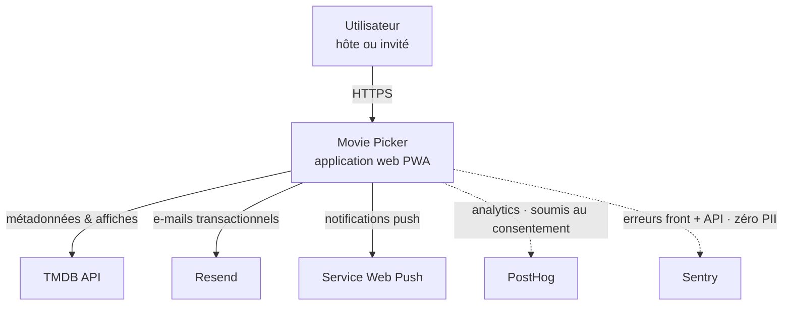

L'utilisateur n'interagit qu'avec Movie Picker (HTTPS). L'application consomme **TMDB** (catalogue et affiches), **Resend** (e-mails transactionnels : réinitialisation de mot de passe), un **service Web Push** (notifications navigateur) et remonte des événements d'usage à **PostHog** — uniquement en production et après consentement. L'**observabilité** repose sur des journaux JSON structurés corrélés (`CorrelationIdMiddleware`, renvoi §8-A09), la supervision Cloud Run, et une remontée d'exceptions dédiée vers **Sentry** (front + API, détail §8.1-A09) : à la différence de PostHog, elle tourne **sans bandeau de consentement**, au titre de l'intérêt légitime RGPD (finalité de sécurité, zéro donnée directement identifiante).

### 2.3 — C4 niveau 2 : conteneurs

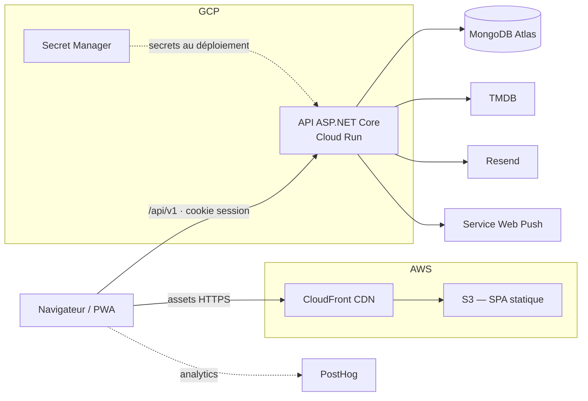

Le navigateur charge la SPA via **CloudFront/S3**, puis appelle l'**API** (`/api/v1`) en **cross-origin** avec cookie de session (`SameSite=None; Secure`, CORS `AllowCredentials` + allowlist d'origines). L'API lit/écrit dans **MongoDB Atlas**, interroge TMDB (clé côté serveur), envoie les e-mails via Resend, émet les notifications push, et récupère ses secrets depuis **Secret Manager** au déploiement. Le rendu de la SPA étant statique, aucun calcul serveur n'est requis pour l'affichage.

### 2.4 — C4 niveau 3 : composants de l'API (architecture hexagonale)

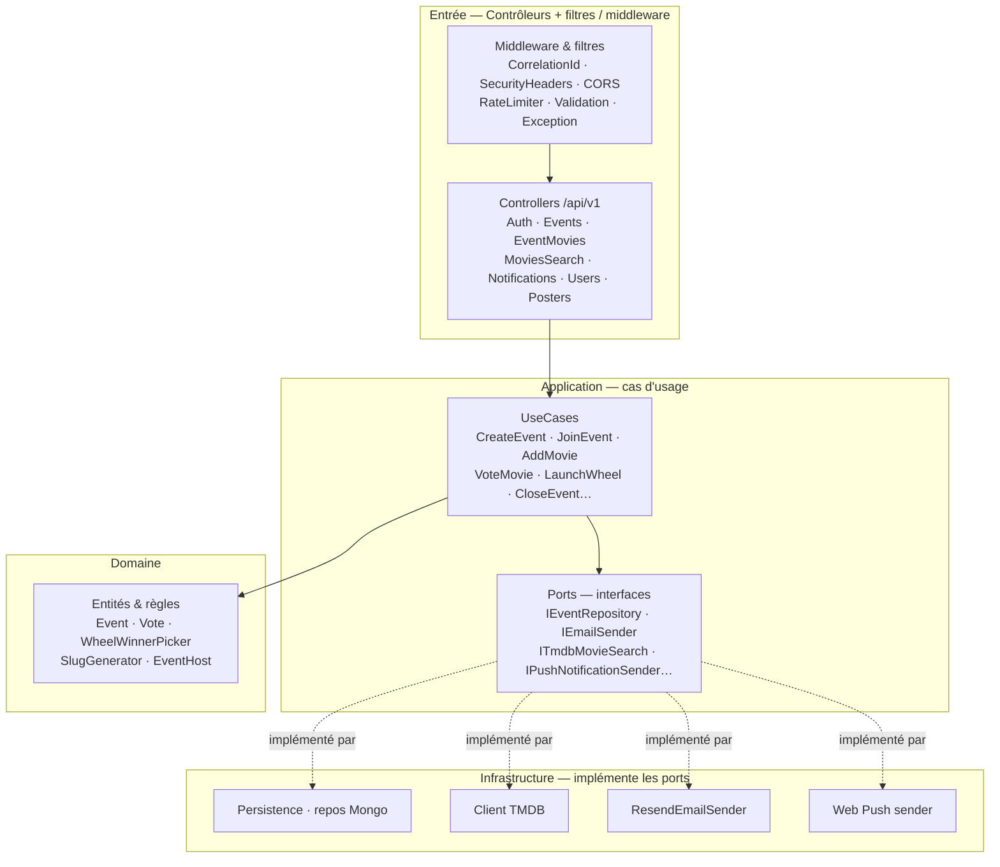

Le **Domaine** et l'**Application** ne connaissent ni MongoDB ni HTTP : l'Application déclare des **ports** (interfaces `Application/Ports/`), que l'**Infrastructure** implémente (`Persistence/`, `Tmdb/`, `Email/`, `Push/`). Ce découplage **facilite les tests** (les ports se substituent par des doubles, cf. §7) et **l'évolution** (changer de base = une nouvelle implémentation de port, sans toucher au métier).

### 2.5 — Organisation du code

**API — `apps/api-dotnet/MoviePicker.Api/`**

```
├─ Controllers/        points d'entrée HTTP (/api/v1)
├─ Application/
│  ├─ UseCases/        1 dossier par cas d'usage (CreateEvent, VoteMovie, LaunchWheel…)
│  ├─ Ports/           interfaces (I*Repository, IEmailSender, ITmdbMovieSearch…)
│  └─ DTOs/            contrats d'entrée / sortie
├─ Domain/             Entities/, Services/, règles métier (WheelWinnerPicker, EventHost)
├─ Infrastructure/
│  ├─ Persistence/     repositories MongoDB
│  ├─ Tmdb/ · Email/ · Push/ · Posters/   implémentations de ports
│  └─ Web/             middlewares, auth cookie, filtres, CORS, rate limit
├─ Configuration/ · Contracts/
└─ Program.cs          composition, pipeline middleware, MapControllers
```

**Front — `apps/web/src/`**

```
├─ app/                composition applicative : components/, pages/ (routage, shell)
├─ features/           domaines fonctionnels : auth/, events/, movies/, notifications/, profile/
├─ shared/             transverse : api/ (client.ts), components/, hooks/, contexts/,
│                                   analytics/, i18n/, types/, utils/
└─ styles/ · test-utils/
```

### 2.6 — Qualités architecturales

| Qualité | Comment elle est assurée |
|---|---|
| **Maintenable** | Découpage hexagonal (métier isolé de l'infra), un dossier par cas d'usage, tests d'intégration + contrat OpenAPI, monorepo outillé (§3). |
| **Sécurisée** | Préfixe `/api/v1` versionné · pipeline middleware (CorrelationId, SecurityHeaders, CORS allowlist, RateLimiter) + filtres validation/exception · secrets externes · cookie `HttpOnly`/`Secure` — détail en §8. |
| **Extensible** | Ports pour brancher de nouvelles implémentations (nouvelle BDD = 1 implémentation) · schéma Mongo souple · ajouter une fonctionnalité = 1 dossier `UseCases/` + 1 contrôleur. |
| **Évolutive (livraison)** | Image Docker · CI/CD GitHub Actions · déploiement Cloud Run + S3/CloudFront automatisé (§4–§5). |

> **Preuves de la section.** Arborescence réelle `apps/api-dotnet/MoviePicker.Api/` (Controllers · Application · Domain · Infrastructure) · `Program.cs` (pipeline middleware, `MapControllers`) · `Application/Ports/*.cs` (interfaces) · `apps/web/src/{app,features,shared}/` · synthèse fidèle de `archive/docs/RNCP/bloc-1-cadrage/10-architecture.md`.

---

## §3 — Environnement de développement & outils

> **Compétence C2.1.1** — *Mettre en œuvre des environnements de déploiement et de test en y intégrant les outils de suivi de performance et de qualité.* Cette section décrit l'environnement de **développement** et les **outils identifiables** (compilateur, serveur d'application, gestion de sources) ; le déploiement est traité en §5 et les critères qualité/perf en §6.

### 3.1 — Poste de développement & runtimes

| Outil | Version / précision (dépôt) | Rôle |
|---|---|---|
| Éditeur | VS Code / Cursor, assisté de **Claude Code** (CLI) | édition, extensions TypeScript & C# ; génération et revue de code assistées par IA |
| Node.js | `^20.19 \|\| ^22.13 \|\| >=24` (champ `engines`) | exécution du *toolchain* front |
| pnpm | **10.0.0** (champ `packageManager`) | gestionnaire de paquets & *workspace* |
| .NET SDK | **10.0** (cible `net10.0`) | build & exécution de l'API |
| Docker | image API multi-étages | conteneurisation pour Cloud Run |
| MongoDB | instance locale / cluster Atlas de dev, base `moviepicker_dev` | persistance documentaire en dev |

La base de développement (`moviepicker_dev`) est **isolée de la production** par un garde-fou (`ServiceCollectionExtensions.cs`) : en environnement `Development`, l'API **refuse de démarrer** si `MONGODB_URI` cible la base de prod `moviepicker` (une base dédiée et jetable, ex. `moviepicker_dev`, est exigée). À l'inverse, hors développement, `ProductionStartupValidation` impose la présence de `MONGODB_URI` et `ALLOWED_ORIGINS`.

### 3.2 — Monorepo & orchestration

Le dépôt est un **monorepo pnpm** (`pnpm-workspace.yaml`) réunissant le front (`apps/web`), l'API (`apps/api-dotnet`) et les tests E2E (`e2e/` à la racine). **Turbo** (`turbo.json`) orchestre les tâches `build / lint / test / test:coverage` avec un **graphe de dépendances** (`^build`) et un **cache** des sorties (`dist/`, `coverage/`) : une seule commande à la racine (`pnpm run build|lint|test`) pilote les deux applications. Le script `dev:full` lance le front et l'API en parallèle (`concurrently`).

### 3.3 — Gestion des sources

- **Git + GitHub**, branche principale **`master`**.
- Travail sur **branches de fonctionnalité** intégrées en `--no-ff` ; les **Pull Requests** tracent les changements et déclenchent la CI.
- La **CI** (`.github/workflows/ci-cd.yml`) s'exécute **sur chaque PR et push `master`** : sur PR elle fournit le signal de validation (lint + tests + build), sur `master` elle **conditionne le déploiement** (les jobs `deploy-*` en dépendent). Détail §4.
- Historisation des versions : `CHANGELOG.md` + **SemVer** + tags/releases GitHub (détail §12).

### 3.4 — Outillage qualité local

Deux filets de sécurité s'exécutent **avant même la CI** :

1. **`pnpm run verify:local`** (`scripts/verify-local.cjs`) — reproduit localement les jobs CI, dans l'ordre :
   lint (Turbo → `tsc` + ESLint) · Prettier `--check` · `dotnet restore` · `dotnet format --verify-no-changes` · **`dotnet build -c Release -warnaserror`** (avertissements = erreurs) · export du contrat OpenAPI · **`pnpm audit --audit-level=high`** · tests front (Vitest + seuils de couverture) · tests API unitaires **et** d'intégration. Les tests API tournent **sans base réelle** (`MONGODB_URI` vide), garantissant leur reproductibilité.
2. **Hook `pre-push`** (`simple-git-hooks`, installé par le script `prepare`) : `pnpm run lint && pnpm run format:check` — **bloque tout push** qui ne compile pas (TypeScript/ESLint) ou n'est pas formaté (Prettier).

### 3.5 — Outils sous forme de composants identifiables (C2.1.1)

| Composant attendu | Outil concret dans le projet |
|---|---|
| **Compilateur** | Front : TypeScript `tsc -b` (via Vite) · API : `dotnet build` / `dotnet publish` |
| **Serveur d'application** | Dev : serveur Vite + Kestrel · Prod : **Cloud Run** (API Kestrel:8080) + **CloudFront/S3** (SPA) |
| **Gestion de sources** | **Git + GitHub** (branche `master`, PR, GitHub Actions) |
| **Conteneurisation** | Docker **multi-étages** : `sdk:10.0` (build → `dotnet publish -c Release`) → `aspnet:10.0` (runtime) ; images **épinglées par digest**, exécution **non-root** (`USER $APP_UID`) |

> **Preuves de la section.** `package.json` (racine : `scripts`, `packageManager`, `engines`, `simple-git-hooks`) · `apps/web/package.json` (build `tsc -b && vite build`) · `scripts/verify-local.cjs` · `turbo.json` · `pnpm-workspace.yaml` · `apps/api-dotnet/MoviePicker.Api/Dockerfile` · `.github/workflows/ci-cd.yml`.

---

## §4 — Intégration continue

> **Compétence C2.1.2** — *Configurer le système d'intégration continue en fusionnant les codes sources et en testant régulièrement les blocs de code afin d'assurer un développement efficient qui réduit les risques de régression.* Le pipeline est décrit dans un unique workflow GitHub Actions : `.github/workflows/ci-cd.yml`.

### 4.1 — Protocole & principes

- **Déclencheurs** : `pull_request` ciblant `master`, `push` sur `master`, et `workflow_dispatch` (exécution manuelle qui force les deux lanes).
- **Path-filtering** : un premier job `changes` (`dorny/paths-filter`) calcule deux sorties **`web`** / **`api`** ; chaque job est conditionné (`if: needs.changes.outputs.<lane> == 'true'`). Un changement purement front n'exécute pas la chaîne .NET (et réciproquement), ce qui **raccourcit le pipeline**.
- **Réutilisation** : deux **actions composites** — `setup-web` (pnpm + Node + cache du store + `install --frozen-lockfile`) et `setup-dotnet-cache` (SDK .NET + cache NuGet indexé sur le hash des `*.csproj`).
- **Robustesse d'exécution** : `concurrency` (annule les runs de PR obsolètes), `timeout-minutes` par job, `permissions` *least-privilege* (`contents: read` par défaut).

### 4.2 — Séquence d'intégration

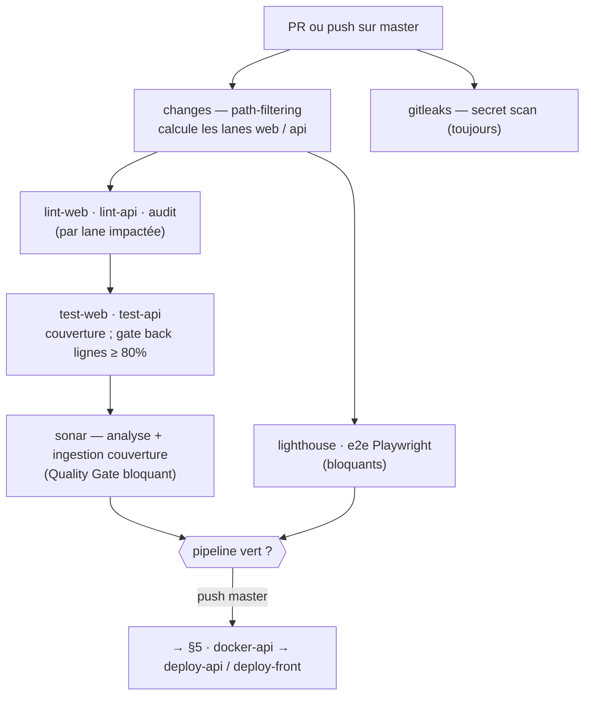

| Job | Déclenché si | Rôle | Bloquant |
|---|---|---|:--:|
| `changes` | PR / push | path-filtering (lanes web / api) | — |
| `gitleaks` | toujours | scan de secrets sur l'arbre de travail | ✅ |
| `lint-web` | lane web | `tsc` + ESLint + Prettier `--check` | ✅ |
| `lint-api` | lane api | `dotnet format` + build `-warnaserror` + export OpenAPI (artefact) | ✅ |
| `audit` | web ou api | `pnpm audit` (high+) + NuGet vulnérables (High/Critical) | ✅ |
| `test-web` | lane web | Vitest + seuils de couverture (cf. §6) | ✅ |
| `test-api` | lane api | xUnit unitaires + intégration + **gate couverture lignes ≥ 80 %** | ✅ |
| `sonar` | après `test-web`/`test-api` | analyse SonarCloud + Quality Gate (code nouveau) | ✅ |
| `lighthouse` | lane web | seuils performance / a11y (médiane 3 passes) | ✅ |
| `e2e` | web ou api | Playwright (build front + API + navigateur) | ✅ |

### 4.3 — Portes de qualité (toutes bloquantes)

**Toutes les portes de qualité sont bloquantes** : elles échouent le pipeline et **bloquent le déploiement** (les jobs `deploy-*` en dépendent via `needs:`).

- **Build & style** : lint front (`tsc` + ESLint + Prettier), `dotnet format` + build `-warnaserror`.
- **Sécurité** : `pnpm audit` (high+), NuGet High/Critical, scan Trivy de l'image (CRITICAL, et HIGH si un correctif existe — cf. §5).
- **Tests & couverture** : tests front (seuils de couverture), tests API unitaires **et** d'intégration, **gate de couverture back ≥ 80 %**.
- **Recette & qualité continue** : **E2E Playwright** (cahier de recettes, §10), **Lighthouse** (seuils perf/a11y, §6.3) et le **Quality Gate SonarCloud** (§6.2).

Le risque de *flake* est **maîtrisé plutôt qu'évité** : Lighthouse statue sur la **médiane de 3 passes**, l'E2E rejoue une fois (`retries: 1`) et le Quality Gate porte sur le **code nouveau** (conditions déterministes). Un échec récurrent est traité comme un bogue (§11), pas contourné.

### 4.4 — Durcissement de la chaîne CI

Le workflow applique des mesures anti *supply-chain* (reprises en §8-A08) : **actions épinglées par SHA de commit** (commentaire `# vX` pour laisser Dependabot proposer les mises à jour), **images Docker épinglées par digest `sha256`**, `persist-credentials: false` au *checkout*, **secrets passés via `env:`** (jamais interpolés dans un bloc `run:`), et des **caches** Turbo / pnpm / NuGet / Trivy / Sonar pour la rapidité.

> **Preuves de la section.** `.github/workflows/ci-cd.yml` (jobs `changes`, `lint-*`, `audit`, `test-*`, `sonar`, `e2e`, `lighthouse`) · actions composites `.github/actions/setup-web/action.yml` et `.github/actions/setup-dotnet-cache/action.yml`.

---

## §5 — Déploiement continu

> **Compétences C2.1.1** (séquences de déploiement) **et C2.2.4** (*déployer le logiciel à chaque modification… afin de présenter une solution stable et conforme*). Le déploiement prolonge le même workflow que la CI (§4).

### 5.1 — Protocole CD

Sur **`push` sur `master` avec CI verte**, le déploiement se déclenche **automatiquement, par lane** : la lane `api` passe par `docker-api` → `deploy-api`, la lane `web` par `deploy-front`. Les deux jobs de déploiement s'exécutent dans l'**environnement GitHub `production`**, qui **historise chaque déploiement** (traçabilité C2.2.4). Chaque fusion sur `master` redéploie ainsi la (ou les) partie(s) modifiée(s) : le **déploiement à chaque modification** est acquis.

### 5.2 — Séquence de déploiement

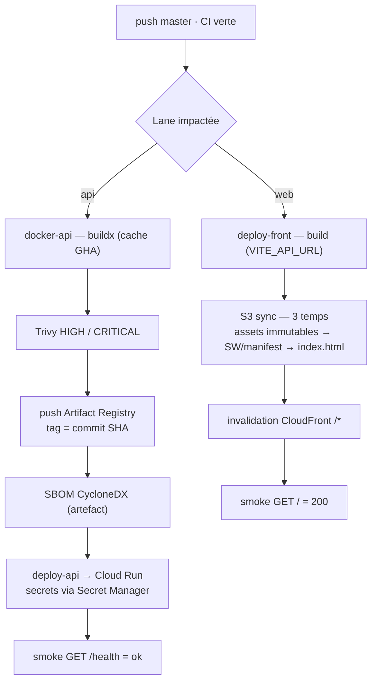

### 5.3 — API → Cloud Run

1. **`docker-api`** — build **buildx** de l'image (avec cache de *layers* GHA) ; **scan Trivy** (bloque sur `CRITICAL`, et sur `HIGH` si un correctif amont existe — `ignore-unfixed`) **avant** toute publication ; **push** vers **Artifact Registry** avec pour tag le **SHA de commit** (`…/api:${github.sha}`) — image traçable et adressable pour le rollback ; génération d'un **SBOM CycloneDX** archivé en artefact (30 j).
2. **`deploy-api`** — `gcloud run deploy` (région **`europe-west1`**, `--platform managed`). Les secrets (`MONGODB_URI`, `TMDB_API_KEY`, `AUTH_DATAPROTECTION_KEYRING`, `VAPID_PUBLIC/PRIVATE_KEY`) sont injectés depuis **Secret Manager** (`--set-secrets …:latest`), jamais dans l'image ni le dépôt ; `ALLOWED_ORIGINS` (CORS) passe en variable. Un **smoke test** `GET /health` (avec *retries*) valide la mise en service et **échoue le déploiement** si la réponse n'est pas `status=ok`.

### 5.4 — Front → S3 + CloudFront

Le front est buildé avec `VITE_API_URL` (garde-fou : refus si l'URL pointe par erreur vers CloudFront/S3), puis publié selon une **stratégie de cache en trois temps** — l'**ordre est volontaire** :

1. **Assets hachés** (JS/CSS dont le nom contient un hash) d'abord, en `max-age=31536000, immutable` : jamais réinvalidés, car un changement de contenu change le nom.
2. **`sw.js` + `manifest.webmanifest`** en `no-cache` (doivent être revalidés).
3. **`index.html` en dernier**, en `no-cache` : comme il **référence** les assets hachés, le publier après eux garantit qu'aucun utilisateur ne reçoive un `index.html` pointant vers un asset pas encore en ligne.

Suivent l'**invalidation CloudFront** (`/*`, avec attente de complétion) et un **smoke test** `GET /` attendu en `200`.

### 5.5 — Reprise sur incident & exploitation continue

- **Rollback API** (`rollback.yml`, manuel) — bascule 100 % du trafic Cloud Run vers une **révision antérieure** (par défaut la précédente). Cloud Run **conservant ses révisions**, le rollback **ne reconstruit rien** : c'est un simple **reroutage de trafic**, quasi instantané, validé par un smoke `/health`. *Limite assumée* : le rollback **front** (S3/CloudFront) n'est pas outillé faute d'artefacts front versionnés → axe d'amélioration (§11.5).
- **Rétention du registre** (`registry-cleanup.yml`, mensuel + manuel) — applique une politique Artifact Registry (`infra/artifact-registry-cleanup-policy.json`) conservant les **10 images récentes** et purgeant les images de **plus de 30 jours**.
- **Déploiement progressif** — choix **assumé** en V1 : déploiement **direct** (100 % du trafic), **sans canary/bleu-vert**, justifié par un projet solo à faible trafic dont le risque est couvert par le **smoke test post-déploiement** et un **rollback rapide**. La plateforme Cloud Run (révisions + routage de trafic) rend le canary **activable sans refonte** — inscrit comme axe d'évolution (§11.5).

> **Preuves de la section.** `.github/workflows/ci-cd.yml` (jobs `docker-api`, `deploy-api`, `deploy-front`) · `.github/workflows/rollback.yml` · `.github/workflows/registry-cleanup.yml` · `infra/artifact-registry-cleanup-policy.json`.

---

## §6 — Critères de qualité & performance

> **Compétence C2.1.1** — volet *outils de suivi de la qualité et de la performance*. Les critères ci-dessous sont **mesurés automatiquement** dans le pipeline (§4) ; on distingue les **seuils bloquants** (plancher qui échoue le build) des **mesures observées** (constat, supérieur au plancher).

### 6.1 — Couverture de tests

| Périmètre | Seuil **bloquant** | Mesuré | Outil |
|---|---|---|---|
| Front (Vitest, provider v8) | lignes **82** · fonctions **76** · branches **74** | — | `apps/web/vitest.config.ts` |
| API (.NET) | **lignes ≥ 80** (gate CI) | — | Coverlet → `test-api` |
| **Global (SonarCloud, 13/07/2026)** | — | **86,6 %** (lignes 91,2 % · branches 77,3 %) | SonarCloud (33 404 lignes analysées) |

Les seuils sont des **planchers** qui font échouer la CI en cas de régression de couverture ; la couverture réellement mesurée (86,6 % global) leur est supérieure.

### 6.2 — Quality Gate SonarCloud

L'analyse SonarCloud s'exécute à chaque PR / push `master` (§4) et ingère la couverture front **et** back. Le **Quality Gate** (profil *Sonar way*, appliqué au **code nouveau**) est **au vert** (13/07/2026) :

| Condition (code nouveau) | Seuil | Valeur | Statut |
|---|---|---|:--:|
| Couverture | ≥ 80 % | 84,3 % | ✅ |
| Duplication | < 3 % | 0,8 % | ✅ |
| Fiabilité / Sécurité / Maintenabilité | A | A / A / A | ✅ |
| Hotspots de sécurité revus | 100 % | 100 % | ✅ |

Ce Quality Gate est **bloquant** dans la CI (§4.3) : le job `sonar` lance `sonarscanner end` avec `sonar.qualitygate.wait=true`, et un Quality Gate rouge **fait échouer le pipeline et bloque le déploiement**. Portant sur le **code nouveau** (conditions déterministes), il reste robuste au *flake*.

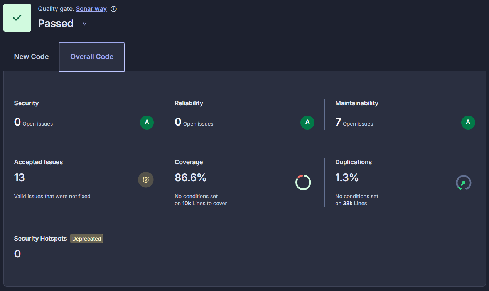

*Figure 7 — Quality Gate SonarCloud au vert (**Passed**, profil Sonar way). Vue « Overall Code » : couverture globale **86,6 %**, duplication **1,3 %**, Fiabilité / Sécurité / Maintenabilité **A / A / A**, 0 hotspot de sécurité ouvert — cohérent avec le §6.1. Les conditions chiffrées du tableau ci-dessus portent sur le **code nouveau** (onglet « New Code », relevé via l'API le 13/07/2026).*

### 6.3 — Performance (Lighthouse)

`pnpm run lighthouse` (script `scripts/lighthouse-run.mjs`) build le front, le sert localement et mesure **3 routes** (`/` accueil, `/new` création, `/e/:slug` soirée) en prenant la **médiane de 3 exécutions** (pour lisser la variance du *runner*). Seuils (`configs/lighthouse-budgets.json`) :

| Catégorie | Seuil (sur 100) |
|---|:--:|
| Performance | 80 |
| Accessibilité | 95 |
| Bonnes pratiques | 95 |
| SEO | 90 (ignoré sur les routes non indexables : `/new` derrière auth, `/e/:slug` privée) |

Le job CI `lighthouse` est **bloquant** (rapport conservé en artefact) : il statue sur la **médiane de 3 passes** par route — ce qui limite le *flake* — et **échoue le pipeline** si un seuil n'est pas atteint. Les seuils ont été **relevés** après une passe d'optimisation (contraste a11y, CLS du *footer*, bundle PostHog en import dynamique, polices `latin`).

### 6.4 — Sécurité (0 vulnérabilité High/Critical)

Quatre filets complémentaires garantissent l'absence de vulnérabilité **High/Critical** (détail des mesures OWASP en §8) :

- **`pnpm audit --audit-level=high`** (dépendances npm) et **`dotnet list package --vulnerable`** (NuGet, High/Critical) — bloquants en CI.
- **Trivy** — scan de l'**image** Docker avant push (§5) **et** scan **filesystem** des *lockfiles*.
- **Gitleaks** — scan de secrets sur l'arbre de travail (§4), à chaque run.

Ces contrôles tournent en CI (§4) **et** via un **scan hebdomadaire planifié** (`security-scan.yml`, lundi) qui attrape les CVE divulguées **entre deux mises à jour Dependabot**.

> **Preuves de la section.** `apps/web/vitest.config.ts` (seuils de couverture) · `.github/workflows/ci-cd.yml` (gate back ≥ 80 %, job `sonar`) · `scripts/lighthouse-run.mjs` + `configs/lighthouse-budgets.json` · `.github/workflows/security-scan.yml` · tableau de bord SonarCloud (Quality Gate « Passed », cf. Figure 7).

---

## §7 — Harnais de tests unitaires

> **Compétence C2.2.2** *(acquise — présentation condensée)* — *Développer un harnais de test unitaire … afin de prévenir les régressions et de s'assurer du bon fonctionnement du logiciel.* Deux harnais, un côté par application.

### 7.1 — Inventaire

| Harnais | Outils | Fichiers | Portée |
|---|---|:--:|---|
| **Front** | Vitest + React Testing Library + `user-event` + `jest-dom` · MSW (mock réseau) · `vitest-axe` (a11y) | **87** `*.test.{ts,tsx}` | composants, hooks, utilitaires, i18n, accessibilité |
| **API — unitaires** | xUnit | **116** `*Tests.cs` | miroir de l'archi : `Domain/`, `UseCases/` (1 par cas d'usage), `Infrastructure/`, `Web/` |
| **API — intégration** | xUnit + `WebApplicationFactory` (`MoviePickerApplicationFactory`) | **19** `*Tests.cs` | endpoints bout-en-bout : `AuthEndpointsTests`, `CriticalPathTests`, `OpenApiContractTests`, `RateLimitingTests`, `ErrorEnvelopeAndCorrelationIdTests`… |

Répartition front (extrait) : `shared/utils` 18 · `features/events` 17 · `features/movies` 12 · `features/profile` 7 · `features/auth` 7. Les tests s'exécutent **sans base réelle** (`MONGODB_URI` vide → dépôts *InMemory*), donc **déterministes et rapides** (§3–§4).

### 7.2 — Exemple front (Vitest + React Testing Library)

Test d'interaction d'un composant réutilisable (rendu → clic → vérification du *callback*) :

```tsx
import { it, expect, vi } from 'vitest';
import { render, screen } from '@testing-library/react';
import userEvent from '@testing-library/user-event';
import ConfirmDialog from '@/shared/components/ConfirmDialog';
import { AppTestProviders } from '@/test-utils/queryWrapper';

it('appelle onConfirm puis onCancel selon le bouton cliqué', async () => {
  const user = userEvent.setup();
  const onConfirm = vi.fn();
  const onCancel = vi.fn();
  render(
    <AppTestProviders>
      <ConfirmDialog open title="Quitter" message="Sûr·e ?"
        onConfirm={onConfirm} onCancel={onCancel} />
    </AppTestProviders>
  );
  await user.click(screen.getByTestId('confirm-dialog-confirm'));
  expect(onConfirm).toHaveBeenCalledTimes(1);
  await user.click(screen.getByTestId('confirm-dialog-cancel'));
  expect(onCancel).toHaveBeenCalledTimes(1);
});
```

*(`ConfirmDialog.test.tsx` couvre aussi l'ouverture/fermeture de la modale, l'état `busy` et la fermeture native par Échap.)*

### 7.3 — Exemple API (xUnit, logique métier)

Test unitaire pur de la **logique de tirage de la roue** (US-5) — déterministe via `Random` à graine fixe, sans I/O :

```csharp
public sealed class WheelWinnerPickerTests
{
    private static Movie M(string id, string title) => new()
        { Id = id, EventId = "e1", ParticipantId = "p1", TmdbId = 1, Title = title, /* … */ };

    [Fact]
    public void Pick_Weighted_FavorsHigherScore()
    {
        var movies = new[] { M("low", "L"), M("high", "H") };
        var random = new Random(0);
        var picked = new Dictionary<string, int>(StringComparer.Ordinal);
        for (var i = 0; i < 200; i++)
        {
            var w = WheelWinnerPicker.Pick(
                movies, id => id == "high" ? 10 : 0, WheelMode.WeightedByVotes, random);
            picked[w.Id] = picked.GetValueOrDefault(w.Id) + 1;
        }
        Assert.True(picked.GetValueOrDefault("high") > picked.GetValueOrDefault("low"));
    }
    // + tirage aléatoire strict, exclusion du gagnant précédent, repli si seul candidat…
}
```

**Couverture croisée d'une même fonctionnalité** : la roue est testée **côté API** (logique de tirage ci-dessus) **et côté front** (`WheelSection.test.tsx` : états d'UI hôte/invité, bouton « Lancer la roue », rendu du film gagnant).

### 7.4 — Couverture majoritaire du code

La couverture (détaillée en §6) satisfait le critère « couvre la majorité du code » : planchers **bloquants** front (lignes 82 / fonctions 76 / branches 74) et back (**≥ 80 %**), pour une couverture globale **mesurée à 86,6 %** (SonarCloud).

> **Preuves de la section.** `apps/web/vitest.config.ts` · `apps/web/src/shared/components/ConfirmDialog.test.tsx` · `apps/api-dotnet/MoviePicker.Api.Tests/Domain/WheelWinnerPickerTests.cs` · `apps/api-dotnet/MoviePicker.Api.IntegrationTests/` (`MoviePickerApplicationFactory.cs` + suites d'endpoints).

---

## §8 — Sécurité : couverture OWASP Top 10 (2021)

> **Compétence C2.2.3 (éliminatoire)** — *Développer le logiciel en veillant à … la sécurisation du code source …* Chaque risque du **Top 10 OWASP 2021** est adressé par une ou plusieurs mesures concrètes, référencées par `fichier:ligne`. Aucune ligne n'est vide ; le **résiduel assumé** est explicité en §8.4.

### 8.1 — Tableau de couverture A01 → A10

| Risque OWASP 2021 | Mesures dans le projet | Référence |
|---|---|---|
| **A01 — Broken Access Control** | Compte obligatoire (pas d'invité anonyme) ; auth par cookie de session, `401`/`403` renvoyés en JSON ; autorisation hôte par **jeton dédié** (cookie `moviepicker_host`) ; CORS en **allowlist stricte** + `AllowCredentials` ; protection **CSRF structurelle** — toute mutation exige un **corps JSON**, ce qui déclenche un *preflight* CORS refusé hors allowlist (y compris `wheel`/`close`, seuls endpoints hôte initialement sans corps) | `MoviePickerCookieAuthenticationConfigurer.cs:27,43-62` · `CorsPolicyBuilderExtensions.cs:17,26-33` · `HostTokenAccessor.cs:9` · `EventsController.cs:160,189` (`CsrfGuardRequest`) |
| **A02 — Cryptographic Failures** | Mots de passe hachés via Identity `PasswordHasher<User>` (PBKDF2 salé) ; cookies `HttpOnly` + `Secure` ; ticket chiffré (Data Protection, keyring `AUTH_DATAPROTECTION_KEYRING`) ; jetons de reset **stockés hachés** | `ServiceCollectionExtensions.cs:61` · `MoviePickerCookieAuthenticationConfigurer.cs:27,39` · `RequestPasswordResetHandler.cs:67-71` |
| **A03 — Injection** | Accès MongoDB par **filtres typés** `Builders<T>` / lambdas (aucune requête concaténée → pas d'injection NoSQL) ; validation d'entrée centralisée → `400` JSON | `MongoMovieRepository.cs:22,45-47` · `ValidationErrorFilter.cs` |
| **A04 — Insecure Design** | Rate limiting (22 politiques *fenêtre fixe* par IP) ; quotas de soirée ; **slugs opaques** ; secrets externalisés ; isolation base dev/prod | `RateLimitingExtensions.cs:81-102` · `Domain/Services/SlugGenerator.cs` · `ServiceCollectionExtensions.cs:174` |
| **A05 — Security Misconfiguration** | En-têtes API (`nosniff`, `X-Frame-Options: DENY`, `Referrer-Policy`, `Permissions-Policy`, CSP `default-src 'none'`) ; **CSP du front SPA** injectée au build ; en-tête serveur Kestrel retiré ; validation de démarrage en prod | `SecurityHeadersMiddleware.cs:8-16` · `apps/web/vite.config.ts` (plugin `moviepicker-csp-meta`) · `Program.cs:13,66` |
| **A06 — Vulnerable & Outdated Components** | Dependabot mensuel groupé (npm, GitHub Actions, NuGet, **digests Docker**) ; CI `pnpm audit` + `dotnet list --vulnerable` + Trivy ; scan hebdomadaire | `.github/dependabot.yml` · `ci-cd.yml` (`audit`, `docker-api`) · `security-scan.yml` |
| **A07 — Identification & Auth Failures** | Rate limit login (30/min) & register (10/min) ; reset **anti-énumération** (réponse identique, *throttle* 60 s, jeton 30 min) ; hachage Identity ; session glissante 14 j | `RateLimitingExtensions.cs:85-87` · `RequestPasswordResetHandler.cs:45-65` |
| **A08 — Software & Data Integrity** | Actions CI épinglées par **SHA** ; images Docker par **digest** ; Gitleaks ; **SBOM** CycloneDX ; `pnpm --frozen-lockfile` | `ci-cd.yml` (`gitleaks`, `docker-api`) · `Dockerfile:11,20` |
| **A09 — Security Logging & Monitoring** | Logs HTTP **JSON structurés** + `correlation id` par requête ; **masquage e-mail** dans les logs ; console JSON en prod ; remontée d'exceptions **Sentry** (front + API), activée uniquement si un DSN est fourni, **zéro PII** (IP/e-mail/username *scrubbés* côté client **et** serveur) | `StructuredHttpRequestLoggingMiddleware.cs` · `CorrelationIdMiddleware.cs` · `Program.cs:18-26,70,81` · `Program.cs:16-34` (init Sentry API) · `MoviePickerExceptionFilter.cs:48` (capture explicite des 500) · `apps/web/src/shared/observability/sentry.ts` |
| **A10 — SSRF** | Proxy d'affiches : seules les URL **HTTPS** vers l'hôte **`image.tmdb.org`** (chemin `/t/p/`) sont acceptées, sinon rejet ; le client ne manipule qu'une **clé opaque** (SHA-256), jamais d'URL arbitraire | `TmdbPosterUrlNormalizer.cs:50-73` |

### 8.2 — Extraits représentatifs

**A05 — en-têtes de sécurité (API)** — `SecurityHeadersMiddleware.cs` :

```csharp
h.Append("X-Content-Type-Options", "nosniff");
h.Append("X-Frame-Options", "DENY");
h.Append("Referrer-Policy", "no-referrer");
h.Append("Permissions-Policy",
    "accelerometer=(), camera=(), geolocation=(), microphone=(), payment=(), usb=()");
h.Append("Content-Security-Policy",
    "default-src 'none'; frame-ancestors 'none'; base-uri 'none'");
```

**A10 — allowlist anti-SSRF du proxy d'affiches** — `TmdbPosterUrlNormalizer.cs` :

```csharp
public static bool TryNormalizeToHttpsTmdb(string? url, out string normalized)
{
    normalized = "";
    if (string.IsNullOrWhiteSpace(url)) return false;
    if (!Uri.TryCreate(url.Trim(), UriKind.Absolute, out var u)) return false;
    if (!string.Equals(u.Scheme, Uri.UriSchemeHttps, StringComparison.OrdinalIgnoreCase)) return false;
    if (!string.Equals(u.Host, TmdbImageHost, StringComparison.OrdinalIgnoreCase)) return false; // image.tmdb.org
    if (!u.AbsolutePath.StartsWith("/t/p/", StringComparison.Ordinal)) return false;
    normalized = "https://" + TmdbImageHost + u.AbsolutePath;
    return true;
}
```

**A04 / A07 — rate limiting (extrait des politiques de production)** — `RateLimitingExtensions.cs` :

```csharp
options.AddPolicy(AuthRegisterPolicy,             ctx => CreateFixedWindow(ctx, permitLimit: 10, windowMinutes: 1));
options.AddPolicy(AuthLoginPolicy,                ctx => CreateFixedWindow(ctx, permitLimit: 30, windowMinutes: 1));
options.AddPolicy(AuthPasswordResetRequestPolicy, ctx => CreateFixedWindow(ctx, permitLimit: 5,  windowMinutes: 1));
options.AddPolicy(AuthDeleteAccountPolicy,        ctx => CreateFixedWindow(ctx, permitLimit: 5,  windowMinutes: 1));
```

### 8.3 — Sécurité du front (SPA)

Au-delà des en-têtes posés par l'API, le front applique sa propre **CSP injectée au build** (plugin Vite `moviepicker-csp-meta`, `apps/web/vite.config.ts`) : `default-src 'self'`, `object-src 'none'`, `base-uri 'self'`, `form-action 'self'`, et un `connect-src` **dérivé de `VITE_API_URL`** (+ PostHog, TMDB) — l'application ne peut donc émettre de requêtes que vers son API et les services attendus.

### 8.4 — Résiduel assumé (honnêteté vis-à-vis du jury)

- **`frame-ancestors` du front** (anti-*clickjacking*) relève d'un **en-tête de réponse CloudFront**, non exprimable via `<meta>` ; côté API la directive est bien posée (`frame-ancestors 'none'`).

*Un résiduel CSRF (2 endpoints hôte en POST sans corps échappant au preflight CORS) a été identifié et fermé pendant la préparation de ce dossier — désormais couvert en A01 ci-dessus, traçabilité complète en §11.4.*

> **Preuves de la section.** `SecurityHeadersMiddleware.cs` · `MoviePickerCookieAuthenticationConfigurer.cs` · `CorsPolicyBuilderExtensions.cs` · `RateLimitingExtensions.cs` · `ValidationErrorFilter.cs` · `TmdbPosterUrlNormalizer.cs` · `Application/UseCases/Auth/PasswordReset/RequestPasswordResetHandler.cs` · `EventsController.cs:160,189` + `Application/DTOs/CsrfGuardRequest.cs` · `Program.cs:16-34` · `MoviePickerExceptionFilter.cs:48` · `apps/web/src/shared/observability/sentry.ts` · `apps/web/vite.config.ts` · `.github/dependabot.yml` · `.github/workflows/{ci-cd,security-scan}.yml`.

---

## §9 — Accessibilité

> **Compétence C2.2.3 (éliminatoire)** — volet *exigences d'accessibilité*. Le référentiel est présenté et justifié, les mesures sont regroupées par thème et adossées à des tests automatisés.

### 9.1 — Référentiel retenu & justifié

Le référentiel retenu est le **RGAA 4.1** (Référentiel général d'amélioration de l'accessibilité), **transposition française de WCAG 2.1**, avec pour cible le **niveau AA** sur les critères applicables. Ce choix est motivé par : (1) son statut de **standard officiel français** (opposable dans le secteur public, référence de fait ailleurs) ; (2) son **alignement direct sur WCAG 2.1 AA** ; (3) son **opérationnalisation** via `axe-core` — le moteur de règles qui implémente une partie des critères WCAG — intégré à la suite de tests (`vitest-axe`).

### 9.2 — Mesures implémentées (par thème)

| Thème | Mesures | Référence |
|---|---|---|
| **Navigation clavier** | Lien d'évitement (1re cible tabulable) vers le landmark principal ; menus en *disclosure* avec **retour de focus sur Échap** et fermeture au clic extérieur | `AppShell.tsx:67` → `PageLayout.tsx:13` · `useMenuFocus.ts:18-19` · `useClickOutside.ts:17` |
| **Gestion du focus** | `:focus-visible` sur les éléments interactifs (boutons, liens) ; landmark principal `tabIndex={-1}` (cible du *skip link*) ; utilitaire `.visually-hidden` pour le texte lecteur d'écran | `styles/02-forms-and-content.css:69,181` · `styles/01-foundation.css:249` |
| **ARIA & sémantique** | Landmarks `header` / `nav` (avec `aria-label`) / `main` / `footer` ; icônes décoratives `aria-hidden="true" focusable="false"` ; messages d'erreur `role="alert"` ; chargements `role="status" aria-live="polite"` | `AppShell.tsx:70-108` · `Skeleton.tsx:45` · `LoginPage.tsx:68` (et pages formulaires) |
| **Contraste & confort** | Thèmes clair/sombre ; contrastes conformes (Lighthouse a11y ≥ 95, §6) ; `prefers-reduced-motion` respecté sur les animations ; attribut **`lang` dynamique** selon la locale | `Tooltip/Skeleton/AddMovieForm.module.css` · `LocaleContext.tsx:63` |

Extrait — lien d'évitement pointant vers le landmark principal focusable :

```tsx
// AppShell.tsx
<a href="#main-content" className={styles.skipLink}>{t('nav.skipToMain')}</a>

// PageLayout.tsx
<main id="main-content" tabIndex={-1} className="page">
```

### 9.3 — Tests automatisés

- **`axe` (vitest-axe) sur 9 vues** — `apps/web/src/app/pages/a11y.test.tsx` : *LandingPage, CreateEvent, LoginPage, RegisterPage, ForgotPasswordPage, AccountPage, MyEventsPage, NotFoundPage* (**8 pages**) **+ ServerErrorPage** (**écran d'erreur serveur**). Chaque vue est rendue avec ses dépendances (MSW), l'attente du *settle* réseau, puis **`expect(results.violations).toHaveLength(0)`**.
- `vitest-axe` est également mobilisé dans des tests de composants isolés.
- **Lighthouse accessibilité ≥ 95** en CI (§6) sur les routes clés.
- **Audit manuel** complémentaire (parcours clavier, ordre de tabulation, lecteur d'écran).

### 9.4 — Limites (honnêteté vis-à-vis du jury)

- Les outils automatiques (`axe`, Lighthouse) ne couvrent **qu'une partie** des critères WCAG/RGAA (ordre de lecture, pertinence réelle des libellés, parcours lecteur d'écran complet relèvent de l'**audit manuel**, non exhaustif ici).
- Aucune **déclaration de conformité RGAA** formelle (audit tiers) n'a été produite — hors périmètre d'un projet solo.
- L'animation de la **roue** sous `prefers-reduced-motion` : **identifié en auto-revue et corrigé** (commit `36690e6`, détail **§11.4**) — le tirage affiche désormais son résultat directement, sans jouer l'animation canvas (7,5 s), quand la préférence système est active.

> **Preuves de la section.** `apps/web/src/app/pages/a11y.test.tsx` · `apps/web/src/app/components/AppShell.tsx` · `apps/web/src/shared/components/PageLayout.tsx` · `apps/web/src/shared/hooks/useMenuFocus.ts` · `apps/web/src/styles/{01-foundation,02-forms-and-content}.css` · `apps/web/src/shared/i18n/LocaleContext.tsx`.

---

## §10 — Cahier de recettes

> **Compétence C2.3.1 (éliminatoire)** — *Élaborer le cahier de recettes en rédigeant les scénarios de tests et les résultats attendus afin de détecter les anomalies et les régressions.* Le cahier est **exécutable** : chaque scénario est adossé à un test **E2E Playwright** rejouable.

### 10.1 — Dispositif de recette

Les recettes sont pilotées par **Playwright** (`playwright.config.ts`, `testDir: ./e2e`), sur navigateur **Desktop Chrome**, locale **fr-FR**, contre la **pile réelle** lancée par deux `webServer` :

- **API .NET** sur `:5010` en `Development`, avec `MONGODB_URI` vide (**dépôts InMemory**, base jetable), `E2E_STUB_TMDB=1` (catalogue TMDB simulé et déterministe) ;
- **Front** servi par `vite preview` sur `:5174` (`baseURL`).

`retries: 1` en CI, `trace: 'on-first-retry'`. Les recettes tournent **au vert en local** et dans la CI (job `e2e`, **bloquant** — §4.3). **4 fichiers de specs, 6 scénarios.**

### 10.2 — Cahier de recettes fonctionnel

| ID | Scénario | Préconditions | Étapes (résumé) | Résultat attendu | Test |
|---|---|---|---|---|---|
| **R1** | Parcours critique complet (US-1→5) | 2 navigateurs (hôte + invité) | l'hôte s'inscrit, crée la soirée (titre/date/heure) → obtient un `slug` ; l'invité s'inscrit, rejoint `/e/:slug`, recherche et **propose** un film ; l'hôte **lance la roue** | soirée sur `/e/:slug`, film visible côté hôte, « film sélectionné » puis « **film gagnant** » | `critical-flow.spec.ts` |
| **R2** | Vote + roue + annulation (US-4,5) | hôte connecté | crée une soirée, propose un film, **vote**, lance la roue, ferme, **annule le tirage** | « retirer mon vote » visible, gagnant affiché, annulation → « **Lancer la roue** » de nouveau | `vote-and-wheel.spec.ts` |
| **R3** | Rejoindre via lien + `returnTo` (US-2) | compte existant | s'inscrit, se déconnecte, tente `/new` (protégée) → redirigé `/login?returnTo=`, se reconnecte | **retour automatique sur `/new`** après connexion | `auth-flows.spec.ts` |
| **R4** | Suppression de compte (RGPD) | hôte connecté | Réglages → « Supprimer mon compte » → **confirme le mot de passe** → « Supprimer définitivement » | redirigé vers `/login` ; une page protégée redemande la connexion | `auth-flows.spec.ts` |
| **R5** | Suivre un ami puis l'inviter (social) | 2 navigateurs | l'ami expose son profil public `/u/:handle` ; l'hôte le **suit**, crée une soirée, ouvre « Inviter des amis », **invite** l'ami | « Ne plus suivre » puis « **Invité ✓** » | `social.spec.ts` |
| **R6** | Protection des routes (sécurité) | non connecté | accède directement à `/new` | redirection `/login?returnTo=` + bouton « Se connecter » | `critical-flow.spec.ts` |

Ces scénarios reprennent **l'ensemble des fonctionnalités** clés (création, invitation par lien, authentification, proposition, vote, roue et **annulation du tirage**, RGPD, social). La **clôture de soirée** est, elle, couverte au niveau unitaire (`CloseEventHandlerTests`).

### 10.3 — Tests structurels

- **Contrat OpenAPI** — l'API est confrontée à son contrat OpenAPI (exporté en artefact `openapi-v1` à chaque CI, §4) : `MoviePicker.Api.IntegrationTests/OpenApiContractTests.cs`.
- **Enveloppe d'erreur homogène + `correlation id`** — toute erreur renvoie le même format JSON, corrélé par en-tête : `ErrorEnvelopeAndCorrelationIdTests.cs`.

### 10.4 — Tests de sécurité

| Contrôle | Vérification | Test |
|---|---|---|
| **401 sans session** | une ressource protégée renvoie `401` (API) / redirige `/login?returnTo=` (front) | `AuthEndpointsTests.cs` · `critical-flow.spec.ts` (R6) |
| **Rate limiting** | dépassement du quota → `429` + `Retry-After` | `RateLimitingTests.cs` |
| **Allowlist CORS** | seules les origines autorisées passent | `Infrastructure/CorsOriginRulesTests.cs` |
| **404 en JSON** | une route inconnue renvoie l'enveloppe JSON (pas de page HTML) | `Program.cs` (`UseStatusCodePages`) · `ErrorEnvelopeAndCorrelationIdTests.cs` |

Extrait — recette de protection des routes (R6), `critical-flow.spec.ts` :

```ts
test('une page protégée redirige les visiteurs non connectés vers la connexion', async ({ page }) => {
  await page.goto('/new');
  await expect(page).toHaveURL(/\/login\?returnTo=/);
  await expect(page.getByRole('button', { name: 'Se connecter' })).toBeVisible();
});
```

### 10.5 — Périmètre & stratégie de recette

Le cahier de recettes **couvre l'ensemble des fonctionnalités**, en les testant **au niveau pertinent** (pyramide de tests) : les **parcours critiques** sont rejoués de bout en bout en E2E ; chaque **cas d'usage** dispose d'un test unitaire / d'intégration dédié ; seules les actions dépendant d'un **service tiers réel** (envoi d'e-mail, notification push navigateur) sont vérifiées manuellement. Aucune fonctionnalité n'est donc hors recette — c'est le **niveau** de test qui varie selon le risque de régression.

| Fonctionnalité | Niveau de recette | Artefact |
|---|---|---|
| Inscription · connexion · `returnTo` · protection des routes | **E2E** | R1, R3, R4, R6 |
| Création de soirée · proposer · voter · roue · annulation | **E2E** | R1, R2 |
| Suppression de compte (RGPD) | **E2E** | R4 |
| Profil public · suivre · inviter | **E2E** | R5 |
| Clôture · expulsion d'un participant · suppression de film | Unitaire (cas d'usage) | `CloseEvent/` · `RemoveParticipant/` · `DeleteMovie/…HandlerTests` |
| Configuration hôte (thème, quota, échéance, type de roue) | Unitaire | `EventConfiguration/{Patch,Get}EventConfigHandlerTests` |
| « Déjà vu » · retrait de vote · note de pitch | Unitaire | `SeenMarks/` · `VoteMovie/ClearMovieVote` · `SetMoviePitchNote/` |
| Mot de passe oublié (réinitialisation par e-mail) | Unitaire + intégration | `Auth/PasswordReset/*HandlerTests` · `AuthEndpointsTests` |
| Export de données personnelles (RGPD) | Unitaire | `Auth/ExportUserDataHandlerTests` |
| Notifications in-app · préférences · abonnement push | Unitaire | `Notifications/*HandlersTests` |
| Export `.ics` · historique de recherche · filtres & tri | Unitaire (front) | `AddToCalendarButton` · `useSearchHistory` · `MovieSearchFiltersPanel`.test |
| Envoi d'e-mail réel (Resend) · push navigateur (VAPID) | **Manuel** (tiers réel) | logique testée en unitaire ; **envoi** vérifié à la main |

Cette **stratification est assumée** : elle évite de gonfler une suite E2E (lente, sensible au réseau) tout en garantissant qu'aucune fonctionnalité n'échappe au contrôle. La recette de bout en bout se concentre sur les **parcours à plus fort risque de régression** ; le reste est verrouillé au niveau du cas d'usage, là où le test est déterministe et rapide.

> **Preuves de la section.** `playwright.config.ts` · `e2e/{critical-flow,vote-and-wheel,auth-flows,social}.spec.ts` · `e2e/helpers.ts` · `MoviePicker.Api.IntegrationTests/{OpenApiContractTests,ErrorEnvelopeAndCorrelationIdTests,RateLimitingTests,AuthEndpointsTests}.cs` · `MoviePicker.Api.Tests/{UseCases,Infrastructure}/…HandlerTests.cs` · `MoviePicker.Api.Tests/Infrastructure/CorsOriginRulesTests.cs`.

---

## §11 — Plan de correction des bogues

> **Compétence C2.3.2** — *Bogues détectés, qualifiés, traités · analyse des tests en échec · corrections conformes.* Le processus est **outillé** (templates GitHub) et **tracé** (commits conventionnels + CHANGELOG).

### 11.1 — Processus traçable, de la détection à la trace

| Étape | Outil / artefact | Trace produite |
|---|---|---|
| 1. **Consignation** | Issue **imposée par template** `bug_report.yml` (`blank_issues_enabled: false`) | issue `[Bug] …`, labels **`bug` + `triage`** |
| 2. **Qualification** | Champs requis : contexte, étapes de repro, attendu, observé, **Sévérité** (`critical`/`high`/`medium`/`low`) | issue triée |
| 3. **Correction** | Branche `fix/…`, **commit conventionnel** `fix(scope): …` | historique Git |
| 4. **Revue** | PR (`PULL_REQUEST_TEMPLATE.md`) : `Closes #`, type de changement, **checklist** (`verify:local`, lint/format, tests, doc, CHANGELOG) | Pull Request |
| 5. **Validation** | CI verte (§4) + **recette E2E** (§10) rejouée | run CI |
| 6. **Historisation** | Entrée `CHANGELOG.md` section **`Fixed`** + tag/release (§12) | CHANGELOG |

*Adaptation projet solo :* le dépôt applique un flux léger (branches de fonctionnalité + `fix(...)`), les **templates** formalisant le process pour d'éventuels contributeurs ; la **traçabilité** est assurée en continu par les commits conventionnels et le CHANGELOG.

### 11.2 — Analyse d'un test en échec

La démarche est constante : **reproduire** (les étapes de l'issue, ou le test rouge) → **isoler** la cause → **corriger** au plus juste → ajouter/ajuster un **test de non-régression** → rejouer **lint + tests + recette** (la CI refuse la fusion si l'un échoue, `-warnaserror` inclus) → **consigner** dans le CHANGELOG.

### 11.3 — Exemple réel (traçabilité Git)

**Anomalie — images cassées en production après l'ajout de la CSP (v1.3.1).**

| | |
|---|---|
| **Détection** | Après l'introduction de la CSP du front, les **affiches TMDB** et les **avatars par défaut** ne s'affichent plus en production. |
| **Qualification** | Régression visible utilisateur, fonctionnalité dégradée → *high*. |
| **Cause** | La directive **`img-src`** de la CSP omettait l'**origine de l'API** (posters proxifiés) et **`api.dicebear.com`** (avatars). |
| **Correctif** | Complément de `img-src` dans `apps/web/vite.config.ts` — commits `0de05e1` (origine API) puis `2485f94` (`api.dicebear.com`). |
| **Non-régression** | `img-src` désormais complet (`'self' data: blob: https://image.tmdb.org https://api.dicebear.com <origine API>`), CSP **exercée au build et en preview** (§8.3). |
| **Trace** | Entrée `CHANGELOG.md` [1.3.1] · **Fixed** : « Images cassées en production : la CSP bloquait les posters et les avatars par défaut (img-src incomplet). » |

Cet incident illustre le cycle complet **détecter → qualifier → corriger → vérifier → historiser**, et a nourri en retour un **garde-fou** : la CSP est désormais construite et vérifiée au build (plus de dérive silencieuse `img-src`/`connect-src`).

### 11.4 — Résidus identifiés en auto-revue, corrigés avant restitution

Deux limites honnêtement documentées plus haut (§8.4, §9.4) ont été closes pendant la préparation de ce dossier, en suivant le même processus qu'en §11.1–§11.2 :

| | CSRF sur `wheel` / `close` (§8.4) | Animation de la roue & `prefers-reduced-motion` (§9.4) |
|---|---|---|
| **Détection** | Auto-revue de sécurité : 2 endpoints `POST` sans corps échappaient au *preflight* CORS (requêtes « simples »), contrairement au reste de l'API | Auto-revue d'accessibilité : le tirage (7,5 s, animation canvas) ignorait la préférence système |
| **Qualification** | Risque faible (slug opaque, pas d'exfiltration) mais incohérent avec la défense en profondeur du reste de l'API → *medium* | Confort / déclencheurs vestibulaires ; critère RGAA/WCAG 2.1 AA → *low* |
| **Correctif** | Corps JSON requis (`CsrfGuardRequest`) sur les 2 endpoints → force le *preflight* CORS, aligné sur `vote` / `config` / ajout de film | `window.matchMedia('(prefers-reduced-motion: reduce)')` : affiche le résultat du tirage directement, sans lancer l'animation |
| **Non-régression** | `PostWheelAndClose_WithoutJsonBody_Returns415` (415 si corps absent) + suite E2E R1/R2 rejouée | `SpinningWheel.test.tsx` (nouveau) : couvre les deux branches (avec/sans préférence système) |
| **Trace** | Commit `36690e6` | Commit `36690e6` |

### 11.5 — Axes d'amélioration restants

Deux axes identifiés mais non traités dans le périmètre de ce dossier — charge disproportionnée pour un projet solo en V1, sans impact sur les critères d'évaluation :

| Axe | Contexte | Effort |
|---|---|---|
| **Rollback front outillé** | `rollback.yml` couvre l'API (Cloud Run) ; le front (S3/CloudFront) n'a pas d'équivalent versionné (§5.5) | Moyen (versionner les builds S3) |
| **Déploiement progressif (canary)** | Déploiement direct 100 % assumé en V1 (§5.5) ; la plateforme Cloud Run le permettrait sans refonte | Moyen (découpage du trafic Cloud Run) |

> **Preuves de la section.** `.github/ISSUE_TEMPLATE/{bug_report.yml,feature_request.yml,config.yml}` · `.github/PULL_REQUEST_TEMPLATE.md` · `CHANGELOG.md` (section *Fixed* de [1.3.1]) · commits `0de05e1`, `2485f94` · `apps/api-dotnet/MoviePicker.Api/Controllers/EventsController.cs` + `Application/DTOs/CsrfGuardRequest.cs` · `apps/web/src/features/events/components/SpinningWheel.tsx` + `SpinningWheel.test.tsx` · `MoviePicker.Api.IntegrationTests/CriticalPathTests.cs` · commit `36690e6`.

---

## §12 — Historique des versions

> **Compétence C2.2.4** — volet *système de gestion de versions & évolutions tracées* (le déploiement à chaque modification est traité en §5).

### 12.1 — Système

Le versionnage repose sur **Git + GitHub** et un **`CHANGELOG.md`** au format **Keep a Changelog** (FR 1.1.0), en **SemVer**. **Chaque version publiée est associée à un tag Git et à une release GitHub**, avec liens de comparaison (`compare/vX…vY`). Les évolutions sont classées par nature (`Added` / `Changed` / `Removed` / `Fixed` / `Security`) ; la section **`[Non publié]`** porte le travail en cours (préparation V1.4).

### 12.2 — Journal des versions

| Version | Date | Jalon principal |
|---|---|---|
| **0.1.0** | 2026-02-27 | Prototype **MVP** (React + API Node/Express) : soirée, proposition TMDB, vote, roue |
| **1.0.0** | 2026-05-19 | Première version de production ; **migration back-end Node/Express → ASP.NET Core** ; comptes, partage + QR, i18n FR/EN, *watch providers* |
| **1.1.0** | 2026-05-25 | **PWA** installable + **notifications push** (VAPID, 5 déclencheurs) ; séries TV, bandes-annonces, avatars |
| **1.2.0** | 2026-06-11 | **Social** (profil public, *follow*, notifications in-app) ; **a11y** (9 vues), **RGPD**, PostHog ; compte obligatoire |
| **1.3.0** | 2026-06-19 | Roue *canvas* + confettis, recherche avancée, refonte navigation, export `.ics` |
| **1.3.1** | 2026-07-08 | **CSP front**, refonte CI/CD, Sonar en CI, optimisations Lighthouse — **version actuelle** |

Six versions **taguées** (`v0.1.0` → `v1.3.1`) jalonnent ~5 mois d'évolution continue. Couplé au déploiement continu (§5) et au *rollback* par révision, cet historique rend le logiciel **manipulable en autonomie** : chaque version est identifiable, déployée et réversible.

> **Preuves de la section.** `CHANGELOG.md` · `git tag` (`v0.1.0`, `v1.0.0`, `v1.1.0`, `v1.2.0`, `v1.3.0`, `v1.3.1`) · releases GitHub associées.

---

## §13 — Manuels d'exploitation

> **Compétence C2.4.1** — *Manuels de déploiement, d'utilisation et de mise à jour ; clarté ; choix techno/langages décrits.*

### 13.1 — Manuel de déploiement

**Prérequis (services & outils).** Comptes : **GCP** (Cloud Run, Artifact Registry, Secret Manager), **AWS** (S3 + CloudFront), **MongoDB Atlas**, **TMDB** (clé API), **Resend** (e-mail, domaine expéditeur vérifié SPF/DKIM/DMARC), **paire VAPID** (push). Outils : `gcloud`, AWS CLI, Docker, Node/pnpm, .NET SDK 10.

**Secrets & variables.**

| Cible | Clé | Rôle |
|---|---|---|
| **API — secrets** (Secret Manager → `--set-secrets`) | `MONGODB_URI` | Connexion MongoDB Atlas |
| | `TMDB_API_KEY` | Clé TMDB (serveur uniquement) |
| | `AUTH_DATAPROTECTION_KEYRING` | Keyring Data Protection (cookie de session, partagé entre révisions) — généré via `apps/api-dotnet/ToolGenDpKey` |
| | `RESEND_API_KEY` | E-mails transactionnels (reset) |
| | `VAPID_PUBLIC_KEY` / `VAPID_PRIVATE_KEY` | Paire ECDH P-256 (Web Push) |
| **API — variable** | `ALLOWED_ORIGINS` | Origines CORS (virgules, sans slash) — **obligatoire hors `Development`** |
| **Front — au build** | `VITE_API_URL` | URL racine de l'API (sans `/api/v1`) |
| | `VITE_POSTHOG_KEY` | Clé projet PostHog |
| **CI (GitHub Actions)** | `GCP_SA_KEY`, `GCP_PROJECT_ID` · `AWS_ACCESS_KEY_ID`, `AWS_SECRET_ACCESS_KEY`, `AWS_S3_BUCKET` · vars `AWS_REGION`, `AWS_CLOUDFRONT_DISTRIBUTION_ID` | Identifiants de déploiement |

*La clé publique VAPID n'est pas une variable front : le navigateur la récupère via `GET /api/v1/notifications/vapid-public-key`. `EMAIL_PROVIDER=log` (défaut) journalise l'e-mail sans l'envoyer ; `resend` l'envoie réellement.*

**Premier déploiement.** (1) provisionner les services et créer les secrets (keyring via `ToolGenDpKey`, VAPID via le script Node documenté) ; (2) renseigner secrets/variables dans GitHub Actions ; (3) **`push` sur `master`** → la CI/CD build, scanne et déploie automatiquement (séquence détaillée en §5) ; (4) validation par **smoke tests** `/health` (API) et `GET /` (CloudFront).

**Rollback & rotation.** Retour arrière API par le workflow `rollback.yml` (bascule de trafic Cloud Run, §5). Rotation d'un secret : `gcloud secrets versions add <NOM> --data-file=-` puis nouvelle révision Cloud Run (consomme `:latest`).

### 13.2 — Manuel d'utilisation

**Parcours hôte.** Créer une soirée (titre, date, heure) → **partager le lien** (+ QR code) → **configurer** (thème, échéance, quota de propositions, type de roue) → suivre propositions et votes en direct → **lancer la roue** (annuler / relancer possible) → **clôturer** ; gestion : expulser un participant, supprimer la soirée.

**Parcours invité.** Ouvrir le lien → **se connecter/s'inscrire** (compte requis) → **rejoindre** → **proposer** un film (recherche TMDB, note de pitch) → **voter** ou marquer « déjà vu » → assister au **tirage**.

**Compte & profil.** Inscription, connexion, mot de passe oublié (e-mail) ; profil public `/u/:handle`, suivi d'utilisateurs, notifications (préférences push) ; **export RGPD** et **suppression de compte** depuis les réglages.

Les captures du parcours principal figurent en §1.5 (accueil, création, détail, roue). Les écrans **compte** et **profil public** complètent l'illustration :

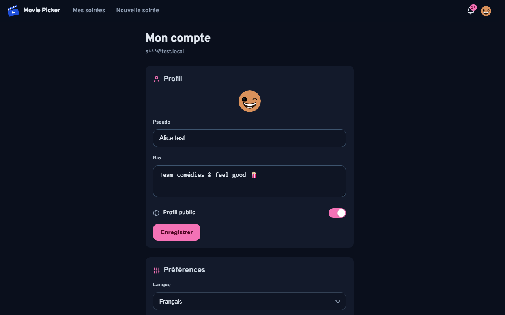

*Figure 5 — **Mon compte** : édition du profil (pseudo, bio, visibilité publique) ; plus bas, préférences de notifications, export RGPD et suppression de compte.*

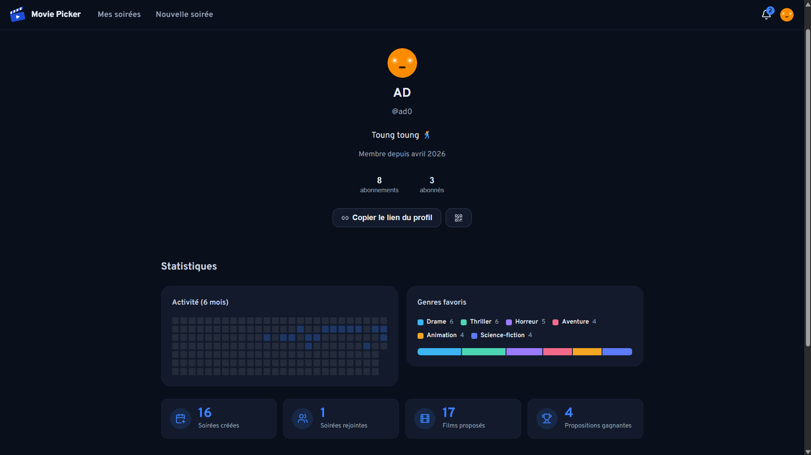

*Figure 6 — **Profil public** (`/u/:handle`) : identité, bio, statistiques d'activité, suivi et partage (lien + QR code).*

### 13.3 — Manuel de mise à jour

- **Dépendances** — **Dependabot** (`.github/dependabot.yml`) : cadence **mensuelle**, PRs **groupées** par écosystème (**npm, GitHub Actions, NuGet, digests Docker**). Chaque PR est validée par la CI avant fusion. Un **scan hebdomadaire** (`security-scan.yml`) capte les CVE divulguées **entre deux cycles Dependabot**. *(Cette démarche de maintenance alimente aussi le maintien en condition opérationnelle — Bloc 4.)*
- **Livraison d'une version** — compléter `CHANGELOG.md` (`[Non publié]` → `[X.Y.Z]`), créer le **tag `vX.Y.Z`** et la **release GitHub**, puis `push` sur `master` → le CD déploie (§5). Numérotation **SemVer**.
- **Correctif urgent (hotfix)** — branche `fix/…` → correctif + test de non-régression → PR → fusion → **version patch** (§11–§12).

### 13.4 — Choix techniques & langages

| Domaine | Choix | Motif (détail §1–§2) |
|---|---|---|
| Front | **TypeScript / React** (Vite, PWA) | Écosystème mûr, typage fort, SPA installable |
| API | **C# / ASP.NET Core .NET 10** | Performance, typage, architecture hexagonale testable (migration depuis Node/Express en 1.0.0) |
| Données | **MongoDB** | Modèle documentaire adapté aux soirées/votes, schéma souple |
| Hébergement | **Cloud Run** (API) + **S3/CloudFront** (front) | *Scale-to-zero*, CDN statique, coût maîtrisé |
| Langues | **FR / EN** (i18n) | Internationalisation dès la V1 |

> **Preuves de la section.** `.env.example` · `.github/dependabot.yml` · `.github/workflows/{ci-cd,rollback,security-scan}.yml` · `apps/api-dotnet/MoviePicker.Api/Configuration/MoviePickerOptions.cs` · `apps/api-dotnet/ToolGenDpKey/` · synthèse fidèle de `archive/docs/v1-produit/deploiement-secrets-ci.md`.

---
