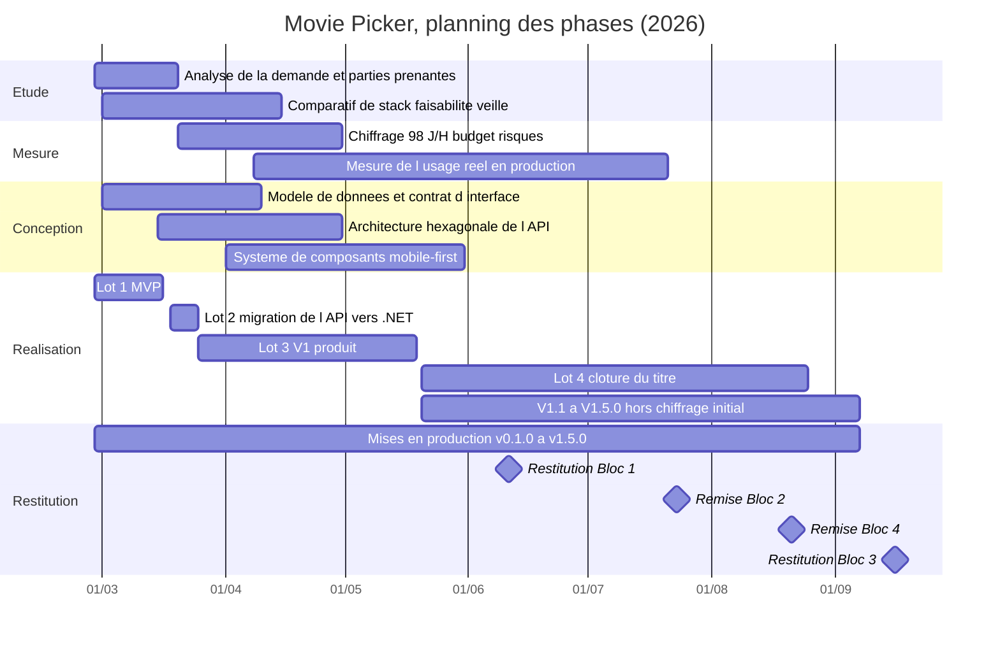

# 01 Planifier l'exécution du projet

> **RNCP 39583 Bloc 3, C3.1, ÉLIMINATOIRE**
>
> **Compétence** : planifier l'exécution du projet en organisant le cadre méthodologique du projet, la répartition et l'ordonnancement des activités, le planning prévisionnel de réalisation et les ressources nécessaires à son exécution afin de coordonner le rôle des différents acteurs.
>
> **Livrable attendu** : une présentation de la méthodologie choisie, le planning détaillé du projet, les ressources nécessaires.
>
> **Critères d'évaluation**
> - Le choix de la méthodologie de gestion de projet est justifié avec les bénéfices attendus.
> - L'outil utilisé pour la planification est argumenté en faisant apparaître les bénéfices attendus.
> - L'outil de planification est compatible avec la méthodologie projet choisie.
> - Le planning est découpé en phases, en tâches ou lots. Il permet de visualiser les phases d'étude, de mesure, de conception, de réalisation, de restitution.
> - Les tâches sont assignées aux membres de l'équipe selon leurs compétences (matrice RACI, RASCI) et tiennent compte des personnes en situation de handicap.
> - Les points de vigilance sont soulignés.

Alimente les diapositives 4 à 9.

**Rappel de posture** : l'exécution a été menée seule, et aucune équipe n'est simulée. La matrice RACI est construite sur les acteurs réels du projet : moi, les agents d'assistance auxquels une partie de l'exécution a été déléguée, le commanditaire, les utilisateurs, les prestataires.

---

## 1. La méthodologie retenue : Kanban léger à revues de version

### 1.1 Le choix

Le projet est piloté en **flux continu** : un travail à faire est décrit dans une fiche, tiré dès qu'une capacité se libère, mené jusqu'à la mise en production, puis consolidé dans une **revue de version** qui matérialise un point de validation avec le commanditaire.

Deux règles structurent ce flux :

| Règle | Contenu |
|-------|---------|
| Limite de travail en cours | Un seul sujet fonctionnel en cours à la fois, hors correctifs de production qui passent devant |
| Critère de sortie | Rien n'est considéré terminé avant d'être déployé en production et vérifié en production |

### 1.2 Les bénéfices attendus, et ce qu'ils ont produit

| Bénéfice attendu | Traduction sur le projet |
|------------------|--------------------------|
| Priorisation permanente plutôt que périmètre figé | Le périmètre a évolué 8 fois sans replanification globale, de la V0.1 à la V1.4 |
| Absence de cérémonie non soutenable | Aucun rituel calibré pour un collectif imposé à une exécution solo : le temps va à la production et à la revue |
| Délai de mise à disposition court | 10 mises en production entre le 27 février et le 7 septembre 2026, soit un point de livraison toutes les 3 semaines en moyenne |
| Réponse rapide à un signal de production | Les anomalies remontées ont été traitées en dehors du flux fonctionnel, sans attendre une fin d'itération |

### 1.3 Les alternatives écartées, et pourquoi

| Méthodologie | Motif d'écartement |
|--------------|--------------------|
| **Scrum** | La valeur de Scrum tient à ses rôles et à ses cérémonies (sprint planning, revue, rétrospective, daily). Sur une exécution à une personne, ces cérémonies deviennent un formalisme sans interlocuteur : on conserve le coût du cadre sans son bénéfice de synchronisation. La notion d'engagement de sprint est par ailleurs incompatible avec un rythme de travail contraint par un calendrier de formation. |
| **Cycle en V** | Il suppose un périmètre spécifié puis figé avant réalisation. Or le produit s'est construit par versions successives nourries de l'usage réel : la V1.4 corrige des hypothèses que les mesures de production ont invalidées. Un cycle en V aurait figé un périmètre avant de disposer de ces mesures. |
| **Kanban outillé complet** (classes de service, métriques de flux, cadence de réapprovisionnement) | Écarté par proportionnalité : l'appareillage statistique d'un Kanban mature (temps de cycle par classe de service, diagramme de flux cumulé) exige un volume de fiches que ce projet n'atteint pas. On conserve les deux règles utiles, on écarte l'instrumentation. |

**Formulation retenue pour l'oral** : « Kanban léger » n'est pas un Kanban dégradé, c'est un Kanban dont l'outillage a été dimensionné à la taille réelle du projet. Le point de vigilance associé est traité en 6.

---

## 2. Les outils de planification

Deux outils, à deux échelles de temps différentes. C'est cette différence d'échelle qui les rend compatibles avec un pilotage en flux.

### 2.1 Le rétroplanning : l'échelle des échéances

| | |
|--|--|
| **Nature** | Planification à rebours depuis les dates non négociables |
| **Points fixes** | Les échéances du titre : oral Bloc 1 le 11 juin 2026, remise Bloc 2 le 23 juillet, remise Bloc 4 le 21 août, oral Bloc 3 le 16 septembre |
| **Bénéfice attendu** | Transformer des dates imposées en dates de fin de lot. Une échéance qui ne bouge pas impose une capacité disponible, donc un périmètre. |
| **Ce qu'il a produit** | Le contenu de chaque version a été arrêté par ce que la capacité restante avant la prochaine échéance permettait de livrer, et non par une liste de souhaits |

### 2.2 Le diagramme de Gantt : l'échelle des phases

| | |
|--|--|
| **Nature** | Représentation des phases et des jalons sur l'axe du temps |
| **Bénéfice attendu** | Rendre visibles deux choses qu'une liste de tâches masque : les **chevauchements** entre phases, et la position des **jalons de version** |
| **Ce qu'il a produit** | La lecture du chevauchement conception / réalisation, qui est la propriété la plus discriminante du pilotage retenu |

### 2.3 La compatibilité avec Kanban

Le point est explicitement demandé par la grille. La réponse tient en une phrase : **les deux outils n'opèrent pas sur le même horizon**.

| Horizon | Outil | Objet |
|---------|-------|-------|
| Le mois et le trimestre | Rétroplanning et Gantt | Où en est-on des phases et des échéances ? |
| La journée et la semaine | Tableau de flux (colonnes, limite de travail en cours) | Que fait-on maintenant, et qu'est-ce qui bloque ? |

Le Gantt ne planifie pas le contenu des fiches, il porte les phases et les jalons. Le tableau de flux ne porte pas d'échéance, il porte l'état d'avancement. La contradiction classique entre Gantt et Kanban naît quand on tente de planifier des tâches individuelles à date fixe dans un flux ; ce n'est pas ce qui est fait ici. Aucune fiche du tableau ne porte de date de fin engagée : seules les **versions** en portent.

---

## 3. Le planning détaillé

### 3.1 Les cinq phases

Le Gantt fait apparaître les cinq phases exigées par la grille. Leur contenu sur ce projet :

| Phase | Période | Contenu |
|-------|---------|---------|
| **Étude** | 27/02 au 15/04/2026 | Analyse de la demande, identification des parties prenantes, étude comparative des stacks, faisabilité technique, veille technologique, hiérarchisation fonctionnelle MoSCoW |
| **Mesure** | 20/03 au 30/04, puis 08/04 au 21/07 | Deux temps. En amont : chiffrage de la charge en jours-homme, budget prévisionnel, cartographie des risques, définition des indicateurs de pilotage. En production : instrumentation et relevé de l'usage réel, qui alimente les arbitrages de la V1.4 |
| **Conception** | 01/03 au 31/05/2026 | Modèle de données, architecture hexagonale de l'API, contrat d'interface, système de composants mobile-first, parcours utilisateur |
| **Réalisation** | 27/02 au 25/08/2026 | Les 4 lots de développement, du socle du MVP à la V1.4 |
| **Restitution** | 27/02 au 16/09/2026 | Deux registres également. Vers l'utilisateur : les 10 mises en production, de la v0.1.0 à la v1.5.0. Vers le commanditaire : les restitutions du titre, oral Bloc 1, dossiers Blocs 2 et 4, oral Bloc 3 |

**Le point à dire à voix haute** : ces phases **se chevauchent**, elles ne se succèdent pas. La conception court jusqu'en mai alors que la réalisation a commencé en février, et la phase de mesure se rouvre en production. C'est précisément ce qu'un cycle en V interdit, et c'est la signature d'un pilotage en flux. Un Gantt dont les barres se suivent sans se recouvrir décrirait un autre projet que celui-ci.

### 3.2 Le diagramme

### 3.3 Les jalons de version

Chaque version est un jalon daté, vérifiable dans le journal des versions et dans l'historique des déploiements.

| Version | Date | Ce qu'elle a mis à disposition |
|---------|------|-------------------------------|
| 0.1.0 | 27/02/2026 | Socle du produit, première soirée créable |
| 1.0.0 | 19/05/2026 | Parcours complet : soirée, partage, proposition, vote, tirage, comptes |
| 1.1.0 | 25/05/2026 | Notifications push et rappels |
| 1.2.0 | 11/06/2026 | Profils publics, dimension sociale, notifications in-app |
| 1.3.0 | 19/06/2026 | États vides, export calendrier, refonte de la navigation |
| 1.3.1 | 08/07/2026 | Consolidation des tests, échelle de notes, optimisations de performance |
| 1.3.2 | 25/07/2026 | Supervision de production, référencement, portes de qualité bloquantes |
| 1.4.0 | 25/08/2026 | Watchlist, intégration Letterboxd, choix manuel du gagnant, flamme de participation, connexion sociale |
| 1.4.1 | 04/09/2026 | Navigation ouverte sans compte, page de découverte bilingue, frictions remontées levées |
| 1.5.0 | 07/09/2026 | Accueil d'exploration ouvert à tous, sagas, sélections thématiques, landing refondue |

### 3.4 Le découpage en lots et la charge

Chiffrage établi au cadrage (Bloc 1) du 20 mars au 30 avril, rétrospectif sur les lots 1 et 2 déjà livrés et prévisionnel sur les lots 3 et 4 ; méthode **analogique** par comparaison entre lots de complexité voisine, marge d'incertitude assumée de 20 % sur les lots de développement.

| Lot | Contenu | Charge |
|-----|---------|-------:|
| **Lot 1, MVP** | Socle monorepo, modèle et API des soirées, intégration du catalogue de films, vote, tirage, interface mobile-first, premier déploiement | 27 J/H |
| **Lot 2, migration de l'API** | Réécriture en ASP.NET Core en architecture hexagonale, tests d'intégration, contrat d'interface, redéploiement conteneurisé | 13 J/H |
| **Lot 3, V1 produit** | Comptes et authentification, réinitialisation de mot de passe, historique, configuration hôte, marqueur déjà vu, cache des affiches, plateformes de diffusion, partage, aperçus de lien, mise à jour en direct, thème, internationalisation, sécurité de la chaîne d'intégration | 35 J/H |
| **Lot 4, clôture du titre** | Cadrage, pilotage, sécurité et accessibilité, recette et tests de bout en bout, procédures d'exploitation et supervision | 23 J/H |
| | **Total** | **98 J/H** |

---

## 4. Les ressources nécessaires

### 4.1 Ressources humaines : une personne, et ce qu'elle délègue

Le projet a été mené par **une seule personne**, qui cumule le développement, l'architecture, l'exploitation et le pilotage. Les 98 J/H du chiffrage sont une charge totale, pas une répartition entre profils : le Bloc 1 les a chiffrés par lot, et c'est par lot qu'ils se lisent.

| Lot | Charge |
|-----|-------:|
| Lot 1, MVP | 27 J/H |
| Lot 2, migration de l'API | 13 J/H |
| Lot 3, V1 produit | 35 J/H |
| Lot 4, clôture du titre | 23 J/H |
| **Total** | **98 J/H** |

Trois autres acteurs sont réels, et ils figurent dans la matrice RACI du § 5 :

| Acteur | Ce qu'il apporte | Depuis quand |
|--------|------------------|--------------|
| **Agents d'assistance au développement** | L'exécution déléguée sous cadre écrit : implémentation, tests, refactorisations, montées de dépendances. **537 des 833 commits** sont co-signés par un agent, soit 64 %, aucun avant le 13 mai 2026, 65 à 84 % par mois ensuite | 13 mai 2026 |
| **Commanditaire** | Le formateur, puis le jury : quatre échéances de restitution, la validation de la conformité au référentiel | Cadrage |
| **Utilisateurs** | 17 comptes : retours, recette informelle, questionnaire de satisfaction | 19 mai 2026, v1.0.0 |

Un agent n'est pas un membre d'équipe : il n'a ni motivation ni progression, et le dire fait partie de la présentation. Ce que sa délégation exige, en revanche, est exactement ce qu'exige une délégation à une personne : un cadre écrit avant, des points d'arrêt aux moments de décision, un contrôle en sortie. Le chapitre 4 en fait la matière du management réel du projet.

### 4.2 Ressources matérielles et techniques

| Famille | Ressource |
|---------|-----------|
| Poste de travail | Un poste de développement par profil, environnement local reproductible, exécution de la chaîne de vérification en local avant toute remontée |
| Outillage de développement | Dépôt unique en monorepo, gestionnaire de paquets et orchestrateur de tâches, environnement de test, analyse statique, formatage automatisé |
| Chaîne de livraison | Intégration continue, analyse de qualité et de sécurité, tests de bout en bout, mesure de performance, déploiement automatisé |
| Hébergement | Exécution conteneurisée de l'API sans serveur, distribution du front par réseau de diffusion de contenu, base de données managée |
| Services tiers | Catalogue de films, envoi d'e-mails transactionnels, supervision des erreurs, mesure d'usage, gestion des secrets |
| Nom de domaine et certificats | Un domaine, certificats gérés automatiquement |

### 4.3 Ressources financières

| Poste | Montant | Nature |
|-------|---------|--------|
| Valeur de développement | 34 300 € HT | 98 J/H au taux journalier junior simulé de 350 €. Coût de trésorerie nul dans le cadre de la formation, cette valeur matérialise l'effort pour le commanditaire |
| Infrastructure récurrente | 0 €/mois aujourd'hui, 1 à 5 €/mois ensuite | Ensemble des services dimensionnés sur leurs paliers gratuits. Seules le stockage et la diffusion du front sortiront du gratuit, à la fin des 12 mois offerts |
| Frais annuels | environ 10 €/an | Nom de domaine |
| Licences | 0 € | Chaîne intégralement en licence libre ou en palier gratuit |
| **Coût réel de trésorerie** | **20 à 190 €/an** | Borne haute atteinte en cas de passage de la base de données au premier palier payant |

Le point à souligner : **aucune licence payante**. C'est une décision de conception et non une conséquence, prise au cadrage sous la contrainte de budget identifiée, et qui conditionne la soutenabilité du service au-delà du titre.

---

## 5. La matrice RACI

Convention : **R** réalise, **A** approuve et rend compte, **C** est consulté, **I** est informé. Les acteurs sont ceux qui ont réellement existé sur le projet.

| Activité | Moi | Agents IA | Commanditaire | Utilisateurs | Prestataires |
|----------|:---:|:---------:|:-------------:|:------------:|:------------:|
| Cadrage et périmètre de version | A, R | I | C | C | |
| Architecture applicative | A, R | C | I | | |
| Modèle de données et contrat d'interface | A, R | C | | | |
| Développement de l'interface | A | R | | I | |
| Développement de l'API | A | R | | | |
| Intégration des services tiers | A | R | | | C |
| Accessibilité et inclusion | A, R | R | | C | |
| Chaîne d'intégration et de déploiement | A, R | C | | | |
| Supervision et exploitation | A, R | I | I | | R |
| Sécurité applicative | A, R | C | I | | |
| Recette et tests de bout en bout | A, R | R | C | C | |
| Arbitrage de périmètre ou de charge | A, R | | C | C | |
| Mise en production | A, R | | I | I | R |
| Restitution et compte rendu | A, R | | C | I | |

Trois propriétés de cette matrice, à dire explicitement :

1. **Le A est toujours le mien.** À une personne, la matrice ne répartit pas la responsabilité : elle rend visible ce qui est délégué et ce qui ne l'est jamais. Cadrage, arbitrage, mise en production et restitution ne portent aucun R en dehors de ma colonne.
2. **Le R des agents dit ce qui est délégué, et sous quel contrôle.** Développement, tests, intégration des services tiers : chaque ligne où un agent réalise porte aussi mon A sur la ligne « recette et tests », c'est-à-dire un contrôle en sortie. Un R sans ce contrôle serait de l'abandon, pas de la délégation.
3. **Les acteurs externes figurent dans la matrice.** Le commanditaire est consulté sur le périmètre et les arbitrages, informé des mises en production ; les utilisateurs sont consultés sur l'accessibilité, la recette et chaque version ; les prestataires exécutent l'hébergement et la supervision. Un acteur absent de la matrice est un acteur qu'on oubliera de solliciter.

### 5.1 Prise en compte du handicap

Le critère est explicitement demandé par la grille. Il est traité à trois niveaux, et le premier commence par la vérité : **personne en situation de handicap n'a travaillé sur le projet.**

**Au niveau de l'affectation.** La ligne « accessibilité et inclusion » de la matrice porte un responsable identifié, moi, et un réalisateur, les agents qui écrivent et exécutent les tests d'accessibilité. Aucune activité de la matrice ne présuppose une capacité physique particulière : tout le travail du projet est écrit, versionné et asynchrone.

**Au niveau de l'organisation.** Ce qui est en place le permettrait sans réunion ni présence : le contexte du projet est intégralement en texte structuré, lisible au lecteur d'écran et au clavier, et aucun dispositif n'exige la simultanéité. Pour une personne en situation de handicap qui rejoindrait le projet, les aménagements seraient accordés à la demande et sans justification médicale à produire : poste adapté, outillage compatible lecteur d'écran et navigation exclusivement au clavier, télétravail et horaires aménagés, temps supplémentaire sur les activités de recette et de formation. C'est un engagement, pas un fait : il n'a jamais eu à s'appliquer.

**Au niveau du produit lui-même.** C'est le niveau vérifiable. L'accessibilité est traitée comme une exigence de conformité et non comme une option d'amélioration : elle figure dans la matrice avec un réalisateur et un approbateur, elle est vérifiée automatiquement à chaque livraison par une porte de qualité **bloquante**, et la mesure d'accessibilité du produit est à son maximum sur l'ensemble des écrans. Livrer un produit inaccessible et se dire inclusif ne tiendrait pas.

---

## 6. Les points de vigilance

Sept points, chacun avec son indicateur de contrôle et sa parade. Les deux premiers sont structurels, les cinq suivants sont techniques.

| # | Point de vigilance | Ce qu'il menace | Indicateur de contrôle | Parade |
|:-:|--------------------|-----------------|------------------------|--------|
| 1 | **Concentration des rôles sur une personne** | La continuité du projet. Un seul acteur détient la connaissance de l'architecture, des accès et des procédures | Nombre de personnes capables de mener une mise en production, aujourd'hui 1 | Procédures d'exploitation écrites et versionnées, infrastructure décrite en code, décisions d'architecture consignées. C'est tout ce qu'un remplaçant recevrait le premier jour |
| 2 | **Sous-estimation des lots documentaires** | Le calendrier du titre. Les lots de documentation sont les plus difficiles à chiffrer par analogie, faute de comparable | Écart entre charge prévue et charge consommée sur le lot de clôture | Rétroplanning à rebours depuis les échéances de restitution, périmètre de version ajusté sur la capacité restante |
| 3 | **Dépendance au catalogue de films externe** | Le cœur du produit. Une rupture de contrat, un changement de conditions d'usage ou un dépassement de quota rend la recherche de films inopérante | Taux d'erreur des appels au catalogue | Cache des affiches et des métadonnées avec durée de vie, limitation du débit de recherche, repli de saisie manuelle |
| 4 | **Transport des e-mails transactionnels** | La réinitialisation de mot de passe et les invitations. Le palier gratuit du service d'envoi plafonne le volume quotidien | Volume d'e-mails envoyés par jour rapporté au plafond | Envoi limité aux messages indispensables, surveillance du volume, fournisseur substituable derrière un port applicatif |
| 5 | **Durcissement de la politique de sécurité du contenu** | L'affichage. Un durcissement mal calibré bloque silencieusement des ressources légitimes, ce qui s'est produit en production sur les affiches et les avatars | Vérification visuelle après chaque modification de la politique, sondes de disponibilité | Inventaire des domaines externes tenu à jour, vérification obligatoire de l'affichage avant mise en production |
| 6 | **Absence de déploiement progressif** | La disponibilité au moment d'une mise en production. Une révision défectueuse est exposée à tous les utilisateurs en même temps | Résultat du test de fumée post-déploiement, taux d'erreur serveur | Arbitrage assumé et réversible : test de fumée bloquant, vérification de la joignabilité de la base avant bascule, retour arrière par redéploiement de la révision précédente |
| 7 | **Instabilité de la chaîne de vérification** | La cadence de livraison. Un contrôle intermittent qui échoue sans cause réelle érode la confiance dans la chaîne et pousse à la contourner | Taux d'échec de la chaîne sur la branche principale, part des échecs sans cause réelle | Contrôle de performance rendu déterministe par médiane de trois exécutions, seuils recalibrés, exécution de la chaîne en local avant remontée |

**La phrase de conclusion du chapitre** : le point 1 est celui qui compte. Les six autres sont des risques de projet, celui-là est un risque d'organisation, et la seule parade réelle est d'écrire tout ce qu'un remplaçant devrait savoir : la parade ne le supprime pas, elle le rend survivable.

---

## 7. Rattachement aux diapositives

| Diapo | Titre | Section source |
|:-----:|-------|----------------|
| 4 | Planifier : un flux, deux horizons (méthodologie et outils) | 1, 2 |
| 5 | Le planning en cinq phases | 3.1, 3.2 |
| 6 | Quatre lots, 98 jours-homme | 3.3, 3.4 |
| 7 | Les ressources nécessaires : une personne, et ce qu'elle délègue | 4 |
| 8 | La matrice RACI, avec les acteurs réels | 5 |
| 9 | Sept points de vigilance, un seul d'organisation | 6 |

## 8. Questions probables sur ce chapitre

| Question | Ligne de réponse |
|----------|------------------|
| Vos documents de cadrage sont datés de juin, votre phase d'étude de février. Comment l'expliquez-vous ? | Les décisions d'étude, comparatif de stack, périmètre MoSCoW, faisabilité, ont été prises en février et mars et sont tracées dans l'historique du dépôt et dans les choix techniques eux-mêmes. Leur **formalisation documentaire** est intervenue en juin pour la restitution du Bloc 1. La décision précède le document, ce qui est une faiblesse de traçabilité assumée et corrigée depuis, les arbitrages étant désormais consignés au moment où ils sont pris |
| Comment avez-vous estimé les 98 J/H ? | Méthode analogique, par comparaison entre lots de complexité voisine, avec une marge d'incertitude de 20 % assumée au chiffrage. Aucune méthode paramétrique n'était applicable faute d'historique de projets comparables |
| Un Gantt n'est-il pas contradictoire avec Kanban ? | Ils n'opèrent pas au même horizon. Le Gantt porte les phases et les jalons de version, le tableau de flux porte le travail de la semaine. Aucune fiche du tableau ne porte de date de fin engagée, seules les versions en portent |
| Une matrice RACI à une personne, à quoi sert-elle ? | À rendre visible ce qui est délégué et sous quel contrôle. Le A ne bouge pas ; l'information est dans la colonne des agents, et dans les lignes qui n'en portent aucun : cadrer, arbitrer, mettre en production, rendre compte. Le jour où une personne rejoint le projet, la matrice est déjà écrite |
| La prise en compte du handicap n'est-elle pas une clause de style ? | Elle porte un responsable identifié dans la matrice, des aménagements nommés et accordés sans justification à produire, et une exigence d'accessibilité du produit vérifiée automatiquement à chaque livraison, à son niveau maximum sur tous les écrans |
