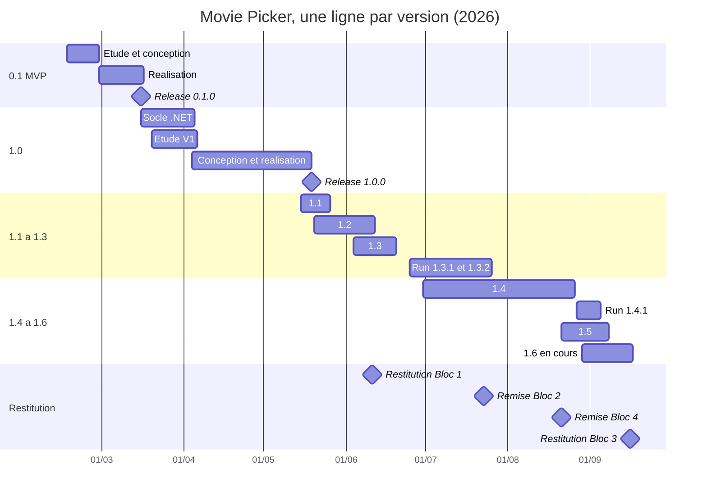

# 01 Planifier l'exécution du projet

> **RNCP 39583 Bloc 3, C3.1, ÉLIMINATOIRE**
>
> **Compétence** : planifier l'exécution du projet en organisant le cadre méthodologique du projet, la répartition et l'ordonnancement des activités, le planning prévisionnel de réalisation et les ressources nécessaires à son exécution afin de coordonner le rôle des différents acteurs.
>
> **Livrable attendu** : une présentation de la méthodologie choisie, le planning détaillé du projet, les ressources nécessaires.
>
> **Critères d'évaluation**
> - Le choix de la méthodologie de gestion de projet est justifié avec les bénéfices attendus.
> - L'outil utilisé pour la planification est argumenté en faisant apparaître les bénéfices attendus.
> - L'outil de planification est compatible avec la méthodologie projet choisie.
> - Le planning est découpé en phases, en tâches ou lots. Il permet de visualiser les phases d'étude, de mesure, de conception, de réalisation, de restitution.
> - Les tâches sont assignées aux membres de l'équipe selon leurs compétences (matrice RACI, RASCI) et tiennent compte des personnes en situation de handicap.
> - Les points de vigilance sont soulignés.

Alimente les diapositives 4 à 8.

**Rappel de posture** : le projet a été mené par une seule personne, sur son temps libre, et aucune équipe n'est simulée. Cette personne porte quatre rôles tour à tour, chef de projet, product owner, développeur, DevOps, et la matrice RACI est écrite sur ces rôles et sur les trois acteurs réels qui entourent le projet : le commanditaire, les utilisateurs, les prestataires.

---

## 1. La méthodologie retenue : un cycle en V par version, un flux pour le run

### 1.1 Le choix

Le projet est piloté en deux régimes, parce qu'il a deux natures de travail.

**Les fonctionnalités suivent un cycle en V, une version à la fois.** Chaque version 1.x est un lot fermé : un objectif, une liste d'items tirés de la roadmap, une taille par item. Chaque item descend la branche gauche du V puis remonte la droite, et chaque niveau de gauche est vérifié par son vis-à-vis de droite.

| Branche gauche | Branche droite, qui la vérifie |
|----------------|--------------------------------|
| **Cadrage** de la version : objectif, items, tailles S à XL dans la roadmap | **Livraison** : release datée, notes de version, fenêtre de nouveautés dans l'application |
| **Conception** de l'item : questions de cadrage, maquette si l'écran est nouveau, contrat d'API | **Validation** : test manuel sur les deux serveurs, go explicite avant la fusion |
| **Réalisation** : test écrit avant le code, une branche par feature dans la branche de version | **Vérification** : revue de code, `verify:local` en quatorze étapes, chaîne d'intégration |

**Le run suit un flux, hors version.** Un signal de production (Sentry, sonde de disponibilité) ou d'un utilisateur (fiche « Signaler un problème », questionnaire) devient une fiche étiquetée avec sa sévérité, une branche `fix/` fusionnée directement sur master, et une version corrective : 1.3.1, 1.3.2, 1.4.1. Il ne passe pas par le V, et c'est voulu : une anomalie ne doit pas attendre la version suivante.

### 1.2 Les bénéfices attendus, et ce qu'ils ont produit

| Bénéfice attendu | Traduction sur le projet |
|------------------|--------------------------|
| Un périmètre figé par version, donc un livrable daté | 10 versions publiées du 27 février au 7 septembre 2026, chacune avec sa release, ses notes et son étiquette sur le commit exact |
| Une vérification qui répond à chaque niveau de conception | Aucune fonctionnalité fusionnée sans test écrit avant, sans revue, sans go après test manuel : la chaîne a 14 contrôles bloquants |
| Un correctif qui n'attend pas la version suivante | Anomalie de production ouverte et corrigée le 24 juillet, livrée en 1.3.2 le 25 ; les retours du 9 septembre corrigés le 10 |
| Une mesure qui nourrit le cadrage suivant | La 1.4 a été cadrée sur l'usage réel de la 1.3.2 ; la 1.4.1 sur le questionnaire du 18 août |

### 1.3 Les alternatives écartées, et pourquoi

| Méthodologie | Motif d'écartement |
|--------------|--------------------|
| **Scrum** | Sa valeur tient à ses rôles et à ses cérémonies : sprint planning, revue, rétrospective, daily. À une personne, ces cérémonies deviennent un formalisme sans interlocuteur. On conserve le découpage en lots et la revue, on écarte les rituels et l'engagement de sprint, incompatible avec un projet mené sur le temps libre. |
| **Cycle en V intégral** | Un seul V sur sept mois aurait figé en février un périmètre que les mesures de production ont corrigé en août : la V1.4 reprend des hypothèses invalidées par l'usage réel. Le V est gardé, mais à l'échelle d'une version, pour que la mesure de l'une cadre la suivante. |
| **Kanban seul** | Un flux sans lot ne produit pas de livrable daté : pas de version, pas de notes, pas de point de validation avec le commanditaire. Il est gardé pour ce qu'il fait bien, le run, et pas pour les fonctionnalités. |

**Formulation retenue pour l'oral** : « un cycle en V pour chaque version, un flux pour le run ». Le point de vigilance associé est traité en 6.

---

## 2. Les outils de planification

Trois outils, à deux échelles. C'est cette différence d'échelle qui les rend compatibles entre eux et avec la méthode.

### 2.1 Le board GitHub Projects : l'échelle des tickets

| | |
|--|--|
| **Nature** | Un ticket par item de roadmap, produit et technique, avec trois champs : la version, la taille (S à XL), la phase |
| **Colonnes** | Backlog, Cadrage, Maquette, Dev, Revue et tests, Recette, Livré : **les colonnes sont les phases du V**, un ticket ne saute pas de colonne |
| **Bénéfice attendu** | Voir en un écran ce qui est cadré, en cours et livré, sans double saisie, dans la plateforme où le code, les branches, les pull requests et les releases vivent |
| **Ce qu'il porte** | 152 tickets au 11 septembre 2026 : 124 produit, 28 techniques, dont 97 livrés, 9 en cadrage pour la 1.6 et la 1.7, 45 au backlog |

### 2.2 Le rétroplanning : l'échelle des échéances

| | |
|--|--|
| **Nature** | Planification à rebours depuis les dates non négociables |
| **Points fixes** | Les échéances du titre : oral Bloc 1 le 11 juin 2026, remise Bloc 2 le 23 juillet, remise Bloc 4 le 21 août, oral Bloc 3 le 16 septembre |
| **Bénéfice attendu** | Transformer une date imposée en date de fin de version : la 1.2 sort le 11 juin, la 1.4 le 25 août, quatre jours après le Bloc 4. Une échéance qui ne bouge pas impose une capacité, donc un périmètre |

### 2.3 Le diagramme de Gantt : l'échelle des versions

| | |
|--|--|
| **Nature** | Une ligne par version, chaque ligne découpée en conception, réalisation, restitution et mesure ; l'étude, le cadrage dans la roadmap, se dit |
| **Bénéfice attendu** | Rendre visibles les **chevauchements** : l'étude de la version suivante pendant la mesure de la précédente, et la position des releases par rapport aux échéances |

### 2.4 La compatibilité avec la méthode

Le point est explicitement demandé par la grille. La réponse tient en deux phrases : **les colonnes du board sont les phases du V**, donc l'outil de suivi des tickets et la méthode décrivent le même parcours ; et **le Gantt et le rétroplanning placent les versions, pas les tickets**, donc ils n'entrent pas en contradiction avec le flux du run, qui ne porte pas de date.

| Horizon | Outil | Objet |
|---------|-------|-------|
| Le trimestre | Rétroplanning depuis les échéances du titre | Quelle version sort avant quelle date ? |
| Le mois | Gantt des versions | Où en est chaque version dans ses cinq phases ? |
| La semaine | Board GitHub Projects | Quel ticket est dans quelle phase, et qu'est-ce qui bloque ? |

---

## 3. Le planning détaillé

### 3.1 Les cinq phases, par version

Le planning fait apparaître les cinq phases exigées par la grille, mais **à l'intérieur de chaque version** : c'est ce qui distingue un V par version d'un cycle en V unique.

| Phase | Ce qu'elle contient sur ce projet | Où elle se lit |
|-------|-----------------------------------|----------------|
| **Étude** | Le cadrage de la version dans la roadmap : objectif, items retenus, tailles. Il commence pendant que la version précédente est en production | Historique des fichiers de roadmap |
| **Conception** | Les questions de cadrage de chaque item, la maquette quand l'écran est nouveau, le contrat d'API | Branche de version ouverte, premiers commits de contrat |
| **Réalisation** | La branche de version reçoit une branche par feature ; une feature tient en un à trois jours | Historique des branches et des fusions |
| **Restitution** | La release : étiquette sur le commit déployé, notes de version, fenêtre de nouveautés dans l'application | Releases et journal des versions |
| **Mesure** | La version vit en production : sondes, erreurs, usage, retours des utilisateurs. Elle alimente l'étude de la version suivante | Supervision, questionnaire, fiches |

Les dates retenues, arrondies à la semaine :

| Version | Étude | Conception | Réalisation | Restitution | Mesure |
|---------|-------|------------|-------------|-------------|--------|
| 0.1, MVP | 16 au 22/02 | 23 au 27/02 | 28/02 au 16/03 | 16/03 | 17 et 18/03 |
| 1.0, socle .NET | 16 et 17/03 | 18/03 | 18 et 19/03 | 19/03 | 20/03 au 04/04 |
| 1.0, V1 produit | 20/03 au 05/04 | 04 au 08/04 | 07/04 au 18/05 | 19/05 | 20 au 25/05 |
| 1.1 | 15 au 17/05 | 18 et 19/05 | 20 au 24/05 | 25/05 | 26/05 au 11/06 |
| 1.2 | 20 au 25/05 | 26 au 28/05 | 27/05 au 10/06 | 11/06 | 12 au 19/06 |
| 1.3 | 04 au 08/06 | 09 au 11/06 | 11 au 18/06 | 19/06 | 20/06 au 08/07 |
| 1.3.1 et 1.3.2, run | | | 25/06 au 07/07, 09 au 24/07 | 08/07, 25/07 | 26/07 au 25/08 |
| 1.4 | 30/06 au 16/07 | 17 au 31/07 | 05 au 24/08 | 25/08 | 26/08 au 04/09 |
| 1.4.1, run | | | 27/08 au 03/09 | 04/09 | |
| 1.5 | 21 au 28/08 | 01 au 03/09 | 04 au 06/09 | 07/09 | 08 au 16/09 |
| 1.6, en cours | 29/08 au 04/09 | 08/09 | depuis le 09/09 | | |

**Le point à dire à voix haute** : les lignes **se chevauchent**. L'étude de la 1.4 court de fin juin à mi-juillet pendant que la 1.3 est mesurée en production ; celle de la 1.5 commence fin août pendant la mesure de la 1.4. Un seul V sur sept mois aurait figé en février ce que la production a corrigé en août. Les versions correctives n'ont ni étude ni conception : elles sont le run en flux.

### 3.2 Le diagramme

### 3.3 Les jalons de version

Chaque version est un jalon daté, vérifiable dans le journal des versions et dans les releases.

| Version | Date | Ce qu'elle a mis à disposition |
|---------|------|-------------------------------|
| 0.1.0 | 27/02/2026 | Socle du produit, première soirée créable |
| 1.0.0 | 19/05/2026 | Parcours complet : soirée, partage, proposition, vote, tirage, comptes |
| 1.1.0 | 25/05/2026 | Notifications push et rappels |
| 1.2.0 | 11/06/2026 | Profils publics, dimension sociale, notifications in-app |
| 1.3.0 | 19/06/2026 | États vides, export calendrier, refonte de la navigation |
| 1.3.1 | 08/07/2026 | Consolidation des tests, échelle de notes, optimisations de performance |
| 1.3.2 | 25/07/2026 | Supervision de production, référencement, portes de qualité bloquantes |
| 1.4.0 | 25/08/2026 | Watchlist, intégration Letterboxd, choix manuel du gagnant, flamme de participation, connexion sociale |
| 1.4.1 | 04/09/2026 | Navigation ouverte sans compte, page de découverte bilingue, frictions remontées levées |
| 1.5.0 | 07/09/2026 | Accueil d'exploration ouvert à tous, sagas, sélections thématiques, landing refondue |

### 3.4 Les lots : les versions, et leur effort réel

Les lots sont les versions. Chacune est un lot fermé, avec ses items et leur taille, et son effort se lit dans l'historique.

| Version | Items livrés | Jours actifs | Commits | Fenêtre |
|---------|-------------:|-------------:|--------:|---------|
| 0.1, MVP | 7 | 2 | 5 | 27/02 au 16/03 |
| 1.0, V1 | 16, plus le socle .NET | 21 | 197 | 17/03 au 19/05 |
| 1.1 | 8 | 2 | 22 | 20 au 25/05 |
| 1.2 | 8 | 14 | 145 | 26/05 au 11/06 |
| 1.3 | 11 | 5 | 37 | 12 au 19/06 |
| 1.3.1 et 1.3.2, run | chaîne, sécurité, supervision | 19 | 259 | 20/06 au 25/07 |
| 1.4 | 10 | 19 | 127 | 26/07 au 25/08 |
| 1.4.1, run | 1, plus les retours | 5 | 37 | 26/08 au 04/09 |
| 1.5 | 14 | 3 | 67 | 05 au 07/09 |
| **Total au 7 septembre, v1.5.0** | **75** | **90** | **896** | 833 commits et 88 jours au relevé du 5 septembre du chapitre 2 |

Une feature tient en un à trois jours : l'intégration Letterboxd, de taille XL, du 9 au 11 août ; la connexion sociale, L, le 12 août ; la refonte de la page soirée, L, le 18 août. Une version tient en une à trois semaines de réalisation.

Le chiffrage du cadrage, 98 jours-homme sur quatre lots (MVP 27, migration 13, V1 produit 35, clôture du titre 23), est celui du dossier du Bloc 1, établi par méthode analogique avec une marge de 20 %. Il sert de référence à l'écart prévisionnel / réel du chapitre 2, pas de découpage ici.

---

## 4. Les ressources nécessaires

### 4.1 Ressources humaines : une personne, quatre rôles, trois acteurs autour

Le projet a été mené par **une seule personne, sur son temps libre, soirs et week-ends**. Elle porte quatre rôles tour à tour, et c'est sur ces rôles que les activités sont affectées dans la matrice RACI du § 5 :

| Rôle | Ce qu'il porte | Ce qu'il exige |
|------|----------------|----------------|
| **Chef de projet** | Les versions et leur date, les arbitrages, les restitutions au commanditaire | Chiffrer, décider, rendre compte |
| **Product owner** | Le cadrage des items, la priorisation de la roadmap, la recette, les retours des utilisateurs | Porter le besoin, tester du point de vue de l'utilisateur |
| **Développeur front et back** | La conception, le code, les tests, la revue | React et TypeScript, C# et ASP.NET Core, architecture hexagonale, accessibilité |
| **DevOps** | La chaîne d'intégration et de déploiement, la mise en production, la supervision, la sécurité | Conteneurs, exécution sans serveur, sondes et alertes, veille de vulnérabilités |

Trois autres acteurs sont réels, et ils figurent dans la matrice :

| Acteur | Ce qu'il apporte | Depuis quand |
|--------|------------------|--------------|
| **Commanditaire** | Le formateur, puis le jury : quatre échéances de restitution, la validation de la conformité au référentiel | Cadrage |
| **Utilisateurs** | 17 comptes : retours, recette informelle, questionnaire de satisfaction | 19 mai 2026, v1.0.0 |
| **Prestataires** | L'hébergement, le catalogue de films, le transport des e-mails, la supervision : des services exécutés par des tiers, sous contrat d'usage | 27 février 2026 |

Aucun acteur intermédiaire n'est ajouté : tout ce qui n'est pas exécuté par un prestataire l'a été par une personne, et le chapitre 4 montre comment cette personne a affecté ses missions dans le temps et à l'automatisation.

### 4.2 Ressources matérielles et techniques

| Famille | Ressource |
|---------|-----------|
| Poste de travail | Un poste de développement, un téléphone pour tester le mobile et jouer le second appareil de la démonstration, environnement local reproductible |
| Assistant de code | Claude Code, abonnement Max : un outil, au même titre que l'IDE. Il ne décide rien, la revue et la recette restent à la main |
| Outillage de développement | Dépôt unique en monorepo, gestionnaire de paquets et orchestrateur de tâches, environnement de test, analyse statique, formatage automatisé |
| Chaîne de livraison | Intégration continue, analyse de qualité et de sécurité, tests de bout en bout, mesure de performance, déploiement automatisé : 18 jobs, 14 bloquants |
| Hébergement | Exécution conteneurisée de l'API sans serveur, distribution du front par réseau de diffusion de contenu, base de données managée |
| Services tiers | Catalogue de films, envoi d'e-mails transactionnels, supervision des erreurs, mesure d'usage, gestion des secrets |
| Nom de domaine et certificats | Un domaine, certificats gérés automatiquement |

### 4.3 Ressources financières, réelles

Le projet n'a coûté que ses outils. Aucun salaire n'est versé ni valorisé : le temps est celui de son auteur.

| Poste | Montant | Nature |
|-------|---------|--------|
| Temps de développement | 0 € | Temps libre de l'auteur, soirs et week-ends. Aucune valorisation |
| Assistant de code | 100 €/mois depuis juin 2026, 300 € à ce jour | Abonnement Claude Max, le seul poste récurrent du projet |
| Nom de domaine | ≈ 10 €/an | `movie-picker.fr` |
| Hébergement, base, e-mails, supervision, chaîne | 0 €/mois | Tous les services dans leur palier gratuit ; l'hébergement du front sortira du gratuit à la fin des 12 mois offerts, 1 à 5 €/mois |
| Licences | 0 € | Chaîne intégralement en licence libre ou en palier gratuit |
| **Engagé à ce jour** | **≈ 310 €** | Sur sept mois de projet |

Le point à souligner : **aucune licence payante**. C'est une décision de conception et non une conséquence, prise au cadrage sous la contrainte de budget identifiée, et qui conditionne la soutenabilité du service au-delà du titre. Deux échéances de coût sont suivies au tableau de bord du chapitre 2 : la fin des 12 mois gratuits du front, et le passage éventuel de la base au premier palier payant.

---

## 5. La matrice RACI

Convention : **R** réalise, **A** approuve et rend compte, **C** est consulté, **I** est informé. Les quatre premières colonnes sont les rôles portés par une même personne ; les trois dernières sont les acteurs qui ont réellement existé sur le projet.

| Activité | Chef de projet | Product owner | Développeur | DevOps | Commanditaire | Utilisateurs | Prestataires |
|----------|:--------------:|:-------------:|:-----------:|:------:|:-------------:|:------------:|:------------:|
| Cadrage et périmètre de version | C | A, R | | | C | C | |
| Architecture applicative | I | | A, R | C | I | | |
| Modèle de données et contrat d'interface | | C | A, R | | | | |
| Développement de l'interface | | A | R | | | I | |
| Développement de l'API | | A | R | | | | |
| Revue, tests et intégration | | | R | A | | | |
| Intégration des services tiers | | | A, R | C | | | C |
| Accessibilité et inclusion | | A | R | | | C | |
| Chaîne d'intégration et de déploiement | | | I | A, R | | | |
| Supervision et exploitation | I | | | A, R | | | R |
| Sécurité applicative | | | R | A | I | | |
| Recette et tests de bout en bout | | A | R | | C | C | |
| Arbitrage de périmètre ou de charge | A, R | C | C | | C | C | |
| Mise en production | A | | | R | I | I | R |
| Restitution et compte rendu | A, R | C | | | C | I | |

Trois propriétés de cette matrice, à dire explicitement :

1. **L'affectation suit la compétence que l'activité exige.** Le product owner approuve le cadrage et la recette parce qu'il porte le besoin ; le développeur réalise et approuve l'architecture ; le DevOps approuve l'intégration et réalise la mise en production ; le chef de projet arbitre et approuve la mise en production. Quand une ligne porte un A et un R différents, la même personne change de casquette entre la décision et le geste : c'est ce qui rend la revue possible à une personne.
2. **La matrice est écrite pour le jour où une personne rejoint le projet.** La colonne Développeur est celle qu'on confierait en premier, puis DevOps ; la ligne « revue, tests et intégration » est celle qui changerait en premier, et c'est la faiblesse que la grille de compétences du chapitre 5 désigne.
3. **Les acteurs externes figurent dans la matrice.** Le commanditaire est consulté sur le périmètre et les arbitrages, informé des mises en production ; les utilisateurs sont consultés sur l'accessibilité, la recette et chaque version ; les prestataires exécutent l'hébergement et la supervision. Un acteur absent de la matrice est un acteur qu'on oubliera de solliciter.

### 5.1 Prise en compte du handicap

Le critère est explicitement demandé par la grille. Il est traité à trois niveaux, et le premier commence par la vérité : **personne en situation de handicap n'a travaillé sur le projet.**

**Au niveau de l'affectation.** La ligne « accessibilité et inclusion » de la matrice porte un approbateur, le product owner, un réalisateur, le développeur, et les utilisateurs y sont consultés. Aucune activité de la matrice ne présuppose une capacité physique particulière : tout le travail du projet est écrit, versionné et asynchrone.

**Au niveau de l'organisation.** Ce qui est en place le permettrait sans réunion ni présence : le contexte du projet est intégralement en texte structuré, lisible au lecteur d'écran et au clavier, et aucun dispositif n'exige la simultanéité. Pour une personne en situation de handicap qui rejoindrait le projet, les aménagements seraient accordés à la demande et sans justification médicale à produire : poste adapté, outillage compatible lecteur d'écran et navigation exclusivement au clavier, télétravail et horaires aménagés, temps supplémentaire sur les activités de recette et de formation. C'est un engagement, pas un fait : il n'a jamais eu à s'appliquer.

**Au niveau du produit lui-même.** C'est le niveau vérifiable. L'accessibilité est traitée comme une exigence de conformité et non comme une option d'amélioration : elle figure dans la matrice avec un réalisateur et un approbateur, elle est vérifiée automatiquement à chaque livraison par une porte de qualité **bloquante**, et la mesure d'accessibilité du produit est à son maximum sur l'ensemble des écrans. Livrer un produit inaccessible et se dire inclusif ne tiendrait pas.

---

## 6. Les points de vigilance

Sept points, chacun avec son indicateur de contrôle et sa parade. Le premier est un risque d'organisation, les six autres sont des risques de projet, dont cinq techniques.

| # | Point de vigilance | Ce qu'il menace | Indicateur de contrôle | Parade |
|:-:|--------------------|-----------------|------------------------|--------|
| 1 | **Concentration des rôles sur une personne** | La continuité du projet. Un seul acteur détient la connaissance de l'architecture, des accès et des procédures | Nombre de personnes capables de mener une mise en production, aujourd'hui 1 | Procédures d'exploitation écrites et versionnées, infrastructure décrite en code, décisions d'architecture consignées, matrice RACI par rôle. C'est tout ce qu'un remplaçant recevrait le premier jour |
| 2 | **Sous-estimation des lots documentaires** | Le calendrier du titre. Les lots de documentation sont les plus difficiles à chiffrer par analogie, faute de comparable | Écart entre charge prévue et charge consommée sur le lot de clôture | Rétroplanning à rebours depuis les échéances de restitution, périmètre de version ajusté sur la capacité restante |
| 3 | **Dépendance au catalogue de films externe** | Le cœur du produit. Une rupture de contrat, un changement de conditions d'usage ou un dépassement de quota rend la recherche de films inopérante | Taux d'erreur des appels au catalogue | Cache des affiches et des métadonnées avec durée de vie, limitation du débit de recherche, repli de saisie manuelle |
| 4 | **Transport des e-mails transactionnels** | La réinitialisation de mot de passe et les invitations. Le palier gratuit du service d'envoi plafonne le volume quotidien | Volume d'e-mails envoyés par jour rapporté au plafond | Envoi limité aux messages indispensables, surveillance du volume, fournisseur substituable derrière un port applicatif |
| 5 | **Durcissement de la politique de sécurité du contenu** | L'affichage. Un durcissement mal calibré bloque silencieusement des ressources légitimes, ce qui s'est produit en production sur les affiches et les avatars | Vérification visuelle après chaque modification de la politique, sondes de disponibilité | Inventaire des domaines externes tenu à jour, vérification obligatoire de l'affichage avant mise en production |
| 6 | **Absence de déploiement progressif** | La disponibilité au moment d'une mise en production. Une révision défectueuse est exposée à tous les utilisateurs en même temps | Résultat du test de fumée post-déploiement, taux d'erreur serveur | Arbitrage assumé et réversible : test de fumée bloquant, vérification de la joignabilité de la base avant bascule, retour arrière par redéploiement de la révision précédente |
| 7 | **Instabilité de la chaîne de vérification** | La cadence de livraison. Un contrôle intermittent qui échoue sans cause réelle érode la confiance dans la chaîne et pousse à la contourner | Taux d'échec de la chaîne sur la branche principale, part des échecs sans cause réelle | Contrôle de performance rendu déterministe par médiane de trois exécutions, seuils recalibrés, exécution de la chaîne en local avant remontée |

**La phrase de conclusion du chapitre** : le point 1 est celui qui compte. Les six autres sont des risques de projet, celui-là est un risque d'organisation, et la seule parade réelle est d'écrire tout ce qu'un remplaçant devrait savoir : la parade ne le supprime pas, elle le rend survivable.

---

## 7. Rattachement aux diapositives

| Diapo | Titre | Section source |
|:-----:|-------|----------------|
| 4 | Planifier : un V par version, un flux pour le run | 1, 2 |
| 5 | Le planning : une ligne par version | 3.1, 3.2 |
| 6 | Sept versions en lots, et les ressources réelles | 3.3, 3.4, 4 |
| 7 | La matrice RACI : quatre rôles, une personne | 5 |
| 8 | Sept points de vigilance, un seul d'organisation | 6 |

## 8. Questions probables sur ce chapitre

| Question | Ligne de réponse |
|----------|------------------|
| Un cycle en V et de l'agilité, n'est-ce pas contradictoire ? | Non, parce qu'ils ne portent pas sur le même travail. Le V s'applique à une version, un lot fermé avec des items connus, où chaque niveau de conception a sa vérification en face. Le flux s'applique au run, aux anomalies et aux retours, qui n'ont pas à attendre une version. Le V est à l'échelle d'une version, pas du projet : c'est la mesure de l'une qui cadre la suivante |
| Comment le board est-il compatible avec la méthode ? | Ses colonnes sont les phases du V : cadrage, maquette, dev, revue et tests, recette, livré. Un ticket ne saute pas de colonne. Le Gantt et le rétroplanning placent les versions, pas les tickets, et le run ne porte pas de date : les trois outils n'opèrent pas au même horizon |
| Vos documents de cadrage sont datés de juin, votre étude de mars. Comment l'expliquez-vous ? | Les décisions d'étude, comparatif de stack, périmètre, faisabilité, ont été prises en février et mars et sont tracées dans la roadmap, dans l'historique du dépôt et dans les choix techniques eux-mêmes. Leur **formalisation documentaire** est intervenue en juin pour la restitution du Bloc 1. La décision précède le document, et les arbitrages sont désormais consignés au moment où ils sont pris |
| Comment avez-vous estimé les 98 J/H du cadrage ? | Méthode analogique, par comparaison entre lots de complexité voisine, avec une marge d'incertitude de 20 % assumée au chiffrage. Aucune méthode paramétrique n'était applicable faute d'historique de projets comparables. L'effort réel se lit ensuite par version, dans l'historique |
| Une matrice RACI à une personne, à quoi sert-elle ? | À écrire qui décide et qui fait pour chaque activité, par rôle : le product owner approuve le cadrage et la recette, le développeur réalise, le DevOps met en production, le chef de projet arbitre. La même personne change de casquette entre le A et le R, et c'est ce qui rend la revue possible. Le jour où une personne rejoint le projet, on sait quelle colonne lui confier en premier |
| Vous ne vous versez aucun salaire : quel est le coût du projet ? | Ses outils, et rien d'autre : un abonnement à l'assistant de code de 100 € par mois depuis juin, une dizaine d'euros de nom de domaine par an, tout le reste en palier gratuit, soit environ 310 € engagés sur sept mois. Le temps est le mien, sur mes soirs et mes week-ends, et je ne le valorise pas. L'absence de licence payante est une décision de cadrage |
| La prise en compte du handicap n'est-elle pas une clause de style ? | Elle porte un approbateur et un réalisateur dans la matrice, des aménagements nommés et accordés sans justification à produire, et une exigence d'accessibilité du produit vérifiée automatiquement à chaque livraison, à son niveau maximum sur tous les écrans |
