# 02 Piloter l'avancement du projet

> **RNCP 39583 Bloc 3, C3.2.1, ÉLIMINATOIRE**
>
> **Compétence** : piloter l'avancement du projet en définissant les outils de suivi adaptés, en assurant un suivi régulier de l'avancée, en communiquant sur les indicateurs clés afin de garantir la performance du projet dans le respect des délais, de la qualité et des coûts.
>
> **Livrable attendu** : l'outil de suivi de projet.
>
> **Critères d'évaluation**
> - L'outil de suivi utilisé est en adéquation avec le projet et la méthodologie choisie.
> - Les indicateurs sélectionnés sont mesurables et quantifiables. Ils permettent de suivre les délais, les coûts et l'avancement du projet.
> - Les tableaux de bord intègrent l'avancement du projet, le suivi des coûts, le suivi des délais, le suivi des risques, les ressources humaines, etc.

Alimente les diapositives 9 à 12.

**Date de relevé** : toutes les valeurs de ce document sont arrêtées au **12 septembre 2026**, sur l'état de `master` au commit **`b3c74b8`**, la fusion de la branche `v1.6`, sauf mention contraire ; les versions sont comptées jusqu'à la **v1.6.0** du 12 septembre, et les mesures de production (disponibilité, taux d'erreur, comptes) sont celles du dossier du Bloc 4, relevées au 5 septembre quand elles ne sont pas recalculables depuis le dépôt. Chacune porte sa source, et chaque source est interrogeable sans passer par la mémoire du candidat.

Nommer le commit de référence n'est pas une précaution de style : la branche principale continue d'avancer, et un recomptage fait un autre jour donnera d'autres valeurs sans qu'aucune des deux soit fausse. C'est ce qui rend les chiffres de ce chapitre **reproductibles** plutôt que simplement affirmés.

**Rappel de posture** : l'exécution a été menée seule. Les indicateurs de ce chapitre sont des **mesures réelles**. L'axe « ressources humaines » du tableau de bord mesure la soutenabilité de la charge d'un exécutant unique, et c'est précisément ce qu'il révèle que l'analyse critique du chapitre 4 traite.

---

## 1. L'outil de suivi

### 1.1 Le choix : une seule plateforme, celle où le travail se produit

Le suivi est tenu **dans GitHub**, sans outil de gestion de projet séparé.

Le critère de choix n'est pas la richesse fonctionnelle, c'est la **distance entre le travail et sa trace**. Un outil de suivi extérieur au dépôt impose une double saisie : on fait le travail, puis on va déclarer qu'on l'a fait. Sur un projet à exécutant unique, cette double saisie est la première chose qui est abandonnée sous pression, et un indicateur abandonné sous pression est un indicateur qui ment exactement au moment où on en a besoin.

En tenant le suivi dans la plateforme qui héberge le code, la trace est produite **par le geste de travail lui-même** : ouvrir une branche, la fusionner, publier une version, déclencher la chaîne de vérification. Aucun de ces indicateurs ne demande de saisie déclarative. C'est la propriété qui les rend fiables rétrospectivement, et vérifiables par un tiers.

### 1.2 Les six surfaces et ce que chacune porte

| Surface | Ce qu'elle porte | Volume au 12/09/2026 |
|---------|------------------|---------------------|
| **Issues** | Les anomalies qualifiées et les demandes entrantes des utilisateurs, avec étiquettes de sévérité et d'origine | 10 fiches : 5 anomalies, 5 retours d'utilisateurs, toutes closes |
| **Pull requests** | La revue, la trace de décision d'intégration, et l'exécution des portes de qualité avant fusion | 86 ouvertes, 35 fusionnées : 26 humaines sur 27, 9 de mise à jour de dépendances sur 59 |
| **Actions** | La vérification automatisée : tests, analyse statique, sécurité, performance, déploiement | 851 exécutions de la chaîne, dont 540 sur la branche principale |
| **Releases et tags** | Les points de livraison datés, adossés au commit exact déployé | 11 versions publiées |
| **Board GitHub Projects** | Un ticket par item de roadmap, avec sa version, sa taille et sa phase : Backlog, Cadrage, Maquette, Dev, Revue et tests, Recette, Livré | **160 tickets** au 12/09, dont 106 livrés |
| **Fichiers versionnés du dépôt** | La feuille de route, le journal des versions, la carte de suivi du titre | 3 fichiers, **160 items** de feuille de route |

La feuille de route (`docs/roadmap.md`) joue le rôle du **backlog priorisé**, et le `CHANGELOG.md` celui du **journal d'avancement**. Les tenir en Markdown versionné plutôt que dans un service tiers a une conséquence directe sur le pilotage : chaque modification de périmètre est un commit daté, attribuable et diffable. La question « quand cet item est-il apparu dans le périmètre, et qu'est-ce qui l'y a mis ? » a une réponse mécanique.

### 1.3 L'adéquation avec le projet et avec la méthodologie

Le critère est explicitement demandé par la grille. Il se vérifie point par point contre la méthode du chapitre 1 : un cycle en V par version, un flux pour le run.

| Propriété de la méthode (ch. 1) | Ce que l'outil fournit |
|--------------------------------|------------------------|
| Une version est un lot fermé | Une branche de version, une pull request de release, une étiquette sur le commit déployé |
| Un item passe par les phases du V | Un ticket par item sur le board, dont les colonnes sont les phases ; une branche par feature |
| Priorisation permanente entre deux versions | Les feuilles de route sont réordonnées par commit, sans replanification globale : le périmètre a été arrêté 11 fois, une par version, sans remise à plat |
| Critère de sortie « déployé et vérifié en production » | La fusion déclenche le déploiement, et le test de fumée post-déploiement vérifie la disponibilité réelle avant de considérer la livraison acquise |
| Le run en flux, hors version | Les anomalies sont des issues étiquetées en sévérité, corrigées sur une branche `fix/` et livrées en version corrective |

Le point à dire à l'oral : **l'outil n'a pas été choisi puis la méthodologie adaptée à lui**. C'est l'inverse. Un outil de suivi à sprints (planification par itération, engagement de vélocité, burndown) aurait imposé une cadence que le temps libre ne permettait pas de tenir, et aurait produit des indicateurs faux, un burndown resté plat pendant trois semaines d'école ne dit rien sur le projet, il dit seulement que l'indicateur ne mesure pas la bonne chose.

### 1.4 Le circuit d'un travail, de l'entrée à la mesure

```mermaid
flowchart LR
    A["Entrée<br/>idée, retour utilisateur,<br/>anomalie, dette"] --> B["Qualification<br/>issue étiquetée<br/>ou item de roadmap"]
    B --> C["Priorisation<br/>ordre dans la roadmap<br/>de la version en cours"]
    C --> D["Réalisation<br/>une branche à la fois"]
    D --> E["Vérification<br/>pipeline, portes bloquantes"]
    E -->|échec| D
    E -->|succès| F["Intégration<br/>fusion sur la branche principale"]
    F --> G["Déploiement<br/>+ test de fumée readiness"]
    G --> H["Livraison<br/>version, tag, release,<br/>entrée au CHANGELOG"]
    H --> I["Mesure en production<br/>sondes, Sentry,<br/>retours utilisateurs"]
    I --> A
```

Chaque flèche de ce circuit laisse une trace horodatée. C'est ce qui rend les indicateurs de la section 2 mesurables sans instrumentation supplémentaire.

### 1.5 Ce que l'outil ne porte pas, et pourquoi c'est dit

Trois limites, énoncées ici plutôt que découvertes par le jury.

| Limite | Constat mesuré | Conséquence sur les indicateurs |
|--------|----------------|--------------------------------|
| **Le temps passé n'est pas saisi** | Aucun relevé d'heures n'a été tenu | La charge consommée est **reconstituée** à partir des jours d'activité du dépôt, avec la marge d'erreur assumée en 5.3. Ce n'est pas une mesure directe |
| **Toutes les intégrations ne passent pas par une pull request** | 187 fusions sur la branche principale pour 35 pull requests fusionnées | L'indicateur « pull requests » mesure le travail **soumis à revue formelle**, pas le débit total. Le débit total se lit sur les fusions et les commits |
| **Le board consolidé est postérieur à une partie du travail** | Le flux a vécu dans les feuilles de route, les branches et les issues ; le board les consolide depuis le 11 septembre, re-rempli le 12 depuis la feuille de route fusionnée | Il visualise une matière datée au commit, il ne la crée pas |

La troisième limite est celle qu'un jury de professionnels repère seul. La réponse tient en une phrase : **la matière de suivi est datée et vérifiable, sa mise en tableau ne l'est pas**. Les 1 070 commits, les 86 pull requests, les 851 exécutions de la chaîne et les 11 versions portent tous un horodatage produit au moment du geste. Le tableau qui les agrège n'ajoute pas d'information, il en change la lisibilité.

---

## 2. Les indicateurs retenus

### 2.1 La règle de sélection

Un indicateur n'est retenu que s'il satisfait les quatre conditions suivantes. Celles qui échouent sont écartées explicitement, ce qui vaut mieux qu'un tableau de bord exhaustif dont la moitié n'est jamais relevée.

1. **Mesurable sans saisie déclarative.** Il est produit par un outil, pas par une déclaration.
2. **Quantifiable.** Il porte un nombre, pas une appréciation.
3. **Rattaché à une décision.** On sait d'avance ce qu'on ferait s'il franchissait un seuil. Un indicateur sans décision associée est un ornement.
4. **Reproductible par un tiers.** Un examinateur peut le recalculer depuis le dépôt public ou l'API de la plateforme.

Sont écartés à ce titre : la vélocité en points d'histoire (pas d'estimation systématique en amont), le temps de cycle d'une fiche (l'entrée en flux n'est pas horodatée de façon fiable), et la charge ressentie (non quantifiable en l'état).

### 2.2 Les cinq axes

L'échelle de taille t-shirt citée ci-dessous est celle de la feuille de route (`S` < 800 lignes, `M` 800 à 2 000, `L` 2 000 à 5 000, `XL` au-delà), et la conversion en points **S = 1, M = 3, L = 8, XL = 20** est celle qu'elle porte dans le titre de chaque version : elle sert à comparer le poids de deux versions autrement qu'au nombre d'items.

#### Axe 1, avancement

| Indicateur | Définition | Source | Fréquence | Valeur au 12/09/2026 |
|------------|------------|--------|-----------|----------------------|
| Items de périmètre livrés | Items cochés / total, feuille de route produit | `roadmap.md` | À chaque version | **81 / 127, soit 64 %** |
| Items techniques livrés | Idem, sections Tech de la feuille de route | `roadmap.md` | À chaque version | **25 / 33, soit 76 %** |
| Poids livré | Somme des points t-shirt des items livrés | Feuille de route | À chaque version | **348 points** livrés, 252 restants |
| Versions publiées | Releases adossées à un tag | Releases GitHub | Continu | **11**, v1.6.0 du 12/09 comprise |
| Commits intégrés | Commits sur la branche principale | Historique Git | Continu | **1 070** |
| Travail soumis à revue | Pull requests fusionnées / ouvertes | GitHub | Continu | **35 / 86** |

#### Axe 2, délais

| Indicateur | Définition | Source | Fréquence | Valeur au 12/09/2026 |
|------------|------------|--------|-----------|----------------------|
| Cadence de livraison | Écart médian entre deux versions consécutives | Dates des releases | À chaque version | **14 jours** (moyenne 19,7) |
| Échéances de restitution tenues | Jalons du titre livrés à la date | Rétroplanning, ch. 1 | Par jalon | **4 / 4** |
| Jours d'activité | Jours distincts portant au moins un commit | Historique Git | Mensuel | **95 sur 198 jours calendaires, soit 48 %** |
| Délai de traitement d'une anomalie | Ouverture → clôture de l'issue | GitHub Issues | Par anomalie | **7, 1 et 0 jours** sur les trois fiches ouvertes au signalement (voir ci-dessous) |

**Le délai de traitement des anomalies est un indicateur récent.** Sur les cinq fiches d'anomalie, deux (`#67` et `#68`, juillet 2026) ont été **ouvertes et closes à dix secondes d'intervalle** : elles consignent une anomalie déjà corrigée au moment où la fiche est créée. Leur délai affiché de zéro ne mesure rien. Seule `#71` (19 au 26 août 2026) a un cycle réel de 7 jours, ouverte sur un signalement utilisateur et close par le correctif de la v1.4.1.

C'est le même défaut que celui relevé au chapitre 1 sur les documents de cadrage : **la décision précède sa trace**. Il est corrigé depuis août, la fiche étant désormais ouverte au signalement et non à la résolution : les trois fiches suivantes (`#71` en août, `#93` et `#95` en septembre) ont été closes en 7, 1 et 0 jours.

#### Axe 3, coûts

| Indicateur | Définition | Source | Fréquence | Valeur au 12/09/2026 |
|------------|------------|--------|-----------|----------------------|
| Coût d'infrastructure récurrent | Dépense mensuelle réelle des services | Consoles GCP, AWS, Atlas | Mensuel | **0 €**, tous les services dans leur palier gratuit |
| Coût annuel engagé | Dépense ferme hors infrastructure | Registraire du domaine | Annuel | **≈ 10 €** (nom de domaine) |
| Coût de licences | Licences payantes | Inventaire des dépendances | À chaque montée de version | **0 €** |
| Outils payants | Abonnement à l'assistant de code | Facture mensuelle | Mensuel | **100 €/mois** depuis juin 2026, 300 € au 12/09 |

#### Axe 4, risques

| Indicateur | Définition | Source | Fréquence | Valeur au 12/09/2026 |
|------------|------------|--------|-----------|----------------------|
| Vulnérabilités ouvertes | Avis HIGH ou CRITICAL non traités | Trivy, `dotnet list --vulnerable`, Dependabot | À chaque commit + hebdomadaire | **0** |
| Stabilité de la chaîne | Exécutions en succès / exécutions conclusives, branche principale | GitHub Actions | Continu | **64 %** (339 / 529, du 16/03 au 12/09) |
| Couverture de tests | Lignes couvertes, front et API agrégés | SonarCloud | À chaque pull request | **88,1 %** |
| Porte de qualité | État du Quality Gate sur le code nouveau | SonarCloud | À chaque pull request | **Passed**, A / A / A, duplication 0,7 % |
| Anomalies ouvertes | Issues étiquetées `bug` non closes | GitHub Issues | Continu | **0 sur 5** |
| Taux d'erreur serveur | Réponses 5xx / total | Cloud Monitoring | Continu | **0,026 %** (4 sur 15 161, trente jours au 05/09) |
| Disponibilité | Sondes externes, trois continents | Uptime checks GCP | 60 s | **100 %** depuis le 24/07/2026 |

#### Axe 5, ressources humaines

| Indicateur | Définition | Source | Fréquence | Valeur au 12/09/2026 |
|------------|------------|--------|-----------|----------------------|
| Densité d'activité | Jours actifs par semaine calendaire | Historique Git | Hebdomadaire | **3,3** (4,0 sur les semaines actives) |
| Continuité | Plus longue série de jours consécutifs travaillés | Historique Git | Mensuel | **12 jours** |
| Interruptions | Semaines sans aucune activité | Historique Git | Mensuel | **5 sur 29** |
| Facteur de bus | Personnes capables de mener une mise en production | Organisation | Trimestriel | **1** |

Les trois premiers indicateurs de cet axe mesurent la **soutenabilité**, pas la productivité. Une série de 12 jours consécutifs suivie d'une semaine à zéro n'est pas un rythme de travail : c'est le signal d'une charge qui absorbe la capacité disponible au lieu d'être lissée par elle. Le quatrième est le point de vigilance n° 1 du chapitre 1, ramené à un nombre.

---

## 3. Tableau de bord 1 : avancement et délais

### 3.1 L'activité mois par mois

| Mois | Commits | Jours actifs | Fusions | Fait marquant |
|------|--------:|-------------:|--------:|---------------|
| Février 2026 | 1 | 1 | 0 | Socle initial, v0.1.0 |
| Mars | 28 | 3 | 0 | Migration de l'API vers .NET |
| Avril | 72 | 11 | 1 | Comptes, authentification, socle V1 |
| Mai | 150 | 14 | 6 | v1.0.0 puis v1.1.0 |
| Juin | 227 | 19 | 39 | v1.2.0 et v1.3.0, passage au travail par branches |
| Juillet | 194 | 18 | 52 | v1.3.1 et v1.3.2, portes de qualité rendues bloquantes |
| Août | 127 | 17 | 18 | v1.4.0 |
| Septembre (12 j.) | 272 | 12 | 71 | v1.4.1, v1.5.0 et v1.6.0 : trois versions en douze jours |
| **Total** | **1 070** | **95** | **187** | **11 versions** |

Deux lectures à porter à l'oral.

**Le pic de juin n'est pas un pic de production, c'est un changement de pratique.** Les fusions passent de 6 à 39 d'un mois sur l'autre alors que les commits ne font que passer de 150 à 227. Ce qui a changé, c'est le découpage : le travail est passé d'une série de commits directs à des branches courtes fusionnées une par une. L'indicateur de fusions ne mesure donc pas la même chose avant et après juin, et il faut le dire avant qu'on le remarque.

**Le creux d'août est voulu.** Le périmètre produit se referme au profit du dossier du Bloc 4. Les 140 commits préfixés `docs` le montrent : **50 d'entre eux tombent en juillet et en août**, autour des deux remises de dossier, Bloc 2 le 23 juillet, Bloc 4 le 21 août, et 62 en septembre, autour de l'oral du Bloc 3. La documentation n'est pas un lot de fin de projet, c'est un lot qui suit les échéances de restitution.

### 3.2 La nature du travail intégré

Répartition des 884 commits hors fusion, par préfixe de convention.

| Nature | Volume | Part |
|--------|-------:|-----:|
| `fix`, correction | 269 | 30 % |
| `feat`, fonctionnalité | 179 | 20 % |
| `docs`, documentation | 140 | 16 % |
| non conventionnel (période initiale) | 67 | 8 % |
| `test` | 49 | 6 % |
| `chore` | 43 | 5 % |
| `style` | 41 | 5 % |
| `ci` | 37 | 4 % |
| `refactor` | 36 | 4 % |
| autres (`perf`, `build`, `release`…) | 23 | 2 % |

**Le ratio correction / fonctionnalité de 1,5 est le chiffre le plus discriminant du tableau de bord**, et il ne doit pas être présenté comme une bonne nouvelle. Trois causes distinctes s'y mélangent, et le dispositif actuel ne sait pas les séparer :

1. Une part de ces corrections sont des **ajustements de finition** sur une fonctionnalité de la même version, pas des régressions livrées en production. Le préfixe ne les distingue pas.
2. Une part vient du **durcissement des portes de qualité** en juillet : un contrôle rendu bloquant produit mécaniquement une salve de corrections de mise en conformité.
3. Le reste est de la **dette réelle**, et c'est ce que l'indicateur sert à voir.

Le fait que le préfixe de commit ne permette pas de séparer ces trois causes est une **limite du dispositif de mesure**, corrigée depuis par le rattachement des corrections à une issue quand elles relèvent d'une anomalie.

### 3.3 Les points de livraison et la cadence

| Version | Date | Écart avec la précédente | Périmètre livré |
|---------|------|-------------------------:|-----------------|
| 0.1.0 | 27/02/2026 | | Prototype, parcours minimal |
| 1.0.0 | 19/05/2026 | 81 j | Première version de production |
| 1.1.0 | 25/05/2026 | 6 j | Application installable, notifications push, séries |
| 1.2.0 | 11/06/2026 | 17 j | Profil public, notifications, conformité RGPD, mesure d'usage |
| 1.3.0 | 19/06/2026 | 8 j | États vides, export calendrier, refonte de la navigation |
| 1.3.1 | 08/07/2026 | 19 j | Politique de sécurité du contenu, refonte du pipeline |
| 1.3.2 | 25/07/2026 | 17 j | Supervision de production, canal de support |
| 1.4.0 | 25/08/2026 | 31 j | Watchlist, Letterboxd, choix manuel, connexion sociale |
| 1.4.1 | 04/09/2026 | 10 j | Navigation ouverte sans compte, landing bilingue |
| 1.5.0 | 07/09/2026 | 3 j | Accueil d'exploration, sagas, sélections, landing refondue |
| 1.6.0 | 12/09/2026 | 5 j | Soirées récurrentes et templates, plusieurs gagnants, watchlist publique, sauvegarde nocturne |

**Médiane de 14 jours, moyenne de 19,7.** L'écart entre les deux tient à un seul intervalle : les **81 jours** entre le prototype et la première version de production. Cet intervalle contient la migration de l'API vers .NET, c'est-à-dire l'arbitrage du chapitre 3. La cadence de livraison est donc le premier indicateur qui a rendu cet arbitrage visible, avant même qu'il soit formulé comme tel.

Les 31 jours de la v1.4.0 ont une autre cause, également identifiée par le suivi : la remise du dossier Bloc 4 le 21 août a mobilisé la capacité disponible.

### 3.4 Le respect des échéances

| Jalon | Date cible | Date réelle | Écart | Corroboration dans le dépôt |
|-------|-----------|-------------|-------|------------------------------|
| Restitution orale Bloc 1 | 11/06/2026 | 11/06/2026 | **0** | Livrables du Bloc 1 archivés le 29/06 |
| Remise du dossier Bloc 2 | 23/07/2026 | 23/07/2026 | **0** | Dernier commit du dossier : **23/07/2026** |
| Remise du dossier Bloc 4 | 21/08/2026 | 21/08/2026 | **0** | Export PDF du dossier : **21/08/2026** |
| Restitution orale Bloc 3 | 16/09/2026 | à venir | | |

**La dernière colonne est ce qui distingue une affirmation d'une preuve.** Deux des trois échéances passées sont horodatées dans l'historique du dépôt au jour près : le dossier du Bloc 2 reçoit sa passe finale le 23 juillet, celui du Bloc 4 est exporté en PDF le 21 août. Un examinateur peut le vérifier sans me croire sur parole.

Les quatre échéances non négociables sont tenues. Ce n'est pas un effet de discipline, c'est un effet de méthode : le rétroplanning du chapitre 1 les traite comme des **dates de fin de lot**, et c'est le périmètre de la version qui absorbe la variation, jamais la date. La preuve en est lisible dans le tableau précédent : quand la capacité s'est réduite en août, c'est l'intervalle entre deux versions qui s'est allongé, pas une échéance qui a glissé.

---

## 4. Tableau de bord 2 : coûts, risques, ressources humaines

### 4.1 Coûts, prévisionnel contre réel

| Poste | Prévu au cadrage | Observé au 12/09/2026 | Écart |
|-------|------------------|----------------------|-------|
| Hébergement de l'API, registre, secrets, supervision | ≈ 0 €/mois | **0 €/mois** | conforme |
| Hébergement du front | 1 à 5 €/mois après 12 mois gratuits | **0 €/mois**, période gratuite en cours | conforme, échéance à surveiller |
| Base de données | 0 €/mois, palier gratuit 512 Mo | **0 €/mois** | conforme |
| Envoi d'e-mails, supervision d'erreurs, chaîne d'intégration | 0 €/mois | **0 €/mois** | conforme |
| Nom de domaine | ≈ 10 €/an | **≈ 10 €/an** | conforme |
| Licences | 0 € | **0 €** | conforme |
| **Infrastructure et domaine** | **20 à 190 €/an** | **≈ 10 €/an à ce jour** | **borne basse** |
| **Assistant de code** | non prévu au cadrage | **100 €/mois** depuis juin, 300 € au relevé | **+300 €**, seul poste non prévu |

Trois commentaires de pilotage, plus utiles que le tableau lui-même.

**Le budget d'infrastructure tient parce qu'il a été conçu pour tenir.** Le dimensionnement sur paliers gratuits est une décision de cadrage, pas une conséquence heureuse. Elle a un coût technique assumé : l'API démarre à froid en 3,8 s après inactivité, contrepartie directe du choix de ne pas payer d'instance permanente.

**Deux échéances de coût sont identifiées et datées**, ce qui est la seule façon utile de suivre un coût qui vaut zéro aujourd'hui : la fin des 12 mois gratuits de l'hébergement du front, qui fait passer le poste à 1 à 5 €/mois, et le franchissement des 512 Mo de la base, qui ferait passer au premier palier payant à environ 9 $/mois. Aucune des deux n'est atteinte ; les deux sont dans le tableau parce qu'un budget qui ne suit que la dépense actuelle ne pilote rien.

**Le seul poste non prévu est l'assistant de code.** 100 € par mois depuis juin, 300 € au relevé : c'est la seule dépense réelle du projet, et elle n'était pas au budget du cadrage, qui ne connaissait pas cet outil. Aucun salaire n'est versé ni valorisé, le temps est celui de l'auteur.

**La sous-consommation de charge n'est pas une bonne performance.** Elle est analysée en 5.

### 4.2 Risques

| Risque suivi | Indicateur | Valeur | Seuil de décision | État |
|--------------|-----------|--------|-------------------|------|
| Introduction d'une vulnérabilité | Avis HIGH ou CRITICAL ouverts | **0** | > 0 déclenche un lot de traitement hors cycle | ✅ |
| Régression livrée | Couverture de tests | **88,1 %** | planchers bloquants : 80 % API, 82 % front | ✅ |
| Dégradation de la qualité interne | Quality Gate sur le code nouveau | **Passed**, A / A / A | rouge = déploiement bloqué | ✅ |
| Érosion de la confiance dans la chaîne | Taux de succès sur la branche principale | **64 %** | < 80 % déclenche une analyse des causes | ⚠️ |
| Indisponibilité du service | Sondes externes, 3 continents | **100 %** | < 99,5 %/mois | ✅ |
| Défaillance serveur | Taux de réponses 5xx | **0,026 %** | > 1 % | ✅ |
| Anomalie non traitée | Issues `bug` ouvertes | **0 / 5** | > 0 au-delà du délai de sévérité | ✅ |
| Perte de continuité | Facteur de bus | **1** | structurel, non résorbable seul | ⚠️ |

**Le taux de succès de la chaîne mérite d'être détaillé, parce que c'est le seul indicateur en alerte qui dépend d'une décision de pilotage.**

| Mois | Exécutions conclusives | Succès | Taux |
|------|----------------------:|-------:|-----:|
| Mars 2026 | 28 | 11 | **39 %** |
| Avril | 39 | 27 | **69 %** |
| Mai | 79 | 44 | **56 %** |
| Juin | 149 | 80 | **54 %** |
| Juillet | 99 | 93 | **94 %** |
| Août | 36 | 28 | **78 %** |
| Septembre (12 j.) | 84 | 56 | **67 %** |
| **Total, 16/03 au 12/09** | **529** | **339** | **64 %** |

Les exécutions annulées ne comptent pas ; septembre est compté hors quinze exécutions qui n'ont jamais démarré, sans rapport avec le code, reconnaissables à leur durée de deux secondes. La courbe raconte une décision et sa conséquence. Les taux de mars à juin correspondent à la construction de la chaîne elle-même, contrôle après contrôle. La remontée à 94 % en juillet suit la refonte du pipeline livrée en v1.3.1 et la stabilisation du contrôle de performance par médiane de trois exécutions, c'est-à-dire une correction décidée **à partir de cet indicateur**. Août et septembre redescendent avec deux chantiers qui font échouer la chaîne par construction, le durcissement de la politique de sécurité du contenu et le traitement des constats d'analyse statique : un échec qui a une cause connue n'est pas une érosion de confiance, mais il reste compté.

### 4.3 Ressources humaines

| Indicateur | Valeur | Lecture |
|------------|--------|---------|
| Jours actifs | **95 sur 198** jours calendaires | 48 % des jours du projet portent une trace de travail |
| Densité hebdomadaire | **3,3** jours par semaine calendaire | Compatible avec un projet mené sur le temps libre, soirs et week-ends |
| Densité sur semaines actives | **4,0** jours | 24 semaines actives sur 29 |
| Semaines sans activité | **5** | Toutes situées avant le 10 mai : le rythme s'est densifié ensuite sans retrouver de respiration |
| Plus longue série continue | **12 jours consécutifs** | Signal de surcharge ponctuelle |
| Répartition hebdomadaire | 1 j : 2 sem. ; 2 j : 1 ; 3 j : 8 ; 4 j : 4 ; 5 j : 4 ; 6 j : 4 ; 7 j : 1 | Amplitude de 1 à 7 : la charge n'est pas lissée |
| Facteur de bus | **1** | Aucune redondance de compétence ni d'accès |

**Ce que cet axe démontre, et c'est l'enchaînement vers le chapitre 4** : la charge a été absorbée, pas pilotée. La plus longue série, **12 jours consécutifs du 1er au 12 septembre 2026**, encadre trois versions, 1.4.1, 1.5.0 et 1.6.0, et la préparation de l'oral ; la précédente, 10 jours du 17 au 26 août, encadrait deux échéances superposées, la remise du dossier Bloc 4 le 21 août et la version 1.4.0 le 25. Une semaine à sept jours travaillés suivie d'une semaine à zéro tient sur sept mois de projet étudiant ; elle ne tient pas sur une exploitation dans la durée. C'est la mesure, pas une intuition, qui fonde l'analyse critique et la limite de charge proposées au chapitre 4.

---

## 5. L'écart entre le prévisionnel et le réel

C'est la diapositive qui prouve que le suivi a servi à **décider**, et pas seulement à mesurer.

### 5.1 Le constat brut

| | Prévu au cadrage | Réel reconstitué | Écart |
|--|------------------|------------------|-------|
| Charge | 98 J/H | ≈ 95 J/H | **−3 %** |
| Périmètre | MVP + migration + V1 + clôture du titre | **+ 9 livraisons** après la V1 (V1.1.0 à V1.6.0), dont **6 versions mineures** apportant des fonctionnalités, aucune chiffrée | **+ 58 items** |
| Délais | 4 échéances de restitution | 4 tenues | **0** |
| Coûts d'infrastructure | 20 à 190 €/an | ≈ 10 €/an | **borne basse** |

L'écart de charge de −3 % tombe dans la marge d'incertitude de 20 % assumée au chiffrage. Pris seul, il donnerait l'image d'une estimation juste. **Pris avec la ligne suivante, il dit l'inverse.**

### 5.2 L'écart réel n'est pas un écart de charge, c'est un écart de périmètre

Le chiffrage initial couvrait quatre lots s'arrêtant à la V1 et à la clôture du titre. La répartition mesurée des 95 jours d'activité :

| Fenêtre | Contenu | Jours actifs | Part |
|---------|---------|-------------:|-----:|
| 27/02 au 19/05 | Lots 1 à 3, prototype, migration, V1 | 23 | 24 % |
| 20/05 au 12/09 | **Hors chiffrage initial** : V1.1 à V1.6.0, plus le lot de clôture du titre | 72 | 76 % |

Les neuf livraisons qui suivent la V1 n'ont **jamais été chiffrées**. Les six versions mineures qu'elles contiennent (V1.1 à V1.6) portent à elles seules **58 des 81 items** produit livrés, soit 72 % du produit final. Formulé sans détour : **le périmètre a plus que triplé pendant que la charge totale restait dans l'enveloppe prévue.**

Cela ne signifie pas qu'on a fait deux fois plus avec autant. Cela signifie que le chiffrage initial était **large sur les trois premiers lots** (la marge de 20 % a couvert la migration .NET) et que l'extension de périmètre a consommé cette marge plus la capacité libérée. Le suivi n'a pas détecté une dérive de charge, il a détecté un **glissement de périmètre invisible**, parce qu'aucun indicateur ne comparait le périmètre courant au périmètre chiffré.

### 5.3 Ce que vaut le chiffre de 95 J/H, et ce qu'il ne vaut pas

Le temps passé n'ayant pas été saisi, la charge est reconstituée depuis les jours d'activité du dépôt. Cette reconstitution a une limite qu'il faut énoncer avant qu'on la trouve.

| Période | Jours actifs mesurés | Fiabilité de la reconstitution |
|---------|---------------------:|-------------------------------|
| 27/02 au 31/03 | 4 | **Faible.** Les commits sont groupés : le tout premier, « steps 1 to 12 », porte à lui seul 3 400 lignes. Un jour actif y représente plusieurs jours de travail |
| 01/04 au 12/09 | 91 | **Correcte.** Le commit est devenu atomique et la branche courte : un jour actif s'y rapproche d'une journée de travail |

Conséquence assumée : **la charge réelle est vraisemblablement supérieure à 95 J/H**, l'écart portant sur les cinq premières semaines. La conversion retenue est de 1 jour actif = 1 J/H, avec une incertitude d'au moins 20 %, la même que celle du chiffrage initial, ce qui interdit d'interpréter un écart de 3 % comme une performance.

Cette limite est elle-même un enseignement de pilotage, et c'est le plus utile du chapitre : **un indicateur ne mesure que la pratique qui le produit**. La régularité du commit n'était pas une exigence de qualité de code au départ, elle est devenue la condition d'existence de l'indicateur d'avancement.

### 5.4 Les quatre décisions prises à partir du suivi

L'indicateur ne vaut que par la décision qu'il déclenche. Quatre décisions sont directement traçables à une mesure ; la diapositive 12 en montre trois, la première étant le cas d'arbitrage du chapitre suivant.

| Mesure qui a déclenché | Décision | Effet mesuré ensuite |
|------------------------|----------|---------------------|
| Cadence de livraison : 81 jours entre le prototype et la V1 | Arbitrer la migration de l'API plutôt que la poursuivre en arrière-plan, **cas d'arbitrage du chapitre 3** | Retour à une médiane de 14 jours entre deux versions sur l'ensemble du projet |
| Taux de succès de la chaîne à 54 % en juin, échecs sans cause réelle sur le contrôle de performance | Rendre les portes de qualité bloquantes **et** déterministes (médiane de trois exécutions, seuils recalibrés), livré en v1.3.1 | Passage à 94 % en juillet |
| Salves de pull requests de mise à jour de dépendances, 59 ouvertes pour 9 fusionnées | Regrouper les mises à jour en une pull request mensuelle par écosystème, et déplacer le filet de sécurité sur l'audit à chaque commit et le scan hebdomadaire | 0 vulnérabilité HIGH ou CRITICAL ouverte, sans fusion non relue |
| Porte de performance rouge sur l'accueil : 4,2 s pour peindre le plus grand élément, seuil à 2,5 s | Peindre le titre de l'accueil dans le HTML initial et sortir la langue inactive et les icônes du chemin de démarrage, livré en v1.6.0 | 2,3 s, porte verte à chaque livraison |

La troisième mérite d'être dite à voix haute : **50 pull requests ouvertes puis fermées sans fusion ne sont pas un gaspillage, c'est le symptôme qu'un automatisme était mal réglé.** L'indicateur a servi à régler la fréquence de l'automatisme, pas à juger le travail.

### 5.5 Ce qui manquait au dispositif

Trois manques identifiés, avec la correction qui en découle. Ce sont des recommandations, pas des regrets.

| Manque | Ce qu'il a coûté | Correction |
|--------|------------------|-----------|
| Aucun indicateur ne comparait le **périmètre courant au périmètre chiffré** | Le glissement de 58 items n'a été visible qu'a posteriori | Un compteur d'items hors chiffrage initial, relevé à chaque version |
| Le temps passé n'était pas saisi | La charge n'est reconstituable qu'avec 20 % d'incertitude | Un relevé déclaratif hebdomadaire à la demi-journée, suffisant et soutenable |
| Le préfixe de commit ne distingue pas **finition** et **régression** | Le ratio correction / fonctionnalité de 1,5 n'est pas interprétable seul | Rattachement obligatoire d'une correction d'anomalie à une issue, déjà en place depuis juillet |

---

## 6. Rattachement aux diapositives

| Diapo | Titre | Section source |
|:-----:|-------|----------------|
| 4 | 2. Un V par version, un flux pour le run, un board : les six surfaces du suivi | 1, 2 |
| 5 | 3. Le planning : une ligne par version : cadence et échéances | 3.3, 3.4 |
| 6 | 4. Huit lots, et l'avancement mois par mois | 3.1, 3.2 |
| 7 | 5. La matrice RACI : la charge réelle | 4.3 |
| 8 | 6. Les moyens : prévu contre réel | 4.1 |
| 9 | 7. Sept points de vigilance : un indicateur par point | 4.2 |
| 6 | 4. Huit lots, et l'avancement mois par mois : l'écart au chiffrage en un chiffre, 58 / 81 | 5.1 à 5.3, 5.5 |
| à venir | 8. Les décisions et un arbitrage : les trois décisions à effet remesuré, avec le cas d'arbitrage | 5.4 |

Le support est organisé par thème et non par compétence : les indicateurs de ce chapitre sont posés sur les diapositives du chapitre 2, chacune portant les deux compétences en pied de page, pour que rien ne soit dit deux fois.

---

## 7. Questions probables sur ce chapitre

| Question | Ligne de réponse |
|----------|------------------|
| Votre tableau de suivi semble avoir été construit après coup | La **matière** est datée et vérifiable au geste près : 1 070 commits, 86 pull requests, 851 exécutions de la chaîne, 11 releases, toutes horodatées au moment où elles se sont produites. Sa **mise en tableau** est effectivement postérieure, et c'est écrit en 1.5. Le tableau change la lisibilité de la matière, il ne la crée pas |
| Pourquoi pas Jira, Trello ou un outil dédié ? | Parce qu'un outil extérieur au dépôt impose une saisie déclarative, et qu'une saisie déclarative est la première chose abandonnée sous pression sur un projet à une personne. Tous les indicateurs retenus sont produits par le geste de travail lui-même, ce qui est la condition pour qu'ils soient encore vrais six mois plus tard |
| 30 % de vos commits sont des corrections. C'est beaucoup | Oui, et le chiffre est présenté tel quel. Trois causes distinctes s'y mélangent : des finitions de version, une salve de mise en conformité après le durcissement des portes de qualité en juillet, et de la dette réelle. Que le dispositif ne sache pas les séparer est une limite de mesure, corrigée depuis par le rattachement des corrections à une issue |
| Votre chaîne d'intégration échoue une fois sur trois | Sur la fenêtre complète, oui : 64 % depuis mars. La série mensuelle est plus parlante, 39 % en mars quand la chaîne se construit, 54 % en juin, 94 % en juillet après une correction décidée à partir de cet indicateur, 78 % en août, 67 % en septembre hors quinze exécutions qui n'ont jamais démarré. Un échec dont la cause est connue reste compté |
| Comment reconstituez-vous 95 J/H sans relevé de temps ? | Par les jours distincts portant au moins un commit, avec une conversion de 1 jour actif pour 1 J/H et une incertitude d'au moins 20 %. La reconstitution est faible sur les cinq premières semaines, où les commits étaient groupés : la charge réelle est vraisemblablement supérieure. C'est écrit en 5.3, et c'est le premier manque que je corrigerais |
| Vous êtes à 97 % du budget de charge, c'est une bonne estimation ? | Non, et c'est le point du chapitre. Pris seul, l'écart de −3 % est dans la marge. Mis en regard du périmètre, il dit qu'on a livré six versions mineures non chiffrées avec l'enveloppe prévue pour la V1. Ce que le suivi a raté, ce n'est pas une dérive de charge, c'est un glissement de périmètre qu'aucun indicateur ne comparait au chiffrage |
| Quel indicateur vous a le plus servi ? | La cadence de livraison. C'est elle qui a rendu visible l'intervalle anormal de 81 jours entre le prototype et la première version de production, et qui a transformé la migration de l'API en arbitrage explicite plutôt qu'en dérive silencieuse. C'est le sujet du chapitre suivant |
