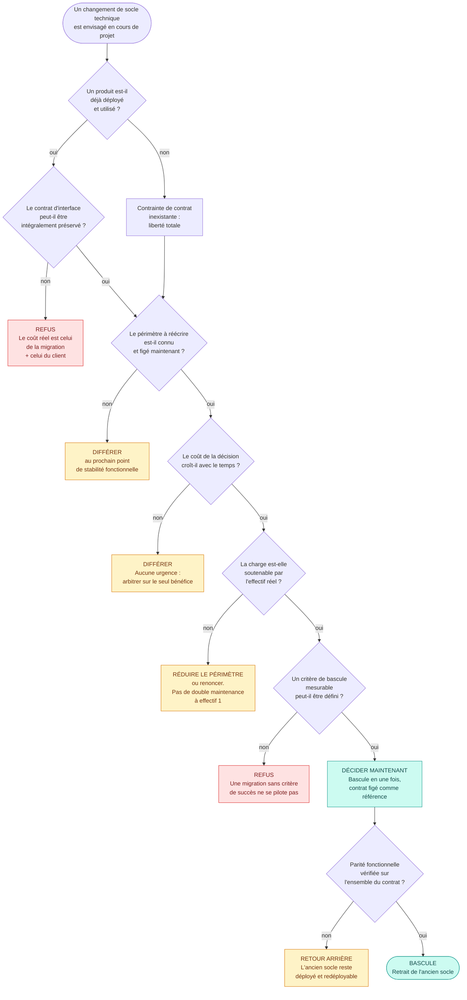

# 03 Le cas d'arbitrage

> **RNCP 39583 Bloc 3, C3.2.2**
>
> **Compétence** : procéder aux arbitrages nécessaires à partir de l'analyse des écarts et des dérives constatés, en utilisant des outils d'aide à la décision (logigramme) afin de garantir le bon déroulement du projet.
>
> **Livrable attendu** : la présentation d'un cas d'arbitrage rencontré au cours du projet.
>
> **Critères d'évaluation**
> - La problématique qui nécessite un arbitrage est exposée avec ses conséquences.
> - Les différentes options possibles pour y remédier sont détaillées.
> - La décision d'arbitrage est argumentée et permet de résoudre la problématique.

Alimente les diapositives 15 et 16.

**Rappel de posture** : le cas exposé a réellement eu lieu, la décision a réellement été prise, et son résultat est mesuré dans le dépôt.

---

## 1. Le cas retenu, et pourquoi celui-là

**Cas retenu : le remplacement de l'API Node.js / Express par ASP.NET Core, décidé le 18 mars 2026, deux jours après la livraison du MVP.**

Trois cas d'arbitrage réels étaient candidats. Le tableau ci-dessous justifie le choix et sert de réserve pour les 15 minutes de questions.

| Cas | Écart déclencheur | Pourquoi il est, ou n'est pas, retenu |
|-----|-------------------|---------------------------------------|
| **Le changement de stack de l'API** | Le MVP est livré sur une pile qui ne satisfait pas les exigences retenues pour la suite, et le coût de la corriger augmente chaque jour | **Retenu.** C'est le seul des trois où la décision engage l'architecture du produit, où les options ont été instruites par écrit **avant** la décision, et où le résultat se mesure encore aujourd'hui |
| La porte de qualité de performance instable | Chaîne d'intégration à 52 % de succès en juin 2026, échecs sans cause réelle bloquant les fusions | Réserve. Excellent cas mesure → décision → effet remesuré (52 % puis 94 %), déjà exposé en diapositive 14. Le garder ici ferait doublon |
| L'abandon de l'application mobile | Application mobile démarrée le 16 mai 2026, archivée le 26 mai | Réserve. La décision est saine mais le motif est extérieur au projet, ce qui affaiblit l'exercice d'arbitrage |

---

## 2. La problématique et ses conséquences

### 2.1 Le fait déclencheur, daté

La chronologie est celle de l'historique du dépôt, à l'heure près.

| Date et heure | Événement | Trace |
|---------------|-----------|-------|
| 27/02/2026 16:16 | Premier commit du projet | `steps 1 to 12` |
| 16/03/2026 16:48 | **MVP terminé**, API Node.js / Express, 944 lignes TypeScript, 18 fichiers, 12 routes | `mvp done` |
| 16/03/2026 | La feuille de route du MVP s'arrête à l'étape 16. **Aucune migration n'y figure** | `docs/mvp/roadmap-mvp.md` à ce commit |
| entre le 16 et le 18/03 | Rédaction du document d'aide à la décision : avantages, inconvénients, risques, périmètre. Il est versionné avec le commit suivant, sa date de rédaction n'est donc pas horodatée séparément | `docs/migration-dotnet/contexte-et-perimetre.md` |
| 18/03/2026 11:57 | **Décision exécutée.** Le document de migration est versionné et une étape 17 est ajoutée à la feuille de route du MVP | `mirgation api to dot net 10` |
| 18/03/2026 12:12 | **Bascule.** L'ancienne API est supprimée du dépôt, 15 minutes après le début | `clean migration`, −2 730 lignes |
| 19/03/2026 16:52 | Migration terminée, chaîne d'intégration adaptée | `chore: bump deps (pnpm + NuGet)` |

**Le point qui fait de ce cas un arbitrage et non l'exécution d'un plan** : la migration est absente de la feuille de route du MVP au moment où le MVP est déclaré terminé. Elle y est ajoutée deux jours plus tard, en même temps que le document qui l'instruit. La décision est donc née **en cours de projet**, après un constat, et non au cadrage.

### 2.2 L'écart constaté

L'API du MVP répondait à un seul critère : livrer vite. Confrontée aux exigences retenues pour la suite du projet, elle en manquait quatre, qui sont énoncées dans le document d'aide à la décision.

| Exigence pour la suite | Ce que l'API du MVP fournissait |
|------------------------|--------------------------------|
| Typage fort et analyse statique bloquante à la compilation | Typage TypeScript effacé à l'exécution : une rupture de contrat entre deux couches n'est pas arrêtée par le compilateur du serveur |
| Sécurité applicative fournie par le cadre (CORS, limitation de débit, en-têtes, antiforgery) | Composants à assembler et à maintenir un par un |
| Socle à support long terme, pour limiter la charge de veille | Écosystème npm à cadence de publication rapide, veille plus fréquente : 59 des 77 pull requests du projet sont des montées de dépendances |
| Architecture en couches imposée par l'outillage | 18 fichiers sans séparation domaine / application / infrastructure |

Ce n'est pas une dérive de délai ni de budget : **c'est un écart entre ce qui est livré et ce sur quoi les six mois suivants allaient être construits.**

### 2.3 Les conséquences, et pourquoi la fenêtre se refermait

C'est le cœur du cas. Le coût de la décision n'était pas stable dans le temps.

| Conséquence si rien n'est décidé | Portée |
|----------------------------------|--------|
| Chaque fonctionnalité de la V1 développée sur Node augmente le volume à réécrire plus tard | Le lot V1 représentait à lui seul 35 J/H, soit près de trois fois le lot de migration |
| Le coût de la migration devient un coût d'arrêt du produit | Une réécriture menée après la V1 fige les évolutions pendant sa durée, cette fois avec des utilisateurs en production |
| Le report se transforme en renoncement | Un chantier technique sans échéance et sans bénéfice utilisateur visible ne se replanifie jamais spontanément |

**La mesure qui tranche.** Au 18 mars 2026, le périmètre à réécrire pesait **944 lignes**. La même API porte aujourd'hui **44 663 lignes réparties sur 544 fichiers**. Le rapport est de 1 à 47.

> Ce chiffre est la justification a posteriori de la décision, pas son argument d'origine : le 18 mars, on savait que le coût croîtrait, on ne savait pas de combien. C'est précisément la nature d'un arbitrage, décider avec l'information disponible au moment où la fenêtre est ouverte.

---

## 3. Les options instruites

Quatre options, avec leur coût, leur effet sur le planning et leur risque. Les trois premières figurent dans le document d'aide à la décision versionné le 18 mars ; la quatrième y est évoquée sous le terme de « double maintenance temporaire » et a été écartée pour un motif d'organisation.

| # | Option | Coût | Effet sur le planning | Risque principal |
|:-:|--------|------|----------------------|------------------|
| **A** | **Ne rien changer**, poursuivre la V1 sur Node / Express | 0 J/H | Aucun décalage | Les quatre exigences de 2.2 restent non satisfaites pour toute la durée du projet. Le risque n'est pas immédiat, il est cumulatif |
| **B** | **Migrer maintenant**, entre le MVP et la V1, bascule en une fois | **13 J/H** : 8 de réécriture, 3 de tests d'intégration et de contrat, 2 de redéploiement conteneurisé | Décalage du début de la V1 d'environ deux semaines | Rupture du contrat d'interface avec un front déjà déployé |
| **C** | **Migrer après la V1**, une fois le produit complet | Même nature de travail sur un périmètre plusieurs fois supérieur, non chiffrable à la date de la décision | Aucun décalage immédiat, gel des évolutions plus tard | Le report devient un renoncement, et la réécriture se ferait avec des utilisateurs en production |
| **D** | **Migrer progressivement**, les deux API coexistant route par route | Coût de la migration **plus** le coût de double maintenance de chaque évolution pendant la transition | Étalé, sans gel | Deux bases de code à tenir à jour **par une seule personne**. Le facteur de bus de 1 rend cette option la plus risquée, pas la plus prudente |

### 3.1 Les critères de décision

Cinq critères, dont un éliminatoire. Ils sont ce que le logigramme de la section 4 formalise.

| # | Critère | Nature | Ce qu'il tranche |
|:-:|---------|--------|------------------|
| 1 | **Le contrat d'interface avec le front déployé doit être préservé** | Éliminatoire | Toute option qui casse les URL ou le format JSON est écartée d'emblée |
| 2 | Le coût de la décision croît-il avec le temps ? | Discriminant | Oui ⇒ décider tôt a une valeur propre, indépendante du bénéfice |
| 3 | Existe-t-il une fenêtre de stabilité fonctionnelle maintenant ? | Discriminant | Le MVP venait d'être figé : le périmètre à réécrire était connu et arrêté |
| 4 | La décision est-elle réversible ? | Modérateur | L'ancienne API reste dans l'historique et redéployable tant que la bascule n'est pas validée |
| 5 | La charge est-elle soutenable par l'effectif réel ? | Modérateur | Écarte la double maintenance, qui suppose un effectif supérieur à 1 |

---

## 4. Le logigramme de décision

L'outil d'aide à la décision demandé par la grille. Il est écrit pour être **réutilisable** : il ne mentionne pas .NET, il énonce les questions qu'un changement de socle technique en cours de projet impose de trancher, dans l'ordre où elles doivent l'être.

**Le chemin suivi le 18 mars 2026** : produit déployé **oui** → contrat préservable **oui**, le contrat OpenAPI de l'API Node servant de référence → périmètre figé **oui**, le MVP venait d'être déclaré terminé → coût croissant **oui** → charge soutenable **oui**, 13 J/H pour un exécutant → critère de bascule définissable **oui**, la parité sur les 12 routes → **décider maintenant**.

---

## 5. La décision et son argumentation

**Décision : option B. Migrer immédiatement, entre le MVP et la V1, avec bascule en une fois, le contrat d'interface de l'API Node servant de spécification de référence.**

Quatre arguments, dans l'ordre où ils ont pesé.

1. **La fenêtre était ouverte et allait se refermer.** Le MVP venait d'être figé : c'était le seul moment du projet où le périmètre à réécrire était à la fois complet et arrêté. Deux semaines de développement V1 plus tard, il ne l'aurait plus été.
2. **Le coût de l'option A n'est pas nul, il est différé.** Ne rien faire revenait à accepter les quatre écarts de 2.2 pour toute la durée du projet, et à payer la migration plus tard à un prix inconnu, ou à ne jamais la payer.
3. **La bascule en une fois est moins risquée que la coexistence, à effectif 1.** C'est contre-intuitif et c'est le point que le jury interrogera. Maintenir deux API en parallèle double le coût de chaque évolution pendant toute la transition ; sur une équipe, ce coût se répartit, sur une personne il s'ajoute. L'option la plus progressive était ici la plus dangereuse.
4. **La décision restait réversible jusqu'à sa validation.** L'ancienne API demeurait dans l'historique et redéployable ; le retrait n'est intervenu qu'après vérification de la parité.

**Ce qui rendait la décision contrôlable** : un critère de succès défini avant de commencer, *le front ne change pas, parce que les URL et le format JSON ne changent pas*. Ce critère est vérifiable, binaire, et il transforme un chantier de réécriture en un objectif mesurable.

---

## 6. Le résultat, mesuré

### 6.1 Ce qui a été tenu

| Objectif | Résultat mesuré | Source |
|----------|-----------------|--------|
| Réécrire l'API à l'identique du contrat | 12 routes migrées, 944 lignes TypeScript remplacées par **4 653 lignes C# sur 111 fichiers** | Historique du dépôt |
| Bascule en une fois, sans double maintenance | Ancienne API retirée **15 minutes** après le début de la bascule | Commit `clean migration` |
| Ne pas décaler la V1 | **v1.0.0 livrée le 19/05/2026**, deux mois après la bascule. Aucune échéance de restitution du titre n'a glissé | Journal des versions |
| Décision non rejouée | **Aucun retour arrière**, aucune seconde migration. 8 versions produit livrées sur ce socle depuis | Journal des versions |
| Socle tenable dans la durée | 44 663 lignes aujourd'hui, couverture **86,6 %**, Quality Gate **A / A / A**, architecture hexagonale | SonarCloud, dossier Bloc 2 |

### 6.2 Ce qui n'a pas été tenu, et qu'il faut dire

Deux écarts, énoncés ici plutôt que laissés à découvrir.

**Le front a bougé de 87 lignes.** L'objectif annoncé était « aucune modification du front ». Le commit de migration, celui de 11 h 57, et non le retrait de l'ancienne API à 12 h 12, touche 9 fichiers de l'interface, pour 87 insertions et 34 suppressions, essentiellement des ajustements de typage et d'affichage sur l'écran de détail d'une soirée. Le critère de succès était donc **presque** tenu : le contrat des URL a été respecté, celui des types ne l'a pas été à la ligne près. Sur un projet à plusieurs, ces 87 lignes auraient été un incident d'intégration entre deux personnes ; à une seule, elles sont passées inaperçues. C'est un argument de plus pour la revue par un tiers, humain ou outillé, sur les changements structurants.

**Le lot est chiffré 13 J/H, l'exécution du cœur tient sur deux journées.** Le chiffrage du Bloc 1 (8 de réécriture, 3 de tests et de contrat, 2 de redéploiement) a été formalisé en juin 2026, donc après coup. L'historique montre une exécution concentrée du 18 mars à 11 h 57 au 19 mars à 16 h 52. Trois raisons à l'écart, aucune ne l'annule complètement : la reconstitution de charge est **faible sur mars**, les commits de cette période étant groupés (chapitre 2, § 5.3) ; le travail préparatoire, contrat OpenAPI, analyse des options, architecture cible, précède le premier commit et n'y figure pas ; et les tests d'intégration comme l'adaptation complète de la chaîne se sont étalés au-delà de mars. **Formulé honnêtement : le lot a été chiffré a posteriori sur son périmètre complet, et l'historique ne permet pas de le vérifier au jour près.**

### 6.3 La prédiction du document d'aide à la décision, vérifiée

Le document d'aide à la décision annonçait un inconvénient : « C# est plus verbeux que TypeScript ». Mesure : **944 lignes TypeScript remplacées par 4 653 lignes C#**, soit un facteur 4,9. L'inconvénient annoncé s'est réalisé, il avait été accepté en connaissance de cause, et il est compensé par la séparation en couches que ce volume porte, 111 fichiers structurés en domaine, application et infrastructure, là où l'API Node en comptait 18 sans séparation.

Un arbitrage dont on peut vérifier après coup que les inconvénients annoncés étaient les bons est un arbitrage instruit. C'est la phrase de conclusion du chapitre.

---

## 7. Les deux arbitrages de réserve

À garder pour les questions, chacun résumé en trois lignes.

| | **La porte de qualité instable** | **L'abandon de l'application mobile** |
|--|--------------------------------|--------------------------------------|
| **Écart** | Chaîne d'intégration à 52 % de succès en juin 2026, échecs sans cause réelle bloquant les fusions | Application mobile démarrée le 16/05/2026, parcours complet livré en une journée |
| **Options** | Désactiver la porte, abaisser les seuils, rendre la mesure déterministe, changer d'outil | Poursuivre en parallèle du web, geler, archiver |
| **Décision** | Rendre la mesure déterministe (médiane de trois exécutions) et recalibrer les seuils, plutôt que baisser l'exigence | Archiver le 26/05/2026 : deux surfaces produit à maintenir sont hors de portée d'un exécutant unique, et le web porte la totalité des utilisateurs |
| **Résultat** | **52 % → 94 %** le mois suivant, portes rendues bloquantes en v1.3.1 | Code conservé dans `archive/`, aucune dette de maintenance, aucun utilisateur impacté |

---

## 8. Rattachement aux diapositives

| Diapo | Titre | Section source |
|:-----:|-------|----------------|
| 15 | La dérive constatée et ses conséquences | 1, 2 |
| 16 | Les options, le logigramme, la décision et son résultat mesuré | 3, 4, 5, 6 |
| A3 | Les deux arbitrages de réserve | 7 |

---

## 9. Questions probables sur ce chapitre

| Question | Ligne de réponse |
|----------|------------------|
| Votre étude comparative du Bloc 1 retient .NET. Pourquoi avoir livré le MVP en Node ? | Parce que le MVP avait un seul objectif, livrer un parcours démontrable. L'étude comparative a été **formalisée en juin 2026** et consigne la décision finale, pas la chronologie. La vérité est celle de l'historique : MVP en Node livré le 16 mars, décision de migrer le 18. Je préfère l'exposer que la laisser trouver |
| Migrer une API entière en deux jours, est-ce crédible ? | Le périmètre était de **944 lignes et 12 routes**, avec un contrat déjà spécifié. Ce n'est pas une API d'entreprise, c'est le socle d'un MVP. Et le chiffrage de 13 J/H couvre le lot complet, tests d'intégration et redéploiement compris, qui s'est étalé au-delà de ces deux jours |
| Pourquoi ne pas avoir migré progressivement ? | Parce que la coexistence de deux API impose de maintenir deux bases de code pendant toute la transition. Sur une équipe ce coût se répartit, à une personne il s'ajoute. Le facteur de bus de 1 fait de l'option la plus progressive la plus risquée. C'est le critère 5 du logigramme |
| Qu'est-ce qui vous garantissait de pouvoir revenir en arrière ? | L'ancienne API restait dans l'historique et redéployable tant que la parité n'était pas vérifiée. Le retrait est intervenu **après** la bascule validée, et c'est la dernière branche du logigramme |
| Le front n'a-t-il vraiment pas bougé ? | Non, et c'est écrit en 6.2 : **87 lignes sur 9 fichiers**, du typage et de l'affichage. Le contrat des URL a tenu, celui des types n'a pas tenu à la ligne près. À plusieurs, ces 87 lignes auraient été un incident d'intégration détecté en revue |
| Cette migration était-elle vraiment nécessaire au produit ? | Non, l'utilisateur n'a rien vu. Elle était nécessaire à ce qui allait être construit dessus pendant six mois : typage fort, sécurité fournie par le cadre, support long terme, architecture en couches. Un arbitrage technique ne se juge pas à son effet immédiat sur le produit, il se juge à ce qu'il rend possible ou impossible ensuite |
| Referiez-vous le même choix ? | Oui, et plus tôt. Le seul regret porte sur la trace : le document d'aide à la décision existe et il est complet, mais il a été supprimé du dépôt le 19 mars et il a fallu le retrouver dans l'historique pour préparer cette présentation. Une décision d'architecture doit rester lisible sans archéologie |
