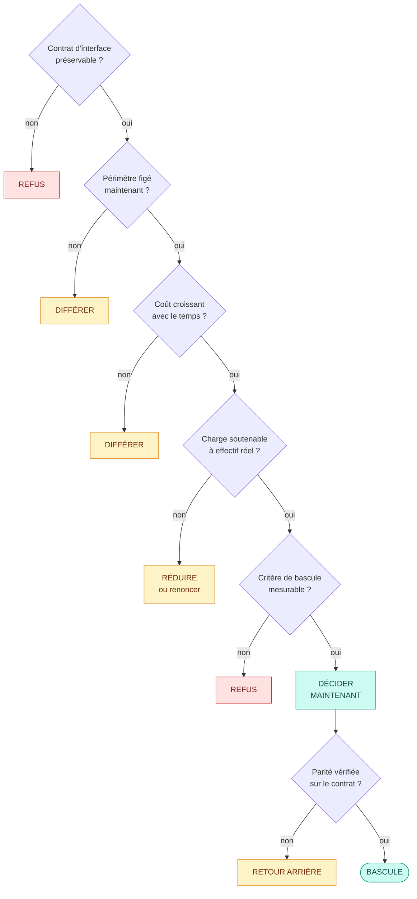

# Movie Picker

Coordonner et piloter un projet de développement logiciel

Bloc 3, Coordonner et piloter un projet de développement d'applications logicielles 
Expert en développement logiciel, RNCP 39583

Adrien MORAND, 16 septembre 2026

<!--
DUREE 0:10.

Ne rien commenter ici. Enchainer immediatement sur la diapo 2.
-->

---

# Le produit et son état aujourd'hui

Une application web de décision collective : choisir à plusieurs quel film regarder.

**Ce qui est livré**

| | |
|--|--|
| Versions en production | **9**, du 27/02 au 04/09/2026 |
| Rythme de livraison | une toutes les 17 jours (médiane) |
| Commits sur la branche principale | 833 |
| Coût de fonctionnement | moins de 200 € par an |

**Ce qui est mesuré en production**

| | |
|--|--|
| Comptes utilisateurs | 17 |
| Soirées créées | 19 |
| Soirées menées jusqu'au tirage | **74 %** |
| Latence de l'API au 95e centile | 207 ms |
| Taux d'erreur serveur | 0,026 % |

Usage mesuré du 8 avril au 21 juillet 2026. Le service est en ligne et utilisé.

<!--
DUREE 0:40.

Objectif unique de cette diapo : etablir qu'on parle d'un logiciel reellement
exploite, pas d'une maquette. Tout le reste de la presentation en depend, et la
demonstration de la fin se fera sur cette version.

Ne pas detailler les fonctionnalites : elles seront montrees en direct.

A PREPARER : inserer une capture de l'application en production a gauche du
tableau si le rendu le permet, sinon laisser les chiffres seuls.
-->

---

# Cadre de la présentation

### Deux registres, jamais confondus

**Le réel, chiffré et vérifiable** 
Le projet a été **exécuté seul**. Les commits, les versions, les mesures de production et les retours utilisateurs sont ceux d'un projet à une personne.

**L'organisation cible, annoncée comme telle** 
Une équipe de **4 profils** sur laquelle sont construits la matrice RACI, l'affectation des missions, la grille de compétences et le plan de développement. C'est la projection d'industrialisation du projet, pas une équipe qui a existé.

### Les sept temps

1. Planifier l'exécution
2. Piloter l'avancement
3. Un cas d'arbitrage
4. Piloter l'équipe
5. Les besoins en compétences
6. Rendre compte au commanditaire
7. **Démonstration en production**

<!--
DUREE 0:40. DIAPO CRITIQUE POUR LES 15 MINUTES DE QUESTIONS.

Dire la phrase telle quelle : « Le projet a ete execute seul. Chaque fois que je
parlerai d'affectation de missions ou de montee en competences, je decrirai
l'organisation cible du projet, et je le signalerai. »

Un jury qui decouvre le caractere projete en fin de presentation le vit comme
une dissimulation. Un jury prevenu des le debut l'evalue comme un exercice de
conception d'organisation. C'est le meme contenu, ce n'est pas la meme note.

Ne pas s'excuser, ne pas justifier longuement. Annoncer, puis avancer.
-->

---

# 1. Planifier l'exécution : la méthodologie

Kanban léger à revues de version

### Le choix

Un flux continu : une fiche est tirée dès qu'une capacité se libère, menée jusqu'à la production, puis consolidée dans une **revue de version** qui vaut point de validation.

Deux règles, pas plus :

- **Limite de travail en cours** : un seul sujet fonctionnel à la fois, hors correctif de production
- **Critère de sortie** : rien n'est terminé avant d'être déployé et vérifié en production

### Les bénéfices attendus, et leur résultat

| Bénéfice | Résultat |
|----------|----------|
| Priorisation permanente | Périmètre revu 8 fois sans replanification |
| Pas de cérémonie non soutenable | Le temps va à la production et à la revue |
| Délai de mise à disposition court | 8 livraisons en 6 mois |
| Réaction à un signal de production | Anomalies traitées hors du flux |

<b>Écartés</b> : <b>Scrum</b>, cérémonies coûteuses sans bénéfice de synchronisation à une personne. <b>Cycle en V</b>, périmètre figé avant les mesures de production.

<!--
DUREE 1:10. ELEMENT IMPOSE 1 : presentation de la methodologie choisie.
CRITERE : le choix est justifie AVEC LES BENEFICES ATTENDUS.

Ne pas definir Kanban en theorie, le jury connait. Passer directement au
« pourquoi ici » et surtout aux benefices constates.

Insister sur la formule : « Kanban leger » n'est pas un Kanban degrade, c'est un
Kanban dont l'outillage a ete dimensionne a la taille reelle du projet. Ce qui a
ete ecarte du Kanban lui-meme, ce sont les metriques de flux (temps de cycle par
classe de service, diagramme de flux cumule), qui exigent un volume de fiches que
ce projet n'atteint pas.

Le motif d'ecartement de Scrum doit etre dit sans mepris : ce n'est pas Scrum qui
est mauvais, c'est son rapport cout / benefice a une personne.

SI ON QUESTIONNE : « pourquoi pas Scrum en solo, juste pour la discipline ? »
Reponse : la discipline vient de la limite de travail en cours et du critere de
sortie, qui sont conserves. Ce qui est ecarte, ce sont les rituels sans
interlocuteur.
-->

---

# Les outils de planification

Deux outils, deux échelles de temps

### Rétroplanning, l'échelle des échéances

À rebours depuis les dates non négociables : Bloc 1 le 11 juin, Bloc 2 le 23 juillet, Bloc 4 le 21 août, Bloc 3 le 16 septembre.

**Bénéfice attendu** : transformer une date imposée en date de fin de lot. Une échéance qui ne bouge pas impose une capacité, donc un périmètre.

**Ce qu'il a produit** : le contenu de chaque version arrêté par la capacité restante, et non par une liste de souhaits.

### Gantt, l'échelle des phases

**Bénéfice attendu** : rendre visibles les deux choses qu'une liste de tâches masque, les **chevauchements** entre phases et la position des **jalons de version**.

### Compatibilité avec Kanban

Les deux outils n'opèrent pas au même horizon.

| Horizon | Outil | Question à laquelle il répond |
|---------|-------|-------------------------------|
| Le mois, le trimestre | Rétroplanning et Gantt | Où en est-on des phases et des échéances ? |
| La journée, la semaine | Tableau de flux | Que fait-on maintenant, et qu'est-ce qui bloque ? |

Le Gantt porte les phases et les jalons, jamais le contenu des fiches. <b>Aucune fiche du tableau ne porte de date de fin engagée. Seules les versions en portent.</b>

<!--
DUREE 0:50. ELEMENT IMPOSE 2 (premiere partie) : le planning detaille.
CRITERES : l'outil de planification est argumente avec ses benefices attendus,
ET il est compatible avec la methodologie choisie.

Le critere de compatibilite est celui que les candidats ratent : ils presentent
un Gantt sur une methode agile sans expliquer comment les deux coexistent. Le
tableau du bas est la reponse, et la derniere phrase en gras est la formulation
a dire mot pour mot.

La contradiction classique entre Gantt et Kanban nait quand on tente de planifier
des taches individuelles a date fixe dans un flux. Ce n'est pas ce qui est fait
ici : le Gantt porte les phases et les jalons, pas le contenu des fiches.
-->

---

# Le planning en cinq phases

fév.
mars
avril
mai
juin
juil.
août
sept.

Étude

Analyse de la demande, parties prenantes

<i style="grid-column:1/22"></i>

Comparatif de stack, faisabilité, veille

<i style="grid-column:3/48"></i>

Mesure

Chiffrage 98 J/H, budget, risques

<i style="grid-column:22/63"></i>

Mesure de l'usage réel en production

<i style="grid-column:41/145"></i>

Conception

Modèle de données, contrat d'interface

<i style="grid-column:3/43"></i>

Architecture hexagonale de l'API

<i style="grid-column:17/63"></i>

Système de composants mobile-first

<i style="grid-column:34/94"></i>

Réalisation

Lot 1, MVP

<i style="grid-column:1/18"></i>

Lot 2, migration de l'API vers .NET

<i style="grid-column:20/27"></i>

Lot 3, V1 produit

<i style="grid-column:27/82"></i>

Lot 4, versions V1.1 à V1.4

<i style="grid-column:83/180"></i>

Restitution

Mises en production, v0.1.0 à v1.4.0

<i style="grid-column:1/180"></i>

Restitutions au commanditaire

<b style="grid-column:105/106"></b><b style="grid-column:147/148"></b><b style="grid-column:176/177"></b><b style="grid-column:202/203"></b>

Du 27 février au 16 septembre 2026. Restitutions au commanditaire : Bloc 1 le 11/06, Bloc 2 le 23/07, Bloc 4 le 21/08, <b>Bloc 3 le 16/09</b>.

Les phases <b>se chevauchent</b>, elles ne se succèdent pas. La conception court jusqu'en mai alors que la réalisation a commencé en février, et la phase de mesure se rouvre en production. C'est ce qu'un cycle en V interdit.

<!--
DUREE 1:20, la plus longue diapo du chapitre. ELEMENT IMPOSE 2 (suite).
CRITERE : le planning permet de visualiser les phases d'ETUDE, de MESURE, de
CONCEPTION, de REALISATION, de RESTITUTION. Les cinq mots sont dans la grille,
les cinq sections sont a l'ecran. Les nommer a voix haute une par une.

Contenu de chaque phase, a dire en balayant le diagramme :
- ETUDE : analyse de la demande, parties prenantes, comparatif de stack,
  faisabilite, veille, hierarchisation MoSCoW.
- MESURE : deux temps, et c'est volontaire. En amont le chiffrage en jours-homme,
  le budget, la cartographie des risques. En production le releve de l'usage
  reel, qui a alimente les arbitrages de la V1.4.
- CONCEPTION : modele de donnees, architecture hexagonale, contrat d'interface,
  systeme de composants mobile-first.
- REALISATION : les 4 lots.
- RESTITUTION : deux registres, les 8 mises en production vers l'utilisateur, et
  les restitutions du titre vers le commanditaire.

LE POINT A NE PAS MANQUER : dire explicitement que les barres se recouvrent, et
pourquoi c'est la signature d'un pilotage en flux. Un Gantt dont les barres se
suivent sans se recouvrir decrirait un cycle en V.

SI ON QUESTIONNE : « vos documents de cadrage sont dates de juin, votre phase
d'etude de fevrier. » Reponse preparee : les DECISIONS d'etude ont ete prises en
fevrier et mars, tracees dans l'historique du depot et dans les choix techniques
eux-memes. Leur FORMALISATION documentaire est intervenue en juin pour la
restitution du Bloc 1. La decision precede le document. C'est une faiblesse de
tracabilite, assumee, et corrigee depuis : les arbitrages sont desormais
consignes au moment ou ils sont pris.
-->

---

# Le découpage en lots et la charge

| Lot | Contenu | Charge |
|-----|---------|-------:|
| **1. MVP** | Socle, API des soirées, catalogue de films, vote, tirage, interface mobile-first, déploiement | 27 J/H |
| **2. Migration** | ASP.NET Core, architecture hexagonale, tests d'intégration, redéploiement | 13 J/H |
| **3. V1 produit** | Comptes, mot de passe oublié, historique, configuration hôte, déjà vu, partage, temps réel, thème, internationalisation, sécurité de la chaîne | 35 J/H |
| **4. Clôture** | Cadrage, pilotage, sécurité et accessibilité, recette, exploitation | 23 J/H |
| | **Total** | **98 J/H** |

### La méthode d'estimation

**Analogique**, par comparaison entre lots de complexité voisine. Aucune méthode paramétrique n'était applicable faute d'historique de projets comparables.

**Marge d'incertitude assumée : 20 %** sur les lots de développement.

Ce chiffrage n'est pas rétrospectif : il est établi au cadrage et sert de base au budget prévisionnel. L'écart entre ces 98 J/H et la charge réellement consommée est traité au chapitre 2.

<!--
DUREE 0:50. CRITERE : le planning est decoupe en phases, en taches ou LOTS.

Ne pas lire le contenu des lots, il est a l'ecran. Dire les quatre intitules et
les quatre charges, puis passer a la methode d'estimation, qui est ce qu'un jury
de professionnels va reellement interroger.

Annoncer des maintenant que l'ecart previsionnel / reel sera traite au chapitre 2.
Cela evite la question « et ca a tenu ? » posee trop tot, et cela montre que le
chiffrage a servi de reference de pilotage et pas seulement de piece a produire.

SI ON QUESTIONNE : « 20 % de marge, c'est beaucoup ou peu ? » Reponse : c'est la
marge usuelle d'une estimation analogique sans historique. Sur les lots
documentaires, elle s'est revelee insuffisante, c'est le point de vigilance 2.
-->

---

# Les ressources nécessaires

### Humaines

Les 4 profils de l'organisation cible.

| Profil | Charge | Part |
|--------|-------:|-----:|
| Lead dev, chef de projet | 19 J/H | 19 % |
| Développeur front | 25 J/H | 26 % |
| Développeur back | 35 J/H | 36 % |
| DevOps et QA, mi-temps | 19 J/H | 19 % |
| **Total** | **98 J/H** | |

Le back porte la charge la plus lourde, conséquence du lot de migration, absorbée par le décalage temporel des lots.

### Matérielles et techniques

- Un poste par profil, environnement local reproductible
- Dépôt unique en monorepo, outillage de test, d'analyse statique et de formatage
- Chaîne d'intégration et de déploiement continus, analyse de qualité et de sécurité, tests de bout en bout
- Exécution conteneurisée sans serveur, diffusion du front par réseau de contenu, base managée
- Services tiers : catalogue de films, e-mails, supervision, mesure d'usage, secrets

### Financières

| Poste | Montant |
|-------|--------:|
| Valeur de développement | 34 300 € HT |
| Infrastructure | 1 à 5 €/mois |
| Domaine | 10 €/an |
| Licences | **0 €** |
| **Trésorerie réelle** | **20 à 190 €/an** |

98 J/H au taux journalier junior simulé de 350 €. Coût de trésorerie nul en formation : ce montant matérialise la valeur de l'effort pour le commanditaire.

<!--
DUREE 0:50. ELEMENT IMPOSE 3 : les ressources necessaires.

Trois familles, une phrase forte par famille, pas de lecture de tableau.

HUMAINES : rappeler d'un mot qu'il s'agit de l'organisation cible. C'est le
deuxieme rappel apres la diapo 3, et il faut qu'il soit naturel, pas defensif.

MATERIELLES : ne pas enumerer, dire « poste de travail, outillage, chaine de
livraison, hebergement, services tiers » et laisser lire.

FINANCIERES : la phrase a dire est « moins de 200 euros par an de tresorerie
reelle, pour une valeur de developpement de 34 300 euros ». C'est le contraste qui
parle a un jury de professionnels. Et l'absence de licence payante est une
decision de conception prise sous contrainte de budget, ce qui conditionne la
soutenabilite du service au-dela du titre.
-->

---

# La matrice RACI

**R** réalise, **A** approuve et rend compte, **C** consulté, **I** informé

| Activité | Lead | Front | Back | DevOps QA | Commanditaire | Utilisateurs |
|----------|:----:|:-----:|:----:|:---------:|:-------------:|:------------:|
| Cadrage et périmètre de version | A R | C | C | C | C | I |
| Architecture applicative | A R | C | R | C | I | |
| Développement de l'interface | A | R | C | C | | I |
| Développement de l'API | A | C | R | C | | |
| Accessibilité du produit | A | R | C | C | C | C |
| Chaîne, supervision, sécurité | A | C | C | R | I | |
| Recette et tests de bout en bout | A | C | C | R | C | C |
| Arbitrage de périmètre ou de charge | A R | C | C | C | C | I |
| **Inclusion et adaptation des postes** | **A R** | C | C | C | I | |

Extrait de 9 lignes. Matrice complète de 15 lignes en annexe.

### Trois propriétés

**Une seule approbation par ligne.** Le rôle A n'est jamais partagé : c'est la condition pour qu'un arbitrage puisse être tranché.

**L'affectation suit la compétence, pas la disponibilité.**

**Les acteurs externes y figurent.** Un acteur absent de la matrice est un acteur qu'on oubliera de solliciter.

<b>Prise en compte du handicap, trois niveaux.</b> 
<b>Affectation</b> : aucune activité ne présuppose une capacité physique, une ligne dédiée porte un responsable identifié. <b>Poste et organisation</b> : poste adapté, outillage compatible lecteur d'écran et navigation clavier, horaires aménagés, temps supplémentaire en recette et en formation, comptes rendus écrits, sans justification à produire à l'équipe. <b>Produit</b> : accessibilité vérifiée automatiquement à chaque livraison, au niveau maximum sur tous les écrans.

<!--
DUREE 0:50. CRITERE : les taches sont assignees selon les competences (RACI) ET
tiennent compte des personnes en situation de handicap. Le second point est un
critere a part entiere, pas une remarque.

Ne pas lire la matrice. Dire les trois proprietes, puis consacrer la moitie du
temps au bandeau du bas.

Sur le handicap, la phrase a dire : « le sujet porte un responsable identifie
dans la matrice, des amenagements nommes, et une exigence d'accessibilite du
produit verifiee automatiquement. Une equipe qui livre un produit inaccessible ne
peut pas pretendre a une organisation inclusive. » C'est ce qui distingue une
prise en compte reelle d'une clause de style, et un jury de professionnels fait
la difference immediatement.

Rappel de posture : c'est l'organisation cible. Troisieme et dernier rappel avant
le chapitre 4.
-->

---

# Les points de vigilance

| # | Point de vigilance | Ce qu'il menace | Indicateur de contrôle | Parade |
|:-:|--------------------|-----------------|------------------------|--------|
| **1** | **Concentration des rôles sur une personne** | La continuité du projet | Nombre de personnes capables de mener une mise en production : **1** | Procédures écrites et versionnées, infrastructure décrite en code, décisions consignées |
| **2** | Sous-estimation des lots documentaires | Le calendrier du titre | Écart charge prévue / consommée sur le lot de clôture | Rétroplanning depuis les échéances, périmètre ajusté sur la capacité restante |
| **3** | Dépendance au catalogue de films externe | Le cœur du produit | Taux d'erreur des appels au catalogue | Cache des métadonnées, limitation du débit, repli de saisie manuelle |
| **4** | Transport des e-mails transactionnels | Mot de passe oublié, invitations | Volume quotidien rapporté au plafond du palier gratuit | Envoi limité à l'indispensable, fournisseur substituable derrière un port applicatif |
| **5** | Durcissement de la politique de sécurité du contenu | L'affichage, blocage silencieux de ressources légitimes | Sondes de disponibilité, vérification visuelle après modification | Inventaire des domaines externes tenu à jour, vérification obligatoire avant mise en production |
| **6** | Absence de déploiement progressif | La disponibilité lors d'une bascule | Test de fumée post-déploiement, taux d'erreur serveur | Arbitrage assumé et réversible, test de fumée bloquant, retour arrière par redéploiement |
| **7** | Instabilité de la chaîne de vérification | La cadence de livraison, la confiance dans la chaîne | Part des échecs sans cause réelle | Contrôle de performance rendu déterministe, seuils recalibrés, vérification en local avant remontée |

Les points 2 à 7 sont des risques de projet. Le point 1 est un risque d'organisation, et c'est lui qui justifie la conception de l'organisation cible présentée dans la suite.

<!--
DUREE 0:50. CRITERE : les points de vigilance sont soulignes. Dernier critere de
C3.1, competence ELIMINATOIRE : le chapitre ne peut pas se terminer sans lui.

Ne pas lire les sept lignes. Structurer en deux temps :

1. « Cinq de ces points sont techniques et chacun porte un indicateur de controle
et une parade. » Citer le point 5 comme exemple, parce qu'il s'est REALISE en
production : un durcissement de la politique de securite du contenu a bloque les
affiches de films et les avatars. L'incident et sa correction sont tracees. Un
point de vigilance qui s'est realise et qui a ete traite vaut mieux qu'une liste
theorique.

2. « Le point 1 est d'une autre nature. » C'est la transition du chapitre :
l'indicateur vaut 1, et cette valeur est le probleme. Enchainer sur le fait que
c'est ce risque qui rend l'organisation cible necessaire.

Le point 6, absence de deploiement progressif, est une faiblesse assumee et
tracee. La dire ici plutot que de la laisser decouvrir par le jury.
-->

---

# 2. Piloter l'avancement : l'outil de suivi

Le suivi est tenu **dans GitHub**, sans outil de gestion de projet séparé.

### Cinq surfaces, cinq natures de trace

| Surface | Ce qu'elle porte | Volume |
|---------|------------------|-------:|
| Issues | Anomalies qualifiées, demandes entrantes | 5 |
| Pull requests | Revue et décision d'intégration | 77 / **26 fusionnées** |
| Actions | Vérification automatisée et déploiement | 449 exécutions |
| Releases et tags | Points de livraison datés | **9 versions** |
| Fichiers versionnés | Feuilles de route, journal des versions | 106 items suivis |

Le critère de choix n'est pas la richesse fonctionnelle, c'est la <b>distance entre le travail et sa trace</b>. Aucun indicateur retenu ne demande de saisie déclarative : la trace est produite par le geste de travail lui-même.

### L'adéquation avec Kanban

| Propriété de la méthode | Ce que l'outil fournit |
|-------------------------|------------------------|
| Flux continu, pas d'itération fixe | Aucune notion de sprint. Les fiches n'ont pas d'échéance, **les versions en ont une** |
| Travail en cours limité à 1 | Une branche fonctionnelle à la fois |
| Priorisation permanente | Feuilles de route réordonnées par commit, sans replanification |
| Sortie = déployé et vérifié | Fusion → déploiement → test de fumée bloquant |
| Correctif prioritaire | Anomalies étiquetées en sévérité, hors flux fonctionnel |

<!--
DUREE 1:00. ELEMENT IMPOSE 4 : l'outil de suivi de projet.
CRITERE : l'outil est en adequation avec le projet ET avec la methodologie.

La phrase d'ouverture, a dire telle quelle : « un outil de suivi exterieur au
depot impose une double saisie, et la double saisie est la premiere chose
abandonnee sous pression sur un projet a une personne. Un indicateur abandonne
sous pression est un indicateur qui ment exactement au moment ou on en a
besoin. »

Puis le tableau de droite, qui est celui que la grille demande : ligne par ligne,
la propriete de la methode et ce que l'outil fournit. Insister sur la premiere :
un outil a sprints aurait impose une cadence que l'alternance ne permet pas de
tenir, et aurait produit des indicateurs faux.

SI ON QUESTIONNE : « pourquoi pas Jira ou Trello ? » Reponse : la saisie
declarative. Pas « c'etait plus simple ».

A PREPARER : capture du tableau de flux GitHub Projects, a inserer a gauche si le
tableau est structure avant l'oral. Sinon, laisser les cinq surfaces.
-->

---

# Les indicateurs retenus

Règle de sélection : mesurable sans saisie déclarative · quantifiable · <b>rattaché à une décision</b> · reproductible par un tiers.

**Avancement**

| Indicateur | Valeur |
|------------|-------:|
| Items de périmètre livrés | **61 / 86** (71 %) |
| Items techniques livrés | 19 / 20 (95 %) |
| Versions publiées | **9** |
| Commits intégrés | 833 |
| Travail soumis à revue | 26 / 77 PR |

**Délais**

| Indicateur | Valeur |
|------------|-------:|
| Cadence de livraison (médiane) | **17 jours** |
| Échéances de restitution tenues | **4 / 4** |
| Jours d'activité | 88 / 191 (46 %) |

**Coûts**

| Indicateur | Valeur |
|------------|-------:|
| Infrastructure récurrente | **0 €/mois** |
| Coût annuel engagé | ≈ 10 € (domaine) |
| Valeur de développement consommée | 30 800 € / 34 300 € |

**Risques**

| Indicateur | Valeur |
|------------|-------:|
| Vulnérabilités HIGH / CRITICAL ouvertes | **0** |
| Stabilité de la chaîne (branche principale) | **78 %** |
| Couverture de tests | 86,6 % |
| Porte de qualité | Passed, A/A/A |
| Anomalies ouvertes | 0 / 3 |
| Taux d'erreur serveur | 0,026 % |
| Disponibilité | 100 % |

**Ressources humaines**

| Indicateur | Valeur |
|------------|-------:|
| Densité d'activité | 3,1 j/semaine |
| Plus longue série continue | **10 jours** |
| Semaines sans activité | 5 / 28 |
| Facteur de bus | **1** |

Écartés faute de mesurabilité : vélocité en points, temps de cycle d'une fiche, charge ressentie.

<!--
DUREE 1:00. CRITERE : les indicateurs sont mesurables et quantifiables, et
permettent de suivre les DELAIS, les COUTS et l'AVANCEMENT. Les cinq axes du
critere « tableaux de bord » sont deja couverts ici.

Ne lire aucun tableau. Dire les quatre conditions de la regle de selection, en
appuyant sur la troisieme : « un indicateur sans decision associee est un
ornement ». Puis annoncer les cinq axes et enchainer sur les deux diapos de
tableaux de bord.

Le geste qui compte : citer les trois indicateurs ECARTES et pourquoi. Un
candidat qui dit ce qu'il n'a pas su mesurer est plus credible qu'un candidat
dont tous les voyants sont au vert.

Deux valeurs sont volontairement en alerte, elles seront commentees en diapo 14 :
la stabilite de la chaine a 78 % et le facteur de bus a 1.
-->

---

# Tableau de bord : avancement et délais

**L'activité mois par mois**

| Mois | Commits | Jours actifs | Fusions |
|------|--------:|-------------:|--------:|
| Février | 1 | 1 | 0 |
| Mars | 28 | 3 | 0 |
| Avril | 72 | 11 | 1 |
| Mai | 150 | 14 | 6 |
| Juin | 227 | 19 | **39** |
| Juillet | 194 | 18 | **52** |
| Août | 127 | 17 | 18 |
| Septembre (5 j.) | 34 | 5 | 6 |
| **Total** | **833** | **88** | **122** |

Le pic de juin n'est pas un pic de production : c'est le passage au travail par branches courtes. L'indicateur de fusions ne mesure pas la même chose avant et après.

**Les 9 points de livraison**

| Version | Date | Écart |
|---------|------|------:|
| 0.1.0 | 27/02 | — |
| 1.0.0 | 19/05 | **81 j** |
| 1.1.0 | 25/05 | 6 j |
| 1.2.0 | 11/06 | 17 j |
| 1.3.0 | 19/06 | 8 j |
| 1.3.1 | 08/07 | 19 j |
| 1.3.2 | 25/07 | 17 j |
| 1.4.0 | 25/08 | 31 j |
| 1.4.1 | 04/09 | 10 j |

Médiane <b>17 jours</b>, moyenne 23,6. L'écart entre les deux tient à un seul intervalle.

<b>Les 4 échéances de restitution du titre sont tenues à la date, écart 0.</b> Ce n'est pas de la discipline, c'est la méthode : le rétroplanning traite ces dates comme des fins de lot, et c'est le <b>périmètre de la version</b> qui absorbe la variation, jamais la date. Quand la capacité s'est réduite en août, c'est l'intervalle entre deux versions qui s'est allongé.

<!--
DUREE 1:00. CRITERE : le tableau de bord integre l'avancement et le suivi des
delais.

Deux chiffres a dire, pas plus : 833 commits sur 88 jours actifs, et 9 versions a
une mediane de 17 jours.

Puis les deux lectures qui prouvent qu'on lit ses propres indicateurs au lieu de
les afficher :

1. Le pic de fusions de juin (6 -> 39) alors que les commits ne passent que de
150 a 227. Ce qui a change, c'est la pratique de decoupage, pas la production. Le
dire AVANT que le jury le remarque.

2. Les 81 jours entre le prototype et la premiere version de production. C'est le
seul intervalle anormal, il contient la migration de l'API, et c'est cet
indicateur qui a transforme la migration en arbitrage explicite. Annoncer le
chapitre 3 ici.

Terminer par le bandeau : ecart de delai nul sur les quatre echeances, parce que
c'est le perimetre qui absorbe, jamais la date.
-->

---

# Tableau de bord : coûts, risques, ressources

### Coûts, prévu / réel

| Poste | Prévu | Réel |
|-------|------:|-----:|
| Infrastructure | 1 à 5 €/mois | **0 €** |
| Domaine | 10 €/an | 10 €/an |
| Licences | 0 € | **0 €** |
| Trésorerie | 20 à 190 €/an | **≈ 10 €/an** |
| Valeur de dév. | 34 300 € | ≈ 30 800 € |

Deux échéances de coût sont suivies bien qu'elles vaillent zéro aujourd'hui : fin des 12 mois gratuits du front, et franchissement des 512 Mo de la base.

### Risques

| Risque | Valeur | État |
|--------|-------:|:----:|
| Vulnérabilités ouvertes | 0 | ✅ |
| Couverture de tests | 86,6 % | ✅ |
| Quality Gate | Passed | ✅ |
| Stabilité de la chaîne | **78 %** | ⚠️ |
| Disponibilité | 100 % | ✅ |
| Erreurs serveur | 0,026 % | ✅ |
| Anomalies ouvertes | 0 / 3 | ✅ |
| Facteur de bus | **1** | ⚠️ |

### Stabilité de la chaîne, détail

| Période | Exéc. | Taux |
|---------|------:|-----:|
| Juin (dès le 19) | 48 | **52 %** |
| Juillet | 99 | **94 %** |
| Août | 36 | 78 % |
| Sept. (5 j.) | 8 | 38 % |

Le passage de 52 à 94 % suit une correction <b>décidée à partir de cet indicateur</b> : portes de qualité rendues déterministes en v1.3.1. La valeur de septembre porte sur 8 exécutions et ne se lit pas comme une tendance.

<b>Ressources humaines : 88 jours actifs sur 191, soit 3,1 jours par semaine — mais une amplitude de 1 à 7 jours, une série de 10 jours consécutifs et 5 semaines à zéro.</b> La charge a été <b>absorbée, pas pilotée</b>. C'est cette mesure, et non une intuition, qui justifie l'organisation cible à quatre profils du chapitre 4.

<!--
DUREE 1:00. CRITERE : le tableau de bord integre le suivi des COUTS, des RISQUES
et des RESSOURCES HUMAINES. Les trois axes restants du critere sont ici.

COUTS, une phrase : le budget d'infrastructure tient parce qu'il a ete concu pour
tenir, avec une contrepartie technique assumee, le demarrage a froid de 3,8 s.
Puis le point de pilotage : deux echeances de cout sont suivies alors qu'elles
valent zero aujourd'hui, parce qu'un budget qui ne suit que la depense actuelle
ne pilote rien.

RISQUES : ne pas parcourir la colonne. Aller directement aux deux voyants
oranges. Le premier, la stabilite de la chaine, est celui qui prouve la boucle
mesure -> decision -> effet mesure : 52 %, correction, 94 %.

RH : c'est la transition du chapitre 4. La phrase a dire : « une semaine a sept
jours travailles suivie d'une semaine a zero tient sur sept mois de projet
etudiant, elle ne tient pas sur une equipe et une exploitation dans la duree. »

SI ON QUESTIONNE : « votre chaine echoue une fois sur cinq. » Reponse : sur la
fenetre complete oui, la serie mensuelle est plus parlante, et la valeur de
septembre porte sur huit executions.
-->

---

# L'écart entre le prévisionnel et le réel

| | Prévu | Réel | Écart |
|--|------|------|------:|
| Charge | 98 J/H | ≈ 88 J/H | **−10 %** |
| Périmètre | MVP + migration + V1 + clôture | **+ 4 versions** non chiffrées | **+ 37 items** |
| Délais | 4 échéances | 4 tenues | **0** |
| Coûts | 20 à 190 €/an | ≈ 10 €/an | borne basse |

Pris seul, l'écart de charge de −10 % tombe dans la marge de 20 % et donnerait l'image d'une estimation juste. <b>Pris avec la ligne du périmètre, il dit l'inverse.</b>

| Fenêtre | Contenu | Jours actifs |
|---------|---------|-------------:|
| 27/02 → 19/05 | Lots 1 à 3, chiffrés | 23 (26 %) |
| 20/05 → 05/09 | **Hors chiffrage initial** | **65 (74 %)** |

Les 4 versions livrées après la V1 représentent **37 des 61 items** du produit final et n'ont jamais été chiffrées.

### Trois décisions prises à partir d'une mesure

| Mesure | Décision | Effet mesuré |
|--------|----------|--------------|
| 81 jours entre le prototype et la V1 | Arbitrer la migration de l'API — **chapitre 3** | Retour à 17 jours de médiane |
| Chaîne à 52 %, échecs sans cause réelle | Portes de qualité bloquantes **et** déterministes (v1.3.1) | **94 %** le mois suivant |
| 59 PR de dépendances ouvertes pour 9 fusionnées | Regroupement mensuel, filet déplacé sur l'audit à chaque commit | **0 vulnérabilité** ouverte, sans fusion non relue |

<b>Ce que le suivi n'a pas vu.</b> Aucun indicateur ne comparait le périmètre courant au périmètre chiffré : le glissement de 37 items n'a été visible qu'a posteriori. C'est le premier compteur que j'ajouterais.

<!--
DUREE 1:00. C'est la diapo qui prouve que le suivi a servi a DECIDER et pas
seulement a mesurer. Elle amene le chapitre 3.

Structurer en trois temps, sans lire les tableaux :

1. « L'ecart de charge est de moins 10 %, dans la marge. Ce n'est pas la bonne
lecture. » Puis la ligne du perimetre : quatre versions produit livrees apres la
V1, 37 des 61 items du produit final, jamais chiffrees. Le perimetre a plus que
double pendant que la charge restait dans l'enveloppe. La derive n'etait pas une
derive de charge, c'etait un glissement de perimetre que rien ne mesurait.

2. Les trois decisions. C'est le coeur de la competence : chaque ligne est une
mesure, une decision, et un effet remesure ensuite.

3. L'autocritique du bandeau orange. Ne pas l'escamoter, c'est elle qui rend les
deux premiers temps credibles.

SI ON QUESTIONNE : « comment reconstituez-vous 88 J/H sans releve de temps ? »
Reponse honnete : par les jours distincts portant au moins un commit, 1 jour
actif pour 1 J/H, incertitude d'au moins 20 %. La reconstitution est FAIBLE sur
les cinq premieres semaines, ou les commits etaient groupes — le premier commit
du projet porte 3 400 lignes a lui seul. La charge reelle est vraisemblablement
superieure a 88 J/H. Un indicateur ne mesure que la pratique qui le produit.
-->

---

# 3. Un cas d'arbitrage : la dérive constatée

### Ce que l'historique montre, à l'heure près

| Date | Événement |
|------|-----------|
| 16/03 16:48 | **MVP terminé**, API Node/Express : 944 lignes, 21 fichiers, 12 routes |
| 16/03 | La feuille de route du MVP s'arrête à l'étape 16. **Aucune migration n'y figure** |
| 18/03 11:57 | Décision exécutée, document d'aide à la décision versionné |
| 18/03 12:12 | **Bascule** : l'ancienne API retirée, 15 min après |
| 19/03 16:52 | Migration terminée |

La migration est <b>absente</b> de la feuille de route au moment où le MVP est déclaré terminé, et ajoutée deux jours plus tard. C'est ce qui en fait un arbitrage et non l'exécution d'un plan.

### L'écart : livré ≠ ce sur quoi on va construire

| Exigence pour la suite | L'API du MVP |
|------------------------|--------------|
| Typage fort, analyse bloquante à la compilation | Typage effacé à l'exécution |
| Sécurité fournie par le cadre | Composants à assembler un par un |
| Support long terme | Cycle court, veille plus fréquente |
| Architecture en couches | 21 fichiers, aucune séparation |

### La conséquence : une fenêtre qui se referme

Au 18 mars, le périmètre à réécrire pesait <b>944 lignes</b>. 
La même API en porte <b>44 663</b> aujourd'hui. 
<b>Rapport de 1 à 47.</b> Le coût de la décision croissait chaque jour.

<!--
DUREE 0:50. ELEMENT IMPOSE 5 (1/3).
CRITERE : la problematique qui necessite un arbitrage est exposee AVEC SES
CONSEQUENCES.

Ouvrir par la phrase qui desamorce la question piege : « le MVP a ete livre sur
une pile que je ne voulais pas garder pour la suite. L'etude comparative du
Bloc 1 retient .NET, mais elle a ete formalisee en juin : elle consigne la
decision finale, pas la chronologie. La verite est celle de l'historique. »

Puis le tableau de gauche, une seule ligne a dire : la migration est ABSENTE de
la feuille de route quand le MVP est declare termine, et ajoutee deux jours plus
tard. C'est ce qui fait de ce cas un arbitrage.

Terminer sur le chiffre de droite, qui est celui que le jury retiendra : 944
lignes a migrer le 18 mars, 44 663 aujourd'hui. Preciser aussitot que ce chiffre
est la justification A POSTERIORI, pas l'argument d'origine : le 18 mars on
savait que le cout croitrait, pas de combien. C'est la nature meme d'un
arbitrage.
-->

---

# Les options et le logigramme de décision

| # | Option | Coût | Risque principal |
|:-:|--------|------|------------------|
| A | Ne rien changer, poursuivre la V1 sur Node | 0 J/H | Les 4 écarts subsistent 6 mois. Risque **cumulatif**, pas immédiat |
| **B** | **Migrer maintenant**, bascule en une fois | **13 J/H** (8 réécriture, 3 tests et contrat, 2 redéploiement) | Rupture du contrat avec un front **déjà déployé** |
| C | Migrer après la V1 | Même travail, périmètre plusieurs fois supérieur | Le report devient un renoncement ; réécriture **avec des utilisateurs en production** |
| D | Migrer progressivement, deux API en parallèle | Migration **+** double maintenance de chaque évolution | Deux bases à tenir **par une seule personne**. L'option la plus progressive est ici la plus risquée |

**Les 5 critères de décision** — 1. contrat d'interface préservé *(éliminatoire)* · 2. le coût croît-il avec le temps ? · 3. fenêtre de stabilité fonctionnelle ? · 4. réversibilité · 5. charge soutenable par l'effectif réel

Écrit pour être <b>réutilisable</b> : aucune techno n'y figure. Version complète en annexe.

<!--
DUREE 1:00. ELEMENT IMPOSE 5 (2/3).
CRITERE : les differentes options possibles sont DETAILLEES. La grille nomme
explicitement le LOGIGRAMME comme outil d'aide a la decision : il doit etre a
l'ecran et commente, pas seulement affiche.

Les quatre options, une phrase chacune, sans lire le tableau. Le temps utile est
sur l'option D, la plus contre-intuitive : migrer progressivement parait plus
prudent, et c'est faux a effectif 1. Deux bases de code en parallele, sur une
equipe le cout se repartit, sur une personne il s'ajoute. C'est le critere 5.

Puis le logigramme, en le PARCOURANT a voix haute sur le chemin reellement
suivi le 18 mars : produit deploye oui, contrat preservable oui grace au contrat
OpenAPI de l'API Node, perimetre fige oui puisque le MVP venait d'etre termine,
cout croissant oui, charge soutenable oui, critere de bascule definissable oui
— la parite sur les 12 routes. Donc decider maintenant.

Insister sur la DERNIERE branche : parite non verifiee = retour arriere,
l'ancien socle restant deployable. C'est ce qui rendait la decision reversible.
-->

---

# La décision et son résultat mesuré

### Option B, argumentée en 4 temps

**1. La fenêtre était ouverte et allait se refermer.** Le MVP venait d'être figé : seul moment où le périmètre à réécrire était complet **et** arrêté.

**2. Le coût de l'option A n'est pas nul, il est différé.** Ne rien faire, c'était payer plus tard à un prix inconnu — ou ne jamais payer.

**3. La bascule en une fois est moins risquée que la coexistence, à effectif 1.**

**4. La décision restait réversible** jusqu'à la vérification de parité.

<b>Ce qui la rendait pilotable</b> : un critère de succès défini <b>avant</b> de commencer — le front ne change pas, parce que les URL et le format JSON ne changent pas. Binaire, vérifiable.

### Ce qui a été tenu

| Objectif | Résultat mesuré |
|----------|-----------------|
| Réécrire à l'identique du contrat | 12 routes, 944 lignes TS → **4 653 lignes C#**, 111 fichiers |
| Bascule sans double maintenance | Ancienne API retirée **15 min** après |
| Ne pas décaler la V1 | **v1.0.0 le 19/05**, aucune échéance du titre décalée |
| Décision non rejouée | **Aucun retour arrière**, 8 versions livrées depuis |
| Socle tenable | 44 663 lignes, couverture **86,6 %**, **A/A/A** |

<b>Ce qui n'a pas été tenu.</b> L'objectif était « aucune modification du front » : le réel est <b>87 lignes sur 9 fichiers</b>, du typage et de l'affichage. À plusieurs, c'était un incident d'intégration détecté en revue. Et le lot est chiffré 13 J/H <b>a posteriori</b> : l'historique ne permet pas de le vérifier au jour près.

<!--
DUREE 0:40. ELEMENT IMPOSE 5 (3/3).
CRITERE : la decision d'arbitrage est argumentee ET permet de resoudre la
problematique. Les deux moities comptent : l'argumentation ET la preuve que ca a
marche.

Ne pas relire les quatre arguments, ils sont a l'ecran. En dire DEUX : la fenetre
qui se referme, et le cout non nul de l'option A.

Puis le tableau de droite en un seul geste : « aucun retour arriere, huit
versions produit livrees sur ce socle depuis, et le socle porte aujourd'hui
44 663 lignes a 86,6 % de couverture. »

Le bandeau orange est OBLIGATOIRE a dire, ne pas le sauter par manque de temps.
C'est lui qui distingue un bilan d'un plaidoyer. Les 87 lignes de front sont le
detail qui prouve qu'on a verifie, et l'aveu sur le chiffrage a posteriori
enchaine directement avec ce qui a ete dit au chapitre 2.

CONCLUSION DU CHAPITRE, phrase a dire telle quelle : « le document d'aide a la
decision annoncait que C# serait plus verbeux. 944 lignes TypeScript sont
devenues 4 653 lignes C#. L'inconvenient annonce s'est realise, il avait ete
accepte en connaissance de cause. Un arbitrage dont on peut verifier apres coup
que les inconvenients annonces etaient les bons est un arbitrage instruit. »
-->

---

# 4. Piloter l'équipe : l'affectation des missions

Organisation cible à 4 profils — <b>projection d'industrialisation</b>, annoncée depuis la diapositive 3.

| Profil | Mission | Critère d'affectation |
|--------|---------|-----------------------|
| **Lead, chef de projet** | Conception d'ensemble, arbitrages, planning, restitutions | Seul rôle portant l'**approbation** : un responsable unique par activité |
| **Développeur front** | Interface, parcours, accessibilité, app installable | React, TypeScript, mobile-first, critères d'accessibilité |
| **Développeur back** | API, modèle, règles métier, intégrations | C#, ASP.NET Core, architecture hexagonale |
| **DevOps et QA**, mi-temps | Chaîne de livraison, infra, supervision, recette | Intégration continue, conteneurisation, sécurité |

L'affectation suit la <b>compétence attestée</b>, jamais la disponibilité.

| Lot | Total | Lead | Front | Back | DevOps |
|-----|------:|-----:|------:|-----:|-------:|
| 1. MVP | 27 | 2 | 9 | 11 | 5 |
| 2. Migration | 13 | 3 | 0 | 8 | 2 |
| 3. V1 produit | 35 | 3 | 12 | 16 | 4 |
| 4. Clôture du titre | 23 | 11 | 4 | 0 | 8 |
| **Total** | **98** | **19** | **25** | **35** | **19** |
| **Part** | | 19 % | 26 % | **36 %** | 19 % |

<b>Une somme équilibrée n'est pas un équilibre.</b> Le back porte 36 %, conséquence du lot de migration. Le déséquilibre est <b>décalé dans le temps</b> : pic back en mars-avril, pic front en avril-mai. À aucun moment un profil n'est saturé pendant qu'un autre attend. 
Quatre profils à 24,5 J/H seraient parfaits sur le papier et impossibles dans le calendrier : les compétences ne sont pas interchangeables.

<!--
DUREE 0:50. ELEMENT IMPOSE 6 : l'affectation des missions.
CRITERE : la charge est repartie de maniere EQUILIBREE sur l'ensemble de
l'equipe.

Premier mot : rappeler que c'est l'organisation cible. C'est le quatrieme rappel
et il doit rester naturel.

Ne pas lire les profils. Dire le critere d'affectation — la competence attestee,
pas la disponibilite — et le fait qu'une seule ligne porte l'approbation.

Tout le temps utile va au bandeau : le back a 36 %, et c'est assume. Un jury de
professionnels va poser la question, autant y repondre avant. La reponse est que
l'equilibre se verifie sur le PROFIL DE CHARGE DANS LE TEMPS, pas sur la colonne
des totaux. Et la phrase qui ferme : quatre profils a 24,5 J/H seraient
equilibres sur le papier et impossibles dans le calendrier.
-->

---

# Les quatre styles managériaux

| Style | Situation réelle du projet | Pourquoi celui-là |
|-------|---------------------------|-------------------|
| **Directif** | Durcissement des portes de qualité en juillet : chaîne à **52 %** de succès, échecs devenus contournables. La règle est posée sans négociation — un contrôle rouge bloque le déploiement | La compétence n'était pas en cause, **la discipline l'était**. Seul style qui tienne quand contourner est possible |
| **Persuasif** | Les conventions de code : chaque règle est accompagnée de son motif — si l'intention n'est pas exprimable par le nommage, c'est le code qu'il faut refactoriser | Une règle contre-intuitive énoncée seule est contournée dès la première gêne |
| **Participatif** | Le cadrage d'une fonctionnalité : questions ouvertes, reformulation, **arrêt obligatoire avant toute ligne de code**. Et les retours utilisateurs, qui ont déclenché deux décisions produit | Celui qui exécute détient une information que le responsable n'a pas |
| **Délégatif** | L'étape « développement en autonomie » : exécution confiée entièrement, sans contrôle intermédiaire, reprise en revue et en tests | Possible **uniquement** parce que le cadre est écrit et la porte de sortie automatisée |

<b>Style dominant : le délégatif encadré.</b> Déléguer l'exécution, conserver la décision, contrôler en sortie par des portes automatisées. C'est le seul style soutenable quand la capacité de supervision est la ressource la plus rare. 
<b>Sa condition de validité</b> : le cadre doit être écrit <i>avant</i>. Un délégatif sans référentiel de conventions n'est pas de la délégation, c'est de l'abandon — et le travail non conforme coûte plus cher que de l'avoir fait soi-même.

<!--
DUREE 0:55. ELEMENT IMPOSE 7 : le ou les styles manageriaux utilises.
CRITERE : le style est IDENTIFIE ET DECRIT.

Ne pas definir les quatre styles en theorie, le jury les connait. Les situer :
une situation du projet par style, et le motif du choix.

Le style a developper est le DIRECTIF, parce que c'est le seul ou la decision est
verifiable : juillet, chaine a 52 %, portes rendues bloquantes, 94 % le mois
suivant. Un style manageral qui produit un indicateur mesurable est plus
convaincant qu'une declaration d'intention.

Puis annoncer le dominant et sa CONDITION DE VALIDITE. C'est la phrase qui compte
et il ne faut pas la sauter : « un delegatif sans referentiel de conventions
n'est pas de la delegation, c'est de l'abandon. »

SI ON QUESTIONNE : « delegue a qui ? » Reponse honnete, elle est en diapo 21 :
la delegation reelle du projet a ete faite a des agents d'assistance au
developpement, avec un cadre ecrit et des points d'arret. Ce n'est pas du
management humain et je ne le presente pas ainsi.
-->

---

# Animation et outils de communication

### Le dispositif réel de délégation

Le projet a été exécuté seul, **mais pas sans délégation** : une part de la production a été confiée à des agents d'assistance, encadrés par un dispositif versionné.

| Élément | Rôle managérial |
|---------|-----------------|
| `AGENTS.md` | Conventions **opposables**, avec leurs motifs |
| Procédure de réalisation | 7 étapes, **3 points d'arrêt obligatoires** |
| Procédure de vérification | La vérification ne dépend pas d'une connaissance orale |
| Gabarit de pull request | 6 contrôles avant intégration |

Les 3 points d'arrêt se placent après le cadrage, après la maquette, après le test manuel — les 3 moments où seul le responsable peut trancher.

### Les outils, et ce qu'ils partagent

| Outil | Ce qu'il partage |
|-------|------------------|
| Monorepo unique | Tout le contexte projet, versionné |
| `AGENTS.md` | Le référentiel de règles et leurs motifs |
| Gabarits d'issue | Une qualification comparable |
| Gabarit de PR | Six vérifications identiques pour tous |
| Actions composites | Des briques de CI réutilisables |
| Procédures exécutables | Le flux de réalisation, pas un savoir oral |
| `CHANGELOG` et releases | L'état livré, sans lire le code |
| Feuilles de route versionnées | Le périmètre et ses évolutions datées |

<b>Aucun de ces outils n'est une messagerie, et c'est délibéré.</b> Aucun n'exige la simultanéité. L'écrit versionné reste consultable après coup ; un fil de discussion perd l'information.

<!--
DUREE 0:40. ELEMENT IMPOSE 8 : les outils de communication et leurs objectifs.
CRITERE : les outils collaboratifs INTEGRENT LE PARTAGE DE RESSOURCES, et les
choix sont pertinents au regard de l'objectif.

Colonne de gauche : c'est le moment d'etre franc sur la delegation reelle. Dire
« le projet a ete execute seul, mais pas sans deleguer », expliquer le dispositif
en trois mots — cadre ecrit, points d'arret, revue en sortie — et ne PAS
sur-vendre : un agent n'a ni motivation ni progression, ce qui retire au
management sa moitie humaine. Ce qui se transpose est l'autre moitie.

Colonne de droite : ne pas lire les huit lignes. La colonne « ce qu'il partage »
EST la reponse au critere, la designer d'un geste.

Finir sur le bandeau, qui est la vraie justification du choix d'outils : aucun
n'exige la simultaneite. C'est ce qui les rend compatibles avec la diapo
suivante.
-->

---

# Inclusion : handicap et contexte international

### Un même dispositif, trois contraintes

Tout le dispositif de la diapositive précédente est **asynchrone et écrit**. Or l'asynchrone écrit répond à trois contraintes qu'on traite d'habitude séparément.

| Contrainte | Ce que l'asynchrone écrit apporte |
|------------|-----------------------------------|
| **Handicap** | Documentation en texte structuré versionné, compatible lecteur d'écran et navigation clavier. Suivre le projet ne suppose pas d'être présent en direct |
| **Fuseaux horaires** | Aucun dispositif n'exige la simultanéité |
| **Langue** | Le contexte est lisible et traduisible ; une réunion orale ne l'est pas |

### Sur le réel

**Produit bilingue** français / anglais, page publique de présentation indexable dans les deux langues. Le produit ne suppose pas un utilisateur francophone.

**Accessibilité** : porte de qualité **bloquante** dans la chaîne, au niveau maximum mesuré sur l'ensemble des écrans.

### Dans l'organisation cible

Accordés **à la demande, sans justification médicale à produire à l'équipe** : poste adapté, outillage compatible lecteur d'écran et navigation clavier, télétravail et horaires aménagés, temps supplémentaire en recette et en formation.

Une équipe qui livre un produit inaccessible ne peut pas prétendre à une organisation inclusive.

<!--
DUREE 0:25. DIAPO COURTE, NE PAS DEBORDER.
CRITERES : les specificites des personnes en situation de handicap sont prises
en compte, et les specificites d'un contexte multiculturel et international sont
integrees.

Une seule idee a faire passer, celle de gauche : le meme dispositif — l'ecrit
asynchrone versionne — repond au handicap, aux fuseaux horaires et a la langue.
Ce n'est pas trois politiques, c'est une seule decision d'organisation.

Puis deux preuves rapides a droite : le produit est bilingue, et l'accessibilite
est une porte BLOQUANTE, pas une intention.

Fermer sur la phrase du bandeau et enchainer. Ne pas s'attarder : la diapo
suivante est celle qui compte pour ce chapitre.
-->

---

# Analyse critique d'une posture

### La situation : 17 au 26 août 2026

| | |
|--|--|
| Fait mesuré | **10 jours travaillés consécutifs**, la plus longue série du projet |
| Cause | Deux échéances superposées : dossier Bloc 4 le **21/08**, version 1.4.0 le **25/08** |
| Posture adoptée | **Absorber.** Ne pas arbitrer le périmètre, ne pas décaler, compenser par l'intensité |
| Résultat immédiat | Les deux échéances sont tenues |

### Ce que ça a coûté

| Constat | Mesure |
|---------|--------|
| La qualité de la chaîne baisse le mois même | **94 % en juillet → 78 % en août** |
| La dette est déplacée, pas absorbée | **38 %** début septembre |
| Le découpage du travail se relâche | Branche avant intégration : **2,7 commits en juillet → 6,1 en août** |

<b>La posture a réussi, et c'est exactement le problème.</b> Une posture qui produit le résultat attendu ne s'auto-corrige pas : elle se répète. Appliquée à une équipe, elle porte un nom — demander un effort exceptionnel plutôt qu'arbitrer le périmètre. Elle fonctionne une fois ; à la deuxième elle devient la norme.  
<b>L'arbitrage n'a pas été perdu, il n'a pas été posé.</b>

### Trois recommandations

| # | Recommandation | Indicateur de contrôle |
|:-:|----------------|------------------------|
| **1** | Traiter un chevauchement d'échéances comme un **arbitrage** : poser les trois options — décaler, réduire, absorber — et écrire celle qui est retenue | Chevauchements ayant donné lieu à une décision écrite |
| **2** | Poser une **limite de charge** comme une limite de travail en cours : au-delà de **5 jours consécutifs**, c'est la version qui décale | Plus longue série consécutive, **déjà au tableau de bord** |
| **3** | Rendre la **revue croisée obligatoire** sur les changements structurants | Part des changements structurants passés en revue |

Seule la n° 2 aurait empêché la situation. C'est aussi la plus difficile : elle oblige à annoncer un décalage <b>avant</b> d'avoir essayé d'y échapper.

<!--
DUREE 0:40. LA DIAPO LA PLUS DISCRIMINANTE DU CHAPITRE.
CRITERES : une analyse critique d'une situation ou d'une posture manageriale est
presentee, ET les recommandations sont realistes et realisables.

Un jury de professionnels distingue immediatement une autocritique sincere d'une
autocritique de facade. Le marqueur de sincerite ici est que la posture critiquee
a REUSSI : les deux echeances ont ete tenues. Personne ne s'autocritique sur un
succes, donc c'est credible.

Dire dans l'ordre :
1. Les faits, dates et chiffres. Dix jours d'affilee, deux echeances superposees.
2. Le cout mesure : 94 % puis 78 % puis 38 %. La chaine a paye le mois meme.
3. La phrase centrale : « l'arbitrage n'a pas ete perdu, il n'a pas ete pose. »
4. La transposition equipe : demander un effort exceptionnel plutot qu'arbitrer
le perimetre. Ca marche une fois, a la deuxieme c'est la norme, et le
responsable qui l'a instauree n'a plus d'argument pour la refuser.

NE PAS tomber dans la flagellation : les deux echeances etaient reelles et non
negociables, et le perimetre de la 1.4.0 avait une valeur produit verifiee. La
faute n'est pas d'avoir travaille dix jours, c'est de ne pas avoir instruit
l'option de decaler.

Terminer sur la recommandation 2 en disant qu'elle est la plus difficile a tenir.
-->

---

# 5. Les compétences à mobiliser

### Déduites des lots, pas d'un référentiel

La question posée pour chaque lot : **que faut-il savoir faire pour que ce lot soit livrable et exploitable ?** Chaque compétence correspond ainsi à une technologie réellement présente dans le dépôt, avec une date d'introduction vérifiable.

| Domaine | Compétences clés |
|---------|------------------|
| Back | ASP.NET Core, hexagonal, modélisation documentaire, contrat d'API |
| Front | React et TypeScript, mobile-first, cache de données distantes, i18n |
| Accessibilité | Critères, tests automatisés, contraste et clavier |
| Chaîne | CI/CD, conteneurisation, sans serveur, secrets |
| Qualité | Tests unitaires à E2E, analyse statique, performance |
| Sécurité | Session, identité fédérée, CSP, veille de vulnérabilités |
| Exploitation | Sondes, alertes, traitement d'anomalie |
| Transverses | Arbitrage, chiffrage, revue, écrit asynchrone |

### La chronologie mesurée : 4 vagues

| Vague | Période | Ce qui la déclenche |
|-------|---------|---------------------|
| **1. Produire** | 16 au **18 mars** | L'arbitrage du chapitre 3 : chaîne d'intégration, C#, hexagonal, MongoDB, tests .NET, OpenAPI, conteneur |
| **2. Fiabiliser** | avril à mai | La V1 : performance, accessibilité, analyse statique, scan de vulnérabilités, i18n, app installable, push |
| **3. Exploiter** | juillet | Des utilisateurs réels : supervision, sondes, alertes, traçabilité |
| **4. Enrichir** | août | Périmètre hors chiffrage : identité fédérée, intégration tierce |

<b>La vague 1 est concentrée sur trois jours.</b> C'est le coût de compétence de l'arbitrage du chapitre 3 — et il n'apparaît <b>nulle part</b> dans le chiffrage en jours-homme. Un plan de développement sert à rendre ce coût visible <b>avant</b> de le payer.

<!--
DUREE 0:40. CRITERE : les competences a mobiliser dans le cadre du projet sont
IDENTIFIEES.

Ne pas lire la cartographie. Dire la METHODE, qui est ce qui distingue ce
chapitre d'un catalogue : les competences sont deduites des lots, et chacune
correspond a une techno reellement presente dans le depot, avec une date
d'introduction verifiable.

Puis les quatre vagues, dans l'ordre : produire, fiabiliser, exploiter, enrichir.
Cet ordre n'a rien d'aleatoire, c'est celui d'un produit qui va en production.

Finir sur le bandeau, qui est le lien avec le chapitre 3 : la vague 1 tient sur
trois jours, c'est le cout de competence de l'arbitrage, et il n'est dans aucune
ligne du chiffrage. C'est la justification meme de l'existence d'un plan de
developpement des competences.
-->

---

# La grille d'évaluation des compétences

Échelle comportementale — <b>0</b> non acquis · <b>1</b> lit et modifie accompagné · <b>2</b> autonome sur une tâche courante · <b>3</b> conçoit, arbitre, traite le cas non nominal · <b>4</b> définit le standard et forme.
<b>Le niveau 2 est le seuil d'autonomie, le 3 le seuil de responsabilité</b> : un profil qui porte le « R » de la matrice RACI doit être à 3.

| Profil | Compétence | Act. | Cible | Écart |
|--------|------------|:----:|:-----:|:-----:|
| **Lead** | Architecture applicative | 3 | 4 | +1 |
| | Arbitrage et chiffrage | 2 | 4 | **+2** |
| | Revue et transmission | 2 | 4 | **+2** |
| **Front** | React et TypeScript | 3 | 3 | 0 |
| | **Accessibilité** | 1 | 3 | **+2** |
| | App installable, i18n | 1 | 2 | +1 |
| **Back** | C# et ASP.NET Core | 3 | 3 | 0 |
| | **Architecture hexagonale** | 1 | 3 | **+2** |
| | Sécurité et identité | 1 | 3 | **+2** |
| **DevOps** | CI/CD, conteneurisation | 2 | 3 | +1 |
| | **Supervision** | 1 | 3 | **+2** |
| | Veille de vulnérabilités | 1 | 3 | **+2** |

Extrait. Grille complète de 19 lignes dans le dossier.

### Ce que la grille dit

**Le niveau « actuel » n'évalue personne** : c'est le socle attendu d'un profil **au recrutement**, junior confirmé de 2 à 3 ans. L'écart mesure ce que le projet exige au-delà.

**1. Les écarts se concentrent sur ce que le marché ne fournit pas.** Écart nul sur React/TypeScript et C#/ASP.NET Core — un recrutement les apporte. Les <b>sept</b> écarts à **+2** portent sur l'hexagonal, l'accessibilité, la sécurité, la supervision, la veille, l'arbitrage et la transmission : **des compétences de contexte, pas de langage.**

**2. L'accessibilité est le seul écart à effet bloquant immédiat.** La porte de qualité échoue le déploiement : un front recruté au niveau 1 casse la chaîne à sa première livraison.

<b>3. Les deux plus gros écarts du lead ne sont pas techniques.</b> Arbitrage, chiffrage, transmission : ce sont les compétences que le projet réel a le plus sollicitées et le moins bien exercées — chiffrage formalisé <i>a posteriori</i> (ch. 2), 87 lignes intégrées sans revue (ch. 3). <b>La grille désigne les mêmes faiblesses que les indicateurs</b>, sinon elle serait de complaisance.

<!--
DUREE 1:00. ELEMENT IMPOSE 9 : l'evaluation des besoins en competences via
grille. CRITERE : la grille est COMMENTEE — le mot est dans la grille officielle,
un tableau affiche sans commentaire ne suffit pas.

PREMIERE PHRASE OBLIGATOIRE, avant tout le reste : « le niveau actuel n'est
l'evaluation de personne, c'est le socle attendu d'un profil au recrutement ».
Sans cette phrase, le jury entend qu'on note des collaborateurs fictifs.

Puis commenter, pas lire. Trois lectures, dans l'ordre :
1. Les ecarts nuls sont sur les langages, les ecarts a +2 sur le contexte. Un
recrutement apporte un langage, il n'apporte pas une conformite.
2. L'accessibilite est le seul ecart a effet bloquant immediat.
3. Le bandeau, qui est le plus important : les deux plus gros ecarts du lead ne
sont pas techniques, et ils designent exactement les faiblesses deja montrees aux
chapitres 2 et 3. C'est ce qui rend la grille credible plutot que flatteuse.

SI ON QUESTIONNE : « comment avez-vous etalonne les cibles ? » Reponse : sur ce
que le projet a reellement exige, chaque competence correspondant a une techno
presente dans le depot avec une date d'introduction verifiable.
-->

---

# Le plan de développement des compétences

Actions classées par **coût d'un écart non comblé** : bloque une porte de qualité (1) · crée une dépendance unique (2) · ralentit sans bloquer (3).

| Profil | Action | Modalité | Durée | Indicateur de réussite | P |
|--------|--------|----------|-------|------------------------|:-:|
| Front | **Accessibilité** | Certifiante externe (Opquast) + pratique encadrée | 3 j + 2 sem. | Une livraison passe la porte **sans reprise** | **1** |
| DevOps | **Supervision** | Compagnonnage + astreinte simulée | 5 j | Traite seul une alerte de bout en bout | **1** |
| Back | Architecture hexagonale | Lecture guidée + revue systématique 1 mois | 1 mois partiel | Livre un cas d'usage sans violation de couche | 2 |
| Back | Sécurité applicative | Autoformation cadrée OWASP + revue croisée | 4 j | Aucune vulnérabilité OWASP sur un trimestre | 2 |
| DevOps | Veille de vulnérabilités | Compagnonnage sur le processus existant | 2 j | Qualifie seul un avis et décide du traitement | 2 |
| Lead | Chiffrage et arbitrage | Formation courte externe + pratique documentée | 3 j | Arbitrage consigné **au moment où il est pris** | 2 |
| Lead | Revue et transmission | Revue croisée obligatoire sur le structurant | continu | 100 % des changements structurants en revue | 2 |
| Front | App installable, i18n | Autoformation + pratique dédiée | 3 j | Livre une fonctionnalité hors ligne et traduite | 3 |

**Total : 20 J/H** d'actions de formation (hors pratique encadrée), dont **6 en externe** · **2 100 €** · soit **20 % de la charge projet**.

### Recruter ou former

| Profil | Exigé au **recrutement** | Construit **en interne** |
|--------|--------------------------|--------------------------|
| Lead | Architecture n. 3, conduite de projet | Arbitrage, chiffrage, transmission |
| Front | React / TS n. 3 | Accessibilité, service worker, i18n |
| Back | C# / ASP.NET Core n. 3 | Hexagonal, sécurité applicative |
| DevOps | CI/CD, conteneurisation n. 2 | Supervision, exploitation, veille |

Note aux RH, en une phrase : <b>recruter sur le langage et l'expérience de conduite, former sur le contexte et la conformité.</b>

### Modalités adaptées au handicap

Posées **par défaut**, sans demande ni justification : tiers-temps de droit sur toute formation et son évaluation · support en **texte structuré** systématique, vidéo seulement si sous-titrée et transcrite · matériel adapté disponible **pendant** la formation · distanciel et séquences courtes enregistrées · **accessibilité de la plateforme = critère de sélection du prestataire**.

Le compagnonnage interne est écrit et asynchrone — <b>c'est le mode de travail normal du projet</b>, pas un aménagement rapporté.

<!--
DUREE 0:50. ELEMENT IMPOSE 10 : le plan de developpement des competences.
CRITERES : le plan est etabli et DETAILLE, des FORMATIONS sont preconisees selon
les besoins et les profils, et les MODALITES sont adaptees au handicap.

Trois choses a dire, une par bloc :

1. Le principe d'ordonnancement. Les actions ne sont pas classees par importance
mais par COUT D'UN ECART NON COMBLE. Citer la priorite 1 : l'accessibilite et la
supervision, parce que l'une bloque une porte de qualite et l'autre laisse une
production sans surveillance.

2. La colonne « indicateur de reussite ». C'est elle qui distingue un plan d'une
liste de vux : chaque action se termine par un fait verifiable, pas par une
attestation de presence.

3. La logique recruter / former, qui est la reponse a « transmettre les besoins
en recrutement au service RH ». La phrase a dire : recruter sur le langage et
l'experience de conduite, former sur le contexte et la conformite. Exiger
l'accessibilite et l'hexagonal des le recrutement restreindrait le vivier sans
necessite, ces deux competences se construisant en un mois de pratique encadree.

Sur le handicap, ne citer que les trois modalites qui ont un COUT REEL, donc
verifiables : le tiers-temps de droit, le support en texte structure
systematique, et l'accessibilite de la plateforme comme critere de selection du
prestataire. Puis le bandeau.
-->
