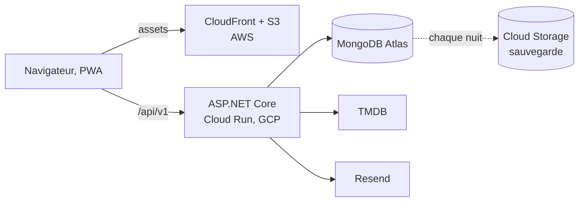

# Movie Picker

Coordonner et piloter un projet de développement logiciel

Bloc 3, Coordonner et piloter un projet de développement d'applications logicielles 
Expert en développement logiciel, RNCP 39583

Adrien MORAND, 16 septembre 2026

<!--
DUREE 0:10.

Ne rien commenter ici. Enchainer immediatement sur la diapo suivante.
-->

---

# Sommaire

<b>1.</b> Démonstration en production<u>C3.4.2</u>

<b>2.</b> La méthode et les outils<u>C3.1, C3.2.1</u>

<b>3.</b> Les versions : planning et cadence<u>C3.1, C3.2.1</u>

<b>4.</b> Les lots et l'avancement<u>C3.1, C3.2.1</u>

<b>5.</b> Les ressources et les rôles<u>C3.1, C3.2.1</u>

<b>6.</b> Les moyens et les coûts<u>C3.1, C3.2.1</u>

<b>7.</b> Les risques<u>C3.1, C3.2.1</u>

<b>8.</b> Un cas d'arbitrage<u>C3.2.2</u>

<b>9.</b> Les compétences : apprises, et à acquérir<u>C3.3.2</u>

<b>10.</b> Piloter le travail, seul<u>C3.3.1</u>

<b>11.</b> Rendre compte, et le bilan<u>C3.4.1, C3.4.2</u>

<!--
DUREE 0:40. AVANT LA DEMONSTRATION. RIEN D'AUTRE A L'ECRAN QUE LE SOMMAIRE :
TOUT CE QUI SUIT SE DIT. DIAPO CRITIQUE POUR LES 15 MINUTES DE QUESTIONS.

Dire la phrase telle quelle : « Le projet a ete mene seul, du 27 fevrier au
16 septembre : developpeur, architecte, exploitant et chef de projet. Je ne
vais pas vous presenter une equipe que je n'ai pas eue. Je vais vous montrer
comment j'ai travaille seul et, la ou le referentiel suppose une equipe, ce
que j'ai fait a la place et ce qui n'a pas d'equivalent. »

Puis le sommaire, une phrase par theme au plus. Dire que le plan suit les
THEMES du pilotage et non l'ordre des competences, pour ne rien dire deux fois :
chaque diapo porte en pied de page les competences qu'elle sert, et les trois
competences eliminatoires, C3.1, C3.2.1 et C3.4.2, sont couvertes par les
themes 1 a 7 et 11.

Ne pas s'excuser d'etre seul, ne pas justifier longuement. Annoncer, puis
avancer. Un jury previent des le debut evalue la methode ; un jury qui
decouvre en cours de route qu'une equipe etait fictive sanctionne.
-->

---

# 1. Démonstration

<a href="https://web.movie-picker.fr" target="_blank">web.movie-picker.fr</a>

<!--
DUREE 0:50, PUIS LA DEMONSTRATION EN DIRECT, 4:50. LE LIEN EST CLIQUABLE. ELEMENT IMPOSE 14 : la
demonstration des fonctionnalites. COMPETENCE C3.4.2, ELIMINATOIRE.

La presentation OUVRE sur le produit : le jury voit le logiciel avant d'entendre
comment il a ete pilote. Dire la phrase de bascule : « je commence par vous
montrer le produit, comme je le montrerais a un client. Tout ce qui suivra,
planning, indicateurs, arbitrages, porte sur ce logiciel-la. »

A DIRE, rien n'est a l'ecran : 11 versions en production depuis fevrier,
21 comptes, 74 % des soirees menees jusqu'au tirage, mesure du 5 septembre. Puis les six temps du
parcours en une phrase, et la demonstration. Au retour, diapo 4 : on parle au
jury.

Objectif unique : etablir qu'on parle d'un logiciel reellement exploite. Tout le
reste de la presentation en depend, et la demonstration se fera dessus.

Trois chiffres, pas plus. Le plus parlant est le 74 % : ce n'est pas un chiffre
d'inscription, c'est un chiffre d'USAGE ABOUTI. Les gens qui creent une soiree
vont au bout dans trois cas sur quatre.

Ne pas detailler les fonctionnalites, elles seront montrees en direct.

SI ON QUESTIONNE le volume : 21 comptes, c'est modeste et je ne le presente pas
autrement. C'est un usage reel et mesure, pas un usage de masse.

= = =

COMPETENCE C3.4.2, ELIMINATOIRE.

REGISTRE CLIENT, il doit s'entendre : pendant la demonstration on ne s'adresse
pas a un jury de professionnels mais a un client. Le vocabulaire change, le
debit ralentit. Le registre jury reprend a la diapo 4.

Ce qui compte pour le critere « le logiciel est utilisable » : c'est la version
en production, pas une maquette, et un second appareil est pret.

MOTS INTERDITS pendant toute la demonstration : API, base de donnees,
deploiement, cache, jeton. Si l'un sort, NE PAS se reprendre a voix haute, se
reprendre attire l'attention sur l'erreur. Continuer.

Si une question technique arrive en cours de demonstration : repondre dans le
registre client, puis « je peux le detailler apres la demonstration si vous le
souhaitez ». Ne pas basculer au milieu du parcours.

=== BASCULE DE REPLI, si le reseau lache ===
Niveau 1, reseau lent : partage de connexion du telephone, deja active.
Niveau 2, reseau indisponible : environnement local deja demarre. DIRE la
phrase preparee : « le reseau de la salle ne suit pas, je bascule sur la meme
version, installee sur mon poste. » Puis continuer sans commentaire.
Niveau 3, poste defaillant : video enregistree, commentee par-dessus.
Niveau 4 : captures imprimees.
Un incident annonce calmement se lit comme de la preparation ; un incident subi
en silence se lit comme une defaillance du logiciel.
-->
---

# 2. Un V par version, un flux pour le run, un board

Chaque version 1.x, de la roadmap à la release

<b>Cadrage</b>objectif de version, items pesés S à XL

<b>Livraison</b>release datée, notes, nouveautés in-app

<b>Conception</b>questions de cadrage, maquette, contrat d'API

<b>Validation</b>test manuel, go avant la fusion

<b>Réalisation</b>test écrit avant le code, branche de feature

<b>Vérification</b>revue, 14 contrôles bloquants

une branche par version, une branche par feature

Le run, en flux, hors version

Signal<i>Sentry, sonde, utilisateur</i>
→

Fiche<i>issue étiquetée, sévérité</i>
→

Correctif<i>branche fix, sur master</i>
→

Livré<i>version corrective</i>

Le board GitHub Projects, une colonne par phase

<b>Backlog</b><i></i><i></i><i></i>

<b>Cadrage</b><i></i><i></i>

<b>Maquette</b><i></i>

<b>Dev</b><i></i>

<b>Revue, tests</b><i></i>

<b>Recette</b><i></i>

<b>Livré</b><i></i><i></i><i></i><i></i>

Le suivi est dans GitHub, zéro saisie

<b style="font-size:1.2rem">160</b>tickets au board

<b style="font-size:1.2rem">11</b>releases datées

<b style="font-size:1.2rem">10</b>fiches, dont 5 anomalies

<b style="font-size:1.2rem">0</b>saisie déclarative

<b>Périmètre figé</b> par version<u>livrable daté, notes de version</u>

<b>Correctif</b> sans attendre la version<u>0 à 7 jours, cinq anomalies closes</u>

<b>Écartés</b><u>Scrum, V intégral, outil de suivi séparé</u>

<!--
DUREE 2:20. ELEMENTS IMPOSES 1, 2 ET 4 : la methodologie, l'outil de
planification, l'outil de suivi. CRITERES : le choix est justifie AVEC LES
BENEFICES ATTENDUS ; l'outil de planification est argumente et compatible avec
la methodologie ; l'outil de suivi est en adequation avec le projet et la
methodologie. Une seule diapo pour les trois, pour ne le dire qu'une fois.

La methode se dit en une phrase : « un cycle en V pour chaque version, un flux
pour le run ». Le V a gauche : une version part de la roadmap avec un objectif,
des items et une taille par item, donc un poids par version ; chaque item passe
par un cadrage par questions, une maquette si l'ecran est nouveau, une
realisation ou le test est ecrit avant le code, puis remonte la branche droite :
verification par la chaine et la revue, validation par un test manuel avant la
fusion, livraison par une release datee. Le trait pointille entre les deux
branches EST le cycle en V : chaque niveau de gauche est verifie par son
vis-a-vis de droite.

Le run, en bas : un signal de production ou d'un utilisateur, une fiche
etiquetee avec sa severite, une branche de correctif fusionnee sur master, une
version corrective. Il ne passe pas par le V, et c'est voulu.

LES BENEFICES, avec les chiffres : le V par version fige un perimetre, donc
chaque version a une date et des notes, onze versions livrees ; le flux du run
corrige sans attendre la version suivante, une anomalie de production ouverte
et corrigee le meme jour en juillet, livree le lendemain.

ECARTES, sans mepris : Scrum, parce que ses ceremonies n'ont pas
d'interlocuteur a une personne, on garde le decoupage et la revue, pas les
rituels ; le cycle en V integral, parce qu'il aurait fige tout le perimetre
avant les mesures de production, alors que la 1.4 corrige des hypotheses que
l'usage reel a invalidees ; un outil de suivi separe du depot, parce qu'il
impose une double saisie.

= = =

L'OUTIL, a droite, sert a la fois a planifier et a suivre, et c'est le meme :
le board GitHub Projects, un ticket par item de roadmap avec sa version, sa
taille et sa phase. Les colonnes du board SONT les phases du V, c'est ce qui
fait la compatibilite avec la methode : un ticket ne saute pas de colonne, il
passe par la maquette quand l'ecran est nouveau, par la revue avant la recette.
Au-dessus du board, un outil a l'echelle des versions : le Gantt, diapo
suivante. Il place les versions, le board porte l'etat des tickets : c'est
cette difference d'echelle qui les rend compatibles.

Le suivi tient dans la meme plateforme, six surfaces, releves le 12 septembre :
160 tickets, 11 releases, 10 fiches dont 5 anomalies toutes closes, 86 pull
requests dont 35 fusionnees, 26 humaines sur 27 et 9 de mise a jour de
dependances sur 59, 851 executions de la chaine dont 540 sur master. Et zero
saisie declarative : la phrase a dire telle quelle, « un outil de suivi
exterieur au depot impose une double saisie, et la double saisie est la
premiere chose abandonnee sous pression sur un projet a une personne. Un
indicateur abandonne sous pression est un indicateur qui ment exactement au
moment ou on en a besoin. »

LES INDICATEURS, regle de selection, rien n'est a l'ecran : un indicateur entre
au tableau de bord s'il est mesurable sans saisie, quantifiable, rattache a une
decision, et reproductible par un tiers depuis le depot public. Appuyer sur la
troisieme : « un indicateur sans decision associee est un ornement ». Les cinq
axes de la grille, avancement, delais, couts, risques, ressources humaines,
sont repartis sur les diapos qui suivent, chacun avec le theme qu'il mesure.
Citer les trois indicateurs ECARTES : la velocite par sprint, il n'y a pas de
sprint ; le temps de cycle d'une fiche, l'entree en flux n'est horodatee de
facon fiable que depuis aout ; la charge ressentie, non quantifiable.

SI ON QUESTIONNE la date du board : il consolide la roadmap, versionnee et
datee au commit. La matiere est datee au geste pres, 1 070 commits, 86 pull
requests, 851 executions, 11 releases. Le board change la lisibilite de cette
matiere, il ne la cree pas.

SI ON QUESTIONNE « pourquoi pas Jira ? » : la saisie declarative, et le board
vit la ou le code vit, la fiche, la branche, la PR et la release au meme
endroit, la trace nait du geste.
-->

---

# 3. Le planning : une ligne par version

fév.
mars
avril
mai
juin
juil.
août
sept.

0.1, MVP

<i class="c" style="grid-column:8/13"></i><i class="r" style="grid-column:13/30"></i><b style="grid-column:29/30"></b><i class="m" style="grid-column:30/32"></i>

Socle .NET

<i class="c" style="grid-column:31/32"></i><i class="r" style="grid-column:31/33"></i><b style="grid-column:32/33"></b><i class="m" style="grid-column:33/49"></i>

V1 produit

<i class="c" style="grid-column:48/53"></i><i class="r" style="grid-column:51/93"></i><b style="grid-column:93/94"></b><i class="m" style="grid-column:94/100"></i>

1.1

<i class="c" style="grid-column:92/94"></i><i class="r" style="grid-column:94/99"></i><b style="grid-column:99/100"></b><i class="m" style="grid-column:100/117"></i>

1.2

<i class="c" style="grid-column:100/103"></i><i class="r" style="grid-column:101/116"></i><b style="grid-column:116/117"></b><i class="m" style="grid-column:117/125"></i>

1.3

<i class="c" style="grid-column:114/117"></i><i class="r" style="grid-column:116/124"></i><b style="grid-column:124/125"></b><i class="m" style="grid-column:125/144"></i>

1.3.1 et 1.3.2, run

<i class="r" style="grid-column:130/143"></i><b style="grid-column:143/144"></b><i class="r" style="grid-column:144/160"></i><b style="grid-column:160/161"></b><i class="m" style="grid-column:161/192"></i>

1.4

<i class="c" style="grid-column:152/167"></i><i class="r" style="grid-column:171/191"></i><b style="grid-column:191/192"></b><i class="m" style="grid-column:192/202"></i>

1.4.1, run

<i class="r" style="grid-column:193/201"></i><b style="grid-column:201/202"></b>

1.5

<i class="c" style="grid-column:198/201"></i><i class="r" style="grid-column:201/204"></i><b style="grid-column:204/205"></b><i class="m" style="grid-column:205/214"></i>

1.6

<i class="c" style="grid-column:203/206"></i><i class="r" style="grid-column:206/209"></i><b style="grid-column:209/210"></b><i class="m" style="grid-column:210/214"></i>

Conception
Réalisation
Release
Mesure en production

<b style="font-size:1.25rem">11</b>versions publiées depuis le 27/02

<b style="font-size:1.25rem">14 j</b>écart médian entre deux versions

<b style="font-size:1.25rem">81 j</b>le seul écart anormal, 0.1 → 1.0

<!--
DUREE 1:40. ELEMENT IMPOSE 2 (suite). CRITERES : le planning est decoupe en
phases et permet de visualiser l'ETUDE, la MESURE, la CONCEPTION, la
REALISATION, la RESTITUTION ; le tableau de bord integre le suivi des DELAIS.
Quatre phases sont dessinees ; l'etude, le cadrage de la version dans la
roadmap, se nomme a voix haute en ouvrant la diapo.

Une ligne par version, du 16 fevrier au 16 septembre 2026. Se lit de gauche a
droite, une phrase par couleur. L'ETUDE se dit, elle n'est pas dessinee : la
version est cadree dans la roadmap, objectif, items, tailles, pendant que la
version precedente est encore en production ; le cadrage de la 1.4 court de
fin juin a mi-juillet, celui de la 1.5 fin aout, celui de la 1.6 debut
septembre. La 1.7 est cadree, sept items, 34 points, elle part apres l'oral.
- CONCEPTION, bleu : questions de cadrage, maquettes des ecrans nouveaux,
  contrat d'API. Court, parce qu'une version tient en quelques items.
- REALISATION, vert : la branche de version, une feature de un a trois jours.
- RESTITUTION, losange : la release, avec ses notes et la fenetre de
  nouveautes. Onze versions publiees, la 1.6 le 12 septembre, un losange
  chacune ; le socle .NET, mis en production sans numero, a le sien.
- MESURE, vert clair : la version vit en production, sondes, erreurs, usage
  et retours ; c'est ce qui alimente le cadrage de la suivante.

LE POINT A NE PAS MANQUER : les lignes se chevauchent, la conception de la
suivante pendant la mesure de la precedente, et c'est ce qui distingue un V par
version d'un cycle en V unique. Un seul V sur sept mois aurait fige en fevrier
ce que la production a corrige en aout.

Deux lignes n'ont pas de conception : les versions correctives, 1.3.1, 1.3.2
et 1.4.1, qui sont le run en flux de la diapo precedente.

LES DELAIS, les trois chiffres du bas : onze versions, une mediane de 14
jours entre deux versions ; le seul ecart anormal, 81 jours entre le prototype et la V1,
contient la migration de l'API, c'est lui qui a rendu l'arbitrage visible,
theme 8. La date d'une version est posee a la fin de sa conception, et c'est
le PERIMETRE qui absorbe la variation, jamais la date : quand la capacite
s'est reduite en aout, l'intervalle s'est allonge, 31 jours, et le perimetre
de la 1.4 a ete tenu.

SI ON QUESTIONNE le calendrier : aucune date n'est imposee de l'exterieur, il
n'y a pas de commanditaire. Les dates sont les miennes, et elles sont tenues
par la methode, pas par la discipline.
-->

---

# 4. Huit lots, et l'avancement mois par mois

Le poids des huit versions livrées : 106 items, 348 points

<i style="width:19.0%;background:var(--s1)">MVP, 66</i>
<i style="width:19.5%;background:var(--s3)">V1, 68</i>
<i style="width:7.5%;background:var(--s2)">1.1, 26</i>
<i style="width:8.6%;background:var(--s4);color:#3b2f00">1.2, 30</i>
<i style="width:9.2%;background:var(--s1)">1.3, 32</i>
<i style="width:15.8%;background:var(--s3)">1.4, 55</i>
<i style="width:9.5%;background:var(--s2)">1.5, 33</i>
<i style="width:10.9%;background:var(--s4);color:#3b2f00">1.6, 38</i>

Commits intégrés sur la branche principale, mois par mois : <b>1 070</b>

<i style="height:0%"></i>

<em>28</em><i style="height:10%"></i>

<em>72</em><i style="height:26%"></i>

<em>150</em><i style="height:55%"></i>

<em>227</em><i style="height:83%"></i>

<em>194</em><i style="height:71%"></i>

<em>127</em><i style="height:47%"></i>

<em>272</em><i style="height:100%"></i>

fév.

mars

avril

mai

juin

juil.

août

sept.

<b style="font-size:1.25rem">1 à 3 jours</b>une feature, de la maquette à la fusion

<b style="font-size:1.25rem">1 à 3 semaines</b>une version, en réalisation

<b style="font-size:1.25rem">58 / 81</b>items produit hors du chiffrage initial, 95 jours actifs pour 98 prévus

<!--
DUREE 1:50. CRITERES : le planning est decoupe en phases, en taches ou LOTS ;
le tableau de bord integre l'AVANCEMENT du projet, et l'ecart au previsionnel.

La barre du haut : les lots sont les versions, et chaque version est un lot
ferme, avec ses items et leur taille, donc un poids, la somme des tailles,
S 1, M 3, L 8, XL 20. C'est ce poids qui sert a comparer deux versions et a
decider d'y ajouter ou d'en retirer un item. Dire les ordres de grandeur, pas
les huit chiffres : 106 items livres, produit et technique, 348 points, entre
26 et 68 par version ; une feature tient en un a trois jours, une version en
une a trois semaines de realisation. Le chiffrage du cadrage, 98 jours-homme
sur quatre lots, est celui du Bloc 1 ; il sert de reference a l'ecart du
theme 8, pas de decoupage ici.

L'AVANCEMENT, en bas : 1 070 commits et 187 fusions sur la branche principale,
mois par mois. Ne PAS commenter les huit mois un par un. Deux lectures :

1. Le pic de fusions de juin, 6 puis 39, alors que les commits ne passent que
de 150 a 227. Ce qui a change c'est la pratique de decoupage, pas la production.
Le dire AVANT que le jury le remarque : c'est ce qui prouve qu'on lit ses
propres indicateurs au lieu de les afficher. Septembre, 272 commits et 71
fusions en douze jours, c'est la meme pratique a plein regime : trois versions
livrees, 1.4.1, 1.5 et 1.6.

2. Le creux d'aout est voulu : le perimetre produit se referme au profit du
dossier du Bloc 4, remis le 21 ; 140 commits du projet sont de la
documentation, et la moitie tombe autour des deux remises de dossier.

L'ECART AU CHIFFRAGE, le dernier chiffre, une lecture en deux phrases : « la
charge est dans l'enveloppe, 95 jours actifs pour 98 prevus, moins 3 %. Ce
n'est pas la bonne lecture : 58 des 81 items produit livres sont HORS du
chiffrage initial, qui s'arretait a la V1. » La derive n'etait pas une derive
de charge, c'etait un glissement de perimetre que rien ne mesurait : aucun
indicateur ne comparait le perimetre courant au perimetre chiffre, et c'est le
premier compteur que j'ajouterais. Le dire soi-meme vaut mieux que de le
laisser trouver.

SI ON QUESTIONNE « comment reconstituez-vous 95 jours sans releve de temps ? »
Par les jours distincts portant au moins un commit, un jour actif pour un
jour-homme, incertitude d'au moins 20 %. La reconstitution est FAIBLE sur les
cinq premieres semaines, ou les commits etaient groupes, le premier commit du
projet porte 3 400 lignes a lui seul : la charge reelle est vraisemblablement
superieure. Un indicateur ne mesure que la pratique qui le produit.

SI ON QUESTIONNE le poids en points : l'echelle est celle de la roadmap,
calibree sur l'empreinte reelle des features livrees, S sous 800 lignes, M
jusqu'a 2 000, L jusqu'a 5 000. Elle compare, elle ne chiffre pas.
-->

---

# 5. La matrice RACI : quatre rôles, une personne

Chef de projet

Product owner

Développeur

DevOps

Utilisateurs

Prestataires

Cadrage et périmètre de version

C

A R

C

Architecture et contrat d'API

I

A R

C

Développement, interface et API

A

R

I

Revue, tests, intégration

R

A

<b>Accessibilité et inclusion</b>

A

R

C

Chaîne, supervision, sécurité

I

R

A R

R

Arbitrage de périmètre ou de charge

A R

C

C

C

Recette, release, retours

C

A R

R

C

Mise en production

A

R

I

R

A approuve et rend compte
R réalise
C consulté
I informé

<b style="font-size:1.2rem">1 personne</b>temps libre, soirs et week-ends

<b style="font-size:1.2rem">95 / 198</b>jours actifs, 3,3 par semaine

<b style="font-size:1.2rem">0 à 7</b>jours par semaine, amplitude

<b style="font-size:1.2rem">12</b>jours consécutifs au plus

<b style="font-size:1.2rem">5</b>semaines à zéro, toutes avant la V1

<b>Quatre rôles</b>, une personne : le A et le R changent de casquette, pas de personne<u>affectation par compétence</u>

<!--
DUREE 1:30. ELEMENT IMPOSE 3 : les ressources necessaires, ici les humaines.
CRITERES : les taches sont assignees selon les competences (RACI) ET tiennent
compte des personnes en situation de handicap ; le tableau de bord integre les
RESSOURCES HUMAINES.

Ne pas lire la matrice. Dire ce qu'elle montre : une personne, quatre roles, et
l'affectation suit la competence que chaque activite exige. Le product owner
approuve le cadrage et la recette parce qu'il porte le besoin ; le developpeur
realise et approuve l'architecture ; le DevOps approuve l'integration et
realise la mise en production ; le chef de projet arbitre et approuve la mise en
production. Quand une ligne a un A et un R differents, c'est que la meme
personne change de casquette entre la decision et le geste : c'est ce qui
rend la revue possible a une personne.

Les acteurs externes y figurent : les 21 utilisateurs, consultes sur
l'accessibilite et sur chaque version, qui font la recette et remontent des
retours ; les prestataires qui executent l'hebergement, le catalogue et les
e-mails. Pas de commanditaire : projet personnel, les dates et le perimetre
sont les miens.

LA CHARGE, les cinq chiffres : une personne sur son temps libre, 95 jours
actifs sur 198, 3,3 par semaine, une amplitude de zero a sept, une serie
maximale de douze jours consecutifs, du 1er au 12 septembre, trois versions
et l'oral dans la meme quinzaine, cinq semaines a zero, toutes avant la V1. Ce
ne sont pas des chiffres de productivite, ce sont des chiffres de
soutenabilite, et la phrase a dire : « une semaine a sept jours travailles
suivie d'une semaine a zero tient sur sept mois de projet etudiant, elle ne
tient pas sur une exploitation dans la duree. » C'est ce qui amene le theme 10.

SI ON DEMANDE le handicap : personne en situation de handicap sur le projet,
donc rien a en dire. Ce qui est verifiable est sur le produit : la ligne
accessibilite a un A et un R, et la porte d'accessibilite est bloquante a
chaque livraison.

SI ON QUESTIONNE « une RACI a une personne, a quoi ca sert ? » : a ecrire qui
decide et qui fait pour chaque activite, donc a savoir ce qu'on confierait en
premier le jour ou quelqu'un rejoint le projet : la colonne Dev, puis DevOps.
-->

---

# 6. Les moyens : ce projet n'a coûté que ses outils

### Matérielles et techniques

Poste de développement<u>plus un téléphone de test</u>

Assistant de code<u>Claude Code, abonnement Max</u>

Monorepo outillé<u>tests, analyse, formatage</u>

Chaîne CI/CD<u>18 jobs, 14 bloquants</u>

Hébergement, services tiers<u>sans serveur, paliers gratuits</u>

### Financières, prévu / réel

| Poste | Prévu | Réel |
|-------|------:|-----:|
| Salaire | 0 € | **0 €**, le temps est le mien |
| Infrastructure | 1 à 5 €/mois | **0 €**, paliers gratuits |
| Nom de domaine | ≈ 10 €/an | **≈ 10 €** |
| Assistant de code | non prévu | **100 €/mois**, 300 € |

<b>≈ 310 €</b> engagés sur sept mois<u>le seul poste non prévu : l'assistant</u>

Deux échéances suivies, à 0 € aujourd'hui<u>front après 12 mois, base au-delà de 512 Mo</u>

<!--
DUREE 1:00. ELEMENT IMPOSE 3 (suite) : les ressources materielles et
financieres. CRITERE : le tableau de bord integre le suivi des COUTS.

MATERIELLES : ne pas enumerer. Un poste, un telephone pour tester le mobile, un
assistant de code, un monorepo outille, une chaine, un hebergement sans
serveur. Dire que l'assistant de code est un outil, comme l'IDE : il ne decide
rien, la revue et la recette restent a la main.

FINANCIERES, et c'est la phrase a dire telle quelle : « ce projet n'a coute
que ses outils ». Aucun salaire, le temps est le mien ; un abonnement de 100
euros par mois depuis juin, 300 euros a ce jour ; une dizaine d'euros de nom de
domaine par an ; tout le reste est dans son palier gratuit, hebergement de l'API
et du front, base, e-mails, supervision. Soit environ 310 euros engages sur
sept mois. L'absence de licence payante est une decision de conception, prise
au cadrage : c'est ce qui rend le service soutenable au-dela du titre.

LE SUIVI, prevu contre reel : le budget tient parce qu'il a ete concu pour
tenir, avec une contrepartie technique assumee, le demarrage a froid de 3,8 s.
Le seul poste non prevu au cadrage est l'assistant de code, et il est dit
comme tel. Puis le point de pilotage : deux echeances de cout suivies alors
qu'elles valent zero aujourd'hui, la fin des douze mois gratuits du front, 1 a
5 euros par mois ensuite, et les 512 Mo de la base, 9 dollars par mois au-dela.
Suivre un cout qui vaut zero, c'est savoir quand il cessera de valoir zero.
-->

---

# 7. Sept points de vigilance, un seul d'organisation

Impact →

<i>3</i><i>4</i>

<i>6</i>

<i class="org">1</i>

<i class="hit">5</i>

<i class="hit">2</i>

<i class="hit">7</i>

faible

moyenne

forte

Probabilité →

s'est réalisé
surveillé
organisation

<b style="color:#b45309">1.</b> <b>Concentration des rôles sur une personne</b><u style="color:#b45309">facteur de bus 1 ⚠</u>

<b>2.</b> Périmètre livré hors du chiffrage initial<u style="color:#b45309">58 items sur 81, 72 % ⚠</u>

<b>3.</b> Dépendance au catalogue de films externe<u>cache, débit limité, repli manuel</u>

<b>4.</b> Perte de la base, aucun instantané<u style="color:var(--ok)">sauvegarde vérifiée chaque nuit ✓</u>

<b>5.</b> Durcissement de la sécurité du contenu<u style="color:var(--ok)">traité, disponibilité 100 % ✓</u>

<b>6.</b> Absence de déploiement progressif<u style="color:var(--ok)">erreurs serveur 0,026 % ✓</u>

<b>7.</b> Instabilité de la chaîne de vérification<u style="color:#b45309">64 %, 94 % en juillet ⚠</u>

<b style="font-size:1.15rem">0</b>vulnérabilité ouverte

<b style="font-size:1.15rem">88,1 %</b>couverture de tests

<b style="font-size:1.15rem">A/A/A</b>Quality Gate, vert

<b style="font-size:1.15rem">0 / 5</b>anomalies ouvertes

<!--
DUREE 1:30. CRITERES : les points de vigilance sont soulignes (C3.1) ; le
tableau de bord integre le suivi des RISQUES (C3.2.1). Une seule diapo : chaque
point de vigilance porte son indicateur, releve le 12 septembre.

Ne pas lire les sept lignes. La carte a gauche place chaque point par
probabilite et par impact ; la liste a droite donne l'indicateur qui le
surveille, ou la parade quand il n'a pas de valeur. Trois temps :

1. « Six de ces points sont des risques de projet, chacun porte un indicateur
et une parade. » Les pleins se sont realises et ont ete traites : le 5, un
durcissement de la politique de securite du contenu a bloque les affiches de
films et les avatars en production, l'incident et sa correction sont traces,
la disponibilite est a 100 % depuis ; le 7, la chaine instable, rendue
deterministe ; le 2, le perimetre hors chiffrage, 58 items produit sur 81,
realise et pas traite : aucun indicateur ne comparait le perimetre courant au
perimetre chiffre, theme 4, c'est le premier compteur a ajouter. Un point qui
s'est realise et qu'on nomme vaut mieux qu'une liste theorique.

2. Les creux sont surveilles : le catalogue externe et la base, en haut a
gauche, ont un impact fort et une probabilite faible, d'ou une parade
preventive, cache et repli manuel pour l'un, sauvegarde nocturne relue et
restauree chaque nuit pour l'autre, le palier gratuit de la base n'offrant
aucun instantane. Le 6, absence de deploiement progressif, est une faiblesse
assumee : test de fumee bloquant, retour arriere par redeploiement de la
revision precedente, 0,026 % d'erreurs serveur sur trente jours. La dire ici
plutot que de la laisser decouvrir.

3. « Le point 1 est d'une autre nature. » Seul en haut a droite : probabilite
certaine, impact fort, et l'indicateur vaut 1, cette valeur EST le probleme. La
parade ne le supprime pas, elle le rend survivable : tout ce qu'un remplacant
recevrait le premier jour est ecrit et versionne. Le theme 10 y revient.

LES QUATRE VOYANTS du bas sont les risques sans point de vigilance dedie,
parce qu'ils sont tenus par la chaine elle-meme : zero vulnerabilite ouverte,
88,1 % de couverture, porte de qualite verte, les cinq anomalies closes.
Disponibilite et erreurs serveur sont les mesures de production du dossier
Bloc 4, trente jours au 5 septembre ; le reste est releve le 12.

SI ON QUESTIONNE : « votre chaine echoue une fois sur trois. » Sur la fenetre
complete oui, 64 % sur 529 executions conclusives depuis mars. La serie
mensuelle est plus parlante : 39 % en mars quand la chaine se construit, 54 %
en juin, 94 % en juillet apres la decision, theme suivant, 78 % en aout, 67 %
en septembre. Septembre est compte hors quinze executions qui n'ont jamais
demarre, sans rapport avec le code ; elles se reconnaissent a leur duree, deux
secondes.
-->

---

# 8. Un cas d'arbitrage : migrer l'API, quand et comment

<b>16/03, 16:48</b><b>MVP terminé</b>, 944 lignes, 12 routes ; aucune migration à la feuille de route

<b>18/03, 11:57</b>Décision exécutée, document d'aide à la décision versionné

<b>18/03, 12:12</b>Ancienne API retirée, <b>15 min</b> après

<b>19/03, 16:52</b>Migration terminée

<b>A</b> Ne rien changer<u>0 J/H, 4 écarts qui s'accumulent 6 mois</u>

<b>B</b> Migrer maintenant, bascule en une fois<u><b>13 J/H</b>, contrat du front à préserver</u>

<b>C</b> Migrer après la V1<u>périmètre multiplié, utilisateurs en production</u>

<b>D</b> Deux API en parallèle<u>double maintenance, à effectif 1</u>

<b>1 → 53</b>944 lignes à réécrire le 18/03, 50 000 aujourd'hui

<b>19/05</b>v1.0.0 à la date prévue

<b>0</b>retour arrière, 10 versions depuis

<b>87</b>lignes de front modifiées, objectif : 0

Contrat d'interface intégralement préservable ?

REFUS

↓ oui &nbsp;/&nbsp; non →

Périmètre à réécrire connu et figé <i>maintenant</i> ?

DIFFÉRER

↓ oui &nbsp;/&nbsp; non →

Le coût de la décision croît-il avec le temps ?

DIFFÉRER

↓ oui &nbsp;/&nbsp; non →

Charge soutenable par l'effectif <i>réel</i> ?

RÉDUIRE

↓ oui &nbsp;/&nbsp; non →

Critère de bascule mesurable définissable ?

REFUS

↓ oui

DÉCIDER MAINTENANT, bascule en une fois

↓

Parité vérifiée sur tout le contrat ?

RETOUR ARRIÈRE

↓ oui

BASCULE, retrait de l'ancien socle

<!--
DUREE 2:20. ELEMENT IMPOSE 5 : un cas d'arbitrage. CRITERES : la problematique
est exposee AVEC SES CONSEQUENCES ; les options sont DETAILLEES ; la decision
est argumentee ET resout la problematique. La grille nomme le LOGIGRAMME : il
est a l'ecran et il se parcourt du doigt.

LA PROBLEMATIQUE, phrase d'ouverture qui desamorce la question piege : « le MVP
a ete livre sur une pile que je ne voulais pas garder pour la suite. L'etude
comparative du Bloc 1 retient .NET, mais elle a ete formalisee en juin : elle
consigne la decision finale, pas la chronologie. La verite est celle de
l'historique. » Premiere case de la frise : la migration est ABSENTE de la
feuille de route quand le MVP est declare termine, et executee deux jours plus
tard. Les quatre exigences que l'API du MVP ne tenait pas : typage arrete a la
compilation, securite fournie par le cadre, socle a support long terme,
architecture en couches. LES CONSEQUENCES : quatre ecarts qui s'accumulent a
chaque version, et un cout de migration qui croit avec le code, rapport de 1 a
53 aujourd'hui. Preciser aussitot que ce rapport est la justification A
POSTERIORI : le 18 mars on savait que le cout croitrait, pas de combien. C'est
la nature d'un arbitrage, decider avec l'information disponible pendant que la
fenetre est ouverte.

LES OPTIONS, une phrase chacune, sans les lire. Le temps utile va a l'option
D, la plus contre-intuitive : elle parait la plus prudente et ne l'est pas, a
effectif 1 la double maintenance s'ajoute au lieu de se repartir, et la
question 4 du logigramme l'ecarte.

LE LOGIGRAMME, parcouru a voix haute sur le chemin du 18 mars : contrat
preservable OUI, grace au contrat OpenAPI de l'API Node ; perimetre fige OUI,
le MVP venait d'etre declare termine ; cout croissant OUI ; charge soutenable
OUI, 13 jours pour un executant ; critere de bascule definissable OUI, la
parite sur les 12 routes. Donc DECIDER MAINTENANT. Insister sur la derniere
branche : parite non verifiee = retour arriere, l'ancien socle restant
deployable. C'est ce qui rendait la decision reversible, et ce qui distingue
un arbitrage d'un pari. Aucune techno n'y figure : il est reutilisable.

LA DECISION ET SON RESULTAT, en un geste : « aucun retour arriere, dix
versions livrees sur ce socle depuis, la V1 a la date prevue ». Le critere de
succes avait ete defini avant : le front ne change pas, parce que les URL et
le format JSON ne changent pas. Le chiffre 87 est OBLIGATOIRE : « aucune
modification du front » annoncee, 87 lignes sur 9 fichiers en realite, et le
lot chiffre 13 jours a posteriori. C'est ce qui distingue un bilan d'un
plaidoyer.

PHRASE DE FIN : « le document d'aide a la decision annoncait que C# serait
plus verbeux. 944 lignes TypeScript sont devenues 4 653 lignes C#, un facteur
4,9. L'inconvenient annonce s'est realise, il avait ete accepte en
connaissance de cause. Un arbitrage dont on peut verifier apres coup que les
inconvenients annonces etaient les bons est un arbitrage instruit. »

SI ON QUESTIONNE « et les autres decisions prises a partir d'une mesure ? » :
trois, chacune avec un effet remesure. La chaine a 54 % en juin, portes
rendues bloquantes et deterministes, 94 % en juillet ; 59 pull requests de
dependances pour 9 fusionnees, regroupement mensuel, zero vulnerabilite
ouverte ; l'accueil a 4,2 s et la porte de performance rouge, le titre peint
dans le HTML initial en 1.6, 2,3 s, porte verte.
-->

---

# 9. Les compétences : ce qu'il a fallu apprendre

Février, déjà acquis

Appris sur le projet, et la version qui le prouve

Reste à acquérir

Back

C#, ASP.NET Core, architecture hexagonale, driver MongoDB et transactions, contrat OpenAPI généré ; Node, Express, Mongoose

Web Push VAPID <u>1.1</u> ; OAuth Google et GitHub, synchronisation Letterboxd <u>1.4</u> ; passe planifiée Cloud Scheduler <u>1.6</u>

Temps réel, SignalR ou WebSocket ; TOTP <u>1.7</u>

Front

React, TypeScript, Vite, React Router

TanStack Query, cache de données distantes ; i18n FR et EN <u>V1</u> ; PWA Workbox <u>1.1</u> ; design system à jetons, SEO JSON-LD et sitemap <u>1.5</u> ; pré-rendu, coquille de démarrage LCP <u>1.6</u>

Consultation hors-ligne en lecture seule <u>1.8</u>

Tests, qualité

xUnit, Playwright, SonarCloud

Vitest, Testing Library, MSW ; Moq, WebApplicationFactory ; tests sur MongoDB réel en replica set ; Stryker, tests de mutation ; seuils de couverture bloquants <u>V1 à 1.6</u>

Revue de code par un tiers

Accessibilité, performance

axe automatisé sur 9 vues, critères RGAA clavier, focus et contraste <u>1.2</u> ; Lighthouse au déploiement <u>V1</u>, bloquant <u>1.3.2</u> ; mesure et correction du LCP <u>1.6</u>

Formation RGAA certifiante

Livraison, infrastructure

GitHub Actions, Dependabot regroupé, Docker, Git

Artifact Registry et Cloud Run, déploiement par digest, rollback de trafic ; S3 et CloudFront, politique d'en-têtes ; Secret Manager ; sauvegarde Atlas vérifiée par restauration <u>1.6</u>

Terraform ; fédération d'identité pour la CI ; environnement de recette

Sécurité, exploitation

Gitleaks ; cookie de session

Data Protection, CSP ; Trivy, zizmor ; export et suppression RGPD, PostHog sous consentement <u>1.2</u> ; Sentry front et API <u>1.3</u> ; 3 sondes de disponibilité, 5 politiques d'alerte, journal de versions

Double authentification <u>1.7</u> ; OWASP

Méthode

Cycle en V par version, feuille de route chiffrée en points, board ; AGENTS.md et conduite d'assistants de code ; document d'aide à la décision, gabarit de PR

Chiffrage avant réalisation, arbitrage consigné ; management d'équipe

<!--
DUREE 1:50. ELEMENT IMPOSE 9 : l'evaluation des besoins en competences via une
grille. CRITERES : les competences a mobiliser sont IDENTIFIEES ; la grille des
competences actuelles et a acquerir est COMMENTEE, afficher ne suffit pas.

Convention, a dire avant de lire : pas de note. Une competence est ici une
technologie ou une methode nommee, et son etat se lit dans le depot. Colonne
grise : ce que je savais en fevrier. Colonne verte : ce que le projet m'a
oblige a apprendre, avec la version qui le prouve. Colonne orange : ce que la
suite du projet demande et que je n'ai pas encore.

COMMENTER, trois lectures :
1. La colonne de fevrier, c'est un profil back et DevOps : C#, hexagonal,
Mongo, OpenAPI, xUnit, Playwright, GitHub Actions, SonarCloud, Gitleaks.
C'est ce qui a rendu la migration de mars possible en quatre jours, theme 8 :
on ne migre pas vers une pile qu'on ne connait pas. Deux cases vides :
l'accessibilite, et la methode de pilotage.
2. Le vert, c'est ce qu'un produit en production impose et que le socle
n'apprend pas : push, OAuth, PWA, i18n, accessibilite, supervision, RGPD,
sauvegarde verifiee, et la methode elle-meme. Appris seul, en production,
sans plan ni budget : c'est la justification du plan de la diapo suivante,
rendre ce cout visible avant de le payer.
3. La colonne orange a deux natures. Les lignes techniques viennent de la
feuille de route, 1.7, 1.8 et le backlog Terraform : ce sont des besoins
dates. La ligne methode vient des indicateurs : chiffrage apres coup, theme 4,
migration chiffree a posteriori, theme 8, facteur de bus, theme 7. La grille
designe les memes faiblesses que les indicateurs, c'est ce qui la rend
credible.

SI ON QUESTIONNE « c'est une auto-evaluation » : oui, et chaque case est
verifiable, une dependance dans package.json ou un csproj, un job dans un
workflow, une version taguee. Une grille flatteuse n'aurait pas de colonne
orange.

SI ON QUESTIONNE « pourquoi un MVP en Node alors que C# etait acquis » :
reponse a fixer par toi ; la diapo 10 dit seulement que la pile du MVP
n'etait pas celle voulue pour la suite.
-->

---

# Le plan de développement : ce qui reste à acquérir

D'où vient le besoin

Compétence à acquérir

Moyen

Preuve attendue

Chiffrage formalisé après coup, thème 4 ; migration chiffrée a posteriori, thème 8

Chiffrage avant réalisation, arbitrage consigné quand il est pris

Pratique à chaque version, dès la 1.7

1.7 chiffrée avant le premier commit, écart mesuré à la livraison

Facteur de bus 1, thème 7 ; 87 lignes intégrées sans revue, thème 8

Revue de code par un tiers

Un pair humain sur le structurant, revue outillée ailleurs

100 % des pull requests structurantes relues avant fusion

1.7 : temps réel, double authentification ; 1.8 : hors-ligne

SignalR sur ASP.NET Core, TOTP RFC 6238, stratégies hors-ligne Workbox

Documentation Microsoft et Google, prototype hors produit avant le lot

Une soirée qui se met à jour sans polling ; le code à six chiffres activable dans les paramètres

Backlog tech : 8 lots Terraform

Terraform, fédération d'identité pour la CI

Tutoriels HashiCorp, lot 1 puis import de la prod existante

terraform plan vide sur la prod en service ; plus de clé JSON longue durée

Porte d'accessibilité : reprises avant chaque livraison

RGAA, au-delà des tests automatisés

Formation certifiante

Une livraison passe la porte sans reprise

Recrutement, pour compléter un profil back et DevOps

Développeur front, designer<u>interface, accessibilité</u>

Product owner, chargé de marketing<u>21 comptes en sept mois</u>

<!--
DUREE 0:50. ELEMENT IMPOSE 10 : le plan de developpement des competences.
CRITERES : le plan est etabli et DETAILLE ; des FORMATIONS sont preconisees
selon les besoins du projet et le profil ; les MODALITES sont adaptees au
handicap ; le besoin en recrutement est transmis aux RH.

Le plan, c'est la colonne orange de la diapo precedente, ligne par ligne,
avec trois choses par ligne : d'ou vient le besoin, comment on l'acquiert, et
a quoi on verra que c'est acquis.

1. L'ordre est celui du cout d'un ecart non comble. Les deux premieres
lignes ont deja coute : un chiffrage apres coup, 87 lignes sans revue, dix
jours d'aout sans arbitrage. Elles passent avant le technique parce que le
technique, lui, s'est appris sur le projet.
2. Les lignes techniques sont datees par la feuille de route : SignalR et
TOTP pour la 1.7, le hors-ligne pour la 1.8, Terraform en huit lots au
backlog. Le moyen est l'autoformation sur la documentation editeur, avec un
prototype hors produit avant le lot, parce que c'est ainsi que le C# a ete
absorbe en mars. Un seul poste est une formation payante : le RGAA, parce que
les tests automatises ne couvrent qu'une partie des criteres.
3. La preuve attendue est un fait, jamais une attestation de presence : un
plan Terraform vide, une soiree sans polling, une livraison sans reprise.

Le recrutement : je ne recruterais pas aujourd'hui, mais la question est
instruite a partir de mon profil, back et DevOps. Ce qui manque est en face :
un developpeur front et designer, et un product owner ou charge de marketing,
parce que 21 comptes en sept mois disent que l'acquisition n'a pas ete faite.
Ce qu'ils recevraient le premier jour existe deja, la RACI et le contexte
ecrit.

Les modalites de formation adaptees au handicap ne sont pas sur la diapo :
personne concernee, rien a en dire. SI ON DEMANDE : tiers-temps de droit sur
la formation et l'evaluation, support en texte structure lisible au lecteur
d'ecran, accessibilite de la plateforme comme critere de choix du
prestataire.
-->

---

# 10. Piloter seul : les missions et le style

Soutien relationnel →

<b>Persuasif</b><i>Les conventions du dépôt : chaque règle est accompagnée de <b>son motif</b></i>

<b>Participatif</b><i>Les utilisateurs : questionnaire, fiches ouvertes, retours intégrés à la feuille de route</i>

<b>Directif</b><i>Juillet : portes de qualité rendues <b>bloquantes</b> sur une chaîne à 54 %, sans dérogation</i>

<b>Délégatif, dominant</b><i>À l'automatisation : ce qu'une machine vérifie n'est jamais contrôlé à la main, <b>la décision reste humaine</b></i>

← directivité forte

autonomie forte →

Les outils, et ce que chacun partage

Monorepo unique<u>tout le contexte projet, versionné</u>

Gabarits d'issue et de PR<u>les mêmes contrôles à chaque changement</u>

Procédures exécutables<u>le flux, pas un savoir oral</u>

Journal des versions, feuille de route<u>l'état livré et le périmètre, datés</u>

À la main

Cadrage et maquette<u>avant toute ligne de code</u>

Arbitrages<u>périmètre, charge, socle</u>

Revue avant intégration<u>gabarit à 6 contrôles</u>

Mise en production, incidents<u>geste vérifié</u>

Confié à la chaîne

Tests, analyse, scans<u>portes bloquantes</u>

Déploiement et test de fumée<u>déclenchés à la main</u>

Montées de dépendances<u>Dependabot, regroupées</u>

Alertes de supervision<u>5 politiques, 3 sondes</u>

<!--
DUREE 1:10. ELEMENTS IMPOSES 6, 7 et 8 : l'affectation des missions realisee
au cours du projet, le ou les styles manageriaux utilises, les outils de
communication et leurs objectifs. CRITERES : la charge
est repartie de maniere equilibree ; le style est IDENTIFIE ET DECRIT.

Dire d'abord ce que le critere ne peut pas mesurer ici : pas d'equipe, donc
pas de repartition entre personnes. La charge dans le temps est au theme 5,
et elle n'a pas ete equilibree non plus : l'analyse critique, plus bas, se
donne en reponse a une question.

La seule affectation reelle est la colonne de droite : ce qui reste a la main,
cadrer, arbitrer, relire, mettre en production ; et ce qui est confie a la
chaine, tout ce qu'une machine verifie mieux qu'un humain fatigue.

Les styles : ne pas les definir, le jury les connait. Les SITUER, une
situation du projet par style. Developper le DIRECTIF, le seul ou la decision
est verifiable : juin, chaine a 54 %, portes rendues bloquantes en juillet,
94 % le mois suivant. Puis le dominant, le delegatif a l'automatisation, qui
est exactement la colonne « confie a la chaine ». Sa condition de validite :
« un delegatif sans regle ecrite ni porte bloquante n'est pas de la
delegation, c'est de l'abandon. »

Les outils, en bas : les quatre lignes « ce qu'il partage » repondent au
critere du partage de ressources. Aucun n'est une messagerie, c'est delibere :
aucun n'exige la simultaneite, et c'est ce qui rend le dispositif independant
de ma presence. Une regle non ecrite n'est pas une regle.

SI ON QUESTIONNE « delegue a qui ? » : a la chaine, pas a une personne. A une
personne, le management s'exerce sur le processus et sur soi-meme.

SI ON DEMANDE une analyse critique de ma posture : du 17 au 26 aout, dix
jours travailles d'affilee pour tenir un dossier le 21 et la v1.4.0 le 25,
sans arbitrer le perimetre. Les deux ont ete tenus, et c'est le probleme :
une posture qui reussit se repete, douze jours d'affilee du 1er au 12
septembre pour la 1.6 et cet oral. La chaine a paye, 94 % en juillet, 78 en
aout, 67 en septembre. L'arbitrage n'a pas ete perdu, il n'a pas ete pose.
Deux regles depuis : un chevauchement d'echeances est un arbitrage ecrit,
decaler, reduire ou absorber ; et au-dela de cinq jours consecutifs, c'est la
version qui decale. La seconde n'a pas encore ete tenue, septembre le
prouve.

SI ON DEMANDE le handicap ou le contexte international : personne dans ces
situations sur le projet, rien a en dire. Ce qui est verifiable est sur le
produit, bilingue FR / EN, porte d'accessibilite bloquante ; et le dispositif
ecrit et asynchrone n'exige de personne d'etre present au bon moment.

SI ON QUESTIONNE ecoute, bienveillance, empathie, leadership : chacun est un
dispositif, pas une intention. L'ecoute par trois canaux entrants outilles,
questionnaire, fiches, lien « signaler un probleme » ; la bienveillance par un
gabarit d'anomalie qui decrit un comportement, jamais une responsabilite ;
l'empathie par le delai de reponse, 17 jours du questionnaire du 18 aout a la
production ; le leadership par la decision ecrite avec ses inconvenients
acceptes, theme 8.
-->

---

# 11. Rendre compte aux utilisateurs, et mesurer

Deux comptes rendus, à chaque version

<b>Fenêtre de nouveautés</b>dans l'application, poussée une fois par version. <b>Savoir ce qui a changé sans rien demander</b>

<b>Journal des versions</b>note et étiquette sur le commit déployé : ce qui est livré, quand

Points de validation<u>11 versions datées ; un contrôle rouge annule la livraison</u>

<b>74 %</b><b>Comportemental</b> : 14 soirées sur 19 menées jusqu'au tirage, au 5 septembre

<b>9,6 / 10</b><b>Déclaratif</b> : recommandation, <b>7 réponses</b> sur 17 comptes, aucun détracteur

<b>100 %</b><b>Opérationnel</b> : disponibilité, 207 ms en p95, 0,026 % d'erreurs, 30 jours au 5 septembre

<b>17 jours</b> entre le retour d'un utilisateur et sa mise en production

<b>18/08</b>questionnaire

<b>19/08</b>fiche ouverte

<b>26/08</b>fiche close

<b>04/09</b>en production, v1.4.1

<!--
DUREE 1:10. ELEMENTS IMPOSES 11, 12 et 13 : les comptes rendus, les points de
validation, les indicateurs de satisfaction. CRITERES : comptes rendus clairs
et ordonnes ; points de validation qui assurent le SUIVI QUALITE ; indicateurs
COHERENTS au regard du projet.

Dire d'abord a qui on rend compte : il n'y a pas de commanditaire, c'est un
projet personnel. Les seuls destinataires sont les utilisateurs, 21 comptes,
et ce qu'ils valident, c'est que ce qui est livre sert. Le critere « faciliter
la prise de decision du client » ne s'applique pas : les decisions sont les
miennes, elles sont instruites dans la feuille de route et les documents de
decision, theme 8.

Gauche : deux comptes rendus, a chaque version. Souligner le premier, le seul
POUSSE : un journal des versions que personne n'ouvre est une archive, pas un
compte rendu. A DIRE HONNETEMENT : ce canal n'existe que depuis la v1.4.0,
les sept versions precedentes n'ont ete annoncees qu'au niveau du journal.
Puis les points de validation : une version n'existe que si les portes de la
chaine sont vertes, theme 2, et le perimetre livre se lit dans le diff date
de la feuille de route.

Droite, les indicateurs. Dire d'emblee : a une vingtaine de comptes et de
soirees, un NPS n'a aucune validite statistique. D'ou trois familles, et
c'est leur COMBINAISON qui fait la mesure. Les mesures sont celles du 5
septembre, date du releve. Puis la limite, avant qu'on la trouve : sept
reponses, echantillon oriente vers les plus assidus, aucun detracteur. La
phrase a dire : « je ne presente pas le 9,6 comme une mesure de satisfaction,
mais comme l'absence de detracteur parmi les utilisateurs engages. » Les
indicateurs COMPORTEMENTAUX pesent plus lourd, ils mesurent ce que les gens
FONT.

La frise prouve que les indicateurs SERVENT : un retour du questionnaire, la
reconnexion depuis un navigateur integre, est en production dix-sept jours
plus tard. SI ON DEMANDE les autres retours : une suggestion confirmee, deja
au perimetre de la 1.4 ; une demande instruite et non livree, 0,5 jour,
priorite 4. Ce qui manque, dit avant qu'on le demande : le dispositif est
ponctuel, pas continu ; la boucle continue est instruite, 1 a 2 jours,
priorite 3.
-->

---

# Bilan

Livré, du 27 février au 12 septembre

<b>11</b>versions en 198 jours, écart médian 14 j, <b>0 retour arrière</b>

<b>348</b>points livrés, 106 items : 81 produit, 25 techniques

<b>21</b>comptes, <b>27 soirées</b>, 125 films, en production

<b>100 %</b>de disponibilité, 0 vulnérabilité, 0 anomalie ouverte

Retenu

<b>1</b>Un indicateur ne mesure que la pratique qui le produit

<b>2</b>Quand le coût d'une décision croît avec le temps, décider tôt a une valeur propre

<b>3</b>Un arbitrage non posé n'est pas un arbitrage

<b>Suite : 1.7</b>, cadrée, 7 items pour 34 points. Temps réel, co-hôte, double authentification.

<!--
DUREE 0:50. DERNIERE DIAPO PRESENTEE. C'EST ELLE QUI SATISFAIT LE QUATRIEME
CRITERE DE C3.4.2 : « la demonstration permet d'aboutir a une VALIDATION du
projet ». La demonstration a ouvert la presentation ; le bilan la
ferme, une fois le pilotage demontre.

En haut, ce qui est livre, quatre chiffres, sans les relire : onze versions,
aucun retour arriere ; le perimetre, produit et technique ; l'usage reel ;
l'etat de la production.

En bas, ce que je retiens, une phrase chacun :
1. Un indicateur ne mesure que la pratique qui le produit : la regularite du
commit est devenue la condition d'existence de l'indicateur d'avancement.
2. Decider tot quand le cout croit : 944 lignes a migrer le 18 mars, 50 000
aujourd'hui, theme 8.
3. L'arbitrage n'a pas ete perdu, il n'a pas ete pose, deux fois : 58 items
hors chiffrage que rien ne comparait au prevu, et dix jours d'affilee en
aout, douze en septembre, plutot que decider ce qui ne serait pas livre.

Le troisieme est celui qui compte. Ne pas l'edulcorer. Un jury de
professionnels a passe trente minutes a entendre un candidat qui mesure et
qui arbitre : entendre en cloture qu'il a rate deux arbitrages, avec les
chiffres, est ce qui rend credible tout ce qui precede. Les deux echecs ont
la MEME RACINE : une option non instruite n'est pas un arbitrage, c'est une
absence de decision.

La suite est decidee, pas soumise : la 1.7 part apres l'oral. Fermer sur
« voila ce qui est livre, et ce que j'en retiens », puis remercier et
laisser le silence. Pas de demande de validation formulee : la validation
est le jugement du jury sur ce qui a ete demontre, elle ne se demande pas.
C'est la fin de la presentation.

Les annexes qui suivent ne sont JAMAIS presentees, seulement appelees par une
question.
-->

---

# Annexe A1 : L'architecture technique

Secrets injectés au déploiement par Secret Manager. Session par cookie, jamais par jeton en stockage local. Chaque révision de l'API est déployée sans trafic, puis promue une fois sa sonde de readiness verte.

### L'API en architecture hexagonale

| Couche | Contenu |
|--------|---------|
| **Entrée** | Contrôleurs `/api/v1`, CORS, limitation de débit, CSP, en-têtes, corrélation |
| **Application** | Cas d'usage et **ports**, les interfaces |
| **Domaine** | Règles métier : soirée, partage, vote, roue |
| **Infrastructure** | Adaptateurs : MongoDB, catalogue, e-mail, notifications |

<b style="font-size:1.2rem">50 277</b>lignes C# non vides, 652 fichiers, tests compris

<b style="font-size:1.2rem">88,1 %</b>de couverture, front et API

<b style="font-size:1.2rem">A / A / A</b>duplication 0,7 %, 0 vulnérabilité

<!--
ANNEXE, appelee sur question « comment c'est fait ? », « ou tourne le
service ? », « et les sauvegardes ? ». Deux hebergeurs, un cloud par
surface : le front statique sur AWS, l'API conteneurisee sur GCP, la base
chez Atlas, le catalogue TMDB et l'e-mail Resend en services tiers. La
sauvegarde nocturne date de la 1.6 : le palier gratuit d'Atlas ne fournit
aucun instantane, un dump part chaque nuit vers un bucket versionne et n'est
publie qu'apres une restauration d'essai. Les chiffres sont ceux du 12
septembre, SonarCloud du 11.
-->

---

# Annexe A2 : Les deux arbitrages de réserve

### La porte de qualité instable

| | |
|--|--|
| **Écart** | Chaîne à **54 %** de succès en juin, échecs sans cause réelle sur le contrôle de performance |
| **Conséquence** | Une porte qu'on apprend à contourner ne garde plus rien |
| **Options** | Désactiver, abaisser les seuils, **rendre la mesure déterministe**, changer d'outil |
| **Décision** | Médiane de trois exécutions et seuils recalibrés, plutôt que baisser l'exigence |
| **Résultat** | **54 % → 94 %** le mois suivant. Portes rendues bloquantes en v1.3.2 |

### L'abandon de l'application mobile

| | |
|--|--|
| **Écart** | Application mobile démarrée le **16/05**, parcours complet en une journée |
| **Conséquence** | Deux surfaces produit à maintenir, pour un seul exécutant |
| **Options** | Poursuivre en parallèle, geler, **archiver** |
| **Décision** | Archivée le **26/05** : le web porte la totalité des utilisateurs |
| **Résultat** | Code conservé dans `archive/`, aucune dette, aucun utilisateur impacté |

Le critère qui a tranché les deux cas est celui du cas principal : <b>la soutenabilité par l'effectif réel</b>.

<!--
ANNEXE, appelee sur « un autre arbitrage ? ». Deux cas, meme critere que la
migration du theme 8 : ce qu'une personne seule peut tenir dans la duree. La
porte instable, c'est mesure, decision, effet remesure, 54 puis 94. Le mobile,
c'est dix jours entre le premier commit et l'archivage, avant qu'un
utilisateur ne depende de la seconde surface.
-->

---

# Annexe A3 : La chaîne CI/CD

<b>18 jobs</b> sur deux chaînes, dont <b>14 bloquants</b>. Un contrôle rouge refuse le déploiement. La mise en production se déclenche à la main, cible tout, front ou API.

| Job | Rôle | Bloquant |
|-----|------|:--------:|
| `changes` | Filtrage par chemins, lanes web et API | |
| `gitleaks` | Scan de secrets sur l'arbre | ✅ |
| `lint-workflows` | Lint des workflows eux-mêmes | ✅ |
| `lint-web` | TypeScript, ESLint, Prettier | ✅ |
| `lint-api` | Format, build `-warnaserror`, export OpenAPI | ✅ |
| `audit` | Trivy sur le lock, NuGet vulnérables | ✅ |
| `test-web` | Vitest, seuils de couverture | ✅ |
| `test-api` | xUnit unitaires et intégration, **≥ 80 %** | ✅ |
| `test-api-mongo` | Intégration sur **MongoDB réel** | ✅ |

| Job | Rôle | Bloquant |
|-----|------|:--------:|
| `e2e` | Playwright, parcours de bout en bout | ✅ |
| `e2e-mongo` | Parcours critique sur **MongoDB réel** | ✅ |
| `sonar` | Quality Gate sur le code nouveau | ✅ |
| `verifier-ci` | Exige une CI verte sur le commit visé | ✅ |
| `lighthouse` | Performance et accessibilité, médiane de 3 | ✅ |
| `docker-api` | Image conteneurisée, Artifact Registry | |
| `deploy-api` | Cloud Run, révision **sans trafic**, promue si readiness verte | ✅ |
| `deploy-front` | S3 et CloudFront, build archivé 30 jours | |
| `deploy-guard` | Vérifie que chaque cible demandée est en ligne | |

Actions épinglées par empreinte, image déployée par digest, <code>persist-credentials: false</code>, secrets passés par <code>env:</code>.

<!--
ANNEXE, appelee sur « qu'est-ce qui est confie a la chaine ? » ou sur la
securite de la chaine. Douze jobs a chaque push, six au deploiement, qui est
un geste manuel depuis la 1.6 : la production est en retard sur master entre
deux declenchements, contrepartie assumee. Le bloquant est ce qui refuse la
livraison, pas ce qui la commente.
-->

---

# Annexe A4 : Le journal des versions

| Version | Date | Contenu principal |
|---------|------|-------------------|
| **1.6.0** | 12/09 | Soirées récurrentes, modèles, plusieurs gagnants, sauvegarde nocturne |
| 1.5.0 | 07/09 | Accueil d'exploration, sagas, sélections, landing refondue |
| 1.4.1 | 04/09 | Navigation sans compte, landing bilingue |
| 1.4.0 | 25/08 | Watchlist, Letterboxd, choix manuel, flamme, OAuth |
| 1.3.2 | 25/07 | Supervision, sonde de readiness, canal de support |
| 1.3.1 | 08/07 | CSP, refonte CI/CD, scans de sécurité, cartes film |
| 1.3.0 | 19/06 | États vides, export calendrier, navigation |
| 1.2.0 | 11/06 | Profil public, notifications in-app, RGPD |
| 1.1.0 | 25/05 | Application installable, notifications push, séries |
| 1.0.0 | 19/05 | Première version de production |
| 0.1.0 | 27/02 | Prototype initial |

Format Keep a Changelog, versionnage sémantique. Un tag et une release par version. La version est en pied de page et exposée par la sonde de readiness.

### Une release en détail, la 1.3.2

**Ajouté** : lien « Signaler un problème » avec contexte pré-rempli, sonde `GET /health/ready` vérifiant MongoDB et exposant la version déployée, trois sondes depuis trois continents, cinq politiques d'alerte, readiness contrôlée par le test de fumée.

**Modifié** : portes de qualité rendues **bloquantes**, Quality Gate, Lighthouse, E2E.

<b>Traçabilité</b> : la fiche d'anomalie référence le commit correctif, le commit appartient à une étiquette, l'étiquette correspond à une entrée du journal. Chaque événement d'erreur en production porte la version déployée.

<!--
ANNEXE, appelee sur « comment on sait ce qui est parti quand ? ». Onze
versions, onze entrees, onze tags. La 1.3.2 est prise en exemple parce
qu'elle est la version du run : supervision, readiness, canal de support, et
les portes qui deviennent bloquantes.
-->

---

# Annexe A5 : Les retours utilisateurs

<b>7 réponses pour 17 comptes</b>, questionnaire en ligne du 18 août, lu le 5 septembre. Échantillon réduit et orienté : 5 des 7 répondants utilisent l'application à chaque soirée.

| Question | Réponses, n = 7 |
|----------|-----------------|
| Usage des boutons de vote | 6 ont voté au moins une fois ; 1 jamais |
| Effet du vote sur le tirage | 4 « ça dépend d'un réglage de l'hôte » ; **1 seul identifie la réalité** : le réglage n'est jamais activé |
| Décision réelle du groupe | 5 « ça dépend des soirées » ; 1 **relance la roue jusqu'à un résultat qui convient** |
| Attente vis-à-vis du vote | **3 veulent écarter du tirage les films rejetés**, mécanisme qui n'existe pas ; 1 veut une pondération |
| Connaissance des notifications | **4 ignoraient que l'activation était possible** ; 3 les ont activées |
| Connaissance du réglage de la roue | 5 le connaissaient, **jamais actionné** : 0 soirée sur 19 en mode pondéré |
| Ce qui ferait revenir plus souvent | 5 « rien de particulier, je l'utilise quand j'en ai besoin » |
| Recommandation, 0 à 10 | 10, 10, 10, 8, 9, 10, 10, soit **9,6**, aucun détracteur |

<b>Ce que ces réponses ont produit</b> : une décision <b>déclenchée</b> et livrée, le bandeau des navigateurs intégrés, v1.4.1, 17 jours du retour à la production ; une <b>confirmée</b> mais déjà au périmètre, la watchlist ; une <b>instruite</b> et non livrée, voir quels films un utilisateur a proposés.

<!--
ANNEXE, appelee sur « qu'ont dit les utilisateurs ? » ou « sept reponses,
c'est un echantillon ? ». Non, et c'est dit tel quel : le 9,6 n'est pas une
mesure de satisfaction, c'est l'absence de detracteur parmi les plus
engages. Ce qui pese, c'est ce que les gens font : 0 soiree sur 19 en mode
pondere, la roue relancee a la main. Et la boucle se juge a ce qu'elle a
produit : une decision declenchee, une confirmee, une instruite, distinguees.
-->

---

# Annexe A6 : La matrice RACI complète

Chef de projet

Product owner

Développeur

DevOps

Utilisateurs

Prestataires

Cadrage et périmètre de version

C

A R

C

Architecture applicative

I

A R

C

Modèle de données et contrat d'interface

C

A R

Développement de l'interface

A

R

I

Développement de l'API

A

R

Revue, tests et intégration

R

A

Intégration des services tiers

A R

C

C

Accessibilité et inclusion

A

R

C

Chaîne d'intégration et de déploiement

I

A R

Supervision et exploitation

I

A R

R

Sécurité applicative

R

A

Recette et tests de bout en bout

A

R

C

Arbitrage de périmètre ou de charge

A R

C

C

C

Mise en production

A

R

I

R

Restitution et compte rendu

A R

C

I

A approuve et rend compte
R réalise
C consulté
I informé

<!--
ANNEXE, appelee sur une ligne absente de la matrice du theme 5, qui regroupe
les quinze activites en neuf. Les quatre premieres colonnes sont les
casquettes d'une meme personne ; les deux autres, les acteurs reels du
projet. Le jour ou quelqu'un rejoint le projet, la colonne Developpeur est
celle qu'on lui confie en premier.
-->

---

# Annexe A7 : L'infrastructure, palier par palier

| Poste | Palier gratuit | Aujourd'hui | Ensuite |
|-------|----------------|------------:|--------:|
| API, Cloud Run | 2 M requêtes par mois | 0 € | |
| Registre, secrets, supervision, GCP | inclus | 0 € | |
| Front, S3 et CloudFront | **12 mois** | 0 € | 1 à 5 € par mois |
| Base, Atlas M0 | **512 Mo** | 0 € | ≈ 9 $ par mois au premier palier |
| E-mail, Resend | 3 000 par mois | 0 € | |
| Erreurs, Sentry | 5 000 événements par mois | 0 € | |
| Nom de domaine | | ≈ 10 € par an | |
| Licences | 100 % libre ou palier gratuit | 0 € | |

<b style="font-size:1.2rem">20 à 190 €</b>par an, infrastructure et domaine, une fois les paliers passés

<b style="font-size:1.2rem">2</b>échéances suivies : la fin des 12 mois du front, les 512 Mo de la base

<!--
ANNEXE, appelee sur « et si ca grossit ? ». Tout est dans son palier gratuit,
par conception, et les deux echeances qui feront sortir du zero sont suivies.
La borne haute, 190 euros par an, suppose la base au premier palier payant.
L'assistant de code, 100 euros par mois, est un cout de developpement, pas
d'exploitation : il est au theme 6.
-->
