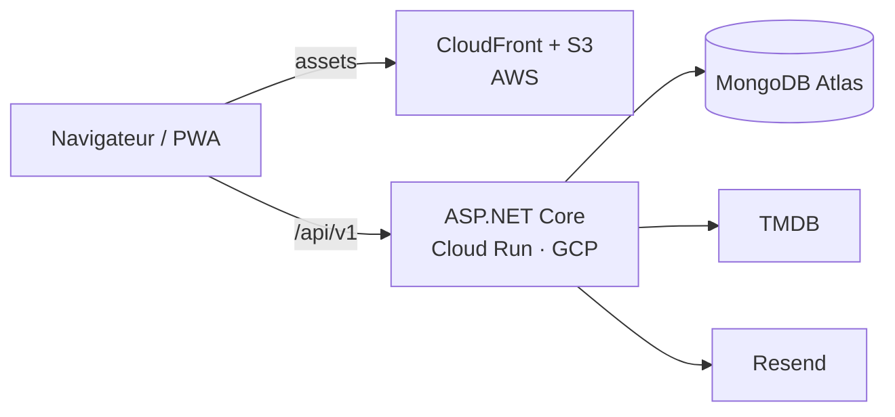

# Movie Picker

Coordonner et piloter un projet de développement logiciel

Bloc 3, Coordonner et piloter un projet de développement d'applications logicielles 
Expert en développement logiciel, RNCP 39583

Adrien MORAND, 16 septembre 2026

<!--
DUREE 0:10.

Ne rien commenter ici. Enchainer immediatement sur la diapo 2.
-->

---

# Le produit, en production

Movie Picker choisit à plusieurs quel film regarder. En ligne depuis février, et utilisé. <b>Je commence par vous le montrer.</b>

<b>10</b>versions en production du 27/02 au 07/09/2026

<b>17</b>comptes utilisateurs 19 soirées créées

<b>74 %</b>des soirées menées jusqu'au tirage

<b>100 %</b>de disponibilité sondes sur 3 continents

<b>1. J'organise</b> une soirée, une date, quelques règles

<b>2. J'invite</b> un lien, un QR code, rien à installer

<b>3. On propose</b> les films qu'on a envie de voir

<b>4. On vote</b> et on signale ce qu'on a déjà vu

<b>5. La roue tranche</b> le film de la soirée est désigné

<b>6. Il en reste une trace</b> historique, profil, envie de revenir

Sur la version <b>en production</b>, celle qu'utilisent les 17 comptes inscrits. Deux appareils : le mien, et celui d'un invité. <b>Quatre minutes cinquante</b>, puis la présentation du pilotage.

<!--
DUREE 0:50, PUIS LA DEMONSTRATION EN DIRECT, 4:50. ELEMENT IMPOSE 14 : la
demonstration des fonctionnalites. COMPETENCE C3.4.2, ELIMINATOIRE.

La presentation OUVRE sur le produit : le jury voit le logiciel avant d'entendre
comment il a ete pilote. Dire la phrase de bascule : « je commence par vous
montrer le produit, comme je le montrerais a un client. Tout ce qui suivra,
planning, indicateurs, arbitrages, porte sur ce logiciel-la. »

Quatre chiffres, puis les six temps annonces presque tels quels, puis la
demonstration. Au retour, diapo 3 : changement de registre, on parle au jury.

Objectif unique : etablir qu'on parle d'un logiciel reellement exploite. Tout le
reste de la presentation en depend, et la demonstration se fera dessus.

Quatre chiffres, pas plus. Le plus parlant est le 74 % : ce n'est pas un chiffre
d'inscription, c'est un chiffre d'USAGE ABOUTI. Les gens qui creent une soiree
vont au bout dans trois cas sur quatre.

Ne pas detailler les fonctionnalites, elles seront montrees en direct.

A PREPARER : capture de l'application en production a inserer sous les chiffres
si le rendu le permet.

SI ON QUESTIONNE le volume : 17 comptes, c'est modeste et je ne le presente pas
autrement. C'est un usage reel et mesure, pas un usage de masse.

= = =

COMPETENCE C3.4.2, ELIMINATOIRE.

CHANGEMENT DE REGISTRE, il doit s'entendre. Les six chapitres precedents
s'adressaient a un jury de professionnels ; celui-ci s'adresse a un client. Le
vocabulaire change, le debit ralentit, les diapos se vident.

La derniere ligne est la seule qui compte pour le critere « le logiciel est
utilisable » : c'est la version en production, pas une maquette, et il y a un
second appareil.

MOTS INTERDITS pendant toute la demonstration : API, base de donnees,
deploiement, cache, jeton. Si l'un sort, NE PAS se reprendre a voix haute — se
reprendre attire l'attention sur l'erreur. Continuer.

Si une question technique arrive en cours de demonstration : repondre dans le
registre client, puis « je peux le detailler apres la demonstration si vous le
souhaitez ». Ne pas basculer au milieu du parcours.

=== BASCULE DE REPLI, si le reseau lache ===
Niveau 1, reseau lent : partage de connexion du telephone, deja active.
Niveau 2, reseau indisponible : environnement local deja demarre. DIRE la
phrase preparee : « le reseau de la salle ne suit pas, je bascule sur la meme
version, installee sur mon poste. » Puis continuer sans commentaire.
Niveau 3, poste defaillant : video enregistree, commentee par-dessus.
Niveau 4 : captures imprimees.
Un incident annonce calmement se lit comme de la preparation ; un incident subi
en silence se lit comme une defaillance du logiciel.
-->

---

# Deux registres, annoncés maintenant

<b>Le réel</b> — chiffré, daté, vérifiable. 
Le projet a été <b>exécuté seul</b>. Commits, versions, mesures de production et retours utilisateurs sont ceux d'un projet à une personne.

<b>L'organisation cible</b> — une projection, jamais une équipe qui a existé. 
4 profils, sur lesquels sont construits la matrice RACI, l'affectation des missions, la grille de compétences et le plan de développement.

### La suite, chapitre par chapitre

<b>1.</b> Planifier l'exécution<u>C3.1, éliminatoire</u>

<b>2.</b> Piloter l'avancement<u>C3.2.1, éliminatoire</u>

<b>3.</b> Un cas d'arbitrage<u>C3.2.2</u>

<b>4.</b> Piloter l'équipe<u>C3.3.1</u>

<b>5.</b> Les besoins en compétences<u>C3.3.2</u>

<b>6.</b> Rendre compte au commanditaire<u>C3.4.1</u>

<b>7.</b> Bilan, et la validation du périmètre livré<u>C3.4.2, éliminatoire</u>

Vous venez de voir le produit. La suite raconte comment il a été piloté pour arriver là, une compétence par chapitre.

<!--
DUREE 0:40. RETOUR AU REGISTRE JURY, apres la demonstration. DIAPO CRITIQUE
POUR LES 15 MINUTES DE QUESTIONS.

Dire la phrase telle quelle : « Le projet a ete execute seul. Chaque fois que je
parlerai d'affectation de missions ou de montee en competences, je decrirai
l'organisation cible du projet, et je le signalerai. »

Un jury qui decouvre le caractere projete en fin de presentation le vit comme
une dissimulation. Un jury prevenu des le debut l'evalue comme un exercice de
conception d'organisation. C'est le meme contenu, ce n'est pas la meme note.

Ne pas s'excuser, ne pas justifier longuement. Annoncer, puis avancer.
-->

---

# 1. Planifier : un flux, deux horizons

<b>Kanban léger à revues de version.</b> Deux règles, aucune cérémonie, et deux outils qui ne se contredisent pas parce qu'ils n'opèrent pas à la même échelle de temps.

<b>Travail en cours limité à 1.</b> Un seul sujet fonctionnel à la fois, hors correctif de production.

<b>Critère de sortie.</b> Rien n'est terminé avant d'être déployé <i>et vérifié</i> en production.

Priorisation permanentepérimètre revu 10 fois, sans replanification

Aucune cérémonie non soutenablele temps va à la production et à la revue

Réaction à un signal de productionanomalies traitées hors du flux

Scrum et cycle en V écartésrituels sans interlocuteur, périmètre figé trop tôt

<b>Le mois, le trimestre</b>Rétroplanning et Gantt<i>Où en est-on des phases et des échéances ? Une date imposée devient une date de fin de lot : la capacité fixe le périmètre, jamais l'inverse</i>

<b>La journée, la semaine</b>Tableau de flux<i>Que fait-on maintenant, qu'est-ce qui bloque ? Aucune fiche ne porte de date de fin, <b>seules les versions en portent une</b></i>

Le Gantt porte les phases et les jalons, jamais le contenu des fiches. Les quatre dates non négociables sont ses jalons ◆, diapositive suivante.

<!--
DUREE 1:30. ELEMENTS IMPOSES 1 ET 2 : la methodologie choisie, et l'outil de
planification. CRITERES : le choix est justifie AVEC LES BENEFICES ATTENDUS ;
l'outil est argumente avec ses benefices ET compatible avec la methodologie.

Deux temps : la colonne de gauche est la methode, la colonne de droite est
l'outillage. Le schema de droite EST la reponse au critere de compatibilite, la
phrase en gras est a dire mot pour mot.

CRITERE : le choix est justifie AVEC LES BENEFICES ATTENDUS.

Ne pas definir Kanban, le jury connait. Aller au « pourquoi ici » et aux
benefices constates, colonne de droite.

La formule a dire : « Kanban leger » n'est pas un Kanban degrade, c'est un Kanban
dont l'outillage a ete dimensionne a la taille reelle du projet. Ce qui a ete
ecarte du Kanban lui-meme, ce sont les metriques de flux — temps de cycle par
classe de service, diagramme de flux cumule — qui exigent un volume de fiches que
ce projet n'atteint pas.

Le motif d'ecartement de Scrum doit etre dit sans mepris : ce n'est pas Scrum qui
est mauvais, c'est son rapport cout / benefice a une personne.

SI ON QUESTIONNE : « pourquoi pas Scrum en solo, juste pour la discipline ? »
La discipline vient de la limite de travail en cours et du critere de sortie, qui
sont conserves. Ce qui est ecarte, ce sont les rituels sans interlocuteur.

= = =

CRITERES : l'outil de planification est argumente avec ses benefices attendus,
ET il est compatible avec la methodologie choisie.

Le critere de compatibilite est celui que les candidats ratent : ils presentent
un Gantt sur une methode agile sans expliquer comment les deux coexistent. Le
tableau de gauche est la reponse, et la phrase en gras est a dire mot pour mot.

La contradiction classique entre Gantt et Kanban nait quand on tente de planifier
des taches individuelles a date fixe dans un flux. Ce n'est pas ce qui est fait
ici.

Ce que le retroplanning a produit concretement : le contenu de chaque version a
ete arrete par la capacite restante avant la prochaine echeance, pas par une
liste de souhaits.
-->

---

# Le planning en cinq phases

Les phases <b>se chevauchent</b> — c'est la signature d'un pilotage en flux, et ce qu'un cycle en V interdit.

fév.
mars
avril
mai
juin
juil.
août
sept.

Étude

Demande, parties prenantes

<i style="grid-column:1/22"></i>

Comparatif de stack, faisabilité

<i style="grid-column:3/48"></i>

Mesure

Chiffrage 98 J/H, budget, risques

<i style="grid-column:22/63"></i>

Usage réel en production

<i style="grid-column:41/145"></i>

Conception

Modèle de données, contrat d'API

<i style="grid-column:3/43"></i>

Architecture hexagonale

<i style="grid-column:17/63"></i>

Composants mobile-first

<i style="grid-column:34/94"></i>

Réalisation

Lot 1, MVP

<i style="grid-column:1/18"></i>

Lot 2, migration de l'API

<i style="grid-column:20/27"></i>

Lot 3, V1 produit

<i style="grid-column:27/82"></i>

Lot 4, clôture du titre

<i style="grid-column:83/180"></i>

V1.1 à V1.5.0, <i>hors chiffrage</i>

<i class="off" style="grid-column:83/194"></i>

Restitution

Mises en production, v0.1.0 → v1.5.0

<i style="grid-column:1/194"></i>

Restitutions au commanditaire

<b style="grid-column:105/106"></b><b style="grid-column:147/148"></b><b style="grid-column:176/177"></b><b style="grid-column:202/203"></b>

Du 27 février au 16 septembre 2026. Jalons ◆ : Bloc 1 le 11/06, Bloc 2 le 23/07, Bloc 4 le 21/08, <b>Bloc 3 le 16/09</b>.

<!--
DUREE 1:10, la plus longue diapo du chapitre. ELEMENT IMPOSE 2 (suite).
CRITERE : le planning permet de visualiser les phases d'ETUDE, de MESURE, de
CONCEPTION, de REALISATION, de RESTITUTION. Les cinq mots sont dans la grille,
les cinq sections sont a l'ecran. Les nommer a voix haute une par une.

Contenu de chaque phase, en balayant le diagramme :
- ETUDE : demande, parties prenantes, comparatif de stack, faisabilite, veille,
  hierarchisation MoSCoW.
- MESURE : deux temps, et c'est volontaire. En amont le chiffrage en jours-homme,
  le budget, la cartographie des risques. En production le releve de l'usage
  reel, qui a alimente les arbitrages de la V1.4.
- CONCEPTION : modele de donnees, architecture hexagonale, contrat d'interface,
  systeme de composants mobile-first.
- REALISATION : les 4 lots. La barre ORANGE est celle qui compte : les versions
  V1.1 a V1.5.0 sont hors du chiffrage initial. On y revient en diapo 14.
- RESTITUTION : deux registres, les 10 mises en production vers l'utilisateur, et
  les 4 restitutions du titre vers le commanditaire.

LE POINT A NE PAS MANQUER : dire explicitement que les barres se recouvrent, et
pourquoi c'est la signature d'un pilotage en flux. Un Gantt dont les barres se
suivent sans se recouvrir decrirait un cycle en V.

SI ON QUESTIONNE : « vos documents de cadrage sont dates de juin, votre phase
d'etude de fevrier. » Les DECISIONS d'etude ont ete prises en fevrier et mars,
tracees dans l'historique du depot et dans les choix techniques eux-memes. Leur
FORMALISATION documentaire est intervenue en juin pour le Bloc 1. La decision
precede le document. Faiblesse de tracabilite assumee, corrigee depuis.
-->

---

# Quatre lots, 98 jours-homme

Chiffrage <b>analogique</b>, établi au cadrage, marge d'incertitude de <b>20 %</b> sur les lots de développement.

<i style="width:27.5%;background:var(--s1)">Lot 1, MVP, 27 J/H</i>
<i style="width:13.3%;background:var(--s3)">Lot 2, 13</i>
<i style="width:35.7%;background:var(--s2)">Lot 3, V1 produit, 35 J/H</i>
<i style="width:23.5%;background:var(--s4);color:#3b2f00">Lot 4, clôture, 23 J/H</i>

<b style="color:var(--s1)">1. MVP</b> Socle, API des soirées, catalogue de films, vote, tirage, premier déploiement

<b style="color:var(--s3)">2. Migration de l'API</b> ASP.NET Core, architecture hexagonale, tests d'intégration, redéploiement

<b style="color:var(--s2)">3. V1 produit</b> Comptes, historique, partage, temps réel, thème, i18n, sécurité de la chaîne

<b style="color:#7a5a00">4. Clôture du titre</b> Cadrage, pilotage, sécurité et accessibilité, recette, exploitation

Aucune méthode paramétrique n'était applicable, faute d'historique comparable. <b>Ce chiffrage n'est pas rétrospectif</b> : il sert de base au budget et de référence de pilotage. L'écart avec la charge réellement consommée est traité au chapitre 2, et il ne dit pas ce qu'on croit.

<!--
DUREE 0:50. CRITERE : le planning est decoupe en phases, en taches ou LOTS.

Ne pas lire le contenu des lots, il est a l'ecran. Dire les quatre intitules et
les quatre charges, puis passer a la methode d'estimation, qui est ce qu'un jury
de professionnels va reellement interroger.

Annoncer des maintenant que l'ecart previsionnel / reel sera traite au chapitre 2.
Cela evite la question « et ca a tenu ? » posee trop tot, et cela montre que le
chiffrage a servi de reference de pilotage et pas seulement de piece a produire.

SI ON QUESTIONNE : « 20 % de marge, c'est beaucoup ou peu ? » C'est la marge
usuelle d'une estimation analogique sans historique. Sur les lots documentaires
elle s'est revelee insuffisante — c'est le point de vigilance 2.
-->

---

# Les ressources nécessaires

### Humaines

Les 4 profils de l'<b>organisation cible</b>, définis par la compétence qu'ils portent

Lead, chef de projet<u>architecture, arbitrage</u>

Développeur front<u>React, accessibilité</u>

Développeur back<u>C#, hexagonal</u>

DevOps et QA, mi-temps<u>CI/CD, supervision</u>

Répartition des 98 J/H au chapitre 4.

### Matérielles et techniques

Un poste par profil<u>environnement reproductible</u>

Monorepo outillé<u>tests, analyse, formatage</u>

Chaîne CI/CD<u>intégration et déploiement</u>

Hébergement<u>sans serveur, CDN, base managée</u>

Services tiers<u>catalogue, e-mails, supervision</u>

### Financières

<b>34 300 €</b>de valeur de développement, HT

<b>&lt; 200 €/an</b>de trésorerie réelle : infrastructure 0 €/mois puis 1 à 5 €, domaine 10 €/an

<b>0 €</b>de licence. Une décision de conception prise sous contrainte de budget, pas une conséquence

<!--
DUREE 0:50. ELEMENT IMPOSE 3 : les ressources necessaires.

Trois familles, une phrase forte par famille, aucune lecture de tableau.

HUMAINES : rappeler d'un mot qu'il s'agit de l'organisation cible. C'est le
deuxieme rappel apres la diapo 3, il doit etre naturel, pas defensif. Le critere
d'affectation est la COMPETENCE PIVOT, pas la disponibilite.

MATERIELLES : ne pas enumerer. Dire « poste de travail, outillage, chaine de
livraison, hebergement, services tiers » et laisser lire.

FINANCIERES : la phrase a dire est celle du bandeau, le contraste entre 200 euros
et 34 300 euros. C'est ce qui parle a un jury de professionnels. L'absence de
licence payante conditionne la soutenabilite du service au-dela du titre.

SI ON QUESTIONNE le « 0 euro/mois » : l'hebergement du front est dans ses douze
mois offerts. La ligne suivante du budget est donc datee, pas hypothetique — voir
diapo 13.
-->

---

# La matrice RACI, et le handicap dedans

Lead

Front

Back

DevOps

Client

Cadrage et périmètre de version

A R

C

C

C

C

Architecture applicative

A R

C

R

C

I

Développement de l'interface

A

R

C

C

Développement de l'API

A

C

R

C

Accessibilité du produit

A

R

C

C

C

Chaîne, supervision, sécurité

A

C

C

R

I

Arbitrage de périmètre ou de charge

A R

C

C

C

C

<b>Inclusion et adaptation des postes</b>

A R

C

C

C

I

A approuve et rend compte
R réalise
C consulté
I informé

Extrait de 8 lignes, matrice complète de 15 lignes en annexe A6.

### Trois propriétés

<b>Un seul A par ligne</b>, jamais partagé

<b>Le R se lit avec le A</b> : qui réalise n'est pas qui rend compte

<b>Les acteurs externes y figurent</b>, sinon on oublie de les solliciter

<b>Le handicap n'est pas une mention, c'est une ligne.</b> Aucune activité ne présuppose une capacité physique, et « inclusion et adaptation des postes » porte un <b>responsable identifié</b>, pas un sujet diffus dont personne ne répond. Les aménagements et le volet produit : diapositive 19.

<!--
DUREE 1:00. CRITERE : les taches sont assignees selon les competences (RACI) ET
tiennent compte des personnes en situation de handicap. Le second point est un
critere a part entiere, pas une remarque.

Ne pas lire la matrice. Dire les trois proprietes, puis la ligne handicap.

Sur le handicap ici, une seule idee : le sujet porte un RESPONSABLE IDENTIFIE
dans la matrice. C'est ce qui distingue une prise en compte reelle d'une clause
de style. Les amenagements concrets et l'accessibilite du produit sont en diapo
19, ne pas les anticiper ici — ce serait la meme chose dite deux fois.

Rappel de posture : c'est l'organisation cible. Troisieme et dernier rappel avant
le chapitre 4.
-->

---

# Sept points de vigilance, un seul d'organisation

Six risques de projet, chacun avec son indicateur de contrôle et sa parade. Et un risque d'organisation, d'une autre nature.

<b>1. Concentration des rôles sur une personne</b> 
1 personne capable de mener une mise en production. 
Parade : procédures écrites et versionnées, infrastructure en code, décisions consignées. <b>C'est ce risque qui rend l'organisation cible nécessaire, et non décorative.</b>

<b>2. Sous-estimation des lots documentaires</b>, l'autre risque structurel. Indicateur : écart prévu / consommé sur le lot de clôture. Parade : rétroplanning depuis les échéances, périmètre ajusté sur la capacité.

<b>3.</b> Dépendance au catalogue de films externe<u>cache, débit limité, saisie manuelle</u>

<b>4.</b> Transport des e-mails transactionnels<u>volume surveillé, fournisseur substituable</u>

<b>5.</b> Durcissement de la politique de sécurité du contenu<u>réalisé en production, traité</u>

<b>6.</b> Absence de déploiement progressif<u>assumé, test de fumée bloquant</u>

<b>7.</b> Instabilité de la chaîne de vérification<u>contrôle rendu déterministe</u>

Un indicateur par point : taux d'erreur des appels au catalogue, volume d'e-mails rapporté au plafond, sondes après chaque modification, test de fumée et erreurs serveur, part des échecs sans cause réelle.

<!--
DUREE 1:00. CRITERE : les points de vigilance sont soulignes. Dernier critere de
C3.1, competence ELIMINATOIRE : le chapitre ne peut pas se terminer sans lui.

Ne pas lire les sept lignes. Deux temps :

1. « Six de ces points sont techniques, chacun porte un indicateur et une
parade. » Citer le point 5 comme exemple, parce qu'il s'est REALISE en
production : un durcissement de la politique de securite du contenu a bloque les
affiches de films et les avatars. L'incident et sa correction sont traces. Un
point de vigilance qui s'est realise et qui a ete traite vaut mieux qu'une liste
theorique.

Le point 6, absence de deploiement progressif, est une faiblesse assumee. La dire
ici plutot que de la laisser decouvrir.

2. « Le point 1 est d'une autre nature. » C'est la transition : l'indicateur vaut
1, et cette valeur EST le probleme. Enchainer sur le fait que c'est ce risque qui
rend l'organisation cible necessaire.
-->

---

# 2. Piloter l'avancement : l'outil de suivi

Le suivi est tenu <b>dans GitHub</b>, là où le travail se produit. Le critère de choix est la <b>distance entre le travail et sa trace</b>.

### Cinq surfaces, cinq natures de trace

<b>5</b>issues : anomalies, demandes entrantes

<b>26 / 77</b>pull requests fusionnées : revue, décision d'intégration

<b>449</b>exécutions de la chaîne : vérification, déploiement

<b>10</b>releases : points de livraison datés

Cinquième surface, les feuilles de route versionnées, 106 items. <b>Aucun indicateur retenu ne demande de saisie déclarative</b> : la trace naît du geste de travail. Un outil extérieur au dépôt impose une double saisie, la première chose abandonnée sous pression.

### L'adéquation avec Kanban

Flux continu, pas d'itération fixe<u>aucun sprint, les versions ont une date</u>

Travail en cours limité à 1<u>une branche fonctionnelle à la fois</u>

Priorisation permanente<u>feuilles de route réordonnées par commit</u>

Sortie = déployé et vérifié<u>fusion → déploiement → test de fumée</u>

Correctif prioritaire<u>anomalies étiquetées, hors flux</u>

<!--
DUREE 1:10. ELEMENT IMPOSE 4 : l'outil de suivi de projet.
CRITERE : l'outil est en adequation avec le projet ET avec la methodologie.

La phrase d'ouverture, a dire telle quelle : « un outil de suivi exterieur au
depot impose une double saisie, et la double saisie est la premiere chose
abandonnee sous pression sur un projet a une personne. Un indicateur abandonne
sous pression est un indicateur qui ment exactement au moment ou on en a
besoin. »

Puis le tableau de droite, qui est celui que la grille demande : ligne par ligne,
la propriete de la methode et ce que l'outil fournit. Insister sur la premiere :
un outil a sprints aurait impose une cadence que l'alternance ne permet pas de
tenir, et aurait produit des indicateurs faux.

DIRE AUSSI LA LIMITE, avant qu'on la trouve : le tableau de flux consolide est
POSTERIEUR au travail qu'il represente. La matiere, elle, est datee au geste
pres — 833 commits, 77 pull requests, 449 executions, 10 releases, toutes
horodatees au moment ou elles se sont produites. Le tableau change la lisibilite
de cette matiere, il ne la cree pas.

SI ON QUESTIONNE : « pourquoi pas Jira ou Trello ? » La saisie declarative. Pas
« c'etait plus simple ».

A PREPARER : capture du tableau de flux GitHub Projects, a inserer a gauche si le
tableau est structure avant l'oral.
-->

---

# Comment un indicateur entre au tableau de bord

Quatre conditions. Celles qui échouent sont écartées explicitement — un tableau de bord exhaustif dont la moitié n'est jamais relevée ne pilote rien.

<b>1. Mesurable sans saisie</b> Produit par un outil, pas par une déclaration

<b>2. Quantifiable</b> Il porte un nombre, pas une appréciation

<b>3. Rattaché à une décision</b> On sait d'avance ce qu'on ferait s'il franchissait un seuil

<b>4. Reproductible</b> Un tiers le recalcule depuis le dépôt public

<b>Avancement</b>Où en est le périmètre ?

<b>Délais</b>La cadence tient-elle ?

<b>Coûts</b>Le budget dérive-t-il ?

<b>Risques</b>Qu'est-ce qui menace la livraison ?

<b>Ressources humaines</b>La charge est-elle soutenable ?

<b>Écartés faute de mesurabilité</b> — et le dire vaut mieux qu'un tableau où tout est vert. 
La <b>vélocité en points</b> : pas d'estimation systématique en amont. Le <b>temps de cycle d'une fiche</b> : l'entrée en flux n'est pas horodatée de façon fiable. La <b>charge ressentie</b> : non quantifiable en l'état.

<!--
DUREE 1:00. CRITERE : les indicateurs sont mesurables et quantifiables, et
permettent de suivre les DELAIS, les COUTS et l'AVANCEMENT.

Cette diapo ne donne AUCUNE valeur : elle donne la methode. Les valeurs sont sur
les deux tableaux de bord qui suivent. Ne pas les anticiper ici.

Dire les quatre conditions en appuyant sur la TROISIEME : « un indicateur sans
decision associee est un ornement ». C'est la condition qui a fait le tri.

Puis annoncer les cinq axes, qui sont exactement les cinq que la grille demande —
avancement, couts, delais, risques, ressources humaines — et dire qu'ils
arrivent sur les deux diapos suivantes, l'une pour l'avancement et les delais,
l'autre pour les couts, les risques et les ressources.

LE GESTE QUI COMPTE : citer les trois indicateurs ECARTES et pourquoi. Un
candidat qui dit ce qu'il n'a pas su mesurer est plus credible qu'un candidat
dont tous les voyants sont au vert. C'est trente secondes bien depensees.
-->

---

# Tableau de bord : avancement et délais

Commits intégrés sur la branche principale — <b>833</b>

<i style="height:0.4%"></i>

<i style="height:12%"></i>

<i style="height:32%"></i>

<em>150</em><i style="height:66%"></i>

<em>227</em><i style="height:100%"></i>

<i style="height:85%"></i>

<i style="height:56%"></i>

<i style="height:15%"></i>

Fusions sur la branche principale — <b>122</b>

<i class="b" style="height:0%"></i>

<i class="b" style="height:0%"></i>

<i class="b" style="height:2%"></i>

<em>6</em><i class="b" style="height:12%"></i>

<em>39</em><i class="b" style="height:75%"></i>

<em>52</em><i class="b" style="height:100%"></i>

<i class="b" style="height:35%"></i>

<i class="b" style="height:12%"></i>

fév.

mars

avril

mai

juin

juil.

août

sept.

<b>Le pic de juin n'est pas un pic de production.</b> Les fusions passent de 6 à 39 quand les commits ne passent que de 150 à 227. Ce qui a changé, c'est le <b>découpage</b> : le travail est passé de commits directs à des branches courtes. L'indicateur de fusions ne mesure pas la même chose avant et après juin.

### Cadence de livraison

<b>17 j</b>écart médian entre deux versions

<b>4 / 4</b>échéances de restitution tenues, écart 0

| Version | Date | Écart |
|---------|------|------:|
| 0.1.0 → 1.0.0 | 27/02 → 19/05 | **81 j** |
| 1.0.0 → 1.3.2 | mai → juillet | 6 à 19 j |
| 1.3.2 → 1.4.0 | 25/07 → 25/08 | 31 j |
| 1.4.0 → 1.4.1 | 25/08 → 04/09 | 10 j |
| 1.4.1 → 1.5.0 | 04/09 → 07/09 | 3 j |

Un seul intervalle est anormal : les <b>81 jours</b> entre le prototype et la première version de production. Il contient la migration de l'API — <b>c'est cet indicateur qui a transformé une dérive en arbitrage explicite.</b> C'est le chapitre 3.

<!--
DUREE 1:00. CRITERE : le tableau de bord integre l'avancement et le suivi des
delais.

Ne PAS commenter les huit mois un par un. Deux lectures, pas plus :

1. Le pic de fusions de juin — 6 puis 39 — alors que les commits ne passent que
de 150 a 227. Ce qui a change c'est la pratique de decoupage, pas la production.
Le dire AVANT que le jury le remarque : c'est ce qui prouve qu'on lit ses propres
indicateurs au lieu de les afficher.

2. Les 81 jours entre le prototype et la V1. Seul intervalle anormal, il contient
la migration de l'API, et c'est lui qui a rendu l'arbitrage visible. Annoncer le
chapitre 3 ici.

Sur les echeances : ecart zero sur les quatre, et deux d'entre elles sont
HORODATEES dans le depot — passe finale du dossier Bloc 2 le 23/07, export PDF du
Bloc 4 le 21/08. Ce n'est pas de la discipline, c'est de la methode : le
retroplanning traite ces dates comme des fins de lot, et c'est le PERIMETRE de la
version qui absorbe la variation, jamais la date. La preuve : quand la capacite
s'est reduite en aout, c'est l'intervalle entre versions qui s'est allonge.

SI ON QUESTIONNE la decroissance d'aout et septembre : elle est voulue, le
perimetre produit se referme au profit des livrables de restitution du titre.
-->

---

# Tableau de bord : coûts, risques, ressources

### Coûts, prévu / réel

| Poste | Prévu | Réel |
|-------|------:|-----:|
| Infrastructure | 1 à 5 €/mois | **0 €** |
| Trésorerie | 20 à 190 €/an | **≈ 10 €** |
| Valeur de dév. | 34 300 € | ≈ 30 800 € |

<b>Deux échéances de coût sont suivies bien qu'elles vaillent zéro aujourd'hui</b> : la fin des 12 mois offerts du front, et le franchissement des 512 Mo de la base. Un budget qui ne suit que la dépense actuelle ne pilote rien.

### Risques

Vulnérabilités HIGH/CRITICAL<u style="color:var(--ok)">0 ✓</u>

Couverture de tests<u style="color:var(--ok)">86,6 % ✓</u>

Quality Gate<u style="color:var(--ok)">A/A/A ✓</u>

Disponibilité<u style="color:var(--ok)">100 % ✓</u>

Erreurs serveur<u style="color:var(--ok)">0,026 % ✓</u>

Anomalies ouvertes<u style="color:var(--ok)">0 / 3 ✓</u>

Stabilité de la chaîne<u style="color:#b45309">78 % ⚠ alerte</u>

Facteur de bus<u style="color:#b45309">1 ⚠ alerte</u>

Seuil de décision de la chaîne : <b>80 %</b>. En dessous, analyse des causes.

### Stabilité de la chaîne

<em>52 %</em><i style="height:52%;background:#d97706"></i>

<em>94 %</em><i style="height:94%"></i>

<em>78 %</em><i style="height:78%;background:#d97706"></i>

<em>38 %</em><i style="height:38%;background:#d97706"></i>

juin 48 exéc.

juil. 99

août 36

sept. 8

Le passage de <b>52 à 94 %</b> suit une correction <b>décidée à partir de cet indicateur</b> (v1.3.1). La valeur de septembre porte sur <b>8 exécutions</b> : elle ne se lit pas comme une tendance.

<b>Ressources humaines : 88 jours actifs sur 191, soit 3,1 par semaine — mais une amplitude de 1 à 7, une série de 10 jours consécutifs, 5 semaines à zéro.</b> La charge a été <b>absorbée, pas pilotée</b>. C'est cette mesure, et non une intuition, qui justifie l'organisation cible du chapitre 4.

<!--
DUREE 1:00. CRITERE : le tableau de bord integre le suivi des COUTS, des RISQUES
et des RESSOURCES HUMAINES. Les trois axes restants du critere sont ici.

COUTS, une phrase : le budget tient parce qu'il a ete concu pour tenir, avec une
contrepartie technique assumee — le demarrage a froid de 3,8 s. Puis le point de
pilotage : deux echeances de cout suivies alors qu'elles valent zero aujourd'hui.

RISQUES : ne pas parcourir la colonne. Aller aux DEUX voyants oranges. Le
premier, la stabilite de la chaine, est celui qui prouve la boucle mesure ->
decision -> effet remesure : 52 %, correction, 94 %. C'est l'histogramme de
droite, et c'est la seule chose a commenter de ce cote.

RH : c'est la transition vers le chapitre 4. La phrase a dire : « une semaine a
sept jours travailles suivie d'une semaine a zero tient sur sept mois de projet
etudiant, elle ne tient pas sur une equipe et une exploitation dans la duree. »

SI ON QUESTIONNE : « votre chaine echoue une fois sur cinq. » Sur la fenetre
complete oui, 78 %. La serie mensuelle est plus parlante, et la valeur de
septembre porte sur huit executions.
-->

---

# L'écart n'est pas où on le cherche

Charge : <b>98 J/H prévus</b> → <b>≈ 88 reconstitués</b>, soit <b>−10 %</b>, dans la marge de 20 %.

Pris seul, cet écart donnerait l'image d'une estimation juste.

Où sont passés les 88 jours actifs

<i style="width:26%;background:var(--s1)">23 j · 26 %</i>
<i style="width:74%;background:#d97706">65 j · 74 %</i>

D'où viennent les 74 items de périmètre livrés

<i style="width:31%;background:var(--s1)">23 items</i>
<i style="width:69%;background:#d97706">51 items · 69 %</i>

Lots 1 à 3, chiffrés au cadrage
Hors chiffrage initial (V1.1 → V1.5.0)

<b>Ce n'était pas une dérive de charge, c'était un glissement de périmètre.</b> Huit livraisons après la V1, dont cinq versions mineures, <b>jamais chiffrées</b>. Le périmètre a triplé pendant que la charge restait dans l'enveloppe.

### Trois décisions prises à partir d'une mesure

| Mesure | Décision | Effet remesuré |
|--------|----------|----------------|
| 81 jours entre le prototype et la V1 | Arbitrer la migration de l'API — **chapitre 3** | Retour à **une version tous les 17 jours** |
| Chaîne à 52 %, échecs sans cause réelle | Portes de qualité bloquantes **et** déterministes | **94 %** le mois suivant |
| 59 PR de dépendances pour 9 fusionnées | Regroupement mensuel, audit à chaque commit | **0 vulnérabilité** ouverte, sans fusion non relue |

<b>Ce que le suivi n'a pas vu.</b> Aucun indicateur ne comparait le périmètre courant au périmètre chiffré : le glissement de 51 items n'a été visible qu'<i>a posteriori</i>. <b>C'est le premier compteur que j'ajouterais.</b>

<!--
DUREE 1:10. C'est la diapo qui prouve que le suivi a servi a DECIDER et pas
seulement a mesurer. Elle amene le chapitre 3.

Trois temps, sans lire les tableaux :

1. Les deux barres de gauche. « L'ecart de charge est de moins 10 %, dans la
marge. Ce n'est pas la bonne lecture. » Puis designer la barre orange : 74 % des
jours actifs et 61 % du produit final sont HORS du chiffrage initial. La derive
n'etait pas une derive de charge, c'etait un glissement de perimetre que rien ne
mesurait.

2. Les trois decisions. C'est le coeur de la competence : chaque ligne est une
mesure, une decision, et un effet REMESURE ensuite. Ne pas en developper plus
d'une — la troisieme est la plus parlante : cinquante pull requests ouvertes puis
fermees sans fusion ne sont pas un gaspillage, c'est le symptome qu'un
automatisme etait mal regle. L'indicateur a servi a regler la frequence de
l'automatisme, pas a juger le travail.

3. L'autocritique du bandeau orange. Ne pas l'escamoter, c'est elle qui rend les
deux premiers temps credibles.

SI ON QUESTIONNE : « comment reconstituez-vous 88 J/H sans releve de temps ? »
Par les jours distincts portant au moins un commit, 1 jour actif pour 1 J/H,
incertitude d'au moins 20 %. La reconstitution est FAIBLE sur les cinq premieres
semaines, ou les commits etaient groupes — le premier commit du projet porte
3 400 lignes a lui seul. La charge reelle est vraisemblablement SUPERIEURE a 88.
Un indicateur ne mesure que la pratique qui le produit.
-->

---

# 3. Un cas d'arbitrage : la dérive constatée

Le MVP est livré sur une pile qui ne portera pas la suite. Et le coût de la corriger croît chaque jour.

<b>16/03, 16:48</b><b>MVP terminé</b>, 944 lignes, 18 fichiers, 12 routes. La feuille de route s'arrête à l'étape 16, <b>aucune migration n'y figure</b>

<b>18/03, 11:57</b>Décision exécutée, document d'aide à la décision versionné

<b>18/03, 12:12</b>Ancienne API retirée, <b>15 min</b> après

<b>19/03, 16:52</b>Migration terminée

La migration est <b>absente</b> de la feuille de route quand le MVP est déclaré terminé, et ajoutée deux jours plus tard. <b>C'est ce qui en fait un arbitrage et non l'exécution d'un plan.</b>

Quatre exigences que l'API du MVP ne tenait pas

Typage arrêté à la compilation<u>typage effacé à l'exécution</u>

Sécurité fournie par le cadre<u>composants à assembler un par un</u>

Socle à support long terme<u>cycle court, veille plus fréquente</u>

Architecture en couches<u>18 fichiers, aucune séparation</u>

<b class="text-4xl" style="color:#b45309">1 → 47</b> 
Au 18 mars, le périmètre à réécrire pesait <b>944 lignes</b>. La même API en porte <b>44 663</b> aujourd'hui. <b>Le coût de la décision croissait chaque jour.</b>

<!--
DUREE 1:00. ELEMENT IMPOSE 5 (1/2).
CRITERE : la problematique qui necessite un arbitrage est exposee AVEC SES
CONSEQUENCES.

Ouvrir par la phrase qui desamorce la question piege : « le MVP a ete livre sur
une pile que je ne voulais pas garder pour la suite. L'etude comparative du
Bloc 1 retient .NET, mais elle a ete formalisee en juin : elle consigne la
decision finale, pas la chronologie. La verite est celle de l'historique. »

Puis UNE seule ligne du tableau de gauche : la migration est ABSENTE de la
feuille de route quand le MVP est declare termine, et ajoutee deux jours plus
tard. C'est ce qui fait de ce cas un arbitrage.

Terminer sur le rapport de 1 a 47, que le jury retiendra. Preciser AUSSITOT que
ce chiffre est la justification A POSTERIORI, pas l'argument d'origine : le 18
mars on savait que le cout croitrait, pas de combien. C'est la nature meme d'un
arbitrage — decider avec l'information disponible pendant que la fenetre est
ouverte.

Sur la troisieme exigence, si on la conteste : la charge de veille de
l'ecosysteme npm s'est verifiee ensuite — 59 des 78 pull requests du projet sont
des montees de dependances — mais c'etait une ANTICIPATION en mars, pas une
mesure.
-->

---

# Quatre options, le logigramme tranche

<b>A</b> Ne rien changer<u>0 J/H, 4 écarts qui s'accumulent 6 mois</u>

<b>B</b> Migrer maintenant, bascule en une fois<u><b>13 J/H</b>, contrat du front à préserver</u>

<b>C</b> Migrer après la V1<u>périmètre multiplié, utilisateurs en production</u>

<b>D</b> Deux API en parallèle<u>migration + double maintenance, à effectif 1</u>

<b>D paraît la plus prudente et ne l'est pas</b> : à effectif 1, la double maintenance s'ajoute au lieu de se répartir. La question 4 du logigramme l'écarte.

<b>Option B</b>, avec un critère de succès défini <i>avant</i> : le front ne change pas, parce que les URL et le format JSON ne changent pas.

<b>12 routes</b>réécrites à l'identique, 944 lignes TS → 4 653 lignes C#

<b>19/05</b>v1.0.0 à la date prévue, aucune échéance décalée

<b>0</b>retour arrière, 9 versions livrées sur ce socle depuis

<b>Non tenu</b> : « aucune modification du front », réel <b>87 lignes sur 9 fichiers</b>. Et le lot est chiffré 13 J/H <i>a posteriori</i>.

Contrat d'interface intégralement préservable ?

REFUS

↓ oui &nbsp;·&nbsp; non →

Périmètre à réécrire connu et figé <i>maintenant</i> ?

DIFFÉRER

↓ oui &nbsp;·&nbsp; non →

Le coût de la décision croît-il avec le temps ?

DIFFÉRER

↓ oui &nbsp;·&nbsp; non →

Charge soutenable par l'effectif <i>réel</i> ?

RÉDUIRE

↓ oui &nbsp;·&nbsp; non →

Critère de bascule mesurable définissable ?

REFUS

↓ oui

DÉCIDER MAINTENANT — bascule en une fois

↓

Parité vérifiée sur tout le contrat ?

RETOUR ARRIÈRE

↓ oui

BASCULE — retrait de l'ancien socle

Aucune technologie n'y figure : il est réutilisable. Version complète en annexe A2.

<!--
DUREE 1:20. ELEMENT IMPOSE 5 (2/2). CRITERES : les options sont DETAILLEES,
la decision est argumentee ET permet de resoudre la problematique. La grille
nomme explicitement le LOGIGRAMME : il doit etre a l'ecran ET commente.

Trois temps : les quatre options en une phrase chacune, le logigramme parcouru
du doigt sur le chemin du 18 mars, puis les trois chiffres du resultat et le
bandeau orange, qui distingue un bilan d'un plaidoyer.

CRITERE : les differentes options possibles sont DETAILLEES. La grille nomme
explicitement le LOGIGRAMME comme outil d'aide a la decision : il doit etre a
l'ecran ET COMMENTE, pas seulement affiche.

Les quatre options, une phrase chacune, sans lire le tableau. Le temps utile va a
l'option D, la plus contre-intuitive.

Puis PARCOURIR le logigramme a voix haute sur le chemin reellement suivi le 18
mars, en descendant du doigt : contrat preservable OUI, grace au contrat OpenAPI
de l'API Node — perimetre fige OUI, le MVP venait d'etre declare termine — cout
croissant OUI — charge soutenable OUI, 13 J/H pour un executant — critere de
bascule definissable OUI, la parite sur les 12 routes. Donc DECIDER MAINTENANT.

Insister sur la DERNIERE branche : parite non verifiee = retour arriere, l'ancien
socle restant deployable. C'est ce qui rendait la decision reversible, et c'est
ce qui distingue un arbitrage d'un pari.

Dire aussi qu'il est REUTILISABLE : aucune techno n'y figure. Un jury de
professionnels reconnait tout de suite un outil de decision d'un schema
decoratif.

= = =

CRITERE : la decision d'arbitrage est argumentee ET permet de resoudre la
problematique. Les deux moities comptent.

Deux arguments seulement pour la decision, ils sont a l'ecran : la fenetre qui
se referme, et le cout non nul de l'option A. Ne pas les relire.

Puis le tableau de droite en un seul geste : « aucun retour arriere, neuf
versions produit livrees sur ce socle depuis. »

Le bandeau orange est OBLIGATOIRE, ne pas le sauter par manque de temps. C'est
lui qui distingue un bilan d'un plaidoyer. Les 87 lignes sont le detail qui
prouve qu'on a verifie, et l'aveu sur le chiffrage a posteriori enchaine avec ce
qui a ete dit au chapitre 2.

CONCLUSION DU CHAPITRE, phrase a dire telle quelle : « le document d'aide a la
decision annoncait que C# serait plus verbeux. 944 lignes TypeScript sont
devenues 4 653 lignes C#, un facteur 4,9. L'inconvenient annonce s'est realise,
il avait ete accepte en connaissance de cause. Un arbitrage dont on peut verifier
apres coup que les inconvenients annonces etaient les bons est un arbitrage
instruit. »
-->

---

# 4. Piloter l'équipe : l'affectation des missions

L'affectation suit la <b>compétence attestée</b>, jamais la disponibilité. Organisation cible — projection, annoncée depuis la diapositive 3.

| Profil | Mission confiée |
|--------|-----------------|
| **Lead, chef de projet** | Conception d'ensemble, arbitrages, planning, restitutions |
| **Développeur front** | Interface, parcours, accessibilité, app installable |
| **Développeur back** | API, modèle, règles métier, intégrations |
| **DevOps et QA** | Chaîne de livraison, infra, supervision, recette |

Répartition des 98 J/H — largeur de barre proportionnelle à la charge du lot

1. MVP

<i style="width:7.4%;background:var(--s1)"></i><i style="width:33.3%;background:var(--s2)">9</i><i style="width:40.7%;background:var(--s3)">11</i><i style="width:18.5%;background:var(--s4)">5</i>

<b>27</b>

2. Migration

<i style="width:23.1%;background:var(--s1)">3</i><i style="width:61.5%;background:var(--s3)">8</i><i style="width:15.4%;background:var(--s4)"></i>

<b>13</b>

3. V1 produit

<i style="width:8.6%;background:var(--s1)"></i><i style="width:34.3%;background:var(--s2)">12</i><i style="width:45.7%;background:var(--s3)">16</i><i style="width:11.4%;background:var(--s4)">4</i>

<b>35</b>

4. Clôture

<i style="width:47.8%;background:var(--s1)">11</i><i style="width:17.4%;background:var(--s2)">4</i><i style="width:34.8%;background:var(--s4)">8</i>

<b>23</b>

Lead 19 J/H · 19 %
Front 25 · 26 %
Back 35 · 36 %
DevOps 19 · 19 %

<b>Une somme équilibrée n'est pas un équilibre.</b> Le back porte 36 %, conséquence du lot de migration — mais le déséquilibre est <b>décalé dans le temps</b> : pic back en mars-avril, pic front en avril-mai. À aucun moment un profil n'est saturé pendant qu'un autre attend.

<!--
DUREE 0:50. ELEMENT IMPOSE 6 : l'affectation des missions.
CRITERE : la charge est repartie de maniere EQUILIBREE sur l'ensemble de
l'equipe.

Premier mot : rappeler que c'est l'organisation cible. Quatrieme rappel, il doit
rester naturel.

Ne pas lire les profils. Dire le critere d'affectation — la competence attestee,
pas la disponibilite.

Tout le temps utile va au graphique et au bandeau. Le back a 36 %, un jury de
professionnels va poser la question, autant y repondre avant. La reponse est que
l'equilibre se verifie sur le PROFIL DE CHARGE DANS LE TEMPS, pas sur la colonne
des totaux. Designer la barre du lot 2, entierement back, et celle du lot 4,
majoritairement lead : les pics ne se superposent pas.

La phrase qui ferme : quatre profils a 24,5 J/H seraient equilibres sur le papier
et impossibles dans le calendrier, les competences n'etant pas interchangeables.

SI ON QUESTIONNE le DevOps a mi-temps : ses 19 J/H sont etales sur toute la duree
et non concentres — la chaine de livraison se construit tot et s'entretient
ensuite.
-->

---

# Les quatre styles managériaux, situés

Chaque style est rattaché à une situation réelle du projet, pas défini en théorie. Style dominant : le <b>délégatif encadré</b>.

Soutien relationnel →

<b>Persuasif</b><i>Les conventions de code : chaque règle est accompagnée de <b>son motif</b>. Une règle contre-intuitive énoncée seule est contournée dès la première gêne</i>

<b>Participatif</b><i>Le cadrage d'une fonctionnalité : questions ouvertes, reformulation, <b>arrêt obligatoire avant toute ligne de code</b>. Celui qui exécute détient une information que le responsable n'a pas</i>

<b>Directif</b><i>Juillet : portes de qualité rendues bloquantes sur une chaîne qui <b>échouait une fois sur deux</b>, sans négociation. La discipline était en cause, pas la compétence</i>

<b>Délégatif</b><i>Le développement en autonomie : exécution confiée entièrement, reprise en revue et en tests. Possible <b>uniquement</b> parce que le cadre est écrit et la sortie automatisée</i>

← directivité forte

autonomie forte →

<b>Délégatif encadré</b> : déléguer l'exécution, conserver la décision, contrôler en sortie par des portes automatisées. Le seul style soutenable quand <b>la capacité de supervision est la ressource la plus rare</b>.

<b>Sa condition de validité</b> : le cadre doit être écrit <i>avant</i>. Un délégatif sans référentiel de conventions n'est pas de la délégation, <b>c'est de l'abandon</b>.

<!--
DUREE 0:55. ELEMENT IMPOSE 7 : le ou les styles manageriaux utilises.
CRITERE : le style est IDENTIFIE ET DECRIT.

Ne pas definir les quatre styles, le jury les connait. Les SITUER : une situation
du projet par style, et le motif du choix.

Le style a developper est le DIRECTIF, parce que c'est le seul ou la decision est
verifiable : juillet, chaine a 52 %, portes rendues bloquantes, 94 % le mois
suivant. Un style manageral qui produit un indicateur mesurable est plus
convaincant qu'une declaration d'intention.

Puis annoncer le dominant et sa CONDITION DE VALIDITE. C'est la phrase qui compte
et il ne faut pas la sauter : « un delegatif sans referentiel de conventions
n'est pas de la delegation, c'est de l'abandon. »

Sur les principes que la grille nomme — empathie, ecoute, bienveillance,
leadership — chacun est incarne dans un dispositif, pas dans une intention :
l'ecoute par trois canaux entrants outilles, la bienveillance par un gabarit
d'anomalie qui decrit un comportement et jamais une responsabilite, l'empathie
par les points d'arret, le leadership par la decision ecrite avec ses
inconvenients acceptes.

SI ON QUESTIONNE : « delegue a qui ? » Reponse honnete, elle est en diapo 19.
-->

---

# Animer, partager, inclure : un seul dispositif

Le projet a été exécuté seul, <b>mais pas sans déléguer</b>. Tout le dispositif est <b>écrit, versionné, asynchrone</b>, et c'est cette propriété qui répond au handicap, aux fuseaux horaires et à la langue.

<b>Cadre écrit avant</b><code>AGENTS.md</code>, des conventions opposables, chacune avec son motif

<b>Trois points d'arrêt</b>après le cadrage, la maquette, le test manuel : les moments où seul le responsable tranche

<b>Contrôle en sortie</b>gabarit de pull request à 6 contrôles, jamais en cours d'exécution

Les outils, et ce que chacun partage

Monorepo unique<u>tout le contexte projet, versionné</u>

Gabarits d'issue et de PR<u>les mêmes contrôles pour tous</u>

Procédures exécutables<u>le flux, pas un savoir oral</u>

Journal des versions, feuilles de route<u>l'état livré et le périmètre, datés</u>

<b>Handicap</b><u>texte structuré, lecteur d'écran, clavier</u>

<b>Fuseaux horaires</b><u>rien n'exige la simultanéité</u>

<b>Langue</b><u>lisible et traduisible, une réunion ne l'est pas</u>

<b>Aménagements de l'organisation cible</b>, à la demande et sans justification médicale à produire à l'équipe : poste adapté, outillage compatible lecteur d'écran et clavier, télétravail et horaires aménagés, temps supplémentaire en recette et en formation.

<b>Sur le produit livré</b> : bilingue FR / EN, et l'accessibilité est une porte de qualité <b>bloquante</b>. Une équipe qui livre un produit inaccessible ne peut pas prétendre à une organisation inclusive.

Aucun de ces outils n'est une messagerie, et c'est délibéré : l'écrit versionné reste consultable après coup.

<!--
DUREE 0:50. ELEMENT IMPOSE 8 : les outils de communication et leurs objectifs.
CRITERES : les outils collaboratifs INTEGRENT LE PARTAGE DE RESSOURCES et les
choix sont pertinents ; les specificites du handicap et du contexte
multiculturel et international sont prises en compte.

Gauche : le dispositif de delegation reel en trois pas, puis les outils et ce
que chacun partage. Droite : les trois contraintes servies par la MEME
propriete, l'ecrit asynchrone, puis les deux preuves.

CRITERE : les outils collaboratifs INTEGRENT LE PARTAGE DE RESSOURCES, et les
choix sont pertinents au regard de l'objectif poursuivi.

Colonne de gauche : etre franc sur la delegation reelle. Dire « le projet a ete
execute seul, mais pas sans deleguer », expliquer le dispositif en trois mots —
cadre ecrit, points d'arret, revue en sortie — et ne PAS sur-vendre : un agent
n'a ni motivation ni progression, ce qui retire au management sa moitie humaine.
Ce qui se transpose est l'autre moitie : ecrire le cadre AVANT de deleguer,
placer le controle en sortie, et accepter qu'une regle non ecrite ne soit pas une
regle.

Les quatre lignes « ce qu'il partage » SONT la reponse au critere, les designer
d'un geste. La vraie justification du choix d'outils : aucun n'exige la
simultaneite, c'est ce qui les rend compatibles avec la colonne de droite.

= = =

Colonne de droite, une seule idee : le meme dispositif — l'ecrit
asynchrone versionne — repond au handicap, aux fuseaux horaires et a la langue.

Puis deux preuves rapides, en dix secondes : les amenagements sont
accordes SANS justification a produire, et l'accessibilite du produit est une
porte BLOQUANTE, pas une intention.

Fermer sur la phrase du bandeau orange et enchainer : la diapo suivante est
celle qui compte pour ce chapitre.
-->

---

# Analyse critique : une posture qui a réussi

### 17 au 26 août 2026

Fait mesuré<u><b>10 jours travaillés consécutifs</b></u>

Cause<u>Bloc 4 le <b>21/08</b>, v1.4.0 le <b>25/08</b></u>

Posture<u><b>Absorber</b>, sans arbitrer le périmètre</u>

Résultat<u>les deux échéances tenues</u>

Ce que la chaîne a payé, le mois même et après

<em>94 %</em><i style="height:94%"></i>

<em>78 %</em><i style="height:78%;background:#d97706"></i>

<em>38 %</em><i style="height:38%;background:#d97706"></i>

juillet

août

septembre

Et le découpage se relâche : branche avant intégration, <b>2,7 commits en juillet → 6,1 en août</b>.

<b>La posture a réussi, et c'est exactement le problème.</b> Une posture qui produit le résultat attendu ne s'auto-corrige pas : elle se répète. Appliquée à une équipe, elle porte un nom — demander un effort exceptionnel plutôt qu'arbitrer le périmètre. Elle fonctionne une fois ; à la deuxième, elle devient la norme. 
<b>L'arbitrage n'a pas été perdu, il n'a pas été posé.</b>

### Trois recommandations

<b>1.</b> Un chevauchement d'échéances est un <b>arbitrage</b> : décaler, réduire ou absorber, et écrire la retenue<u>décisions écrites</u>

<b>2.</b> Une <b>limite de charge</b> : au-delà de <b>5 jours consécutifs</b>, c'est la version qui décale<u>plus longue série, déjà mesurée</u>

<b>3.</b> <b>Revue croisée obligatoire</b> sur les changements structurants<u>part du structurant revu</u>

Seule la n° 2 aurait empêché la situation, et c'est la plus difficile : elle oblige à annoncer un décalage <b>avant</b> d'avoir essayé d'y échapper.

<!--
DUREE 0:55. LA DIAPO LA PLUS DISCRIMINANTE DU CHAPITRE.
CRITERES : une analyse critique d'une situation ou d'une posture manageriale est
presentee, ET les recommandations sont realistes et realisables.

Un jury de professionnels distingue immediatement une autocritique sincere d'une
autocritique de facade. Le marqueur de sincerite ici est que la posture critiquee
a REUSSI : les deux echeances ont ete tenues. Personne ne s'autocritique sur un
succes, donc c'est credible.

Dans l'ordre :
1. Les faits. Dix jours d'affilee, deux echeances superposees, les deux tenues.
2. Le cout mesure, en designant l'histogramme : 94, 78, 38. La chaine a paye le
mois meme, et la dette a ete deplacee, pas absorbee.
3. La phrase centrale : « l'arbitrage n'a pas ete perdu, il n'a pas ete pose. »
4. La transposition equipe : demander un effort exceptionnel plutot qu'arbitrer
le perimetre. Ca marche une fois ; a la deuxieme c'est la norme, et le
responsable qui l'a instauree n'a plus d'argument pour la refuser.

NE PAS tomber dans la flagellation : les deux echeances etaient reelles et non
negociables, et le perimetre de la 1.4.0 avait une valeur produit verifiee. La
faute n'est pas d'avoir travaille dix jours, c'est de ne pas avoir INSTRUIT
l'option de decaler.

Terminer sur la recommandation 2 en disant qu'elle est la plus difficile a tenir.
-->

---

# 5. Les compétences, déduites des lots

Pour chaque lot : <b>que faut-il savoir faire pour qu'il soit livrable et exploitable ?</b> Chaque compétence correspond ainsi à une technologie du dépôt, avec une date d'introduction vérifiable.

<b>Back</b><u>ASP.NET Core, hexagonal, contrat d'API</u>

<b>Front</b><u>React, TypeScript, mobile-first, i18n</u>

<b>Accessibilité</b><u>critères, tests, contraste, clavier</u>

<b>Chaîne et exploitation</b><u>CI/CD, conteneurs, sondes, alertes</u>

<b>Qualité et sécurité</b><u>tests, analyse statique, CSP, veille</u>

<b>Transverses</b><u>arbitrage, chiffrage, revue, écrit</u>

L'ordre d'apparition dans le dépôt — celui d'un produit qui va en production

<b>1. Produire</b>16 → 19 mars C#, hexagonal, Mongo, CI, OpenAPI

<b>2. Fiabiliser</b>avril–mai Performance, a11y, scans, i18n, push

<b>3. Exploiter</b>juillet Supervision, sondes, alertes

<b>4. Enrichir</b>août Identité fédérée, service tiers

<b>La vague 1 tient sur quatre jours.</b> C'est le coût de compétence de l'arbitrage du chapitre 3 — un changement de socle complet absorbé par autoformation, en production.  
Et il n'apparaît <b>dans aucune ligne du chiffrage en jours-homme</b>. Un plan de développement des compétences sert exactement à ça : rendre ce coût visible <b>avant</b> de le payer.

<!--
DUREE 0:40. CRITERE : les competences a mobiliser dans le cadre du projet sont
IDENTIFIEES.

Ne pas lire la cartographie. Dire la METHODE, qui est ce qui distingue ce
chapitre d'un catalogue : les competences sont deduites des lots, et chacune
correspond a une techno reellement presente dans le depot, avec une date
d'introduction verifiable.

Puis la frise, dans l'ordre : produire, fiabiliser, exploiter, enrichir. Cet
ordre n'a rien d'aleatoire, c'est celui d'un produit qui va en production.

Finir sur le bandeau, qui est le lien avec le chapitre 3 : la vague 1 tient sur
quatre jours et n'est dans aucune ligne du chiffrage. C'est la justification meme
de l'existence d'un plan de developpement des competences.

SI ON QUESTIONNE : « quatre jours pour changer de socle, c'est peu. » Le
perimetre etait de 944 lignes et 12 routes, avec un contrat deja specifie. Et la
reconstitution de charge est faible sur mars — voir diapo 14.
-->

---

# La grille d'évaluation, et ce qu'elle avoue

<b>0</b> non acquis · <b>1</b> lit et modifie accompagné · <b>2</b> autonome sur une tâche courante · <b>3</b> conçoit, arbitre, traite le cas non nominal · <b>4</b> définit le standard et forme.
Le <b>2</b> est le seuil d'autonomie, le <b>3</b> le seuil de responsabilité : un profil qui porte le « R » de la matrice RACI doit être à 3.

01234

Lead · Architecture

<i class="bar" style="left:75%;width:25%"></i><u class="a" style="left:75%"></u><u class="c" style="left:100%"></u>

Lead · Arbitrage, chiffrage

<i class="bar big" style="left:50%;width:50%"></i><u class="a" style="left:50%"></u><u class="c" style="left:100%"></u>

Lead · Revue, transmission

<i class="bar big" style="left:50%;width:50%"></i><u class="a" style="left:50%"></u><u class="c" style="left:100%"></u>

Front · React, TypeScript

<u class="c" style="left:75%"></u>

Front · Accessibilité

<i class="bar big" style="left:25%;width:50%"></i><u class="a" style="left:25%"></u><u class="c" style="left:75%"></u>

Front · App installable, i18n

<i class="bar" style="left:25%;width:25%"></i><u class="a" style="left:25%"></u><u class="c" style="left:50%"></u>

Back · C#, ASP.NET Core

<u class="c" style="left:75%"></u>

Back · Architecture hexagonale

<i class="bar big" style="left:25%;width:50%"></i><u class="a" style="left:25%"></u><u class="c" style="left:75%"></u>

Back · Sécurité, identité

<i class="bar big" style="left:25%;width:50%"></i><u class="a" style="left:25%"></u><u class="c" style="left:75%"></u>

DevOps · CI/CD, conteneurs

<i class="bar" style="left:50%;width:25%"></i><u class="a" style="left:50%"></u><u class="c" style="left:75%"></u>

DevOps · Supervision

<i class="bar big" style="left:25%;width:50%"></i><u class="a" style="left:25%"></u><u class="c" style="left:75%"></u>

DevOps · Veille de vulnérabilités

<i class="bar big" style="left:25%;width:50%"></i><u class="a" style="left:25%"></u><u class="c" style="left:75%"></u>

Socle attendu au recrutement
Niveau que le projet exige
— trait épais = écart de +2

<b>Le niveau « actuel » n'évalue personne</b> : c'est le socle attendu d'un profil <b>au recrutement</b>, junior confirmé de 2 à 3 ans. L'écart mesure ce que le projet exige au-delà.

**Les écarts nuls sont sur les langages.** React/TypeScript et C#/ASP.NET Core : un recrutement les apporte.

**Les sept écarts à +2 sont des compétences de contexte**, pas de langage. Elles ne s'achètent pas sur une fiche de poste, elles se construisent sur le projet.

<b>Les deux plus gros écarts du lead ne sont pas techniques.</b> Arbitrage, chiffrage, transmission : ce sont les compétences que le projet réel a le plus sollicitées et le moins bien exercées — chiffrage formalisé <i>a posteriori</i> (ch. 2), 87 lignes intégrées sans revue (ch. 3). <b>La grille désigne les mêmes faiblesses que les indicateurs</b>, sinon elle serait de complaisance.

<!--
DUREE 1:10. ELEMENT IMPOSE 9 : l'evaluation des besoins en competences via
grille. CRITERE : la grille est COMMENTEE — le mot est dans la grille officielle,
un tableau affiche sans commentaire ne suffit pas.

PREMIERE PHRASE OBLIGATOIRE, avant tout le reste : « le niveau actuel n'est
l'evaluation de personne, c'est le socle attendu d'un profil au recrutement ».
Sans cette phrase, le jury entend qu'on note des collaborateurs fictifs.

Puis COMMENTER, en designant le graphique — les traits epais sautent aux yeux,
c'est le but :
1. Les deux lignes sans trait sont les langages. Un recrutement les apporte.
2. Les sept traits epais sont des competences de CONTEXTE : hexagonal,
accessibilite, securite, supervision, veille, arbitrage, transmission. Un
recrutement n'apporte pas une conformite.
3. L'accessibilite est le seul ecart a effet bloquant IMMEDIAT : la porte de
qualite echoue le deploiement, un front recrute au niveau 1 casse la chaine a sa
premiere livraison.
4. Le bandeau, le plus important : les deux plus gros ecarts du lead ne sont pas
techniques, et ils designent exactement les faiblesses deja montrees aux
chapitres 2 et 3. C'est ce qui rend la grille credible plutot que flatteuse.

SI ON QUESTIONNE l'etalonnage des cibles : sur ce que le projet a reellement
exige, chaque competence correspondant a une techno presente dans le depot avec
une date d'introduction verifiable.
-->

---

# Le plan de développement des compétences

Classé par <b>coût d'un écart non comblé</b> : bloque une porte de qualité (P1), crée une dépendance unique (P2), ralentit sans bloquer (P3). <b>20 J/H, 2 100 €</b>, 20 % de la charge projet, payés une fois.

P1 Front, accessibilité
<i style="width:27%">3 j</i><em>certifiante externe. Une livraison passe la porte <b>sans reprise</b></em>

P1 DevOps, supervision
<i style="width:45%">5 j</i><em>compagnonnage, astreinte simulée. Traite seul une alerte</em>

P2 Back, hexagonal
<i class="cont" style="width:14%">1 mois</i><em>lecture guidée, revue. Un cas d'usage sans violation de couche</em>

P2 Back, sécurité
<i style="width:36%">4 j</i><em>OWASP, revue croisée. Aucune vulnérabilité sur un trimestre</em>

P2 DevOps, veille
<i style="width:18%">2 j</i><em>compagnonnage. Qualifie seul un avis et décide</em>

P2 Lead, chiffrage
<i style="width:27%">3 j</i><em>formation courte. Arbitrage consigné <b>quand il est pris</b></em>

P2 Lead, revue
<i class="cont" style="width:14%">continu</i><em>revue croisée obligatoire. 100 % du structurant passé en revue</em>

P3 Front, installable, i18n
<i style="width:27%">3 j</i><em>autoformation. Une fonctionnalité hors ligne et traduite</em>

P1, bloque une porte de qualité
P2, dépendance unique
P3, ralentit sans bloquer

<b>Note aux RH</b> : recruter sur le langage et l'expérience de conduite, former sur le contexte et la conformité.

Lead<u>architecture n. 3, formé arbitrage</u>

Front<u>React n. 3, formé accessibilité, i18n</u>

Back<u>C# n. 3, formé hexagonal, sécurité</u>

DevOps<u>CI/CD n. 2, formé supervision, veille</u>

<b>Modalités handicap, posées par défaut</b>, sans demande ni justification : tiers-temps de droit sur toute formation et son évaluation, support en texte structuré, matériel adapté pendant la formation, accessibilité de la plateforme comme critère de sélection du prestataire.

<!--
DUREE 0:50. ELEMENT IMPOSE 10 : le plan de developpement des competences.
CRITERES : le plan est etabli et DETAILLE, des FORMATIONS sont preconisees selon
les besoins et les profils, et les MODALITES sont adaptees au handicap.

Trois choses, une par bloc :

1. Le principe d'ordonnancement. Les actions ne sont pas classees par importance
mais par COUT D'UN ECART NON COMBLE. Citer les deux priorites 1 : l'accessibilite
bloque une porte de qualite, la supervision laisse une production sans
surveillance.

2. La colonne « indicateur de reussite ». C'est elle qui distingue un plan d'une
liste de vux : chaque action se termine par un fait verifiable, pas par une
attestation de presence. La designer d'un geste.

3. La logique recruter / former, qui est la reponse a « transmettre les besoins
en recrutement au service RH ». Exiger l'accessibilite et l'hexagonal des le
recrutement restreindrait le vivier sans necessite : ces deux competences se
construisent en un mois de pratique encadree.

Sur le handicap, ne citer que les modalites qui ont un COUT REEL, donc
verifiables : le tiers-temps de droit, le support en texte structure
systematique, et l'accessibilite de la plateforme comme critere de selection du
prestataire. Ajouter que le compagnonnage interne est deja ecrit et asynchrone —
c'est le mode de travail normal du projet, pas un amenagement rapporte.

SI ON QUESTIONNE : « 20 % de la charge en formation, n'est-ce pas beaucoup ? »
C'est le prix de la conversion d'un projet a une personne en projet d'equipe. Sur
le projet reel, ces memes ecarts ont ete franchis sans plan ni budget, en
autoformation et en production. C'est faisable une fois, a une personne, sur un
projet dont on est proprietaire — ce n'est pas un modele.
-->

---

# 6. Rendre compte : les points de validation

<b>Deux commanditaires, deux rythmes.</b> Le jury valide la conformité au référentiel sur 4 échéances. Les 17 utilisateurs valident que ce qui est livré sert, sur 10 versions.

<b>0.1.0</b>27/02 Parcours minimal

<b>1.0.0</b>19/05 Compte réel

<b>1.1.0</b>25/05 Installe et notifie

<b>1.2.0</b>11/06 Social, RGPD

<b>1.3.0</b>19/06 Navigation

<b>1.3.1</b>08/07 Chaîne, sécurité

<b>1.3.2</b>25/07 Observable

<b>1.4.0</b>25/08 Au-delà de la soirée

<b>1.4.1</b>04/09 Sans compte

<b>1.5.0</b>07/09 Explorer

### Une date ne suffit pas à faire un point qualité

| | Contrôle bloquant |
|--|-------------------|
| Avant | Tests, lint, couverture minimale |
| Avant | Analyse statique, porte de qualité |
| Avant | E2E, performance, **accessibilité** |
| Avant | Scan de vulnérabilités et de secrets |
| Après | **Test de fumée** : joignabilité réelle de la base |

<b>Un contrôle rouge annule la livraison.</b> Ce n'est pas une recommandation : la chaîne refuse le déploiement.

<b>L'adéquation entre le développement et l'attendu se lit dans le <i>diff daté</i> de la feuille de route.</b> Un item livré hors périmètre s'y voit, daté.

Les 4 échéances du titre — 11/06, 23/07, 21/08, 16/09 — toutes tenues, écart 0.

<!--
DUREE 0:50. ELEMENT IMPOSE 12 : la planification des points de validation.
CRITERE : les points de validation sont organises de maniere a assurer le SUIVI
QUALITE (adequation developpement / fonctionnalites attendues, delais).

Ouvrir par les deux commanditaires. C'est la distinction qui structure tout le
chapitre, et elle est rarement faite : rendre compte a un jury et rendre compte a
un utilisateur ne se font pas avec le meme document. Le premier attend une
demonstration de conformite, le second attend de savoir ce qui a change pour lui.
Un projet qui n'a qu'un seul format de compte rendu en sert mal au moins un des
deux.

Ne PAS lire les dix versions. Balayer la frise d'un geste et dire que chaque
point est DATE et VERIFIABLE, adosse a une etiquette posee sur le commit exact
deploye.

Le temps utile va en bas a gauche, qui est la reponse au critere : une date de
livraison ne suffit pas a faire un point de validation qualite. Cinq controles
bloquants, puis un test de fumee apres deploiement qui verifie la joignabilite
reelle de la base. Un controle rouge annule la livraison.

SI ON QUESTIONNE l'adequation avec les fonctionnalites attendues : elle se lit
dans le diff de la feuille de route, qui est versionnee. Un item livre hors
perimetre s'y voit, date.
-->

---

# Le compte rendu qui fait décider

Un compte rendu qui se contente d'informer ne satisfait pas le critère. <b>Trois des cinq blocs du gabarit ne sont pas de l'information.</b>

### Le gabarit, sur un cas réel

<i style="width:40%;background:#a7b0ae">2 blocs d'information</i>
<i style="width:60%;background:var(--s1)">3 blocs de décision</i>

L'adoption des notifications, du constat à la décision

Constat, mesuré et sourcé<u>3 abonnements sur 17, 18 %</u>

Analyse, ce que le code explique<u>une absence d'occasion, pas un refus</u>

<b>Proposition</b> exécutable<u>proposer l'activation une fois, au moment utile</u>

<b>Coût, délai, gain attendu</b><u>1 j, une itération, adoption visée &gt; 40 %</u>

<b>Priorité, et critère d'arrêt</b><u>P3 ; gel défendable sous 40 % à deux mois</u>

<b>Aucun constat sans proposition, aucune proposition sans coût.</b> Un constat seul renvoie la décision au destinataire ; un coût manquant la rend impossible.

### Trois niveaux de compte rendu

<b>Fenêtre de nouveautés</b>in-app, automatique à chaque version. Savoir ce qui a changé sans rien demander. <b>Le seul compte rendu poussé</b>

<b>Journal des versions</b>note et étiquette à chaque version. Retrouver ce qui a été livré, sur quel commit

<b>Compte rendu d'arbitrage</b>à chaque revue de cycle. <b>Prendre une décision</b>

Le niveau poussé n'existe que depuis la v1.4.0 : les sept versions précédentes n'ont été annoncées qu'au journal. Le dispositif s'est corrigé en cours de projet, il n'était pas complet dès le départ.

<!--
DUREE 0:50. ELEMENT IMPOSE 11 : les comptes rendus sur les evolutions et
ameliorations. CRITERES : clairs et ordonnes, et surtout ils FACILITENT LA PRISE
DE DECISION DU CLIENT.

Le second critere est celui qui se rate. Lire le tableau de gauche EN DIAGONALE :
la colonne du milieu montre que trois blocs sur cinq ne sont pas de
l'information. Dire la regle de redaction telle quelle : aucun constat sans
proposition, aucune proposition sans cout.

S'arreter sur DEUX choses de l'exemple :
1. « le taux ne mesure pas un refus, il mesure une absence d'occasion » — c'est
l'analyse qui transforme un mauvais chiffre en question tranchable. Presente
seul, 18 % conduit a « la fonctionnalite ne marche pas, on l'abandonne ».
2. le critere d'arret enonce d'avance, 40 % sous deux mois.

Souligner le niveau 1, le seul compte rendu POUSSE : un journal des versions que
personne n'ouvre est une archive, pas un compte rendu. A DIRE HONNETEMENT : ce
canal n'existe que depuis la v1.4.0. Les sept versions precedentes n'ont ete
annoncees qu'au niveau 2. Le dispositif s'est corrige en cours de projet, il
n'etait pas complet des le depart.
-->

---

# Les indicateurs de satisfaction

À 17 comptes, un indice de recommandation n'a <b>aucune validité statistique</b>. Trois familles, et c'est leur <b>combinaison</b> qui fait la mesure.

<b>74 %</b><b>Comportemental</b>, le plus fiable : 14 soirées sur 19 menées jusqu'au tirage. Notifications activées : 3 sur 17

<b>9,6</b><b>Déclaratif</b>, le moins fiable : recommandation sur 10, <b>7 réponses</b>

<b>100 %</b><b>Opérationnel</b> : disponibilité, 207 ms en p95, 0,026 % d'erreurs

<b>7 réponses pour 17 comptes</b>, 5 des 7 sont les plus assidus, aucun détracteur : signal de biais autant que bon résultat. <b>Le 9,6 n'est pas une mesure de satisfaction</b>, c'est l'absence de détracteur parmi les engagés. Une information différente, et beaucoup plus modeste.

### La boucle, mesurée

<b>17 jours</b> entre le retour d'un utilisateur et sa mise en production.

<b>18/08</b>questionnaire en ligne

<b>19/08</b>fiche ouverte

<b>26/08</b>fiche close

<b>04/09</b>correctif en production, v1.4.1

Reconnexion depuis un navigateur intégré<u>déclenchée, livrée en v1.4.1</u>

Suggestion d'une liste de films à voir<u>confirmée, déjà au périmètre</u>

Voir quels films un utilisateur a proposés<u>instruite, 0,5 j, priorité 4</u>

<b>Ce qui manque</b> : le dispositif est ponctuel, pas continu. Un questionnaire diffusé une fois donne un point, pas une tendance. La boucle continue est chiffrée à 1 à 2 jours.

<!--
DUREE 1:00. ELEMENT IMPOSE 13 : les indicateurs de satisfaction mis en place.
CRITERE : ils sont definis et COHERENTS AU REGARD DU PROJET.

La coherence est le mot du critere, et c'est la que se joue la note. Dire
d'emblee : a 17 comptes et 19 soirees, un NPS n'a aucune validite statistique.
D'ou trois familles, et c'est leur COMBINAISON qui fait la mesure.

Puis la limite, avant qu'on la trouve : sept reponses, echantillon oriente vers
les plus assidus, aucun detracteur. La phrase a dire : « je ne presente pas le
9,6 comme une mesure de satisfaction, mais comme l'absence de detracteur parmi
les utilisateurs engages. »

Les indicateurs COMPORTEMENTAUX pesent plus lourd dans les decisions, parce
qu'ils mesurent ce que les gens FONT et non ce qu'ils disent.

La colonne de droite prouve que les indicateurs SERVENT. Distinguer les trois
statuts a voix haute — declenchee, confirmee, instruite non livree — et dire
POURQUOI on les distingue : presenter une confirmation comme un declenchement
serait surevaluer la boucle.

Terminer sur les 17 jours, puis IMMEDIATEMENT sur ce qui manque. Enchainer sur la
demonstration : changement de registre.
-->

---

# 7. Bilan, et la validation du périmètre livré

<b>Ce qui n'est pas mesuré ne se pilote pas, et ce qui n'est pas arbitré se décide tout seul.</b>

<b>Un indicateur ne mesure que la pratique qui le produit.</b> 
La régularité du commit n'était pas une exigence au départ. Elle est devenue la condition d'existence de l'indicateur d'avancement.

<b>Quand le coût d'une décision croît avec le temps, décider tôt a une valeur propre.</b> 
944 lignes à migrer le 18 mars, 44 663 aujourd'hui. Le bénéfice de l'arbitrage était dans sa date.

<b>L'arbitrage n'a pas été perdu : il n'a pas été posé.</b> Deux fois. 
Sur le périmètre, 51 items hors chiffrage que rien ne comparait au prévu. Sur la charge, dix jours consécutifs en août plutôt que décider ce qui ne serait pas livré.

Vous avez vu, en production : <b>organiser, inviter, proposer, voter, trancher, garder une trace</b>. Et ce qui vient ensuite, déjà arbitré :

Rendre les notifications atteignables<u>1 j</u>

Réconcilier le vote et son effet sur le tirage<u>2 à 3 j</u>

Boucle de retour utilisateur continue<u>1 à 2 j</u>

<b>Sur cette base, je vous demande de valider le périmètre livré, pour engager le lot suivant.</b>

Merci. Je suis à votre disposition pour vos questions.

<!--
DUREE 0:40. DERNIERE DIAPO PRESENTEE. C'EST ELLE QUI SATISFAIT LE QUATRIEME
CRITERE DE C3.4.2 : « la demonstration permet d'aboutir a une VALIDATION du
projet ». La demonstration a ouvert la presentation ; la demande de validation
la ferme, une fois le pilotage demontre.

Trois enseignements en une phrase chacun, les trois evolutions chiffrees, puis
LA DEMANDE, prononcee telle qu'elle est ecrite, sans l'adoucir. Puis SE TAIRE
et laisser le silence.

Trois enseignements, une phrase chacun, sans developper : ils sont a l'ecran et
ils ont tous ete demontres dans les chapitres precedents.

Le troisieme est celui qui compte. Ne pas l'edulcorer, ne pas l'enrober. Un jury
de professionnels a passe trente minutes a entendre un candidat qui mesure et qui
arbitre : entendre en cloture qu'il a rate deux arbitrages, avec les chiffres,
est ce qui rend credible tout ce qui precede.

Les deux echecs ont la MEME RACINE, et c'est la phrase qui les relie : une option
non instruite n'est pas un arbitrage, c'est une absence de decision.

Prononcer la phrase de cloture lentement, puis MARQUER UN TEMPS avant de
remercier. C'est la derniere chose que le jury entendra avant les questions.

Les huit annexes qui suivent ne sont JAMAIS presentees. Elles sont appelees
uniquement si une question les demande. Connaitre leur ordre :
A1 architecture 28 · A2 logigramme complet 29 · A3 arbitrages de reserve 30 ·
A4 budget 31 · A5 chaine CI/CD 32 · A6 RACI complete 33 · A7 journal des
versions 34 · A8 retours utilisateurs 35.

= = =

Ce critere n'est pas une consequence automatique d'une bonne demonstration. Une
demonstration qui se termine par « voila, c'est tout » ne laisse rien a valider.
Il faut DEMANDER la validation, et la derniere phrase est ecrite pour cela.

1. Ce qui est valide. Enumerer les six verbes du parcours, pas les
fonctionnalites. C'est la promesse produit qui est validee, pas une liste.

2. Ce qui vient ensuite. Trois evolutions CHIFFREES et PRIORISEES, issues des
mesures et des retours du chapitre 6. Montrer que la suite est instruite et non
improvisee.

3. LA DEMANDE, prononcee telle qu'elle est ecrite, sans l'adoucir : « sur cette
base, je vous demande de valider le perimetre livre, pour engager le lot
suivant. » Puis SE TAIRE et laisser le silence. C'est la fin de la demonstration.

Cette formulation place la demonstration dans un cycle de projet — le sujet du
Bloc 3 — au lieu d'en faire une presentation de produit isolee.
-->

---

# Annexe A1 — Architecture technique

Secrets injectés au déploiement par Secret Manager. Session par cookie, jamais par jeton en stockage local.

### L'API en architecture hexagonale

| Couche | Contenu |
|--------|---------|
| **Entrée** | Contrôleurs `/api/v1`, sécurité : CORS, limitation de débit, CSP, en-têtes, corrélation |
| **Application** | Cas d'usage et **ports** (interfaces) |
| **Domaine** | Règles métier : soirée, partage, vote, roue |
| **Infrastructure** | Adaptateurs : MongoDB, catalogue, e-mail, notifications |

| | |
|--|--|
| Volume | **44 663 lignes**, 544 fichiers |
| Couverture | **86,6 %** (lignes 91,2 %, branches 77,3 %) |
| Qualité | Quality Gate **Passed**, A / A / A, duplication 1,3 % |

---

# Annexe A2 — Le logigramme complet, et le chemin suivi

Un produit est-il déjà déployé et utilisé ?

Liberté totale

↓ oui &nbsp;·&nbsp; non →

Contrat d'interface intégralement préservable ?

REFUS

↓ oui &nbsp;·&nbsp; non →

Périmètre à réécrire connu et figé <i>maintenant</i> ?

DIFFÉRER

↓ oui &nbsp;·&nbsp; non →

Le coût de la décision croît-il avec le temps ?

DIFFÉRER

↓ oui &nbsp;·&nbsp; non →

Charge soutenable par l'effectif <i>réel</i> ?

RÉDUIRE

↓ oui &nbsp;·&nbsp; non →

Critère de bascule mesurable définissable ?

REFUS

↓ oui

DÉCIDER MAINTENANT

↓

Parité vérifiée sur tout le contrat ?

RETOUR ARRIÈRE

↓ oui

BASCULE — retrait de l'ancien socle

### Le chemin réellement suivi, le 18 mars 2026

| Question | Ce qui fonde le « oui » |
|----------|-------------------------|
| Produit déployé ? | Le MVP est en ligne depuis le 16/03 |
| Contrat préservable ? | Le contrat OpenAPI de l'API Node sert de spécification |
| Périmètre figé ? | Le MVP venait d'être déclaré terminé |
| Coût croissant ? | Chaque jour de V1 augmente le volume à réécrire |
| Charge soutenable ? | 13 J/H pour un exécutant |
| Critère de bascule ? | La parité sur les **12 routes** |
| **Parité vérifiée ?** | D'où le retrait de l'ancien socle, 15 min après |

Le logigramme est <b>réutilisable</b> : aucune technologie n'y figure. Il énonce les questions qu'un changement de socle impose de trancher, <b>dans l'ordre où elles doivent l'être</b> — la question éliminatoire du contrat vient avant toute considération de coût.

---

# Annexe A3 — Les deux arbitrages de réserve

### La porte de qualité instable

| | |
|--|--|
| **Écart** | Chaîne à **52 %** de succès en juin 2026, échecs sans cause réelle bloquant les fusions |
| **Conséquence** | Érosion de la confiance dans la chaîne, tentation de contourner la porte |
| **Options** | Désactiver · abaisser les seuils · **rendre la mesure déterministe** · changer d'outil |
| **Décision** | Médiane de trois exécutions et seuils recalibrés, **plutôt que baisser l'exigence** |
| **Résultat** | **52 % → 94 %** le mois suivant. Portes rendues bloquantes en v1.3.1 |

### L'abandon de l'application mobile

| | |
|--|--|
| **Écart** | Application mobile démarrée le **16/05/2026**, parcours complet livré en une journée |
| **Conséquence** | Deux surfaces produit à maintenir, pour un seul exécutant |
| **Options** | Poursuivre en parallèle · geler · **archiver** |
| **Décision** | Archivée le **26/05/2026** : le web porte la totalité des utilisateurs |
| **Résultat** | Code conservé dans `archive/`, **aucune dette de maintenance, aucun utilisateur impacté** |

Ces deux cas partagent le critère qui a tranché le cas principal : <b>la soutenabilité par l'effectif réel</b>. C'est le critère 5 du logigramme, et celui qui revient le plus souvent sur ce projet.

---

# Annexe A4 — Le budget prévisionnel détaillé

### Valeur de développement

| Lot | Charge | TJM simulé | Coût HT |
|-----|-------:|-----------:|--------:|
| MVP | 27 J/H | 350 € | 9 450 € |
| Migration .NET | 13 J/H | 350 € | 4 550 € |
| V1 produit | 35 J/H | 350 € | 12 250 € |
| Clôture du titre | 23 J/H | 350 € | 8 050 € |
| **Total** | **98 J/H** | | **34 300 €** |

Coût de trésorerie nul dans le cadre de la formation. Ce montant matérialise la valeur de l'effort pour le commanditaire.

### Infrastructure récurrente

| Poste | Palier gratuit | Estimation |
|-------|----------------|-----------:|
| Hébergement API (Cloud Run) | 2 M req/mois | ~0 € |
| Registre, secrets, supervision | inclus | ~0 € |
| Hébergement front (S3 + CloudFront) | **12 mois** | ~1–5 €/mois **ensuite** |
| Base de données (Atlas M0) | 512 Mo | ~0 € |
| E-mail (Resend) | 3 000/mois | ~0 € |
| Supervision d'erreurs (Sentry) | 5 000 év./mois | ~0 € |
| Nom de domaine | — | ~10 €/an |
| **Licences** | 100 % libre ou palier gratuit | **0 €** |
| **Trésorerie réelle** | | **20 à 190 €/an** |

Borne haute atteinte si la base passe au premier palier payant (~9 $/mois).

---

# Annexe A5 — La chaîne d'intégration et de déploiement

<b>15 jobs</b>, dont <b>10 bloquants</b>. Un contrôle rouge refuse le déploiement — ce n'est pas une recommandation.

| Job | Rôle | Bloquant |
|-----|------|:--------:|
| `changes` | Path-filtering, lanes web / api | — |
| `gitleaks` | Scan de secrets sur l'arbre | ✅ |
| `lint-web` | TypeScript, ESLint, Prettier | ✅ |
| `lint-api` | Format, build `-warnaserror`, export OpenAPI | ✅ |
| `audit` | Trivy sur le lock, NuGet vulnérables | ✅ |
| `test-web` | Vitest + seuils de couverture | ✅ |
| `test-api` | xUnit unitaires et intégration, **≥ 80 %** | ✅ |

| Job | Rôle | Bloquant |
|-----|------|:--------:|
| `test-api-mongo` | Intégration sur **MongoDB réel** | ✅ |
| `sonar` | Quality Gate sur le code nouveau | ✅ |
| `lighthouse` | Performance et accessibilité, médiane de 3 | ✅ |
| `e2e` | Playwright, parcours de bout en bout | ✅ |
| `docker-api` | Image conteneurisée → Artifact Registry | — |
| `deploy-api` | Cloud Run, **avec test de fumée readiness** | ✅ |
| `deploy-front` | S3 et CloudFront | — |
| `deploy-guard` | Garde-fou de déploiement sur `master` | — |

Mesures anti-chaîne d'approvisionnement : actions épinglées par SHA, images par digest, <code>persist-credentials: false</code>, secrets passés par <code>env:</code>.

---

# Annexe A6 — La matrice RACI complète

**R** réalise · **A** approuve et rend compte · **C** consulté · **I** informé

| Activité | Lead, CDP | Front | Back | DevOps, QA | Commanditaire | Utilisateurs |
|----------|:---------:|:-----:|:----:|:----------:|:-------------:|:------------:|
| Cadrage et périmètre de version | A, R | C | C | C | C | I |
| Architecture applicative | A, R | C | R | C | I | |
| Modèle de données et contrat d'interface | A | C | R | C | | |
| Développement de l'interface | A | R | C | C | | I |
| Développement de l'API | A | C | R | C | | |
| Intégration des services tiers | A | C | R | C | | |
| Accessibilité du produit | A | R | C | C | C | C |
| Chaîne d'intégration et de déploiement | A | C | C | R | | |
| Supervision et exploitation | A | I | C | R | I | |
| Sécurité applicative | A | C | C | R | I | |
| Recette et tests de bout en bout | A | C | C | R | C | C |
| Arbitrage de périmètre ou de charge | A, R | C | C | C | C | I |
| Mise en production | A | I | I | R | I | I |
| Restitution et compte rendu | A, R | C | C | C | C | I |
| **Inclusion et adaptation des postes** | **A, R** | C | C | C | I | |

<b>Une seule approbation par ligne</b> : le rôle A n'est jamais partagé, condition pour qu'un arbitrage puisse être tranché. <b>L'affectation suit la compétence, pas la disponibilité.</b> <b>Les acteurs externes y figurent</b> : un acteur absent de la matrice est un acteur qu'on oubliera de solliciter.

---

# Annexe A7 — Le journal des versions

| Version | Date | Contenu principal |
|---------|------|-------------------|
| **1.5.0** | 07/09/2026 | Accueil d'exploration, sagas, sélections, landing refondue |
| 1.4.1 | 04/09/2026 | Navigation sans compte, landing bilingue |
| 1.4.0 | 25/08/2026 | Watchlist, Letterboxd, choix manuel, flamme, OAuth |
| 1.3.2 | 25/07/2026 | Supervision, sonde de readiness, canal de support |
| 1.3.1 | 08/07/2026 | Filtre de durée, échelle de notes, CSP, refonte CI/CD |
| 1.3.0 | 19/06/2026 | États vides, export calendrier, navigation |
| 1.2.0 | 11/06/2026 | Profil public, notifications in-app, RGPD |
| 1.1.0 | 25/05/2026 | Application installable, notifications push, séries |
| 1.0.0 | 19/05/2026 | Première version de production |
| 0.1.0 | 27/02/2026 | Prototype initial |

Format <b>Keep a Changelog</b>, versionnage sémantique. Un tag annoté et une release par version. La version est en pied de page et exposée par la sonde de readiness.

### Détail d'une release — v1.3.2

**Ajouté** — lien « Signaler un problème » avec contexte pré-rempli · sonde `GET /health/ready` vérifiant MongoDB et exposant la version déployée · 3 sondes sur 3 continents, 5 politiques d'alerte · contrôle de readiness dans le test de fumée.

**Modifié** — portes de qualité rendues **bloquantes** (Quality Gate, Lighthouse, E2E) · réduction de la duplication.

<b>Traçabilité bidirectionnelle</b> : la fiche d'anomalie référence le commit correctif, le commit appartient à une étiquette, l'étiquette correspond à une entrée du journal. Et chaque événement d'erreur en production porte la version déployée.

---

# Annexe A8 — Les retours utilisateurs, question par question

<b>7 réponses pour 17 comptes.</b> Échantillon réduit et orienté : 5 des 7 répondants utilisent l'application à chaque soirée.

| Question | Réponses (n = 7) |
|----------|------------------|
| Usage des boutons de vote | 6/7 ont voté au moins une fois ; 1/7 jamais |
| Effet du vote sur le tirage | 4/7 « ça dépend d'un réglage de l'hôte » ; **1/7 identifie la réalité** — le réglage n'est jamais activé |
| Décision réelle du groupe | 5/7 « ça dépend des soirées » ; **1/7 relance la roue jusqu'à un résultat qui convient** |
| Attente vis-à-vis du vote | **3/7 veulent écarter du tirage les films rejetés** — un mécanisme d'élimination qui n'existe pas |
| Connaissance des notifications | **4/7 ignoraient que l'activation était possible** ; 3/7 les ont activées |
| Connaissance du réglage de la roue | 5/7 le connaissaient — repéré mais **jamais actionné** : 0 soirée sur 19 |
| Ce qui ferait revenir plus souvent | 5/7 « rien de particulier, je l'utilise quand j'en ai besoin » |
| Recommandation (0 à 10) | 10, 10, 10, 8, 9, 10, 10 → **moyenne 9,6**, aucun détracteur |

<b>Ce que ces réponses ont produit</b> : une décision <b>déclenchée</b> et livrée (le bandeau des navigateurs intégrés, v1.4.1, 17 jours du retour à la production), une <b>confirmée</b> mais non déclenchée (la watchlist, déjà au périmètre), une <b>instruite</b> et non livrée (voir quels films un utilisateur a proposés).

