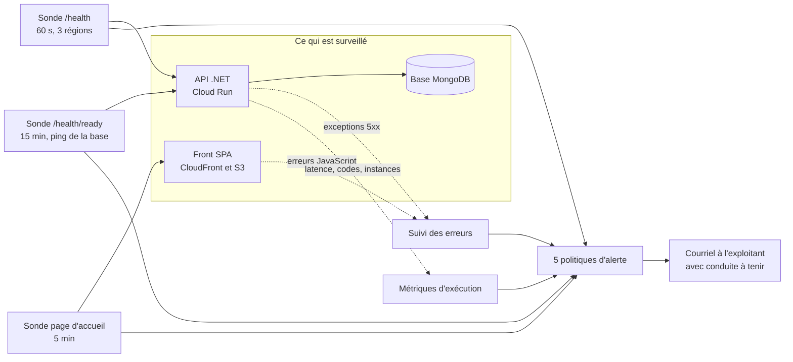
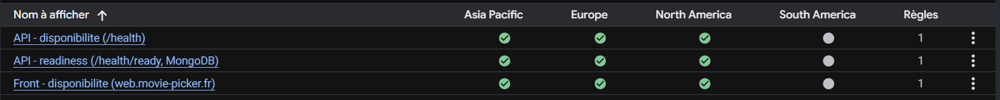
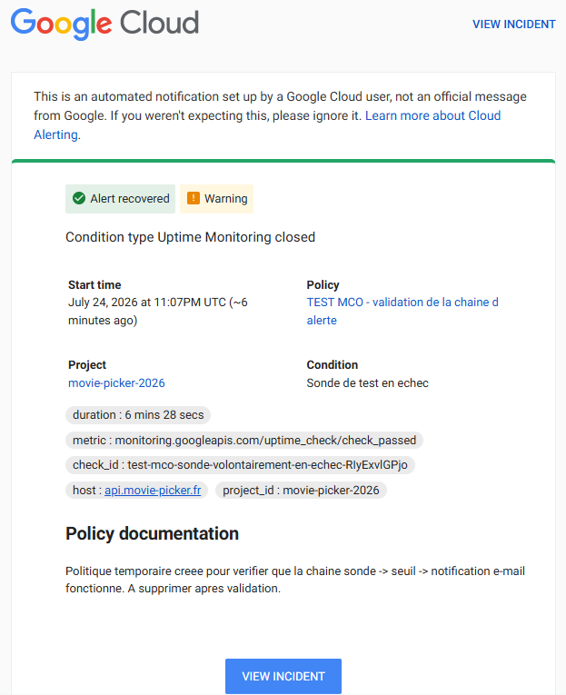
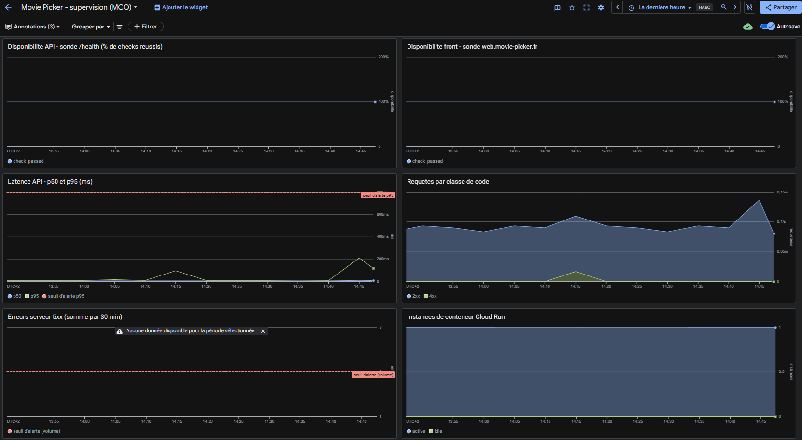
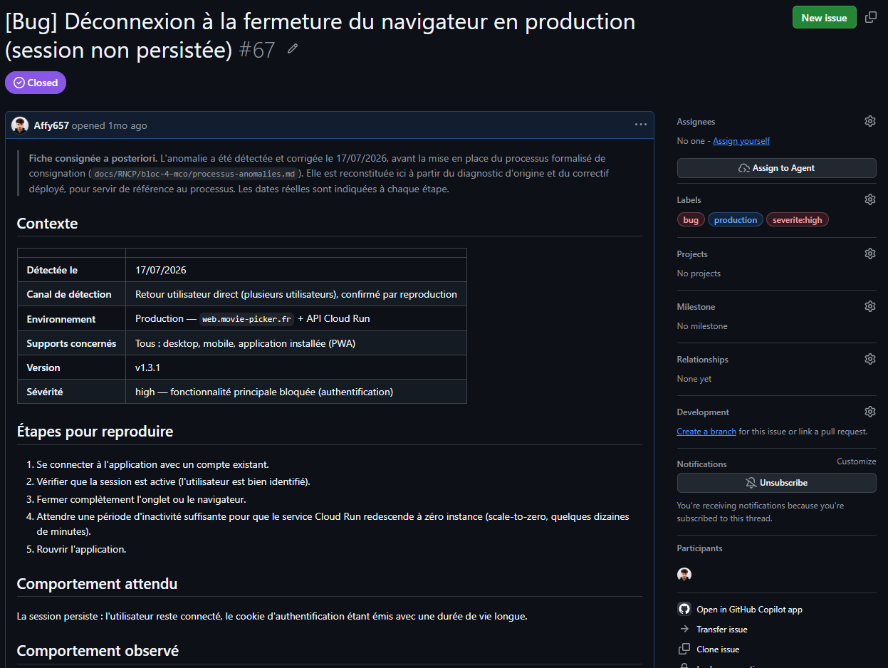
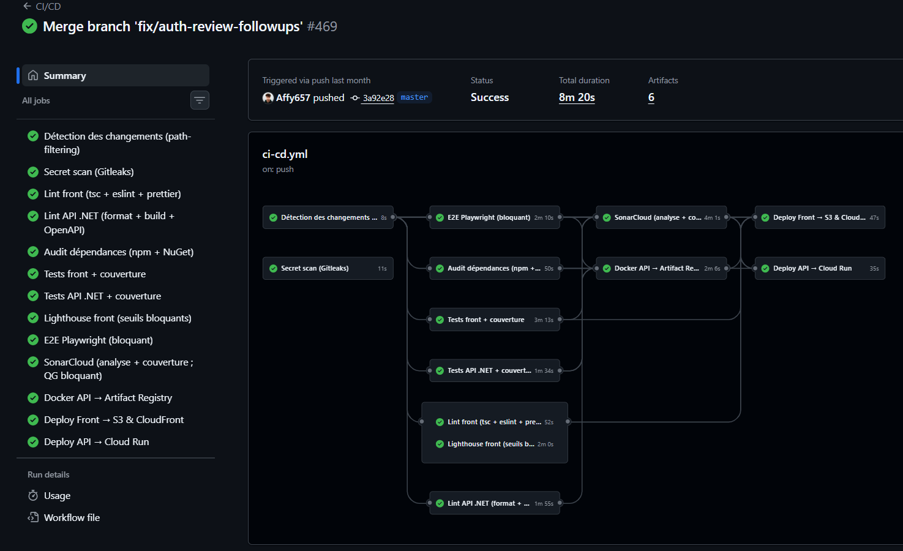
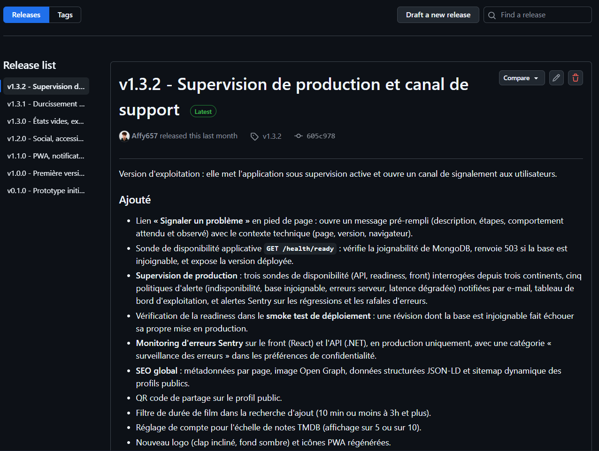
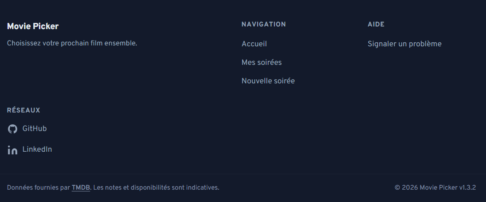

# Dossier professionnel Bloc 4

## Maintenir l'application logicielle en condition opérationnelle

|  |  |
|---|---|
| **Certification** | Expert en développement logiciel : **RNCP 39583** |
| **Bloc évalué** | Bloc 4 : Maintenir l'application logicielle en condition opérationnelle |
| **Projet support** | **Movie Picker** : application web pour choisir un film à plusieurs |
| **Candidat** | Adrien MORAND |
| **Date** | Août 2026 |

> Ce dossier décrit le maintien en condition opérationnelle d'une application **réellement déployée et utilisée** : les mesures, seuils, incidents et indicateurs qui y figurent proviennent de la production, non d'un environnement de démonstration. Les mesures d'exploitation et les indicateurs d'usage ont été relevés fin juillet 2026, les retours utilisateurs recueillis à la mi-août.

| § | Section | Compétence |
|:--:|---|---|
| 1 | Processus de mise à jour des dépendances | C4.1.1 |
| 2 | Système de supervision et d'alerte | **C4.1.2** (élim.) |
| 3 | Processus de collecte et de consignation des anomalies | **C4.2.1** (élim.) |
| 4 | Fiche de consignation d'une anomalie | **C4.2.1** (élim.) |
| 5 | Traitement d'une anomalie détectée en production | C4.2.2 |
| 6 | Recommandations argumentées d'amélioration | C4.3.1 |
| 7 | Journal des versions déployées | **C4.3.2** (élim.) |
| 8 | Problème résolu en collaboration avec le support | C4.3.3 |

---

## Contexte

**Movie Picker** répond à un irritant du quotidien : choisir un film à plusieurs sans négociation interminable. Un hôte crée une **soirée** et invite des participants par un lien ; chacun propose des films issus du catalogue TMDB, l'assemblée vote, puis une roue tire au sort parmi les propositions retenues.

L'application sert des utilisateurs réels depuis **avril 2026** à l'adresse **web.movie-picker.fr**, les comptes et l'authentification étant en production depuis le 8 avril et le périmètre s'étant complété par livraisons successives jusqu'à la `1.0.0`. Elle repose sur trois composants déployés indépendamment.

| Composant | Technologie | Hébergement |
|-----------|-------------|-------------|
| Front (SPA installable en PWA) | React 19, TypeScript, Vite | AWS S3 + CloudFront |
| API REST | ASP.NET Core (.NET 10) | GCP Cloud Run (europe-west1) |
| Base de données | MongoDB | MongoDB Atlas |

L'échelle réelle du service conditionne toutes les décisions d'exploitation présentées ici : **17 comptes inscrits**, **19 soirées créées** entre avril et juillet 2026, **15 161 requêtes** utilisateur servies sur les trente derniers jours. Un projet de cette taille ne justifie ni astreinte ni redondance multi-région ; il justifie en revanche que la moindre indisponibilité soit détectée sans dépendre du signalement d'un utilisateur, et que chaque anomalie laisse une trace écrite. D'où le parti pris retenu : un dispositif **proportionné**, mais complet sur la chaîne détection, consignation, correction, traçabilité.

---

## §1. Processus de mise à jour des dépendances

> **Compétence C4.1.1** : *Gérer les mises à jour des dépendances et des bibliothèques tierces, en surveillant régulièrement les nouvelles versions, en évaluant les impacts, et en les intégrant de manière sécurisée.*

### 1.1 Périmètre logiciel

Le dépôt est un monorepo réunissant deux applications et leur outillage. Le code livré en production repose sur quatre écosystèmes de dépendances, tous placés sous surveillance automatisée.

| Écosystème | Manifeste | Contenu surveillé |
|------------|-----------|-------------------|
| **npm / pnpm** | `pnpm-lock.yaml` (racine + workspace `apps/*`) | Front React/TypeScript, outillage de build et de test |
| **NuGet** | `apps/api-dotnet/**/*.csproj` | API .NET, dépendances transitives incluses |
| **GitHub Actions** | `.github/workflows/*.yml` | Actions du pipeline, épinglées par **SHA de commit** |
| **Images Docker** | `apps/api-dotnet/MoviePicker.Api/Dockerfile` | Images de base de l'API, épinglées par **digest `sha256`** |

L'épinglage par SHA et par digest protège contre les attaques de chaîne d'approvisionnement : une action ou une image ne peut pas changer de contenu sous une même étiquette. En contrepartie, ces références n'évoluent que si on les met à jour explicitement, d'où leur intégration au périmètre automatisé.

### 1.2 Fréquence

Trois rythmes se complètent, du plus lent au plus réactif.

| Rythme | Mécanisme | Rôle |
|--------|-----------|------|
| **Mensuel** | Dependabot : une pull request **groupée par écosystème** | Maintenir le socle à jour sans noyer le projet sous les demandes de fusion |
| **Hebdomadaire** | Analyse planifiée Trivy du dépôt entier (lundi, 04 h 17 UTC), sévérités **HIGH et CRITICAL bloquantes** | Capter les vulnérabilités divulguées entre deux cycles mensuels |
| **À chaque commit** | Audit intégré au pipeline : Trivy sur `pnpm-lock.yaml` et `dotnet list package --vulnerable --include-transitive` | Interdire l'introduction d'une dépendance vulnérable et bloquer le déploiement si une faille est publiée entretemps |

La cadence mensuelle groupée, plutôt qu'hebdomadaire et unitaire, répond à une contrainte de projet mené par une seule personne : une pluie de demandes de fusion produit de la fatigue, puis des fusions non relues. Le filet de sécurité réel n'est pas la fréquence de l'outil de proposition, mais l'analyse hebdomadaire et l'audit à chaque commit, **bloquants** l'un et l'autre.

### 1.3 Type de mise à jour : automatique ou manuel

| Étape | Automatique | Manuel |
|-------|:-----------:|:------:|
| Surveillance des nouvelles versions, détection des vulnérabilités | ✅ | |
| Ouverture de la demande de fusion | ✅ | |
| Exécution des tests et portes de qualité | ✅ | |
| **Évaluation d'impact et décision de fusion** | | ✅ |
| **Montée de version majeure** | | ✅ |
| Déploiement après fusion | ✅ | |

**Aucune fusion n'est automatique.** La proposition est automatisée, la décision ne l'est pas : une montée de version peut franchir toutes les portes tout en modifiant un comportement non couvert par les tests. Les demandes ouvertes par Dependabot s'exécutent d'ailleurs sans accès aux secrets du dépôt, ce qui désactive l'analyse de qualité externe et impose une relecture humaine.

**Évaluation de l'impact.** Chaque montée est jugée sur quatre points : la **nature du changement** (une majeure impose la lecture des notes de version), l'**exploitabilité réelle** de la vulnérabilité dans cette application, la **surface d'impact** (fichiers concernés, couverture de tests sur ces chemins), et la **vérification** (compilation, tests unitaires et de bout en bout, build de production, audit de performance). Ces contrôles étant bloquants, une régression détectable ne peut pas atteindre la production.

### 1.4 Cas d'application : une montée majeure sous contrainte de sécurité

Le 25 juillet 2026, l'audit du pipeline échoue sur l'avis **`GHSA-qwww-vcr4-c8h2`** (sévérité haute) : la bibliothèque de routage `react-router` 7.18.1 est vulnérable, le correctif se trouve en version **8.3.0**. Le déploiement est automatiquement bloqué, la porte joue son rôle.

**Évaluation.** L'avis concerne le mode « composants serveur » du routeur, que cette SPA sans rendu serveur n'utilise pas : le code vulnérable n'y est pas atteignable et l'impact en exploitation est nul. Le correctif impose pourtant une **montée majeure**, et l'analyse révèle un point structurant : les 51 fichiers qui importent le routeur se limitent tous à son cœur stable, mais le paquet `react-router-dom` n'est plus publié au-delà de la 7.18.1, la ligne 8.x étant distribuée sous le paquet unifié `react-router`. La montée impose donc un changement de paquet, pas seulement de version.

**Décision et vérification.** La montée est effectuée plutôt que neutralisée par une exception : l'interface utilisée est stable, la couverture de tests est forte, et supprimer la cause vaut mieux qu'entretenir une dérogation. Après remplacement du paquet et réécriture des imports, le contrôle est complet, de l'analyse statique aux parcours de bout en bout et à l'audit de performance. L'avis disparaît et le déploiement reprend son cours, en moins d'une heure et sans adaptation du code applicatif.

**Limites connues.** L'audit npm s'appuie sur Trivy et non sur l'outil natif du gestionnaire de paquets, dont le service d'audit a été retiré le 15 juillet 2026. Deux exclusions sont par ailleurs déclarées dans le dépôt plutôt que subies : côté .NET, une suppression d'audit sur l'avis `GHSA-6c8g-7p36-r338` (sévérité modérée, aucun correctif amont, interface vulnérable non atteignable), documentée avec sa justification donc réexaminable ; côté npm, la neutralisation du manifeste des supports de présentation archivés, figé et hors production. Enfin, les montées majeures restent des décisions humaines : aucune automatisation ne peut juger de l'acceptabilité d'une rupture d'interface.

---

## §2. Système de supervision et d'alerte

> **Compétence C4.1.2 (éliminatoire)** : *Concevoir un système de supervision et d'alerte en déterminant le périmètre de supervision, en identifiant les indicateurs de suivi pertinents, en mettant en place des sondes et en configurant la modalité des signalements, afin de garantir une disponibilité permanente du logiciel.*

### 2.1 Périmètre de supervision

Les trois composants de l'application sont déployés séparément et peuvent tomber indépendamment les uns des autres : le périmètre les couvre tous les trois, ainsi que les dépendances externes dont l'indisponibilité dégrade le service.

| Composant | Ce qui est surveillé |
|-----------|----------------------|
| **Front SPA** (S3 + CloudFront) | Disponibilité de la page servie, erreurs JavaScript, Web Vitals |
| **API .NET** (Cloud Run) | Disponibilité, aptitude à servir, latence, taux d'erreur, exceptions serveur |
| **Base MongoDB** (Atlas) | Joignabilité depuis l'API |
| **Services tiers** (catalogue TMDB, courriel, notifications) | Indisponibilité, remontée en erreur serveur et capturée par le suivi des erreurs |

La supervision de l'infrastructure sous-jacente (machines, réseau, réplication) relève des fournisseurs managés et n'est pas instrumentée par le projet : limite cohérente avec le choix d'un hébergement entièrement managé.

### 2.2 Indicateurs de suivi et critères de qualité

Les cibles ne sont pas des valeurs théoriques : elles ont été calées sur trente jours de mesures réelles relevées avant leur définition.

| Indicateur | Mesure de référence | Cible |
|------------|--------------------|-------|
| Disponibilité de l'API et du front | 100 % depuis la mise en service des sondes | **≥ 99,5 %** par mois |
| Latence p50 / p95 / p99 | **72 ms** / **207 ms** / 284 ms | < 200 ms / **< 500 ms** / < 1 s |
| Démarrage à froid | 3,8 s | toléré (choix de coût assumé) |
| Ping de la base depuis l'API | **7 ms** | < 100 ms |
| Taux d'erreur serveur | **0,026 %** (4 réponses 5xx sur 15 161 requêtes) | **< 1 %** |
| Erreurs applicatives | regroupées par empreinte | 0 anomalie non triée au-delà de 24 h |
| Performance du front | médiane de trois exécutions | **≥ 80**, porte bloquante |
| Accessibilité du front | score 100 mesuré | **≥ 98**, porte bloquante |

L'API tourne sans instance minimale : le démarrage à froid de 3,8 secondes est un arbitrage de coût explicite, dont les seuils d'alerte tiennent compte plutôt que de le traiter comme une anomalie.

### 2.3 Sondes mises en place et finalité de chacune

Quatre familles de sondes se complètent, de la vérification externe la plus factuelle à la prévention en amont du déploiement ; les trois premières convergent vers le même point de signalement.

**a. Sondes actives de disponibilité.** Ce sont les seules qui prouvent qu'un utilisateur peut réellement atteindre le service : elles interrogent l'application **de l'extérieur**, depuis trois continents, indépendamment de son propre code.

| Sonde | Cible | Fréquence | Finalité | Validation |
|-------|-------|:---------:|----------|------------|
| Disponibilité API | `api.movie-picker.fr/health` | 60 s | Le service répond-il ? | Code 2xx **et** `status = ok` |
| Aptitude à servir | `api.movie-picker.fr/health/ready` | 15 min | Le service est-il réellement opérationnel, base comprise ? | Code 2xx **et** dépendance `mongodb` à `ok` |
| Disponibilité front | `web.movie-picker.fr/` | 5 min | La SPA est-elle servie par le CDN ? | Code 2xx **et** présence du titre attendu |

Chaque sonde s'exécute depuis l'Europe, l'Amérique du Nord et l'Asie-Pacifique, avec un délai d'expiration de dix secondes. Interroger plusieurs régions évite de confondre une panne réelle avec un incident réseau local.

La distinction entre les deux sondes de l'API est le point central du dispositif. `GET /health` répond sans solliciter aucune dépendance : il détecte un service mort ou une révision qui ne démarre pas. `GET /health/ready` exécute un ping de la base avec un délai maximal de trois secondes et renvoie **503** si elle est injoignable : il détecte le cas, invisible pour la première sonde, où l'API répond parfaitement mais ne peut servir aucune donnée. Sa réponse porte aussi la **version déployée**, sous forme de l'identifiant du commit. La même vérification est rejouée **en fin de déploiement** : une révision dont la base est injoignable fait échouer sa propre mise en production, avant d'avoir servi le moindre utilisateur.

**b. Sondes passives, métriques d'exécution.** Collectées en continu par la plateforme d'hébergement, sans instrumentation applicative : requêtes par classe de code, distribution des latences, nombre d'instances actives. Leur finalité est de détecter les **dégradations progressives** que des sondes binaires « en ligne / hors ligne » ne verraient jamais.

**c. Sonde applicative, suivi des erreurs.** Deux projets Sentry, un par composant, en production uniquement. Sont capturées les exceptions front non gérées et toute réponse de classe 5xx, y compris l'indisponibilité déclarée d'un service tiers ; les erreurs métier attendues sont exclues pour éviter le bruit. Le partage se fait sur le code de réponse plutôt que sur le type d'exception, de sorte qu'une nouvelle erreur serveur est capturée sans qu'on ait à y penser. Chaque événement porte l'environnement, la **version déployée**, la route et le contexte d'exécution ; les incidents sont regroupés par empreinte, avec compteur d'occurrences et version d'introduction. Sa finalité est de **nommer la cause** là où les sondes précédentes ne constatent qu'un symptôme.

**d. Sondes préventives, avant la mise en production.** Les portes du pipeline détaillées au §5.1, complétées par l'analyse de sécurité hebdomadaire. Leur finalité est de faire échouer le déploiement plutôt que l'utilisateur.

### 2.4 Seuils d'alerte

Cinq politiques sont configurées, dont celle des erreurs serveur qui porte deux conditions complémentaires. Leurs seuils sont volontairement placés **au-dessus du bruit mesuré** : une alerte qui se déclenche sans raison finit par être ignorée, et un système de supervision qu'on ignore ne supervise plus rien.

| Politique | Condition | Seuil | Sévérité | Justification du seuil |
|-----------|-----------|-------|:--------:|------------------------|
| **API indisponible** | Sonde `/health` en échec | ≥ 2 points de contrôle sur 5 min | Critique | Un seul point en échec traduit un incident réseau local, pas une panne |
| **Base injoignable** | Sonde `/health/ready` en échec | ≥ 2 points de contrôle sur 30 min | Critique | L'API répond mais ne peut servir aucune donnée : impact utilisateur total |
| **Front indisponible** | Sonde front en échec | ≥ 2 points de contrôle sur 10 min | Critique | Même logique, avec une fréquence de sonde plus lente |
| **Erreurs serveur anormales** | Volume de réponses 5xx | > 2 sur 30 min | Erreur | Référence mesurée : 4 réponses 5xx en 30 jours |
| **Erreurs serveur anormales** | Part des réponses en 5xx | > 20 % pendant 10 min | Erreur | Capte la panne généralisée indépendamment du volume servi |
| **Latence dégradée** | p95 des requêtes | > 800 ms pendant 10 min | Avertissement | Référence mesurée : 207 ms ; marge laissée aux démarrages à froid |

L'ordre des deux conditions sur les erreurs serveur résulte d'un calcul de volume. Celle en **volume absolu** travaille au quotidien : elle détecte le cas le plus courant, une partie des routes applicatives qui tombe alors que le service continue de répondre. Celle en **part du trafic** couvre la panne généralisée indépendamment du volume, mais les sondes la diluent mécaniquement, ajoutant une trentaine d'appels toujours en 200 par fenêtre de dix minutes contre trois à quatre requêtes utilisateur : une défaillance limitée aux routes applicatives ne franchirait pas les 20 %, ce que la condition en volume rattrape. Celle en part reprend l'avantage si le volume remonte, ou si la panne atteint aussi les points d'entrée de santé.

Chaque politique embarque sa **conduite à tenir**, affichée dans la notification : où regarder, dans quel ordre, et quand déclencher un retour arrière. Un incident se referme dès que sa condition n'est plus remplie, et automatiquement au bout de trente minutes sans nouvelle donnée.

### 2.5 Modalité de signalement

Le signalement se fait par **courriel** vers l'adresse d'exploitation, déclarée comme canal de notification et rattachée aux cinq politiques. Le message porte la politique déclenchée, la condition franchie, la ressource concernée, l'horodatage et la durée de l'incident, un lien vers celui-ci, ainsi que la conduite à tenir. Trois règles complémentaires par projet Sentry couvrent les erreurs applicatives : anomalie prioritaire, **régression** d'une anomalie précédemment corrigée, et **rafale** de plus de vingt occurrences en une heure ; la deuxième protège contre une correction qui se défait silencieusement plusieurs déploiements plus tard.

La chaîne complète a été **vérifiée de bout en bout** : une sonde temporaire pointant vers une adresse inexistante a été mise en service, l'alerte s'est déclenchée après deux points de contrôle en échec, le courriel est parvenu à l'exploitant avec sa conduite à tenir, puis l'incident s'est refermé au retour à la normale. La sonde et la politique de test ont ensuite été supprimées : le dispositif n'est pas seulement configuré, il est prouvé.

Le projet étant exploité par une seule personne, il n'y a ni astreinte ni escalade : le signalement va directement à l'exploitant, qui est aussi le développeur. Toute alerte débouche sur une action, qualifiée à partir de l'incident puis consignée en fiche écrite selon le processus du §3.

### 2.6 Tableau de bord

Un tableau de bord d'exploitation regroupe les six vues suivies au quotidien : disponibilité de l'API et du front, latences p50 et p95 avec le seuil d'alerte matérialisé, requêtes par classe de code, erreurs serveur avec son seuil de volume, instances actives.

### 2.7 Coûts, données personnelles et limites

Le dispositif entier tient dans les offres gratuites : les sondes ajoutent environ **138 000 requêtes mensuelles** à l'API, soit 7 % du quota offert, avec un effet de bord favorable puisque les instances restent tièdes. Le suivi des erreurs relève de l'**intérêt légitime** (sécurité et stabilité du service), n'utilise aucun cookie et applique une minimisation stricte : envoi des données personnelles désactivé, adresse IP, courriel et nom d'utilisateur effacés avant transmission, aucun enregistrement de session. Trois limites sont assumées : une rétention des erreurs d'environ trente jours ; une base supervisée seulement dans sa joignabilité depuis l'API ; et des sondes et politiques non décrites en infrastructure-as-code, point de fragilité repris au §6.

---

## §3. Processus de collecte et de consignation des anomalies

> **Compétence C4.2.1 (éliminatoire)** : *Consigner les anomalies détectées en élaborant un processus de collecte et de consignation, en utilisant des outils de collecte et en y intégrant toutes les informations pertinentes, afin de déterminer le correctif à mettre en place.*

### 3.1 Principe

**Une anomalie confirmée donne lieu à une fiche écrite.** Le gestionnaire d'incidents du dépôt (GitHub Issues) est la source unique de vérité : aucune correction n'est déployée sans une trace expliquant ce qui ne va pas, comment le reproduire et ce qui a été décidé. Sur un projet mené par une seule personne, où la mémoire du développeur remplace volontiers l'écrit, la règle est à la fois la plus fragile et la plus utile : trois semaines après, la cause racine n'est plus reconstituable de tête, et un correctif dont on a oublié le motif se défait au premier remaniement.

Le processus est dimensionné pour la typologie du logiciel : une application web grand public, en déploiement continu, sans astreinte, dont les anomalies proviennent presque toutes de trois origines, une régression introduite par un déploiement, une dépendance externe défaillante, ou un cas d'usage non prévu.

### 3.2 Canaux de collecte

Cinq canaux alimentent le processus, du plus automatique au plus humain.

| # | Canal | Ce qu'il détecte | Délai |
|:-:|-------|------------------|-------|
| 1 | **Supervision** : 3 sondes, 5 politiques d'alerte (§2) | Indisponibilité, base injoignable, erreurs serveur anormales, latence dégradée | 2 à 30 min |
| 2 | **Suivi des erreurs** : 2 projets, 3 règles chacun (§2) | Exception front ou serveur, régression, rafale d'occurrences | Immédiat |
| 3 | **Retours utilisateurs** : lien « Signaler un problème » | Anomalie fonctionnelle sans exception : comportement inattendu, donnée incohérente, parcours bloqué | Variable |
| 4 | **Portes du pipeline** : tests, performance, accessibilité, qualité, vulnérabilités, secrets | Régression, vulnérabilité, dégradation, **avant** la mise en production | Chaque commit, plus l'analyse hebdomadaire |
| 5 | **Recette manuelle** | Écart avec le cahier de recettes | Chaque évolution fonctionnelle |

Les canaux 1, 2 et 4 sont automatiques et notifient par courriel. Le canal 3 est le seul qui dépende d'une démarche humaine, et c'est celui qui remonte les anomalies les plus coûteuses, puisqu'elles ont déjà atteint l'utilisateur sans déclencher la moindre alerte technique : l'anomalie du §4 en est l'illustration exacte, l'application répondant normalement pendant que les utilisateurs perdaient leur session. C'est pour réduire la dépendance à ce canal que la supervision a été renforcée, et pour le rendre plus efficace que le lien de signalement a été ajouté, avec son message pré-rempli embarquant la page, la version et le navigateur.

### 3.3 Outil et gabarit de consignation

Les fiches vierges sont **désactivées** dans le dépôt : tout signalement passe par un formulaire structuré, ce qui garantit que les informations nécessaires à la reproduction sont présentes dès la création plutôt que réclamées ensuite.

| Champ | Obligatoire | Pourquoi il est nécessaire |
|-------|:-----------:|----------------------------|
| **Contexte** (URL, navigateur, système, version) | oui | Sans lui, on corrige à l'aveugle un défaut peut-être propre à un environnement |
| **Étapes pour reproduire** | oui | Une anomalie non reproductible ne peut être ni corrigée avec certitude, ni vérifiée après correction |
| **Comportement attendu** | oui | Distingue le défaut réel du malentendu fonctionnel |
| **Comportement observé** | oui | Décrit le symptôme indépendamment de son interprétation |
| **Captures ou journaux** | non | Raccourcit fortement le diagnostic |
| **Sévérité** | oui | Détermine le délai de prise en charge |

Les fiches portent des étiquettes normalisées : `bug`, `triage` (posée automatiquement à la création), `severite:critical|high|medium|low`, `production` lorsque l'anomalie est constatée en production, et `regression` lorsqu'il s'agit de la réapparition d'une anomalie déjà corrigée.

### 3.4 Qualification et délais de prise en charge

La sévérité est déclarée par le signalant puis confirmée au triage. Elle mesure l'**impact utilisateur**, jamais la difficulté technique : une anomalie triviale à corriger peut bloquer tout le monde, une correction complexe n'affecter personne.

| Sévérité | Définition | Prise en charge | Correction visée |
|----------|-----------|-----------------|------------------|
| **critical** | Service inutilisable ou perte de données | Immédiate, tout autre travail suspendu | Sous 24 h, ou retour arrière immédiat |
| **high** | Fonctionnalité principale bloquée, sans contournement | Sous 24 h | Sous 72 h |
| **medium** | Gêne réelle mais contournement possible | Au prochain lot de travail | Prochaine version mineure |
| **low** | Cosmétique ou marginal | Mise en file | Sans engagement de date |

Une anomalie critique en production ouvre un arbitrage immédiat, **corriger** ou **revenir en arrière**. Le retour arrière est privilégié lorsque l'anomalie suit un déploiement : il rétablit le service en quelques minutes sans exiger d'avoir compris la cause, et comprendre vient ensuite.

### 3.5 Cycle de vie d'une anomalie

| Étape | Contenu |
|-------|---------|
| **1. Signalement** | Création de la fiche via le gabarit, quel que soit le canal. Une alerte ou une erreur capturée est recopiée avec le lien vers l'événement d'origine |
| **2. Triage** | Confirmation de la sévérité, retrait de l'étiquette `triage`, ajout de `production` ou `regression` le cas échéant |
| **3. Reproduction** | Rejeu des étapes déclarées. Une anomalie non reproductible n'est pas refermée : elle est documentée avec ce qui a été tenté et reste ouverte tant que le signalement persiste |
| **4. Analyse** | Identification de la cause racine, consignée dans la fiche. Symptôme et cause sont distingués, une même déconnexion pouvant venir d'un cookie, d'une clé de chiffrement ou d'une configuration inopérante |
| **5. Correction** | Branche dédiée, correctif accompagné d'un **test de non-régression** lorsque la nature du défaut le permet |
| **6. Vérification** | Validation en production et pas seulement en local, par le contrôle automatique en fin de déploiement puis vérification du comportement d'origine |
| **7. Clôture** | Fiche refermée en référençant le commit correctif et la date de déploiement |

**Définition de « corrigé »** : correctif déployé en production, comportement d'origine vérifié sur l'environnement réel, test automatisé couvrant le cas lorsque c'est possible, évolution inscrite au journal des versions. Tant que ces quatre conditions ne sont pas réunies, l'anomalie reste ouverte : un correctif fusionné mais non déployé ne corrige rien pour l'utilisateur.

### 3.6 Traçabilité

Chaque anomalie laisse une chaîne complète : fiche, branche dédiée, commit expliquant la cause racine, portes du pipeline franchies, déploiement d'une révision identifiée, entrée au journal des versions, étiquette et publication, puis clôture de la fiche référençant le commit correctif. Elle se parcourt dans les deux sens, et son détail figure au §7.5.

---

## §4. Fiche de consignation d'une anomalie

> **Compétence C4.2.1 (éliminatoire)** : *La fiche de consignation contient les informations permettant de reproduire le bogue ; l'analyse du bogue et les préconisations de correction sont explicitées et permettent de corriger l'anomalie.*

### 4.1 L'anomalie retenue et son identification

L'anomalie traitée ici relève du cas le plus difficile pour un dispositif de maintien en condition opérationnelle : une anomalie **invisible pour la supervision technique**. L'API répondait, ne levait aucune exception, et renvoyait des codes d'erreur conformes à son propre code ; seuls les utilisateurs pouvaient la signaler. Elle est consignée dans le gestionnaire d'incidents du dépôt sous la référence **#67**.

| | |
|---|---|
| **Référence** | #67 |
| **Titre** | Déconnexion à la fermeture du navigateur en production (session non persistée) |
| **Détectée le** | 17/07/2026 |
| **Canal de détection** | Retour utilisateur direct (plusieurs utilisateurs), confirmé par reproduction |
| **Environnement** | Production : front et API |
| **Supports concernés** | Tous : ordinateur, mobile, application installée en PWA |
| **Version** | 1.3.1 |
| **Sévérité** | **high** : fonctionnalité principale bloquée, sans contournement |
| **Étiquettes** | `bug`, `production`, `severite:high` |

### 4.2 Reproduction

**Étapes**

1. Se connecter à l'application avec un compte existant.
2. Vérifier que la session est active (l'utilisateur est bien identifié).
3. Fermer complètement l'onglet ou le navigateur.
4. Attendre une période d'inactivité suffisante pour que le service redescende à zéro instance (quelques dizaines de minutes).
5. Rouvrir l'application.

**Comportement attendu.** La session persiste : l'utilisateur reste connecté, le cookie d'authentification étant émis avec une durée de vie longue.

**Comportement observé.** L'utilisateur est déconnecté et renvoyé vers l'écran de connexion ; l'API répond **401** sur les appels authentifiés.

**Élément déterminant.** Le phénomène est apparu **sans aucun changement de code**. Les utilisateurs le formulent ainsi : « avant, ça marchait ».

L'étape 4 est celle qui rend la fiche exploitable : sans elle, la reproduction échoue une fois sur deux et l'anomalie passe pour intermittente.

### 4.3 Analyse

Le diagnostic a mis au jour **deux causes cumulées**, l'une expliquant le déclenchement, l'autre aggravant silencieusement la situation depuis l'origine.

**Cause racine 1 : clé de chiffrement expirée.** Le cookie d'authentification est chiffré par le mécanisme de protection des données du framework. La clé provenait d'un secret généré **sans durée explicite**, donc avec la valeur par défaut de **90 jours**. Créée lors du déploiement de l'authentification, le 7 avril 2026, elle a expiré à la mi-juillet. Le trousseau ne contenant qu'une seule clé, chaque instance s'est mise à en régénérer une **éphémère**, stockée dans un dossier temporaire effacé au démarrage. Le service étant configuré sans instance minimale, le démarrage à froid suivant rendait le cookie émis par l'instance précédente indéchiffrable : 401, puis déconnexion.

Cette cause explique les trois observations : le lien avec la fermeture du navigateur (le temps d'inactivité laisse le service redescendre à zéro), l'atteinte de tous les supports (le défaut est côté serveur), et l'apparition sans déploiement (c'est le temps qui déclenche, pas le code).

**Cause racine 2 : configurateur jamais exécuté.** Le composant chargé de configurer le cookie était enregistré sur une interface que la fabrique d'options **ne consomme pas**. Il ne s'exécutait donc jamais : le cookie portait le nom par défaut du framework au lieu du nom applicatif, le magasin de sessions était inactif, les réglages de sécurité étaient inopérants, et un 401 renvoyait même une redirection vers une route de connexion inexistante dans cette API.

Ce défaut était présent depuis l'origine sans jamais se manifester : il n'a été révélé que par l'investigation de la première cause. Vérification apportée au diagnostic : un test isolé de l'injection de dépendances échoue avec l'ancien enregistrement, le cookie produit portant le nom par défaut.

### 4.4 Préconisations de correction

| # | Préconisation | Effet attendu |
|:-:|---------------|---------------|
| 1 | **Persister les clés de chiffrement en base**, partagées entre instances et révisions | Supprime la cause 1 : plus de perte de clé au redémarrage, rotation sans rupture |
| 2 | **Corriger l'enregistrement du configurateur** sur l'interface consommée par la fabrique d'options | Supprime la cause 2 : nom du cookie, magasin de sessions et réglages de sécurité redeviennent effectifs |
| 3 | **Porter la durée de session à 30 jours glissants**, en une constante unique | Aligne la durée réelle sur la promesse faite à l'utilisateur |
| 4 | **Allonger la durée de la clé de secours** générée hors base | Évite que le repli reproduise l'expiration à 90 jours |
| 5 | **Ajouter un test de non-régression** sur l'application effective du configurateur | Interdit la réapparition silencieuse de la cause 2 |

**Effet de bord à anticiper** : le changement de clé de chiffrement et l'activation du magasin de sessions invalident les cookies existants. Une **reconnexion unique** de tous les utilisateurs au déploiement est donc inévitable, inconvénient sans commune mesure avec le défaut corrigé, mais qui doit être annoncé plutôt que subi.

### 4.5 Portée de la fiche

Cette fiche a été consignée **a posteriori** : l'anomalie du 17 juillet 2026 précède la formalisation du processus décrit au §3, et elle a été reconstituée à partir du diagnostic d'origine et du correctif déployé, avec les dates réelles de chaque étape. Le processus s'applique depuis en amont : l'anomalie suivante, détectée le 25 juillet par les portes du pipeline, a été consignée au moment de sa constatation (fiche #68, §5.4).

---

## §5. Traitement d'une anomalie détectée en production

> **Compétence C4.2.2** : *Créer et déployer un correctif en respectant le processus d'intégration et de déploiement continu afin de résoudre l'anomalie. Le traitement tire profit du processus d'intégration et de déploiement continu ; le correctif mis en place est décrit et permet la résolution de l'anomalie.*

### 5.1 Le pipeline mobilisé

Un correctif emprunte exactement le même chemin qu'une évolution : **aucune voie rapide, aucun accès direct à la production**. L'urgence d'une anomalie est précisément le moment où l'on est tenté de sauter les vérifications. Le pipeline se déclenche sur **toute poussée, quelle que soit la branche**, et compare celle-ci à la branche principale pour déterminer ce qu'il doit vérifier : les portes s'exécutent avant la fusion, sur le périmètre exact que la fusion apportera, seuls la publication et le déploiement étant réservés à la branche principale.

| Étape | Contrôles | Bloquant |
|-------|-----------|:--------:|
| **Poussée sur une branche** | Analyse statique, formatage, compilation, recherche de secrets | ✅ |
| **Tests** | Unitaires front (578) et API, intégration, **6 parcours de bout en bout** | ✅ |
| **Qualité et sécurité** | Porte de qualité sur le code nouveau, vulnérabilités des dépendances et de l'image, audit de performance et d'accessibilité | ✅ |
| **Fusion sur la branche principale** | Relecture du correctif, hors portes automatiques | n/a |
| **Construction et publication** | Image conteneur analysée puis publiée, référencée par empreinte | ✅ |
| **Déploiement** | Mise en ligne de la révision (API), synchronisation et invalidation du cache (front) | n/a |
| **Contrôle post-déploiement** | Appel des deux sondes de santé : répond-il, et peut-il servir ? | ✅ |

Le déploiement n'est donc pas un acte manuel, mais la conséquence d'une fusion ayant franchi l'ensemble des portes. En cas d'incident malgré tout, un retour arrière bascule la totalité du trafic vers la révision précédente **sans reconstruction**, en quelques minutes.

### 5.2 Chronologie du traitement de l'anomalie #67

| Étape | Contenu |
|-------|---------|
| **Signalement** (17/07) | Plusieurs utilisateurs rapportent des déconnexions ; qualification et reproduction |
| **Analyse** | Identification des deux causes racines (§4.3) |
| **Correctif** | Branche `fix/auth-session-persistence`, commit `ec7ce77` avec test de non-régression |
| **Portes du pipeline** | Analyse statique, tests, parcours de bout en bout, qualité, sécurité : toutes franchies |
| **Fusion et relecture** | `21335d2` sur la branche principale, puis ajustements de revue (`f80c95b`) fusionnés par `3a92e28` |
| **Déploiement** | Automatique : publication de l'image, mise en ligne de la révision et du front |
| **Contrôle post-déploiement** | Sondes de santé appelées par le pipeline, réponses conformes |
| **Vérification fonctionnelle** | Session testée après déploiement, **puis après un démarrage à froid**, condition exacte du défaut |
| **Clôture** | Fiche refermée en référençant le commit correctif et la date de déploiement |

### 5.3 Le correctif mis en place

Les cinq préconisations du §4.4 ont toutes été réalisées. Le dépôt de clés est adossé à la base de données, ce qui les rend durables et partagées entre instances et révisions sans interrompre la rotation automatique, le repli sur fichier restant en développement. Le configurateur est enregistré sur l'interface effectivement consommée par la fabrique d'options, si bien que le nom du cookie applicatif, le magasin de sessions, les réglages de sécurité et la réponse 401 en JSON redeviennent effectifs. La durée de session passe à trente jours glissants par une constante unique partagée par les trois composants concernés, la clé de secours hors base à dix ans, et un test de non-régression échoue avec l'ancien enregistrement.

**Pourquoi le correctif résout l'anomalie.** La cause racine 1 disparaît parce que la clé n'est plus dans un espace éphémère : ni un redémarrage, ni un passage à zéro instance, ni un déploiement ne la lui font perdre, et le cookie reste déchiffrable. La cause racine 2 disparaît parce que la configuration s'applique enfin, ce qu'un test garantit à chaque exécution du pipeline. La reconnexion unique annoncée s'est produite comme prévu, puis les sessions sont restées stables. **Aucune réapparition depuis le 17 juillet 2026.**

### 5.4 Un second cas : la porte qui bloque avant l'utilisateur

Le 25 juillet 2026, l'ajout du lien « Signaler un problème » fait échouer **cinq parcours de bout en bout** sur six : le libellé d'accessibilité du nouveau lien contient le mot « e-mail », si bien que le sélecteur `getByLabel('E-mail')` des tests désigne désormais deux éléments. La porte étant bloquante et le déploiement du front en dépendant, la mise en ligne est annulée : **le défaut n'a jamais atteint la production.** Il est consigné en fiche **#68** selon le même processus, avec ses étapes, son analyse et les deux options envisagées ; rendre le sélecteur exact a été retenu plutôt que dégrader le libellé d'accessibilité.

### 5.5 Ce que le déploiement continu apporte

Les deux cas se complètent : le premier montre le pipeline **corrigeant** une anomalie parvenue jusqu'aux utilisateurs, le second le montre **empêchant** un défaut de les atteindre. Le **délai** d'abord, le correctif atteignant la production dès la fusion ; la **non-régression** ensuite, un correctif ne pouvant pas en introduire un autre sans que les 578 tests, les six parcours et les audits ne le signalent, y compris dans l'urgence ; la **réversibilité** enfin, qui rend praticable l'arbitrage du §3.4.

---

## §6. Recommandations argumentées d'amélioration

> **Compétence C4.3.1** : *Proposer des axes d'amélioration en prenant en compte les indicateurs de performance et en analysant les retours utilisateurs, afin de maintenir et renforcer l'attractivité du logiciel.*

### 6.1 Méthode

Les recommandations qui suivent partent de mesures, non d'intuitions. Cinq sources ont été croisées : la **base de production** (agrégats sans donnée personnelle), les **métriques d'exploitation** sur trente jours, l'**analytique produit** sur quatre-vingt-dix jours, les **audits automatisés** exécutés à chaque déploiement, et les **retours utilisateurs**. Ce dernier volet est le plus récent : le canal « Signaler un problème » est en service depuis la version 1.3.2, et le questionnaire, en ligne depuis le 18 août 2026, a recueilli sept réponses sur dix-sept comptes. L'échantillon est réduit et orienté vers les utilisateurs les plus engagés, cinq répondants sur sept utilisant l'application à chaque soirée : ses tendances confirment ou nuancent les mesures quantitatives sans les fonder.

### 6.2 Indicateurs observés

| Indicateur | Mesure | Lecture |
|------------|--------|---------|
| Utilisateurs inscrits | 17 (avril à juillet 2026) | Base réduite, usage entre proches |
| Soirées créées | 19 : rythme mensuel 2 / 6 / 6 / 5 | Activité stable |
| Soirées menées jusqu'au tirage | **14 sur 19 : 74 %** | Le parcours principal aboutit |
| Films proposés, participations | 62 (3,3 par soirée), 80 (4,2 par soirée) | Le partage par lien fonctionne |
| Votes exprimés | 81 (68 pour, 13 contre) | **56 % des participations sans aucun vote** ; les autres votent 2,3 fois pour 3,3 films |
| Soirées tirées en mode pondéré | **0 sur 19** | Le vote n'a jamais influencé un tirage |
| Films dotés d'une note de présentation | **3 sur 62 : 5 %** | Fonctionnalité quasi ignorée |
| Abonnements aux notifications système | **3 sur 17 : 18 %** | Fonctionnalité peu adoptée |
| Relations de suivi | 21 | Fonctionnalité sociale utilisée |
| Recommandation du produit (0 à 10) | **9,6**, aucune note sous 8 (n = 7) | Aucun détracteur, échantillon volontaire |
| Latence p95, taux d'erreur | 207 ms, 0,026 % | Aucun problème de fiabilité |
| Événements du parcours cœur | **0** | Création, vote et tirage non instrumentés |

Deux conclusions structurent le reste. **Ni la fiabilité ni l'appréciation générale ne sont le facteur limitant**, aucun indicateur technique n'étant dans le rouge et la note de recommandation ne relevant aucun détracteur. **L'engagement dans la soirée l'est** : le vote, mécanisme censé faire émerger le consensus, est à peine sollicité, et plusieurs fonctionnalités livrées ne rencontrent pas leur usage.

### 6.3 Recommandations

**R1. Instrumenter le parcours cœur.** *Priorité 1, prérequis des autres.* Aucun événement n'est capturé sur la création d'une soirée, l'ajout d'un film, le vote ou le tirage. Les chiffres du §6.2, reconstitués depuis la base, décrivent des résultats et jamais des abandons : ils ne permettent pas de répondre à « combien d'invités ouvrent le lien sans jamais voter ? ». *Proposition* : capturer six événements et construire l'entonnoir correspondant, l'infrastructure analytique existant déjà. *Coût **0,5 à 1 jour**, délai immédiat. Gain : mesure des abandons étape par étape, les décisions suivantes cessent d'être des paris.*

**R2. Réconcilier le vote et son effet sur le tirage.** *Priorité 2.*

**56 % des participations n'ont produit aucun vote.** La cause tient moins à l'intensité du vote qu'à son absence d'effet : la roue accepte un tirage strictement aléatoire et un tirage pondéré par les votes, le premier est la valeur par défaut, et **aucune des 19 soirées n'a activé le second**. Le produit demande donc un effort dont il n'utilise pas le résultat. Le questionnaire le confirme : un répondant relance manuellement la roue jusqu'à un résultat qui convienne à tout le monde, alors que le réglage est connu de cinq répondants sur sept. La barrière n'est pas sa découvrabilité, mais son statut par défaut. Trois répondants sur sept souhaiteraient même que le vote élimine les films rejetés au lieu de les pondérer, piste notée faute d'échantillon suffisant.

*Proposition*, en trois volets : faire du mode pondéré la valeur par défaut, l'hôte restant libre de revenir au tirage aléatoire ; afficher sur la roue la part réelle de chaque film ; signaler à l'hôte, avant le lancement, la proportion de participants n'ayant pas voté. *Coût **2 à 3 jours**, délai d'une itération après R1. Gain : le vote retrouve la fonction qui justifie sa présence, faire émerger un consensus, promesse même du produit. Objectifs mesurables : la moitié des soirées tirées en mode pondéré, et les participations sans vote ramenées sous 25 %.*

**R3. Rendre les notifications atteignables avant de trancher leur sort.** *Priorité 3.*

Trois abonnements actifs pour dix-sept inscrits, alors que la version 1.1 a livré les clés de signature, cinq déclencheurs et une interface de préférences. L'examen du code explique le chiffre : l'activation n'est **jamais proposée dans le parcours**, elle n'existe que sous la forme d'un interrupteur que rien ne signale dans la page « Mon compte », et le réglage par type ne s'affiche qu'une fois l'utilisateur déjà abonné. Le taux ne mesure donc pas un refus mais une absence de sollicitation, ce que le questionnaire confirme : quatre répondants sur sept ignoraient que l'activation était possible, et l'un d'eux demande spontanément à être averti quand un film est ajouté à une soirée qu'il a rejointe, notification qui existe déjà mais reste invisible.

*Proposition* : proposer l'activation une fois, juste après avoir créé ou rejoint une soirée, en énonçant ce que l'utilisateur recevra ; rendre le choix par type visible avant l'abonnement plutôt qu'après. *Coût **1 jour**, délai d'une itération. Gain : une décision fondée. Si l'adoption ne dépasse pas 40 % dans les deux mois, le gel devient défendable ; aujourd'hui, il condamnerait une fonctionnalité que personne n'a jamais eu l'occasion d'accepter.*

**R4. Installer une boucle de satisfaction continue.** *Priorité 3.* Aucun dispositif ne mesure la satisfaction dans la durée : le questionnaire donne une photographie, pas une tendance, et sa note de 9,6 ne dira rien d'une dégradation à venir. *Proposition* : une question unique après le tirage, « cette soirée s'est-elle bien passée ? » à trois niveaux, stockée sans donnée nominative et agrégée par mois. *Coût **1 à 2 jours**, délai d'une itération. Gain : détection des dégradations d'expérience invisibles pour la supervision technique, aucune des anomalies fonctionnelles rencontrées n'ayant levé d'exception.*

**R5. Mesurer le pari de la récurrence plutôt que l'étendre.** *Priorité 4, conditionnée à R1.* Dix-neuf soirées en trois mois et demi pour dix-sept inscrits : l'application est utilisée par événement, pas par habitude. La version 1.4 en préparation mise sur la récurrence, avec la sélection manuelle du film et la flamme de régularité, sans qu'aucune mesure n'éclaire encore ce pari ; le questionnaire va plutôt dans l'autre sens, cinq répondants sur sept déclarant que rien ne les ferait utiliser l'application plus souvent. *Proposition* : ne pas prolonger cet axe avant d'avoir observé l'effet réel de la flamme sur l'entonnoir de R1, puis retenir d'abord la reconduction d'une soirée avec le même groupe en un clic. *Coût **2 jours** pour la reconduction contre **5 à 8 jours** pour une gamification étendue, délai après un mois d'observation de R1. Gain : évite d'engager une semaine sur une hypothèse non vérifiée, et supprime le principal frein à une nouvelle soirée, reconstituer le groupe.*

**R6. Décrire la supervision en infrastructure-as-code.** *Priorité 4.* Les trois sondes, les cinq politiques d'alerte, le canal de notification et le tableau de bord ont été créés par appels d'interface de programmation : ils ne sont pas versionnés, et une suppression accidentelle ou une dérive passerait inaperçue. *Proposition* : les décrire dans le dépôt et les appliquer depuis le pipeline. *Coût **1 à 2 jours**, délai d'une itération. Gain : configuration reproductible et relue comme du code, un point de fragilité en moins.*

**R7. Corriger deux irritants remontés par le questionnaire.** *Priorité 4.* Le texte libre a fait remonter deux frictions absentes des mesures quantitatives : un répondant doit se reconnecter à chaque ouverture du lien de soirée depuis le navigateur intégré de Snapchat, symptôme distinct de l'anomalie #67 et consigné en fiche #71 ; un autre signale que le profil public n'affiche que le nombre de films proposés, jamais lesquels. *Proposition* : détecter les navigateurs intégrés connus pour suggérer l'ouverture dans le navigateur système ; lister les films proposés sur le profil. *Coût **1 jour**, délai immédiat. Gain : deux frictions concrètes levées, remontées par deux répondants différents.*

### 6.4 Priorisation et périmètre

| Rang | Recommandation | Coût | Délai de mise en œuvre | Nature du gain |
|:----:|----------------|:----:|------------------------|----------------|
| 1 | R1, Instrumenter le parcours cœur | 0,5 à 1 j | Immédiat | Capacité de décision |
| 2 | R2, Réconcilier le vote et son effet | 2 à 3 j | Une itération après R1 | Attractivité, qualité de la promesse produit |
| 3 | R3, Rendre les notifications atteignables | 1 j | Une itération | Adoption réelle, ou décision d'arrêt fondée |
| 3 | R4, Boucle de satisfaction | 1 à 2 j | Une itération | Détection des irritants invisibles |
| 4 | R5, Récurrence (option courte) | 2 j | Après un mois d'observation de R1 | Fréquence d'usage, sous condition de mesure |
| 4 | R6, Supervision en IaC | 1 à 2 j | Une itération, indépendante | Robustesse de l'exploitation |
| 4 | R7, Deux irritants du questionnaire | 1 j | Immédiat | Frictions concrètes levées |

**Total : 8,5 à 12 jours**, en quatre lots successifs. Aucune recommandation n'exige de refonte, toutes s'appuyant sur l'existant, condition de leur faisabilité à une seule personne ; l'ordre n'est pas une file d'attente, R1 conditionnant l'évaluation de R2, R3 et R5. La fiabilité et la performance sont délibérément absentes : elles ne limitent pas l'attractivité du produit, et y investir reviendrait à optimiser ce qui fonctionne déjà.

---

## §7. Journal des versions déployées

> **Compétence C4.3.2 (éliminatoire)** : *Établir un journal des versions déployées en y intégrant la documentation des correctifs réalisés, pour suivre les différentes évolutions du logiciel. Le journal contient les améliorations apportées par la version ; les correctifs déployés sont documentés.*

### 7.1 Dispositif

Le journal repose sur trois supports complémentaires, tous versionnés ou publiés.

| Support | Rôle |
|---------|------|
| **`CHANGELOG.md`**, à la racine du dépôt | Journal de référence : format *Keep a Changelog 1.1.0*, entrées groupées sous les rubriques canoniques du format (*Added*, *Changed*, *Removed*, *Fixed*, *Security*), contenu rédigé en français |
| **Étiquettes Git** | Une étiquette annotée `vX.Y.Z` par version publiée, posée sur le commit exact déployé |
| **Publications GitHub** | Notes de version en français, adossées à l'étiquette correspondante, reprenant les mêmes rubriques traduites |

La version est également **lisible depuis l'application elle-même** : affichée en pied de page, où la capture du §8.1 la montre en `v1.3.2`, et exposée par la sonde d'aptitude à servir sous forme de l'identifiant du commit déployé. Un utilisateur qui signale une anomalie transmet donc sa version sans avoir à la chercher, le message pré-rempli l'embarquant automatiquement.

### 7.2 Politique de versionnage

Versionnage sémantique, interprété comme suit pour une application web.

| Incrément | Déclencheur | Exemple |
|-----------|-------------|---------|
| **Majeur** | Rupture du parcours utilisateur ou du contrat de l'API | Aucun à ce jour |
| **Mineur** | Nouveau parcours ou nouvel écran : l'utilisateur peut faire quelque chose qu'il ne pouvait pas faire | `1.2.0` : profil public, suivi entre utilisateurs, export et suppression de compte |
| **Correctif** | Correction d'anomalie, sécurité, exploitation, et enrichissement d'un parcours existant sans en ouvrir de nouveau | `1.3.2` : supervision, canal de signalement, filtre de durée, correctif de sécurité |

Le critère du mineur est l'ouverture d'un parcours, pas la simple visibilité d'un changement, ce qui évite l'inflation du numéro mineur sur un produit livré en continu. Les entrées décrivent les évolutions du produit, jamais les commits.

### 7.3 Versions publiées

| Version | Date | Contenu principal |
|---------|------|-------------------|
| **1.3.2** | 25/07/2026 | Supervision de production, canal de signalement, suivi des erreurs, SEO, correctif des sessions, portes de qualité bloquantes |
| 1.3.1 | 08/07/2026 | Refonte des cartes film, politique de sécurité du contenu, refonte du pipeline, durcissement SSRF, lacunes de tests comblées |
| 1.3.0 | 19/06/2026 | Roue animée, recherche avancée, offres de location, export calendrier, états vides, refonte de la navigation |
| 1.2.0 | 11/06/2026 | Profil public, suivi entre utilisateurs, notifications dans l'application, accessibilité étendue, export et suppression RGPD |
| 1.1.0 | 25/05/2026 | Application installable, notifications système à cinq déclencheurs, séries, bandes-annonces, plateformes |
| 1.0.0 | 19/05/2026 | Premier périmètre de production consolidé, déployé progressivement depuis avril : comptes, soirée partageable, propositions, votes, roue, temps réel |
| 0.1.0 | 27/02/2026 | Prototype : création de soirée, proposition de films, vote, roue de tirage |

Les dates sont celles de la mise en production effective, c'est-à-dire du commit déployé. Le versionnage sémantique ayant été formalisé le 8 juillet 2026, les six versions déjà livrées à cette date ont été étiquetées rétroactivement, chaque étiquette étant posée sur le commit réellement déployé à l'époque ; depuis la 1.3.1, l'étiquette est posée au moment de la publication.

### 7.4 Exemplaire : la note de version 1.3.2

Version d'exploitation : elle met l'application sous supervision active et ouvre un canal de signalement aux utilisateurs. Principales entrées, sous les rubriques du journal.

**Ajouté**
- Lien « Signaler un problème » en pied de page, ouvrant un message pré-rempli avec la page, la version et le navigateur.
- Sonde `GET /health/ready` vérifiant la joignabilité de la base et exposant la version déployée, rejouée par le pipeline en fin de déploiement.
- Supervision de production : trois sondes, cinq politiques d'alerte notifiées par courriel, tableau de bord, règles sur les régressions et les rafales d'erreurs.
- Suivi des erreurs sur le front et l'API, avec sa catégorie dans les préférences de confidentialité.
- Référencement : métadonnées par page, image de partage, données structurées, plan de site des profils publics.
- Filtre de durée, échelle de notes au choix, code QR de profil, version affichée en pied de page.

**Modifié**
- Portes de qualité du pipeline rendues bloquantes (qualité du code, performance, parcours de bout en bout).
- Performance et accessibilité : accessibilité 100, décalage de mise en page éliminé, poids du paquet réduit de 83 %.
- Duplication de code réduite : actions sur un film, fermeture des fenêtres modales, pied de carte partagé.

**Corrigé**
- **Sessions non persistées en production (fiche #67)** : les utilisateurs étaient déconnectés à la fermeture du navigateur, sans changement de code. Clés de chiffrement désormais persistées en base et partagées entre instances, configurateur de cookie enregistré sur l'interface effectivement consommée, durée de session unifiée à trente jours glissants, test de non-régression ajouté. Une reconnexion unique a été nécessaire au déploiement.
- Cookie de session passé en `SameSite=Lax` en production.
- Images cassées en production : la politique de sécurité du contenu bloquait les affiches et les avatars par défaut.
- Sept signalements de qualité du code résolus ; envoi des courriels de production rebranché ; correction du saut transitif du pipeline qui empêchait les deux travaux de déploiement de s'exécuter.
- Les points d'entrée de lancement et de clôture de la roue exigent un corps JSON, alignés sur le reste de l'API ; l'animation de la roue respecte la préférence système de réduction des animations.

**Sécurité**
- Montée du routeur de 7.18.1 vers 8.3.0, corrigeant l'avis `GHSA-qwww-vcr4-c8h2`.
- Résolution des huit alertes de dépendances ouvertes (six hautes, deux basses).
- Remplacement de l'audit natif par Trivy, le service amont ayant été retiré : l'audit ne scannait plus aucun fichier depuis son introduction.
- Déblocage du pipeline : vulnérabilité de l'image Docker de base et version de Java obsolète pour l'analyseur de qualité.

### 7.5 Traçabilité des correctifs

**De l'anomalie vers la version** : la fiche référence le commit correctif, le commit appartient à une étiquette, l'étiquette correspond à une entrée du journal ; l'anomalie #67 se retrouve ainsi dans la version qui la corrige. **De la version vers les anomalies** : la rubrique *corrigé* énumère les correctifs embarqués, la rubrique *sécurité* les vulnérabilités traitées avec leur identifiant d'avis public. **De la production vers le code** : la version portée par chaque événement d'erreur, égale à l'identifiant du commit déployé, rattache une exception observée en production au déploiement exact qui l'a introduite.

---

## §8. Problème résolu en collaboration avec le support

> **Compétence C4.3.3** : *Collaborer avec les équipes de support en fournissant une expertise technique, en répondant aux retours clients et en résolvant des problèmes complexes afin d'améliorer le logiciel.*

### 8.1 Dispositif de support

L'application est développée et exploitée par une seule personne : les rôles de support de premier niveau (réception et qualification) et de second niveau (diagnostic et correction) sont tenus par le même intervenant. Le dispositif est donc conçu pour que le retour utilisateur ne dépende pas d'un canal informel : la réception passe par le lien **« Signaler un problème »** en pied de page, dont le message pré-rempli embarque la page, la version et le navigateur ; la qualification suit le gabarit et la grille de sévérité du §3 ; le diagnostic s'appuie sur les outils du §2 ; le retour à la normale est confirmé en production, avec les utilisateurs signalants. La faiblesse structurelle est connue, signalant et correcteur ne se contrôlant pas mutuellement : elle est compensée par la formalisation écrite de chaque anomalie.

### 8.2 Le retour utilisateur

L'anomalie traitée aux §4 et §5 illustre ce dispositif, en tant qu'elle a été **détectée par les utilisateurs et par eux seuls**. Le 17 juillet 2026, plusieurs d'entre eux signalent le même symptôme en langage courant : *« je dois me reconnecter à chaque fois »*. Les échanges de qualification apportent trois précisions qu'aucun outil n'aurait fournies :

1. La déconnexion survient **à la fermeture de l'onglet ou du navigateur**, pas pendant l'utilisation.
2. Elle touche **tous les supports** : ordinateur, mobile, application installée.
3. **« Avant, ça marchait »**, alors qu'aucune version n'a été publiée entretemps.

Traduit en termes techniques, le problème à résoudre devient : pourquoi un cookie émis avec une durée de vie longue cesse-t-il d'être reconnu après la fermeture du navigateur, sans modification du code ?

### 8.3 Résolution et annonce

La troisième précision a écarté d'emblée l'hypothèse d'une régression de code et orienté vers un mécanisme dépendant du temps. L'investigation a mis au jour deux causes cumulées : une clé de chiffrement arrivée à expiration, combinée à un stockage éphémère et au passage à zéro instance du service, et un composant de configuration enregistré sur une interface jamais consommée, inopérant depuis l'origine. La première a été supprimée en persistant les clés en base, la seconde en corrigeant l'enregistrement du composant ; le détail figure aux §4.3 et §5.3.

Un point relevait de la relation avec les utilisateurs plutôt que de la technique : le changement de clé imposait une **reconnexion unique pour tous**, annoncée avant le déploiement. Un utilisateur prévenu y voit une opération de maintenance ; non prévenu, il y voit une seconde anomalie.

### 8.4 Contribution des parties prenantes

| Partie prenante | Contribution | Sans elle |
|-----------------|--------------|-----------|
| **Utilisateurs signalants** | Détection, description du symptôme, les trois précisions de contexte | L'anomalie restait invisible : aucune alerte, aucune exception, aucun code d'erreur anormal |
| **Développeur-mainteneur** | Qualification, reproduction, diagnostic, correctif, test, déploiement, vérification | n/a |
| **Hébergeur de l'API** | Le comportement documenté du passage à zéro instance, chaînon entre l'expiration de la clé et le symptôme | Le lien entre les deux restait incompréhensible |
| **Base de données managée** | Support de persistance durable des clés entre instances et révisions | La correction se limitait à repousser l'expiration |
| **Pipeline d'intégration et de déploiement** | Portes de qualité, déploiement, contrôle post-déploiement | Correctif livré sans garantie de non-régression |

La contribution la plus déterminante n'est pas technique : c'est le **« avant, ça marchait »**. Cette phrase a exclu la piste la plus naturelle et orienté vers l'expiration d'une clé. Un signalement limité à « je suis déconnecté » aurait coûté plusieurs heures de recherche, très probablement engagées dans la mauvaise direction.

### 8.5 Ce que l'épisode a changé

Trois évolutions en ont été tirées, toutes livrées depuis : le **canal de signalement** en pied de page, qui embarque d'emblée la page, la version et le navigateur ; la **supervision** décrite au §2 ; et la **consignation systématique** formalisée au §3.

Le progrès apporté par la supervision est plus étroit qu'il n'y paraît. Une déconnexion massive se traduit par des réponses 401, que le suivi des erreurs écarte délibérément puisqu'un mot de passe erroné en produit tout autant, et que les sondes ne verraient pas davantage puisqu'elles interrogent des points d'entrée non authentifiés. Ce n'est donc pas la détection de ce symptôme qui a progressé, mais la capacité à voir ses voisins : le suivi de la version déployée par chaque événement aurait montré qu'aucun déploiement ne coïncidait avec l'apparition du défaut. Une anomalie qui n'émet aucun signal technique reste tributaire du canal utilisateur, ce qui est précisément la raison d'être de ce canal.

Sur un projet à intervenant unique, la collaboration avec le support se joue entre le développeur et ses utilisateurs : ceux-ci ont tenu le rôle de détection et de qualification qu'assurerait un support de premier niveau. Dans une organisation plus grande, la différence porterait sur la traçabilité du ticket et la passation entre niveaux, que le processus écrit couvre déjà.
