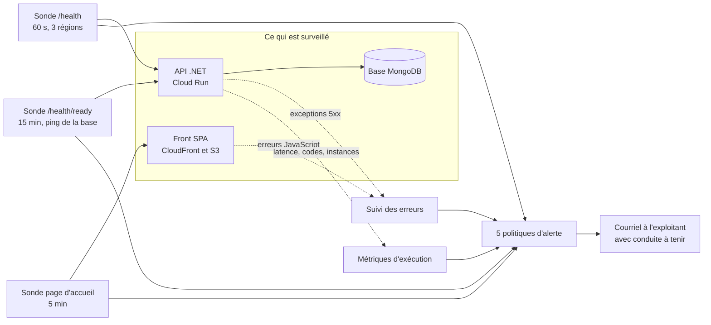
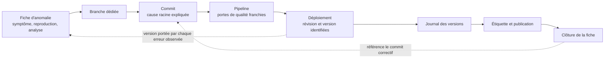

# Dossier professionnel Bloc 4

## Maintenir l'application logicielle en condition opérationnelle

|  |  |
|---|---|
| **Certification** | Expert en développement logiciel : **RNCP 39583** |
| **Bloc évalué** | Bloc 4 : Maintenir l'application logicielle en condition opérationnelle |
| **Projet support** | **Movie Picker** : application web pour choisir un film à plusieurs |
| **Candidat** | Adrien MORAND |
| **Modalité** | Projet individuel, commanditaire fictif (Ynov) |
| **Livrable** | Ce dossier (20 pages maximum) |
| **Date** | Juillet 2026 |

> Ce dossier décrit le maintien en condition opérationnelle d'une application **réellement déployée et utilisée** : les mesures, seuils, incidents et indicateurs qui y figurent proviennent de la production, non d'un environnement de démonstration. Les valeurs chiffrées ont été relevées fin juillet 2026 ; le déploiement continu implique que la production peut avoir évolué depuis.

---

## Sommaire

| § | Section | Compétence |
|:--:|---|---|
| 1 | Processus de mise à jour des dépendances | C4.1.1 |
| 2 | Système de supervision et d'alerte | **C4.1.2** (élim.) |
| 3 | Processus de collecte et de consignation des anomalies | **C4.2.1** (élim.) |
| 4 | Fiche de consignation d'une anomalie | **C4.2.1** (élim.) |
| 5 | Traitement d'une anomalie détectée en production | C4.2.2 |
| 6 | Recommandations argumentées d'amélioration | C4.3.1 |
| 7 | Journal des versions déployées | **C4.3.2** (élim.) |
| 8 | Problème résolu en collaboration avec le support | C4.3.3 |

---

## Contexte

**Movie Picker** répond à un irritant du quotidien : choisir un film à plusieurs sans négociation interminable. Un hôte crée une **soirée** et invite des participants par un simple lien ; chacun propose des films issus du catalogue TMDB, l'assemblée vote, puis une roue tire au sort parmi les propositions retenues.

L'application sert des utilisateurs réels depuis **avril 2026** (la première version étiquetée `1.0.0` datant du 19 mai) à l'adresse **web.movie-picker.fr**. Elle repose sur trois composants déployés indépendamment :

| Composant | Technologie | Hébergement |
|-----------|-------------|-------------|
| Front (SPA installable en PWA) | React 19, TypeScript, Vite | AWS S3 + CloudFront |
| API REST | ASP.NET Core (.NET 10) | GCP Cloud Run (europe-west1) |
| Base de données | MongoDB | MongoDB Atlas |

L'échelle réelle du service conditionne toutes les décisions d'exploitation présentées ici : **17 comptes inscrits**, **19 soirées créées** entre avril et juillet 2026, **15 161 requêtes** servies sur les trente derniers jours. Un projet de cette taille ne justifie ni astreinte ni redondance multi-région ; il justifie en revanche que la moindre indisponibilité soit détectée sans dépendre du signalement d'un utilisateur, et que chaque anomalie laisse une trace écrite. C'est le parti pris de ce dossier : un dispositif **proportionné**, mais complet sur la chaîne détection → consignation → correction → traçabilité.

---

## §1. Processus de mise à jour des dépendances

> **Compétence C4.1.1** : *Gérer les mises à jour des dépendances et des bibliothèques tierces, en surveillant régulièrement les nouvelles versions, en évaluant les impacts, et en les intégrant de manière sécurisée.*

### 1.1 Périmètre logiciel

Le dépôt est un monorepo réunissant deux applications et leur outillage. Le code livré en production repose sur quatre écosystèmes de dépendances, tous placés sous surveillance automatisée :

| Écosystème | Manifeste | Contenu surveillé |
|------------|-----------|-------------------|
| **npm / pnpm** | `pnpm-lock.yaml` (racine + workspace `apps/*`) | Front React/TypeScript, outillage de build et de test |
| **NuGet** | `apps/api-dotnet/**/*.csproj` | API .NET, dépendances transitives incluses |
| **GitHub Actions** | `.github/workflows/*.yml` | Actions du pipeline, épinglées par **SHA de commit** |
| **Images Docker** | `apps/api-dotnet/MoviePicker.Api/Dockerfile` | Images de base de l'API, épinglées par **digest `sha256`** |

L'épinglage par SHA et par digest est une protection contre les attaques de chaîne d'approvisionnement : une action ou une image ne peut pas changer de contenu sous une même étiquette. En contrepartie, ces références n'évoluent que si on les met à jour explicitement : d'où leur intégration au périmètre automatisé.

### 1.2 Fréquence

Trois rythmes se complètent, du plus lent au plus réactif :

| Rythme | Mécanisme | Rôle |
|--------|-----------|------|
| **Mensuel** | Dependabot : une pull request **groupée par écosystème** | Maintenir le socle à jour sans noyer le projet sous les demandes de fusion |
| **Hebdomadaire** | Analyse planifiée Trivy du dépôt entier (lundi, 04 h 17 UTC), sévérités **HIGH et CRITICAL bloquantes** | Capter les vulnérabilités divulguées entre deux cycles mensuels |
| **À chaque commit** | Audit intégré au pipeline : Trivy sur `pnpm-lock.yaml` et `dotnet list package --vulnerable --include-transitive` | Interdire l'introduction d'une dépendance vulnérable et bloquer le déploiement si une faille est publiée entretemps |

La cadence mensuelle groupée, plutôt qu'hebdomadaire et unitaire, est un choix délibéré : sur un projet mené par une seule personne, une pluie de demandes de fusion produit de la fatigue puis des fusions non relues. Le filet de sécurité réel n'est pas la fréquence de l'outil de proposition, mais l'analyse hebdomadaire et l'audit à chaque commit, tous deux **bloquants**.

### 1.3 Type de mise à jour : automatique ou manuel

| Étape | Automatique | Manuel |
|-------|:-----------:|:------:|
| Surveillance des nouvelles versions | ✅ | |
| Détection des vulnérabilités | ✅ | |
| Ouverture de la demande de fusion | ✅ | |
| Exécution des tests et portes de qualité | ✅ | |
| **Évaluation d'impact et décision de fusion** | | ✅ |
| **Montée de version majeure** | | ✅ |
| Déploiement après fusion | ✅ | |

**Aucune fusion n'est automatique.** La proposition est automatisée, la décision ne l'est pas : une montée de version peut franchir toutes les portes tout en modifiant un comportement non couvert par les tests. Les demandes ouvertes par Dependabot s'exécutent d'ailleurs sans accès aux secrets du dépôt, ce qui désactive l'analyse de qualité externe et impose une relecture humaine.

### 1.4 Évaluation de l'impact

Chaque montée de version est jugée sur quatre points : la **nature du changement** (correctif, mineure ou majeure ; une majeure impose la lecture des notes de version), l'**exploitabilité réelle** de la vulnérabilité dans cette application, la **surface d'impact** (fichiers concernés, couverture de tests sur ces chemins), et la **vérification** (compilation, tests unitaires et de bout en bout, build de production, audit de performance). Ces contrôles étant bloquants, une régression détectable ne peut pas atteindre la production.

### 1.5 Cas d'application : une montée majeure sous contrainte de sécurité

Le 25 juillet 2026, l'audit du pipeline échoue sur l'avis **`GHSA-qwww-vcr4-c8h2`** (sévérité haute) : la bibliothèque de routage `react-router` 7.18.1 est vulnérable, le correctif se trouve en version **8.3.0**. Le déploiement est automatiquement bloqué : la porte joue son rôle.

**Évaluation.** L'avis concerne le mode « composants serveur » du routeur, que cette SPA sans rendu serveur n'utilise pas : le code vulnérable n'y est pas atteignable et l'impact en exploitation est nul. Le correctif impose pourtant une **montée majeure** (7.x → 8.x). L'analyse montre que 51 fichiers importent le routeur, tous limités à son cœur stable, et révèle un point structurant : le paquet `react-router-dom` n'est plus publié au-delà de la 7.18.1, la ligne 8.x étant distribuée sous le paquet unifié `react-router`. La montée impose donc un changement de paquet, pas seulement de version.

**Décision et vérification.** La montée est effectuée plutôt que neutralisée par une exception : l'interface utilisée est stable, la couverture de tests est forte, et supprimer la cause vaut mieux qu'entretenir une dérogation à réexaminer indéfiniment. Après remplacement du paquet et réécriture des imports sur les 51 fichiers, le contrôle est complet : compilation et analyse statique sans erreur, suite unitaire au vert, construction de production et service worker conformes, parcours de bout en bout et audit de performance validés. L'avis disparaît, le déploiement bloqué reprend son cours. Durée totale : moins d'une heure, sans adaptation du code applicatif.

### 1.6 Limites connues

L'audit npm s'appuie sur Trivy et non sur l'outil natif du gestionnaire de paquets, dont le service d'audit a été retiré le 15 juillet 2026 ; Trivy lit directement le fichier de verrouillage et couvre le même besoin.

Deux exclusions sont assumées, toutes deux déclarées dans le dépôt plutôt que subies. Côté .NET, une suppression d'audit est active sur l'avis `GHSA-6c8g-7p36-r338` (bibliothèque de compression, sévérité modérée) : aucun correctif amont n'existe, et l'interface vulnérable n'est pas atteignable depuis le pilote de base de données qui l'embarque. La suppression est déclarée dans la configuration du projet, avec sa justification, ce qui la rend relisible et réexaminable, à la différence d'une vulnérabilité simplement ignorée. Côté npm, un cinquième manifeste échappe volontairement à la surveillance, celui des supports de présentation archivés : figé et hors production, il ferait échouer en boucle les correctifs de sécurité sur des dépendances qu'aucun déploiement n'utilise.

Enfin, les montées majeures restent des décisions humaines : aucune automatisation ne peut juger de l'acceptabilité d'une rupture d'interface.

---

## §2. Système de supervision et d'alerte

> **Compétence C4.1.2 (éliminatoire)** : *Concevoir un système de supervision et d'alerte en déterminant le périmètre de supervision, en identifiant les indicateurs de suivi pertinents, en mettant en place des sondes et en configurant la modalité des signalements, afin de garantir une disponibilité permanente du logiciel.*

### 2.1 Périmètre de supervision

Les trois composants de l'application sont déployés séparément et peuvent tomber indépendamment les uns des autres : le périmètre les couvre tous les trois, ainsi que les dépendances externes dont l'indisponibilité dégrade le service.

| Composant | Ce qui est surveillé |
|-----------|----------------------|
| **Front SPA** (S3 + CloudFront) | Disponibilité de la page servie, erreurs JavaScript, Web Vitals |
| **API .NET** (Cloud Run) | Disponibilité, aptitude à servir, latence, taux d'erreur, exceptions serveur |
| **Base MongoDB** (Atlas) | Joignabilité depuis l'API |
| **Services tiers** (catalogue TMDB, courriel, notifications) | Indisponibilité, remontée en erreur serveur et capturée par le suivi des erreurs |

La supervision de l'infrastructure sous-jacente (machines, réseau, réplication) relève des fournisseurs managés et n'est pas instrumentée par le projet : c'est une limite assumée, cohérente avec le choix d'un hébergement entièrement managé.

### 2.2 Indicateurs de suivi et critères de qualité

Les cibles ne sont pas des valeurs théoriques : elles ont été calées sur trente jours de mesures réelles relevées avant leur définition.

| Indicateur | Mesure de référence | Cible |
|------------|--------------------|-------|
| Disponibilité de l'API | 100 % depuis la mise en service des sondes | **≥ 99,5 %** par mois |
| Disponibilité du front | 100 % depuis la mise en service des sondes | **≥ 99,5 %** par mois |
| Latence p50 | **72 ms** | < 200 ms |
| Latence p95 | **207 ms** | **< 500 ms** |
| Latence p99 | 284 ms | < 1 s |
| Démarrage à froid | 3,8 s | toléré (choix de coût assumé) |
| Ping de la base depuis l'API | **7 ms** | < 100 ms |
| Taux d'erreur serveur | **0,026 %** (4 réponses 5xx sur 15 161 requêtes) | **< 1 %** |
| Erreurs applicatives | regroupées par empreinte | 0 anomalie non triée au-delà de 24 h |
| Performance du front | médiane de trois exécutions | **≥ 80**, porte bloquante |
| Accessibilité du front | score 100 mesuré | **≥ 98**, porte bloquante |

L'API est configurée sans instance minimale : après une période d'inactivité, le premier appel subit un **démarrage à froid de 3,8 secondes**. C'est un arbitrage de coût explicite, et les seuils d'alerte en tiennent compte plutôt que de le traiter comme une anomalie.

### 2.3 Sondes mises en place et finalité de chacune

Quatre familles de sondes se complètent, de la vérification externe la plus factuelle à la prévention en amont du déploiement. Les trois premières convergent vers le même point de signalement.



**a. Sondes actives de disponibilité.** Ce sont les seules qui prouvent qu'un utilisateur peut réellement atteindre le service : elles interrogent l'application **de l'extérieur**, depuis trois continents, indépendamment de son propre code.

| Sonde | Cible | Fréquence | Finalité | Validation |
|-------|-------|:---------:|----------|------------|
| Disponibilité API | `api.movie-picker.fr/health` | 60 s | Le service répond-il ? | Code 2xx **et** `status = ok` |
| Aptitude à servir | `api.movie-picker.fr/health/ready` | 15 min | Le service est-il réellement opérationnel, base comprise ? | Code 2xx **et** dépendance `mongodb` à `ok` |
| Disponibilité front | `web.movie-picker.fr/` | 5 min | La SPA est-elle servie par le CDN ? | Code 2xx **et** présence du titre attendu |

Chaque sonde s'exécute depuis l'Europe, les États-Unis et l'Asie-Pacifique, avec un délai d'expiration de dix secondes. Interroger plusieurs régions évite de confondre une panne réelle avec un incident réseau local.


La distinction entre les deux sondes de l'API est le point central du dispositif. `GET /health` répond sans solliciter aucune dépendance : il détecte un service mort ou une révision qui ne démarre pas. `GET /health/ready` exécute un ping de la base avec un délai maximal de trois secondes et renvoie **503** si elle est injoignable : il détecte le cas (invisible pour la première sonde) où l'API répond parfaitement mais ne peut servir aucune donnée. La réponse porte également la **version déployée**, ce qui permet de vérifier à tout instant ce qui tourne réellement en production :

```json
{
  "status": "ready",
  "service": "movie-picker-api",
  "release": "df44971f…",
  "dependencies": [{ "name": "mongodb", "status": "ok", "durationMs": 7 }]
}
```

Cette même vérification est rejouée **en fin de déploiement** par le pipeline : une révision dont la base est injoignable fait échouer sa propre mise en production, avant d'avoir servi le moindre utilisateur.

**b. Sondes passives, métriques d'exécution.** Collectées en continu par la plateforme d'hébergement, sans instrumentation applicative : requêtes par classe de code (2xx/3xx/4xx/5xx), distribution des latences, nombre d'instances actives. Leur finalité est de détecter les **dégradations progressives** que des sondes binaires « en ligne / hors ligne » ne verraient jamais : une latence qui monte, des erreurs qui apparaissent.

**c. Sonde applicative, suivi des erreurs.** Deux projets Sentry, un par composant, en production uniquement. Sont capturées les exceptions front non gérées (y compris les erreurs de rendu remontées par la barrière d'erreur de l'application) et toute réponse de classe 5xx, y compris l'indisponibilité déclarée d'un service tiers. Les erreurs métier attendues sont délibérément exclues pour éviter le bruit : validation, ressource non trouvée, conflit, non autorisé. Le partage se fait sur le code de réponse plutôt que sur le type d'exception, de sorte qu'une nouvelle erreur serveur est capturée sans qu'on ait à y penser. Les traces de performance sont échantillonnées à 10 %. Chaque événement porte l'environnement, la **version déployée**, la route et le contexte d'exécution ; les incidents sont regroupés par empreinte, avec compteur d'occurrences et version d'introduction. Les fichiers de correspondance du front sont transmis pendant la construction puis retirés de l'artefact publié : les piles d'appel sont lisibles sans exposer le code source. Sa finalité est de **nommer la cause** là où les sondes précédentes ne constatent qu'un symptôme.

**d. Sondes préventives : avant la mise en production.** Tests unitaires et d'intégration, tests de bout en bout, audit de performance et d'accessibilité, porte de qualité du code, analyses de vulnérabilités et de secrets, plus une analyse de sécurité hebdomadaire planifiée. Leur finalité est de faire échouer le déploiement plutôt que l'utilisateur.

### 2.4 Seuils d'alerte

Cinq politiques sont configurées, dont celle des erreurs serveur qui porte deux conditions complémentaires. Leurs seuils sont volontairement placés **au-dessus du bruit mesuré** : une alerte qui se déclenche sans raison finit par être ignorée, et un système de supervision qu'on ignore ne supervise plus rien.

| Politique | Condition | Seuil | Sévérité | Justification du seuil |
|-----------|-----------|-------|:--------:|------------------------|
| **API indisponible** | Sonde `/health` en échec | ≥ 2 points de contrôle sur 5 min | Critique | Un seul point en échec traduit un incident réseau local, pas une panne |
| **Base injoignable** | Sonde `/health/ready` en échec | ≥ 2 points de contrôle sur 30 min | Critique | L'API répond mais ne peut servir aucune donnée : impact utilisateur total |
| **Front indisponible** | Sonde front en échec | ≥ 2 points de contrôle sur 10 min | Critique | Même logique, avec une fréquence de sonde plus lente |
| **Erreurs serveur anormales** | Part des réponses en 5xx | > 20 % pendant 10 min | Erreur | Voir ci-dessous : un seuil exprimé en nombre d'erreurs serait inatteignable à ce volume |
| **Erreurs serveur anormales** | Volume de réponses 5xx | > 2 sur 30 min | Erreur | Référence mesurée : 4 réponses 5xx en 30 jours |
| **Latence dégradée** | p95 des requêtes | > 800 ms pendant 10 min | Avertissement | Référence mesurée : 207 ms ; marge laissée aux démarrages à froid |

La politique sur les erreurs serveur mérite un mot, parce qu'elle illustre le piège d'un seuil calé sur le seul bruit. Le service reçoit environ 15 000 requêtes utilisateur par mois, soit **moins de deux par fenêtre de cinq minutes** : un seuil exprimé en nombre absolu d'erreurs, si bas soit-il, ne peut pas être franchi par une panne qui renverrait pourtant 500 à la totalité du trafic. Le déclencheur principal est donc une **part du trafic**, indépendante du volume, tenue pendant dix minutes pour qu'une erreur isolée, mécaniquement majoritaire sur un trafic aussi faible, ne déclenche rien. Le déclencheur en volume absolu reste en second rideau, sur une fenêtre de trente minutes, pour capter la dégradation lente que la part du trafic manquerait si le volume remontait.

Chaque politique embarque sa **conduite à tenir**, affichée dans la notification : où regarder, dans quel ordre, et quand déclencher un retour arrière. Les alertes se referment automatiquement après trente minutes sans nouvelle occurrence.

### 2.5 Modalité de signalement

Le signalement se fait par **courriel** vers l'adresse d'exploitation, déclarée comme canal de notification et rattachée aux cinq politiques. Le message porte la politique déclenchée, la condition franchie, la valeur observée, l'horodatage, un lien vers l'incident et le graphique correspondant, ainsi que la conduite à tenir. Trois règles complémentaires par projet Sentry couvrent les erreurs applicatives : anomalie classée prioritaire, **régression** d'une anomalie précédemment corrigée, et **rafale** de plus de vingt occurrences en une heure. La règle de régression protège contre un scénario classique : une correction qui se défait silencieusement plusieurs déploiements plus tard.

La chaîne complète a été **vérifiée de bout en bout** : une sonde temporaire pointant vers une adresse inexistante a été mise en service, l'alerte s'est déclenchée après deux points de contrôle en échec, et le courriel est parvenu à l'exploitant avec sa conduite à tenir. La sonde et la politique de test ont ensuite été supprimées. Le dispositif n'est donc pas seulement configuré : il est prouvé.


Le projet étant exploité par une seule personne, il n'y a ni astreinte ni escalade à plusieurs niveaux : le signalement va directement à l'exploitant, qui est aussi le développeur. Une escalade formelle serait ici une complication sans destinataire.

Une alerte n'a d'intérêt que si elle débouche sur une action : elle est qualifiée à partir de l'incident, puis consignée en fiche écrite selon le processus du §3, corrigée par le pipeline ou annulée par un retour arrière, et refermée par la vérification des sondes et l'inscription au journal des versions.

### 2.6 Tableau de bord

Un tableau de bord d'exploitation regroupe les six vues utilisées au quotidien : disponibilité de l'API, disponibilité du front, latences p50 et p95 avec le seuil d'alerte matérialisé, répartition des requêtes par classe de code, erreurs serveur, et nombre d'instances actives.


### 2.7 Données personnelles

Le suivi des erreurs relève de l'**intérêt légitime**, sécurité et stabilité du service : il n'utilise aucun cookie et n'est pas conditionné au consentement, contrairement à l'analytique produit, mais figure par transparence dans les préférences. La minimisation est stricte : envoi des données personnelles désactivé sur les deux SDK, effacement de l'adresse IP, du courriel et du nom d'utilisateur avant transmission, aucun enregistrement de session. Les sondes n'interrogent que des points d'entrée techniques, sans authentification ni donnée utilisateur.

### 2.8 Coûts et limites

L'ensemble du dispositif fonctionne dans les offres gratuites. Les sondes ajoutent environ **138 000 requêtes mensuelles** à l'API, soit 7 % du quota offert sur une facturation au temps de traitement : la sonde `/health` interrogée toutes les minutes depuis trois régions en représente à elle seule 130 000. Les exécutions de sondes et les notifications ne sont pas facturées. Effet de bord favorable : les instances restent tièdes, ce qui réduit les démarrages à froid pour les utilisateurs réels.

Trois limites sont assumées. La rétention des erreurs est d'environ trente jours sur l'offre gratuite, ce qui impose d'archiver hors outil les incidents à conserver. La base de données n'est pas supervisée pour elle-même, seule sa joignabilité depuis l'API l'est. Enfin, les sondes et les politiques ont été créées par appels d'interface de programmation et ne sont pas encore décrites en infrastructure-as-code : c'est un point de fragilité, repris comme axe d'amélioration au §6.

---

## §3. Processus de collecte et de consignation des anomalies

> **Compétence C4.2.1 (éliminatoire)** : *Consigner les anomalies détectées en élaborant un processus de collecte et de consignation, en utilisant des outils de collecte et en y intégrant toutes les informations pertinentes, afin de déterminer le correctif à mettre en place.*

### 3.1 Principe

**Une anomalie confirmée donne lieu à une fiche écrite.** Le gestionnaire d'incidents du dépôt (GitHub Issues) est la source unique de vérité : aucune correction n'est déployée sans une trace expliquant ce qui ne va pas, comment le reproduire et ce qui a été décidé.

Cette règle vaut particulièrement sur un projet mené par une seule personne. C'est là qu'elle est la plus fragile (la mémoire du développeur remplace volontiers l'écrit) et là qu'elle rend le plus service : trois semaines après, la cause racine d'une anomalie n'est plus reconstituable de tête, et un correctif dont on a oublié le motif se défait au premier remaniement.

Le processus est dimensionné pour la typologie du logiciel : une application web grand public, en déploiement continu, sans astreinte, dont les anomalies proviennent presque toutes de trois origines : une régression introduite par un déploiement, une dépendance externe défaillante, ou un cas d'usage non prévu.

### 3.2 Canaux de collecte

Une anomalie n'arrive jamais par un seul chemin. Cinq canaux alimentent le processus, du plus automatique au plus humain.

| # | Canal | Ce qu'il détecte | Délai de détection |
|:-:|-------|------------------|--------------------|
| 1 | **Supervision** : 3 sondes actives, 5 politiques d'alerte (§2) | Indisponibilité, base injoignable, erreurs serveur anormales, latence dégradée | 2 à 30 min selon la sonde |
| 2 | **Suivi des erreurs** : 2 projets, 3 règles d'alerte chacun (§2) | Exception front ou serveur, régression d'une anomalie corrigée, rafale d'occurrences | Immédiat |
| 3 | **Retours utilisateurs** : lien « Signaler un problème » en pied de page | Anomalie fonctionnelle qui ne lève aucune exception : comportement inattendu, donnée incohérente, parcours bloqué | Variable |
| 4 | **Portes du pipeline** : tests unitaires, intégration, bout en bout, performance, accessibilité, qualité du code, vulnérabilités, secrets, analyse hebdomadaire | Régression, vulnérabilité, dégradation : **avant** la mise en production | À chaque commit, plus une analyse hebdomadaire |
| 5 | **Recette manuelle** | Écart avec le cahier de recettes | À chaque évolution fonctionnelle |

Les canaux 1, 2 et 4 sont automatiques et notifient par courriel. Le canal 3 est le seul qui dépende d'une démarche humaine, et c'est celui qui remonte les anomalies les plus coûteuses, puisqu'elles ont déjà atteint l'utilisateur sans déclencher la moindre alerte technique. L'anomalie présentée au §4 en est l'illustration exacte : l'application répondait normalement et ne levait aucune exception pendant que les utilisateurs perdaient leur session.

C'est précisément pour réduire la dépendance à ce canal que la supervision a été renforcée, et pour le rendre plus efficace que le lien de signalement a été ajouté : il ouvre un message pré-rempli embarquant la page concernée, la version de l'application et le navigateur, trois informations qu'il fallait auparavant réclamer.

### 3.3 Outil et gabarit de consignation

Les fiches vierges sont **désactivées** dans le dépôt : tout signalement passe obligatoirement par un formulaire structuré. Cette contrainte garantit que les informations nécessaires à la reproduction sont présentes dès la création, plutôt que réclamées ensuite par allers-retours.

| Champ | Obligatoire | Pourquoi il est nécessaire |
|-------|:-----------:|----------------------------|
| **Contexte** | oui | URL, navigateur, système, version : sans eux, on corrige à l'aveugle une anomalie qui peut être propre à un environnement |
| **Étapes pour reproduire** | oui | Une anomalie non reproductible ne peut être ni corrigée avec certitude, ni vérifiée après correction |
| **Comportement attendu** | oui | Distingue le défaut réel du malentendu fonctionnel |
| **Comportement observé** | oui | Décrit le symptôme tel qu'il se manifeste, indépendamment de son interprétation |
| **Captures ou journaux** | non | Capture, erreur de console ou lien vers l'événement capturé : raccourcit fortement le diagnostic |
| **Sévérité** | oui | Détermine le délai de prise en charge |

Les fiches portent des étiquettes normalisées : `bug`, `triage` (posée automatiquement à la création), `severite:critical|high|medium|low`, `production` lorsque l'anomalie est constatée en production, et `regression` lorsqu'il s'agit de la réapparition d'une anomalie déjà corrigée.

### 3.4 Qualification et délais de prise en charge

La sévérité est déclarée par le signalant, puis confirmée au triage. Elle mesure l'**impact utilisateur**, jamais la difficulté technique : une anomalie triviale à corriger peut bloquer tout le monde, et une correction complexe n'affecter personne.

| Sévérité | Définition | Prise en charge | Correction visée |
|----------|-----------|-----------------|------------------|
| **critical** | Service inutilisable ou perte de données | Immédiate, tout autre travail suspendu | Sous 24 h, ou retour arrière immédiat |
| **high** | Fonctionnalité principale bloquée, sans contournement | Sous 24 h | Sous 72 h |
| **medium** | Gêne réelle mais contournement possible | Au prochain lot de travail | Prochaine version mineure |
| **low** | Cosmétique ou marginal | Mise en file | Sans engagement de date |

Une anomalie critique en production ouvre un arbitrage immédiat : **corriger** ou **revenir en arrière**. Le retour arrière est privilégié lorsque l'anomalie suit un déploiement, car il rétablit le service en quelques minutes sans exiger d'avoir compris la cause : comprendre vient ensuite, sans les utilisateurs en otage.

### 3.5 Cycle de vie d'une anomalie

1. **Signalement** : création de la fiche via le gabarit, quel que soit le canal d'origine. Une alerte de supervision ou une erreur capturée est recopiée en fiche, avec le lien vers l'événement d'origine.
2. **Triage** : confirmation de la sévérité, retrait de l'étiquette `triage`, ajout de `production` ou `regression` le cas échéant.
3. **Reproduction** : rejeu des étapes déclarées. Une anomalie non reproductible n'est pas refermée pour autant : elle est documentée avec ce qui a été tenté, et reste ouverte tant que le signalement persiste.
4. **Analyse** : identification de la cause racine, consignée dans la fiche. Symptôme et cause sont distingués explicitement : une même déconnexion peut venir d'un cookie, d'une clé de chiffrement ou d'une configuration inopérante.
5. **Correction** : branche dédiée, correctif accompagné d'un **test de non-régression** lorsque la nature du défaut le permet (§5).
6. **Vérification** : le correctif est validé en production et pas seulement en local, par le contrôle automatique en fin de déploiement, puis vérification du comportement d'origine.
7. **Clôture** : la fiche est refermée en référençant le commit correctif et la date de déploiement.

**Définition de « corrigé »** : le correctif est déployé en production, le comportement d'origine est vérifié sur l'environnement réel, un test automatisé couvre le cas lorsque c'est possible, et l'évolution est inscrite au journal des versions. Tant que ces quatre conditions ne sont pas réunies, l'anomalie reste ouverte : un correctif fusionné mais non déployé ne corrige rien pour l'utilisateur.

### 3.6 Traçabilité

Chaque anomalie laisse une chaîne complète et vérifiable :



Cette chaîne se parcourt dans les deux sens : depuis une anomalie, on retrouve la version qui la corrige ; depuis une version, on retrouve les anomalies qu'elle traite. La version portée par chaque événement d'erreur, égale à l'identifiant du commit déployé, fait le lien entre une exception observée en production et le déploiement qui l'a introduite.

---

## §4. Fiche de consignation d'une anomalie

> **Compétence C4.2.1 (éliminatoire)** : *La fiche de consignation contient les informations permettant de reproduire le bogue ; l'analyse du bogue et les préconisations de correction sont explicitées et permettent de corriger l'anomalie.*

### 4.1 L'anomalie retenue

L'anomalie traitée ici relève du cas le plus difficile pour un dispositif de maintien en condition opérationnelle : une anomalie **invisible pour la supervision technique**. L'API répondait, ne levait aucune exception, et renvoyait des codes d'erreur parfaitement conformes à son propre code. Seuls les utilisateurs pouvaient la signaler.

Elle est consignée dans le gestionnaire d'incidents du dépôt sous la référence **#67** (`github.com/Affy657/Movie-Picker/issues/67`).


### 4.2 Identification

| | |
|---|---|
| **Référence** | #67 |
| **Titre** | Déconnexion à la fermeture du navigateur en production (session non persistée) |
| **Détectée le** | 17/07/2026 |
| **Canal de détection** | Retour utilisateur direct (plusieurs utilisateurs), confirmé par reproduction |
| **Environnement** | Production : front et API |
| **Supports concernés** | Tous : ordinateur, mobile, application installée en PWA |
| **Version** | 1.3.1 |
| **Sévérité** | **high** : fonctionnalité principale bloquée, sans contournement |
| **Étiquettes** | `bug`, `production`, `severite:high` |

### 4.3 Reproduction

**Étapes**

1. Se connecter à l'application avec un compte existant.
2. Vérifier que la session est active (l'utilisateur est bien identifié).
3. Fermer complètement l'onglet ou le navigateur.
4. Attendre une période d'inactivité suffisante pour que le service redescende à zéro instance (quelques dizaines de minutes).
5. Rouvrir l'application.

**Comportement attendu.** La session persiste : l'utilisateur reste connecté, le cookie d'authentification étant émis avec une durée de vie longue.

**Comportement observé.** L'utilisateur est déconnecté et renvoyé vers l'écran de connexion ; l'API répond **401** sur les appels authentifiés.

**Élément déterminant.** Le phénomène est apparu **sans aucun changement de code**. Les utilisateurs le formulent ainsi : « avant, ça marchait ».

L'étape 4 est celle qui rend la fiche exploitable : sans elle, la reproduction échoue une fois sur deux et l'anomalie passe pour intermittente. C'est la conjonction *fermeture du navigateur* + *inactivité prolongée du service* qui déclenche le défaut.

### 4.4 Analyse

Le diagnostic a mis au jour **deux causes cumulées**, l'une expliquant le déclenchement, l'autre aggravant silencieusement la situation depuis l'origine.

**Cause racine 1 : clé de chiffrement expirée.** Le cookie d'authentification est chiffré par le mécanisme de protection des données du framework. La clé provenait d'un secret généré **sans durée explicite**, donc avec la valeur par défaut de **90 jours**. Créée lors d'un déploiement d'avril 2026, elle a expiré à la mi-juillet. Le trousseau ne contenant qu'une seule clé, chaque instance s'est mise à en régénérer une **éphémère**, stockée dans un dossier temporaire effacé au démarrage. Le service étant configuré sans instance minimale, le démarrage à froid suivant rendait le cookie émis par l'instance précédente indéchiffrable : 401, puis déconnexion.

Cette cause explique les trois observations : le lien avec la fermeture du navigateur (le temps d'inactivité laisse le service redescendre à zéro), l'atteinte de tous les supports (le défaut est côté serveur), et l'apparition sans déploiement (c'est le temps qui déclenche, pas le code).

**Cause racine 2 : configurateur jamais exécuté.** Le composant chargé de configurer le cookie était enregistré sur une interface que la fabrique d'options **ne consomme pas**. Il ne s'exécutait donc jamais : le cookie portait le nom par défaut du framework au lieu du nom applicatif, le magasin de sessions était inactif, et les réglages de sécurité étaient inopérants. Un 401 renvoyait même une redirection vers une route de connexion inexistante dans cette API.

Ce défaut était présent depuis l'origine sans jamais se manifester : il n'a été révélé que par l'investigation de la première cause. Vérification apportée au diagnostic : un test isolé de l'injection de dépendances échoue avec l'ancien enregistrement, le cookie produit portant le nom par défaut.

### 4.5 Préconisations de correction

| # | Préconisation | Effet attendu |
|:-:|---------------|---------------|
| 1 | **Persister les clés de chiffrement en base** plutôt que dans un stockage éphémère, de sorte qu'elles soient partagées entre instances et révisions | Supprime la cause racine 1 : plus de perte de clé au redémarrage, rotation automatique sans rupture |
| 2 | **Corriger l'enregistrement du configurateur** sur l'interface effectivement consommée par la fabrique d'options | Supprime la cause racine 2 : nom du cookie, magasin de sessions et réglages de sécurité redeviennent effectifs |
| 3 | **Porter la durée de session à 30 jours glissants**, valeur partagée par le configurateur, le contrôleur d'authentification et le magasin de tickets | Aligne la durée réelle sur la promesse faite à l'utilisateur, en une seule source de vérité |
| 4 | **Allonger la durée de la clé de secours** générée hors base | Évite que le repli reproduise l'expiration à 90 jours |
| 5 | **Ajouter un test de non-régression** vérifiant que le configurateur s'applique réellement | Interdit la réapparition silencieuse de la cause racine 2 |

**Effet de bord à anticiper** : le changement de clé de chiffrement et l'activation du magasin de sessions invalident les cookies existants. Une **reconnexion unique** de tous les utilisateurs au déploiement est donc inévitable : un inconvénient sans commune mesure avec le défaut corrigé, mais qui doit être assumé et annoncé plutôt que subi.

Le traitement effectif de ces préconisations, de la branche de correction à la vérification en production, fait l'objet du §5.

### 4.6 Portée de la fiche

Cette fiche a été consignée **a posteriori** : l'anomalie date du 17 juillet 2026, antérieure à la formalisation du processus décrit au §3. Elle a été reconstituée à partir du diagnostic d'origine et du correctif déployé, avec les dates réelles de chaque étape. Depuis, le processus s'applique en amont (le canal de signalement, les étiquettes de triage et le gabarit obligatoire sont en place) et l'anomalie suivante, détectée le 25 juillet par les portes du pipeline, a bien été consignée au moment de sa constatation (fiche #68, §5.4).

---

## §5. Traitement d'une anomalie détectée en production

> **Compétence C4.2.2** : *Créer et déployer un correctif en respectant le processus d'intégration et de déploiement continu afin de résoudre l'anomalie. Le traitement tire profit du processus d'intégration et de déploiement continu ; le correctif mis en place est décrit et permet la résolution de l'anomalie.*

### 5.1 Le pipeline mobilisé

Un correctif emprunte exactement le même chemin qu'une évolution : **aucune voie rapide, aucun accès direct à la production**. C'est ce qui permet de corriger vite sans corriger mal : l'urgence d'une anomalie est précisément le moment où l'on est tenté de sauter les vérifications.

Le pipeline se déclenche sur **toute poussée, quelle que soit la branche**, et compare la branche à la branche principale pour déterminer ce qu'il doit vérifier. Les portes s'exécutent donc avant la fusion, sur le périmètre exact que la fusion apportera ; seuls les travaux de publication et de déploiement sont réservés à la branche principale.

| Étape | Contrôles | Bloquant |
|-------|-----------|:--------:|
| **Poussée sur une branche** | Analyse statique, formatage, compilation ; recherche de secrets | ✅ |
| **Tests** | Tests unitaires front (578) et API, tests d'intégration, **6 parcours de bout en bout** | ✅ |
| **Qualité et sécurité** | Porte de qualité du code sur le code nouveau, analyse de vulnérabilités des dépendances et de l'image, audit de performance et d'accessibilité | ✅ |
| **Fusion sur la branche principale** | Relecture du correctif par son auteur, hors portes automatiques | n/a |
| **Construction et publication** | Image conteneur analysée puis publiée, référencée par empreinte | ✅ |
| **Déploiement** | Mise en ligne de la révision (API) ; synchronisation et invalidation du cache (front) | n/a |
| **Contrôle post-déploiement** | Appel des deux sondes de santé : le service répond-il, et peut-il servir ? | ✅ |

Le déploiement n'est donc pas un acte manuel, mais la conséquence d'une fusion ayant franchi l'ensemble des portes. En cas d'incident malgré tout, un retour arrière bascule la totalité du trafic vers la révision précédente **sans reconstruction**, en quelques minutes.

### 5.2 Chronologie du traitement de l'anomalie #67

| Étape | Contenu |
|-------|---------|
| **Signalement** (17/07) | Plusieurs utilisateurs rapportent des déconnexions ; qualification et reproduction |
| **Analyse** | Identification des deux causes racines (§4.4) |
| **Branche dédiée** | `fix/auth-session-persistence`, isolée de la branche principale |
| **Correctif** | Commit `ec7ce77`, accompagné d'un test de non-régression |
| **Portes du pipeline** | Analyse statique, tests unitaires et d'intégration, parcours de bout en bout, qualité, sécurité : toutes franchies |
| **Fusion** | `21335d2` sur la branche principale |
| **Relecture** | Relecture du correctif après fusion, ajustements livrés sur une branche de suivi (`f80c95b`) |
| **Déploiement** | Automatique : construction, publication de l'image, mise en ligne de la révision |
| **Contrôle post-déploiement** | Sonde de santé appelée par le pipeline, réponse conforme |
| **Vérification fonctionnelle** | Session testée après déploiement, **puis après un démarrage à froid** : la condition exacte qui déclenchait le défaut |
| **Clôture** | Fiche refermée en référençant le commit correctif et la date de déploiement |

### 5.3 Le correctif mis en place

Les cinq préconisations du §4.5 ont toutes été réalisées. Le dépôt de clés est désormais adossé à la base de données, ce qui les rend durables et partagées entre instances et révisions sans interrompre la rotation automatique, le repli sur fichier restant en développement. Le configurateur est enregistré sur l'interface effectivement consommée par la fabrique d'options, si bien que le nom du cookie applicatif, le magasin de sessions, les réglages de sécurité et la réponse 401 en JSON redeviennent effectifs. La durée de session est portée à trente jours glissants par une constante unique, partagée par le configurateur, le contrôleur d'authentification et le magasin de tickets. La clé de secours générée hors base voit sa durée de vie portée à dix ans. Un test de non-régression, enfin, échoue avec l'ancien enregistrement.

**Pourquoi le correctif résout l'anomalie.** La cause racine 1 disparaît parce que la clé n'est plus dans un espace éphémère : ni un redémarrage, ni un passage à zéro instance, ni un déploiement ne la lui font perdre, et le cookie reste déchiffrable. La cause racine 2 disparaît parce que la configuration s'applique enfin, ce qu'un test garantit à chaque exécution du pipeline. La reconnexion unique annoncée s'est produite comme prévu, puis les sessions sont restées stables. **Aucune réapparition depuis le 17 juillet 2026.**

### 5.4 Un second cas : la porte qui bloque avant l'utilisateur

Le 25 juillet 2026, l'ajout du lien « Signaler un problème » en pied de page fait échouer **cinq parcours de bout en bout** sur six. Le motif est instructif : le libellé d'accessibilité du nouveau lien contient le mot « e-mail », si bien que le sélecteur `getByLabel('E-mail')` des tests, jusque-là sans ambiguïté, désigne désormais deux éléments, le champ du formulaire d'inscription et le lien du pied de page.

Conséquence immédiate : la porte des parcours de bout en bout étant bloquante et le déploiement du front en dépendant, la mise en ligne est annulée. **Le défaut n'a jamais atteint la production.**

Le processus décrit au §3 s'applique de la même manière qu'à une anomalie signalée par un utilisateur : le défaut est consigné en fiche **#68**, avec ses étapes de reproduction, son analyse et les options de correction envisagées. Deux étaient possibles : dégrader le libellé d'accessibilité du lien pour lever l'ambiguïté, ou rendre le sélecteur de test exact. La seconde a été retenue, parce que l'accessibilité prime et qu'un futur libellé mentionnant l'e-mail ne recassera pas les tests. Le défaut se situait d'ailleurs dans le test, non dans l'application : le sélecteur, écrit en correspondance partielle, était fragile avant même l'ajout du lien, qui n'a fait que le révéler. Après correction, les six parcours repassent au vert en local, puis en intégration continue ; le déploiement bloqué reprend et met en ligne le canal de signalement.

### 5.5 Ce que le déploiement continu apporte au traitement d'une anomalie

Ces deux cas se complètent : le premier montre le pipeline **corrigeant** une anomalie parvenue jusqu'aux utilisateurs, le second le montre **empêchant** un défaut de les atteindre, une même chaîne mobilisée à deux moments du cycle de vie. Ils donnent ensemble la mesure de ce que le déploiement continu change. Le **délai** d'abord : le correctif atteint la production dès la fusion, sans fenêtre de livraison à attendre. La **non-régression** ensuite, puisqu'un correctif ne peut pas en introduire un autre sans que les 578 tests unitaires, les six parcours de bout en bout et les audits de qualité ne le signalent, y compris dans l'urgence. La **réversibilité** enfin, qui rend l'arbitrage « corriger ou revenir en arrière » du §3.4 réellement praticable, un retour arrière rétablissant la révision précédente en quelques minutes sans reconstruction.


---

## §6. Recommandations argumentées d'amélioration

> **Compétence C4.3.1** : *Proposer des axes d'amélioration en prenant en compte les indicateurs de performance et en analysant les retours utilisateurs, afin de maintenir et renforcer l'attractivité du logiciel.*

### 6.1 Méthode

Les recommandations qui suivent partent de mesures, non d'intuitions. Quatre sources ont été exploitées : la **base de production** (agrégats sans donnée personnelle), les **métriques d'exploitation** sur trente jours, l'**analytique produit** sur quatre-vingt-dix jours, et les **audits automatisés** exécutés à chaque déploiement.

Le volet qualitatif s'y ajoute désormais : le canal « Signaler un problème » est en service depuis la version 1.3.2, et le questionnaire de retour, en ligne depuis le 18 août 2026, a reçu sept réponses en quarante-huit heures sur une dizaine espérée au maximum. L'échantillon est réduit et orienté vers les utilisateurs les plus engagés (cinq répondants sur sept utilisent l'application à chaque soirée) ; les tendances qu'il révèle sont indicatives, pas représentatives, et intégrées ci-dessous à titre de confirmation plutôt que de fondement.

### 6.2 Indicateurs observés

| Indicateur | Mesure | Lecture |
|------------|--------|---------|
| Utilisateurs inscrits | 17 (avril à juillet 2026) | Base réduite, usage entre proches |
| Soirées créées | 19 : rythme mensuel 2 / 6 / 6 / 5 | Activité stable |
| Soirées menées jusqu'au tirage | **14 sur 19 : 74 %** | Le parcours principal aboutit |
| Films proposés | 62 : moyenne 3,3 par soirée | Conforme à l'usage attendu |
| Participations | 80 : moyenne 4,2 par soirée | Le partage par lien fonctionne |
| Votes exprimés | 81 (68 pour, 13 contre) | **56 % des participations n'ont produit aucun vote** ; les 44 % restantes votent 2,3 fois pour 3,3 films disponibles |
| Soirées tirées en mode pondéré par les votes | **0 sur 19** | Le vote n'a jamais influencé un tirage |
| Films dotés d'une note de présentation | **3 sur 62 : 5 %** | Fonctionnalité quasi ignorée |
| Marques « déjà vu » | 15 | Usage modéré |
| Abonnements aux notifications système | **3 sur 17 : 18 %** | Fonctionnalité peu adoptée |
| Relations de suivi | 21 | Fonctionnalité sociale utilisée |
| Latence p95, taux d'erreur | 207 ms, 0,026 % | Aucun problème de fiabilité |
| Événements du parcours cœur | **0** | Création, vote et tirage non instrumentés |

Deux conclusions structurent le reste. **La fiabilité n'est pas le facteur limitant** : aucun indicateur technique n'est dans le rouge. **L'engagement dans la soirée l'est** : le vote, mécanisme censé faire émerger le consensus, est à peine sollicité, et plusieurs fonctionnalités livrées ne rencontrent pas leur usage.

### 6.3 Recommandations

**R1. Instrumenter le parcours cœur.** Aucun événement n'est capturé sur la création d'une soirée, l'ajout d'un film, le vote ou le tirage : les chiffres ci-dessus ont dû être reconstitués depuis la base et décrivent des résultats, jamais des abandons. Impossible aujourd'hui de répondre à « combien d'invités ouvrent le lien sans jamais voter ? ». La proposition consiste à capturer six événements et à construire l'entonnoir correspondant ; l'infrastructure analytique existe déjà et reste soumise au consentement, seuls les appels manquent.
*Coût **0,5 à 1 jour**, effet immédiat. Gain : mesure des abandons étape par étape, les décisions suivantes cessent d'être des paris.* **Priorité 1**, prérequis des autres.

**R2. Réconcilier le vote et son effet sur le tirage.** Chaque film proposé porte deux boutons, « Voter pour » et « Voter contre ». Le problème n'est pas l'intensité du vote mais son audience : les participants qui votent le font sur 2,3 films en moyenne, mais **56 % des participations n'ont produit aucun vote**. La mesure décisive est toutefois ailleurs. La roue accepte deux modes, un tirage strictement aléatoire et un tirage pondéré par les votes ; le premier est la valeur par défaut, et **aucune des 19 soirées n'a activé le second**. Depuis la mise en production, aucun vote n'a donc jamais influencé un tirage. Le produit demande aux participants un effort dont il n'utilise pas le résultat, ce qui suffit à expliquer le désintérêt observé. Le questionnaire le confirme sur un cas concret : un répondant décrit relancer manuellement la roue jusqu'à un résultat qui convienne à tout le monde, alors même que le réglage aléatoire/pondéré est connu de cinq répondants sur sept. La barrière n'est donc pas sa découvrabilité, mais son statut par défaut. Une pluralité de répondants (3 sur 7) va plus loin et souhaiterait que le vote élimine les films rejetés plutôt que de simplement les pondérer, une piste notée pour une itération ultérieure faute d'échantillon suffisant pour trancher.
La proposition tient en trois volets : faire du mode pondéré la valeur par défaut à la création d'une soirée, l'hôte restant libre de revenir au tirage strictement aléatoire ; afficher sur la roue la part réelle de chaque film, pour que l'effet du vote se voie avant le tirage ; signaler à l'hôte, avant le lancement, la proportion de participants n'ayant pas voté.
*Coût **2 à 3 jours**, une itération. Gain : le vote retrouve la fonction qui justifie sa présence, faire émerger un consensus, ce qui est la promesse même du produit. Objectifs mesurables : au moins la moitié des soirées tirées en mode pondéré, et la part des participations sans aucun vote ramenée sous 25 %.* **Priorité 2.**

**R3. Rendre les notifications atteignables avant de trancher leur sort.** Trois abonnements actifs pour dix-sept inscrits, alors que la version 1.1 a investi dans les clés de signature, cinq déclencheurs et une interface de préférences. L'examen du code explique le chiffre : l'activation n'est **jamais proposée dans le parcours**. Elle n'existe que sous la forme d'un interrupteur dans la page « Mon compte », que rien ne signale, et le réglage fin par type de notification ne s'affiche même qu'une fois l'utilisateur déjà abonné. Le taux d'adoption ne mesure donc pas un refus, mais l'absence de sollicitation, ce que confirme un cas concret du questionnaire : un répondant qui n'a jamais activé les notifications demande spontanément à être averti quand un film est ajouté à une soirée qu'il a rejointe, une notification qui existe déjà mais reste invisible tant que l'activation n'est jamais proposée.
La proposition consiste à proposer l'activation une fois, au moment où son intérêt est évident, par exemple juste après avoir créé ou rejoint une soirée, en énonçant ce que l'utilisateur recevra, et à rendre le choix par type visible avant l'abonnement plutôt qu'après. Si l'adoption ne dépasse pas 40 % dans les deux mois qui suivent, la fonctionnalité aura été jugée sur pièces et son gel deviendra défendable.
*Coût **1 jour**, une itération. Gain : une décision fondée. Aujourd'hui, geler l'investissement reviendrait à condamner une fonctionnalité que personne n'a jamais eu l'occasion d'accepter.* **Priorité 3.**

**R4. Installer une boucle de satisfaction continue.** Aucun dispositif ne mesure la satisfaction dans la durée ; le questionnaire donne une photographie, pas une tendance. La proposition ajoute une question unique après le tirage, « cette soirée s'est-elle bien passée ? » à trois niveaux, stockée sans donnée nominative et agrégée par mois, en complément du canal de signalement déjà livré.
*Coût **1 à 2 jours**, une itération. Gain : détection des dégradations d'expérience invisibles pour la supervision technique, aucune des anomalies fonctionnelles rencontrées n'avait levé d'exception.* **Priorité 3.**

**R5. Encourager la récurrence, mais après mesure.** Dix-neuf soirées en trois mois et demi pour dix-sept inscrits : l'application est utilisée par événement, pas par habitude. La version 1.4 envisagée (sélection manuelle, flamme de régularité) parie sur la récurrence sans qu'aucune mesure ne l'éclaire. Le questionnaire va dans le même sens : cinq répondants sur sept déclarent que rien de particulier ne les ferait utiliser l'application plus souvent, l'usage tenant à l'occasion plutôt qu'à l'habitude. La proposition consiste à attendre les données de R1 avant d'engager le développement ; si le pari se confirme malgré tout, la piste la moins coûteuse est la reconduction d'une soirée avec le même groupe en un clic, plutôt qu'un mécanisme de gamification complet.
*Coût **2 jours** pour la reconduction contre **5 à 8 jours** pour la gamification. Gain : évite d'engager une semaine sur une hypothèse non vérifiée, et supprime le principal frein à une nouvelle soirée, reconstituer le groupe.* **Priorité 4**, conditionnée à R1.

**R6. Décrire la supervision en infrastructure-as-code.** Les trois sondes, les cinq politiques d'alerte, le canal de notification et le tableau de bord ont été créés par appels d'interface de programmation : ils ne sont pas versionnés, une suppression accidentelle ou une dérive de configuration passerait inaperçue. La proposition consiste à les décrire dans le dépôt et à les appliquer depuis le pipeline.
*Coût **1 à 2 jours**, une itération. Gain : configuration de supervision reproductible et relue comme du code ; suppression d'un point de fragilité de l'exploitation.* **Priorité 4.**

**R7. Corriger deux irritants remontés par le questionnaire.** Le texte libre a fait remonter deux frictions absentes des mesures quantitatives : un répondant doit se reconnecter à chaque ouverture du lien de soirée depuis le navigateur intégré de Snapchat, symptôme distinct de l'anomalie #67 et consigné en fiche #71 ; un autre signale que le profil public n'affiche que le nombre de films proposés par un utilisateur, jamais lesquels.
La proposition détecte les navigateurs intégrés connus pour suggérer l'ouverture dans le navigateur système, et liste les films proposés sur le profil plutôt que leur seul total.
*Coût **1 jour**. Gain : deux frictions concrètes levées, remontées indépendamment par deux répondants différents.* **Priorité 4**, indépendante des autres recommandations.

### 6.4 Priorisation et périmètre

L'ordre de priorité, indiqué sous chaque recommandation, totalise **8,5 à 12 jours** séquençables en trois itérations, R7 rejoignant le même dernier lot que R5 et R6. Aucune n'exige de refonte : toutes s'appuient sur l'existant, condition de leur faisabilité sur un projet mené par une seule personne. Et l'ordre n'est pas une simple file d'attente, puisque R1 conditionne l'évaluation de R2, R3 et R5 : engager R5 avant R1 reviendrait à développer une semaine de fonctionnalités sur une hypothèse invérifiable, exactement ce que ces recommandations cherchent à éviter.

La fiabilité et la performance sont délibérément absentes de cette liste, parce qu'elles ne limitent pas l'attractivité du produit : y investir reviendrait à optimiser ce qui fonctionne déjà, au détriment de ce qui bloque réellement, et le démarrage à froid relève du même raisonnement puisque les sondes de disponibilité l'ont atténué sans développement. Le questionnaire étant encore en cours, la liste ci-dessus sera réexaminée si d'autres réponses arrivent avant la remise du dossier, ce que R4, une fois en place, rendra possible en continu plutôt que par campagnes ponctuelles.

---

## §7. Journal des versions déployées

> **Compétence C4.3.2 (éliminatoire)** : *Établir un journal des versions déployées en y intégrant la documentation des correctifs réalisés, pour suivre les différentes évolutions du logiciel. Le journal contient les améliorations apportées par la version ; les correctifs déployés sont documentés.*

### 7.1 Dispositif

Le journal repose sur trois supports complémentaires, tous versionnés ou publiés :

| Support | Rôle |
|---------|------|
| **`CHANGELOG.md`**, à la racine du dépôt | Journal de référence : format *Keep a Changelog 1.1.0*, rédigé en français |
| **Étiquettes Git** | Une étiquette annotée `vX.Y.Z` par version publiée, posée sur le commit exact déployé |
| **Publications GitHub** | Notes de version lisibles, adossées à l'étiquette correspondante |

La version est également **lisible depuis l'application elle-même** : affichée en pied de page, et exposée par la sonde d'aptitude à servir sous forme de l'identifiant du commit déployé. Un utilisateur qui signale une anomalie transmet donc sa version sans avoir à la chercher (le message pré-rempli du canal de signalement l'embarque automatiquement) et l'exploitant peut vérifier à tout instant ce qui tourne réellement en production.

### 7.2 Politique de versionnage

Versionnage sémantique, interprété comme suit pour une application web :

| Incrément | Déclencheur | Exemple |
|-----------|-------------|---------|
| **Majeur** | Rupture du parcours utilisateur ou du contrat de l'API | Aucun à ce jour |
| **Mineur** | Nouveau parcours ou nouvel écran : l'utilisateur peut faire quelque chose qu'il ne pouvait pas faire | `1.2.0` : profil public, suivi entre utilisateurs, export et suppression de compte |
| **Correctif** | Correction d'anomalie, sécurité, exploitation, et enrichissement d'un parcours existant sans en ouvrir de nouveau | `1.3.2` : supervision, canal de signalement, filtre de durée, correctif de sécurité |

Le critère du mineur est donc l'ouverture d'un parcours, pas la simple visibilité d'un changement : un filtre supplémentaire dans une recherche existante ou un réglage dans la page de compte enrichissent un écran déjà là et restent des correctifs. Ce choix évite l'inflation du numéro mineur sur un produit livré en continu, où presque chaque semaine apporte un ajustement visible.

Les entrées sont classées par catégories (*ajouté*, *modifié*, *corrigé*, *sécurité*) et rédigées pour être comprises sans lire le code : ce sont les évolutions du produit qui sont décrites, jamais les commits.

### 7.3 Versions publiées

| Version | Date | Contenu principal |
|---------|------|-------------------|
| **1.3.2** | 25/07/2026 | Supervision de production (sondes, alertes, tableau de bord), sonde d'aptitude à servir, canal « Signaler un problème », suivi des erreurs et SEO, correctif de la persistance des sessions, portes de qualité rendues bloquantes, optimisations de performance et d'accessibilité, filtre de durée et échelle de notes, correctif de sécurité du routeur |
| 1.3.1 | 08/07/2026 | Refonte des cartes film (grille immersive, vue liste, modale streaming), politique de sécurité du contenu, refonte du pipeline, bascule de l'analyse de qualité en intégration continue, durcissement SSRF et scans de sécurité étendus, comblement des lacunes de tests |
| 1.3.0 | 19/06/2026 | Roue en canvas animée, recherche avancée, tri de la liste, offres de location et d'achat, export calendrier, états vides, infobulles, refonte de la navigation |
| 1.2.0 | 11/06/2026 | Profil public et statistiques, suivi entre utilisateurs, notifications dans l'application, note de présentation, historique de recherche, accessibilité étendue, analytique consentie, suppression de compte et export RGPD |
| 1.1.0 | 25/05/2026 | Application installable, notifications système à cinq déclencheurs, séries, bandes-annonces et plateformes, sélecteur d'avatar |
| 1.0.0 | 19/05/2026 | Première version de production : comptes, soirée avec lien de partage et code QR, propositions, votes, marque « déjà vu », roue, temps réel, bilingue, thèmes, back-end ASP.NET Core, limitation de débit et en-têtes de sécurité |
| 0.1.0 | 27/02/2026 | Prototype : création de soirée, proposition de films, vote, roue de tirage |

Les dates ci-dessus sont celles de la mise en production effective, c'est-à-dire du commit déployé. Elles ne coïncident pas avec la date de création des étiquettes pour les versions antérieures à la 1.3.1 : le versionnage sémantique a été formalisé le 8 juillet 2026, et les six versions déjà livrées à cette date ont été étiquetées rétroactivement ce jour-là, chaque étiquette étant posée sur le commit réellement déployé à l'époque. Depuis la 1.3.1, l'étiquette est posée au moment de la publication. La distinction est visible sur le dépôt et méritait d'être dite plutôt que laissée à l'interprétation.


### 7.4 Exemplaire : version 1.3.2

**Ajouté**
- Lien « Signaler un problème » en pied de page, ouvrant un message pré-rempli avec la page concernée, la version et le navigateur.
- Sonde `GET /health/ready` vérifiant la joignabilité de la base et exposant la version déployée.
- Supervision de production : trois sondes de disponibilité, cinq politiques d'alerte notifiées par courriel, tableau de bord d'exploitation, règles d'alerte sur les régressions et les rafales d'erreurs.
- Suivi des erreurs sur le front et l'API, avec sa catégorie dédiée dans les préférences de confidentialité.
- Référencement : métadonnées par page, image de partage, données structurées et plan de site des profils publics.
- Filtre de durée à la recherche, échelle de notes au choix, code QR de partage du profil.

**Modifié**
- Portes de qualité du pipeline rendues bloquantes (qualité du code, performance, parcours de bout en bout).
- Optimisations de performance et d'accessibilité : accessibilité 100, décalage de mise en page éliminé, poids du paquet réduit de 83 %.
- Réduction de la duplication de code : actions sur un film, fermeture des fenêtres modales, pied de carte partagé.

**Corrigé**
- **Sessions non persistées en production (fiche #67)** : les utilisateurs étaient déconnectés à la fermeture du navigateur, sans changement de code. Clés de chiffrement désormais persistées en base et partagées entre instances, configurateur de cookie enregistré sur l'interface effectivement consommée, durée de session unifiée à trente jours glissants, test de non-régression ajouté. Une reconnexion unique a été nécessaire au déploiement.
- Images cassées en production : la politique de sécurité du contenu bloquait les affiches et les avatars par défaut.
- Sept signalements de qualité du code résolus.
- Les points d'entrée de lancement et de clôture de la roue exigent un corps de requête JSON, alignés sur le reste de l'API.
- L'animation de la roue respecte la préférence système de réduction des animations.

**Sécurité**
- Montée du routeur de 7.18.1 vers 8.3.0, corrigeant l'avis `GHSA-qwww-vcr4-c8h2`.
- Résolution des huit alertes de dépendances ouvertes (six hautes, deux basses).
- Remplacement de l'audit natif par Trivy, le service amont ayant été retiré : l'audit ne scannait plus aucun fichier depuis son introduction.

Chaque correctif est rattachable à sa trace : la fiche #67 pour l'anomalie de session, l'identifiant public de l'avis pour les correctifs de sécurité.

### 7.5 Traçabilité des correctifs

Chaque correctif se relie à sa version dans les deux sens :

- **De l'anomalie vers la version** : la fiche référence le commit correctif, le commit appartient à une étiquette, l'étiquette correspond à une entrée du journal. L'anomalie #67 se retrouve ainsi dans la version qui la corrige.
- **De la version vers les anomalies** : la rubrique *corrigé* énumère les correctifs embarqués, la rubrique *sécurité* les vulnérabilités traitées avec leur identifiant d'avis.
- **De la production vers le code** : la version portée par chaque événement d'erreur, égale à l'identifiant du commit déployé, rattache une exception observée en production au déploiement exact qui l'a introduite.

---

## §8. Problème résolu en collaboration avec le support

> **Compétence C4.3.3** : *Collaborer avec les équipes de support en fournissant une expertise technique, en répondant aux retours clients et en résolvant des problèmes complexes afin d'améliorer le logiciel.*

### 8.1 Dispositif de support

L'application est développée et exploitée par une seule personne : les rôles de support de premier niveau (réception et qualification) et de second niveau (diagnostic et correction) sont tenus par le même intervenant. Le dispositif est donc conçu pour que le retour utilisateur ne dépende pas d'un canal informel. La réception passe par le lien **« Signaler un problème »** en pied de page, dont le message pré-rempli embarque la page, la version et le navigateur ; la qualification suit le gabarit et la grille de sévérité du §3 ; le diagnostic s'appuie sur les outils du §2 ; et le retour à la normale est confirmé en production, avec les utilisateurs signalants.


La faiblesse structurelle de ce dispositif est connue : signalant et correcteur ne se contrôlent pas mutuellement. Elle est compensée par la formalisation écrite de chaque anomalie, y compris lorsqu'une seule personne la lit.

### 8.2 Le retour utilisateur

L'anomalie traitée aux §4 et §5 illustre ce dispositif, en tant qu'elle a été **détectée par les utilisateurs et par eux seuls**. Le 17 juillet 2026, plusieurs d'entre eux signalent le même symptôme en langage courant : *« je dois me reconnecter à chaque fois »*. Les échanges de qualification apportent trois précisions qu'aucun outil n'aurait fournies :

1. La déconnexion survient **à la fermeture de l'onglet ou du navigateur**, pas pendant l'utilisation.
2. Elle touche **tous les supports** : ordinateur, mobile, application installée.
3. **« Avant, ça marchait »**, alors qu'aucune version n'a été publiée entretemps.

Traduit en termes techniques, le problème à résoudre devient : pourquoi un cookie émis avec une durée de vie longue cesse-t-il d'être reconnu après la fermeture du navigateur, sans modification du code ?

### 8.3 Résolution et annonce

La troisième précision a écarté d'emblée l'hypothèse d'une régression de code et orienté vers un mécanisme dépendant du temps. L'investigation a mis au jour deux causes cumulées : une clé de chiffrement arrivée à expiration, combinée à un stockage éphémère et au passage à zéro instance du service, et un composant de configuration enregistré sur une interface jamais consommée, inopérant depuis l'origine. La première a été supprimée en persistant les clés en base, la seconde en corrigeant l'enregistrement du composant ; le détail de l'analyse figure au §4.4 et celui du correctif au §5.3.

Un point relevait de la relation avec les utilisateurs plutôt que de la technique : le changement de clé de chiffrement imposait une **reconnexion unique pour tous**. Elle a été annoncée avant le déploiement. Un utilisateur prévenu d'une reconnexion y voit une opération de maintenance ; le même utilisateur non prévenu y voit une seconde anomalie.

### 8.4 Contribution des parties prenantes

| Partie prenante | Contribution | Sans elle |
|-----------------|--------------|-----------|
| **Utilisateurs signalants** | Détection, description du symptôme, et les trois précisions de contexte | L'anomalie restait invisible : aucune alerte, aucune exception, aucun code d'erreur anormal |
| **Développeur-mainteneur** | Qualification, reproduction, diagnostic, correctif, test de non-régression, déploiement, vérification | n/a |
| **Hébergeur de l'API** | Le comportement documenté du passage à zéro instance a fourni le chaînon entre l'expiration d'une clé et le symptôme perçu | Le lien entre les deux restait incompréhensible |
| **Base de données managée** | Support de persistance durable des clés, partagé entre instances et révisions | La correction se serait limitée à repousser l'expiration |
| **Pipeline d'intégration et de déploiement** | Portes de qualité, déploiement, contrôle post-déploiement | Correctif livré sans garantie de non-régression |

La contribution la plus déterminante n'est pas technique : c'est le **« avant, ça marchait »**. Cette phrase a exclu la piste la plus naturelle et orienté vers l'expiration d'une clé. Un signalement limité à « je suis déconnecté » aurait coûté plusieurs heures de recherche, très probablement engagées dans la mauvaise direction.

### 8.5 Ce que l'épisode a changé

Trois évolutions en ont été tirées, toutes livrées depuis : le **canal de signalement** en pied de page, qui embarque d'emblée la page, la version et le navigateur, trois informations qu'il avait fallu réclamer ; la **supervision** décrite au §2 ; et la **consignation systématique** formalisée au §3.

Sur la supervision, la portée exacte du progrès mérite d'être dite. Une déconnexion massive se traduit par des réponses 401, que le suivi des erreurs écarte délibérément puisqu'un mot de passe erroné en produit tout autant, et que les sondes ne verraient pas davantage puisqu'elles interrogent des points d'entrée non authentifiés. Ce n'est donc pas la détection de ce symptôme précis qui a progressé, mais la capacité à voir ses voisins : l'expiration de la clé était un mécanisme dépendant du temps, et c'est le suivi de la version déployée par chaque événement, ajouté depuis, qui aurait montré qu'aucun déploiement ne coïncidait avec l'apparition du défaut. La leçon retenue est plus large que l'outillage : une anomalie qui n'émet aucun signal technique reste tributaire du canal utilisateur, ce qui est précisément la raison d'être de ce canal.

Sur un projet à intervenant unique, la collaboration avec le support se joue entre le développeur et ses utilisateurs, non entre deux équipes constituées. Le cas est réel et non simulé : les utilisateurs ont tenu le rôle de détection et de qualification qu'assurerait un support de premier niveau. Dans une organisation plus grande, la différence porterait sur la traçabilité du ticket et la passation entre niveaux, deux points que le processus écrit couvre déjà.
