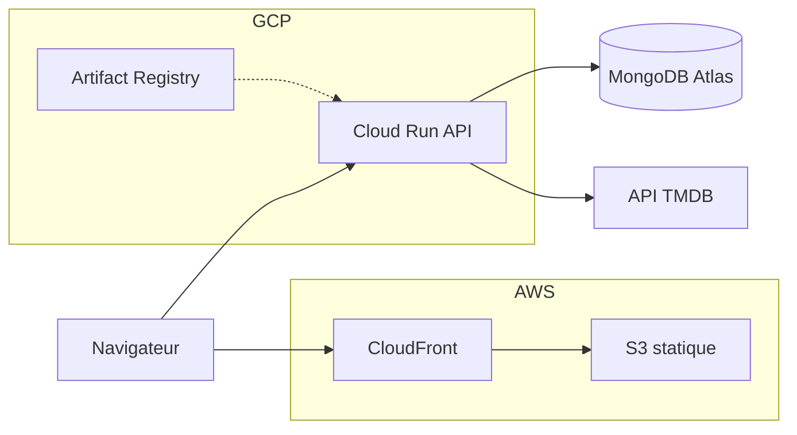

# Architecture système

Vue d’ensemble **sans ouvrir le code** : flux runtime, dépôt, contrat HTTP et organisation de l’API. Pour les choix d’implémentation (auth, codes d’erreur, tableau de routes, règles OpenAPI), se reporter au code et aux tests d’intégration listés ci-dessous.

## Schéma d’exécution

## Services

| Fournisseur | Service | Rôle |
|-------------|---------|------|
| **AWS** | S3 | Build statique front |
| **AWS** | CloudFront | CDN, HTTPS, URL publique front |
| **GCP** | Cloud Run | Conteneur API |
| **GCP** | Artifact Registry | Image Docker API |
| **MongoDB** | Atlas | Persistance |
| **TMDB** | API | Films, affiches |

## Dépôt (repères dev)

| Chemin | Rôle |
|--------|------|
| `apps/web/` | SPA React, **TanStack Query**, appels HTTP vers l’API avec préfixe versionné |
| `apps/api-dotnet/MoviePicker.Api/` | API ASP.NET Core |
| `artifacts/openapi-v1.json` | Export OpenAPI généré par `pnpm run openapi:export` |
| Racine `eslint.config.mjs` | ESLint 9 (flat config) pour le front |
| `configs/` | TypeScript / Prettier partagés (`tsconfig*.json`, `prettier.config.cjs`) |

En développement local typique : API **port 4000** (`http://localhost:4000/`, `/health`, `/swagger`), front Vite **port 5173**. Préfixe API public **`/api/v1`**. Hôte MVP : paramètre d’URL `?host=<token>` ou cookie équivalent.

## Contrat HTTP (surface)

- **Préfixe** : `/api/v1`.
- **Swagger** en environnement de développement ; export du schéma vers `artifacts/openapi-v1.json` ; tests d’intégration **`OpenApiContractTests`** sur le JSON exporté pour éviter les dérives de contrat.

## Structure applicative (API)

Architecture **hexagonale** :

- **Domaine** : concepts et règles sans dépendance framework (soirée, slug, erreurs métier).
- **Application** : cas d’usage (handlers), **ports** (interfaces), DTOs ; orchestre sans connaître MongoDB ni HTTP.
- **Infrastructure** : implémentations concrètes des ports (MongoDB, documents, repositories, accès cookie / query).
- **Entrée** : contrôleurs ASP.NET qui traduisent HTTP → cas d’usage → JSON.

Flux type : requête HTTP → contrôleur → handler → règles domaine → port → implémentation → réponse DTO. Les erreurs métier prévues sont mappées en réponses HTTP cohérentes (filtres / middleware).

## Automatisation

Les assistants (Cursor) et la parité de vérification locale suivent les règles du répertoire **`.cursor/`** et le fichier **AGENTS.md** à la **racine du dépôt** (hors de ce dossier « documentation »).
