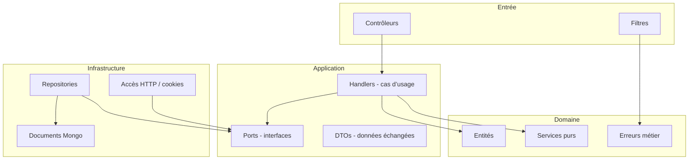
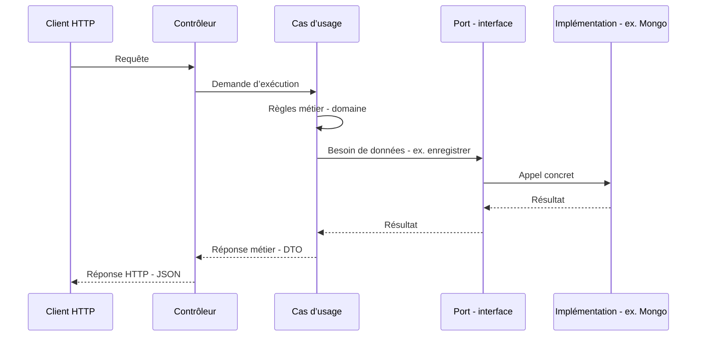

# Architecture de l’API .NET (Movie Picker)

Vulgarisation et description de l’organisation du code dans `apps/api-dotnet/MoviePicker.Api`.

---

## En une phrase

L’application est découpée en **couches** : au **centre**, les règles métier et les scénarios (créer une soirée, rejoindre, etc.) ; **autour**, tout ce qui touche au **web** (HTTP) ou à la **base de données** est branché via des **contrats** (interfaces), pour pouvoir les changer sans réécrire le cœur de l’app.

On appelle souvent ça une **architecture hexagonale** : le « cœur » ne dépend pas de MongoDB ni d’ASP.NET ; ce sont ces technologies qui s’adaptent au cœur.

---

## Schéma global

```
        ┌─────────────────────────────────────┐
        │  Ce qui reçoit les requêtes HTTP    │
        │  (contrôleurs, filtres d’erreur)  │
        └──────────────────┬──────────────────┘
                           │
                           ▼
        ┌─────────────────────────────────────┐
        │  Cas d’usage + contrats (interfaces)  │
        │  « Que faire ? » + « J’ai besoin de   │
        │   lire/écrire des événements »        │
        └──────────────────┬──────────────────┘
                           │
              ┌────────────┴────────────┐
              ▼                         ▼
   ┌────────────────────┐    ┌────────────────────┐
   │  Règles métier     │    │  Accès MongoDB,    │
   │  (soirée, slug…)   │    │  lecture cookie…   │
   └────────────────────┘    └────────────────────┘
```

- **Haut** : l’**entrée** du monde extérieur (le navigateur ou un client appelle l’API).
- **Milieu** : l’**application** orchestre ce qu’il faut faire et s’appuie sur des **interfaces** pour ne pas connaître le détail technique.
- **Bas à gauche** : le **domaine** = concepts et règles (une soirée « terminée », génération d’identifiants courts, etc.).
- **Bas à droite** : l’**infrastructure** = comment on parle vraiment à MongoDB, comment on lit le token hôte dans la requête HTTP.

---

## Les quatre blocs (dépendances)

Idée clé : **le domaine et l’application ne « voient » pas MongoDB ni les contrôleurs**. Seules les couches extérieures connaissent ces détails.



| Bloc | Rôle vulgarisé |
|------|----------------|
| **Domaine** | « C’est quoi une soirée / un participant ? » et règles qui ne dépendent d’aucun framework. |
| **Application** | « Quand quelqu’un crée une soirée, quelles étapes ? » Elle appelle des **ports** (ex. « sauvegarder un événement ») sans savoir si c’est Mongo ou autre chose. |
| **Infrastructure** | Réalise concrètement les ports : écriture en base, lecture du paramètre `host` ou du cookie, etc. |
| **Entrée (contrôleurs)** | Traduit la requête HTTP en appel au bon cas d’usage et renvoie la réponse JSON. |

---

## Parcours type : une action utilisateur



En cas d’erreur attendue (ex. ressource introuvable), le cas d’usage peut lever une **erreur métier** ; un **filtre** la transforme en message JSON et code HTTP cohérents pour le client.

---

## Où est le code dans le dépôt

| Dossier | Contenu documenté |
|---------|-------------------|
| `Domain/` | Entités, services sans dépendance externe, exceptions métier. |
| `Application/` | Interfaces des ports, DTOs, handlers par scénario. |
| `Infrastructure/` | MongoDB (documents, repositories), accès au contexte HTTP, chargement config, filtres. |
| `Controllers/` | Points d’entrée HTTP. |
| `Program.cs` | Assemblage de l’application (pipeline, enregistrement des services). |

Ce document ne décrit que l’**architecture** ; le détail des routes et du contrat API est ailleurs dans la doc de migration.
