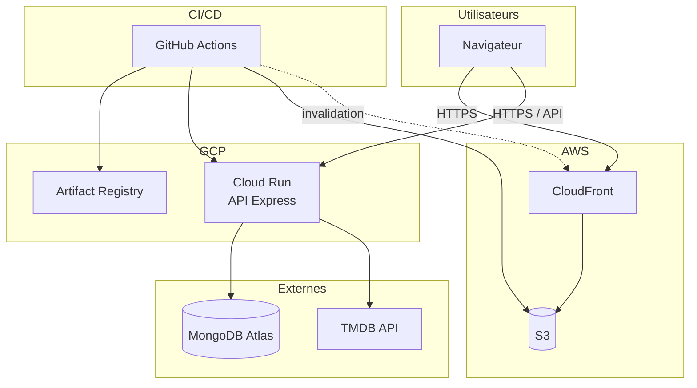

# Schéma d'architecture – Movie Picker MVP

## Vue d'ensemble

- **Front** : React (Vite), hébergé sur **AWS** (S3 + CloudFront).
- **Back** : API Express (Node.js), déployée sur **GCP** (Cloud Run).
- **Données** : MongoDB Atlas.
- **CI/CD** : GitHub Actions (build, push image, déploiement Cloud Run + S3/CloudFront).

## Diagramme

## Légende

| Élément | Rôle |
|--------|------|
| **CloudFront** | CDN, sert le build React (fichiers statiques depuis S3). |
| **S3** | Stockage du build front (index.html, assets). |
| **Cloud Run** | Exécution du conteneur API (Express). |
| **Artifact Registry** | Stockage de l'image Docker de l'API. |
| **MongoDB Atlas** | Base de données (events, participants, movies, votes). |
| **TMDB** | API films (recherche, posters). |
| **GitHub Actions** | Build, tests, push image, déploiement API + front, invalidation CloudFront. |

## Flux

1. **Utilisateur** → ouvre l'URL CloudFront → reçoit l'app React depuis S3.
2. **App React** → appelle l'API sur l'URL Cloud Run (HTTPS).
3. **API** → lit/écrit MongoDB, appelle TMDB pour les films.
4. **CI/CD** : à chaque push sur `main`, GitHub Actions build l'API (Docker), pousse l'image vers Artifact Registry, déploie sur Cloud Run, build le front, uploade sur S3, invalide le cache CloudFront.
